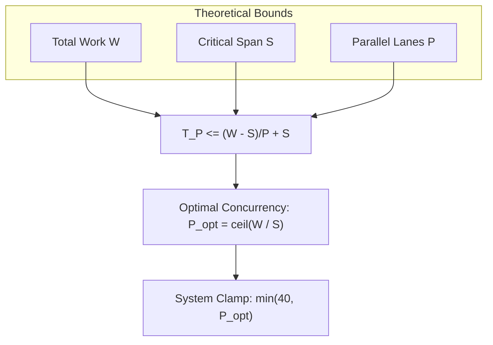

# Brent's Work-Span Theorem & Optimal Concurrency

[OLT Documentation Hub](../../README.md) > [Architecture Index](../index.md) > [Chapter 05](./index.md) > 05-01 Brent's Work-Span Theorem

---

[⏮️ Previous: Chapter 05: Concurrency Scaling & Straggler SLA Overview](index.md) | [📂 Chapter Index](index.md) | [📚 All Chapters Index](../index.md) | [⏭️ Next: 05-02 Coffman-Graham Width Bounds](05-02-coffman-graham-width-bounds.md)
---

## 1. Mathematical Foundations of Work & Span

In parallel computing and directed acyclic graph execution, every workload is characterized by two fundamental parameters:

1. **Work ($W$)**: The total computational effort (or total sequential execution time) across all tasks in the DAG:
   $$W = \sum_{v \in V} \text{Cost}(v)$$
2. **Span ($S$)** (also known as the **Critical Path Length** or $T_\infty$): The longest directed path of dependencies from any source node to any sink node:
   $$S = \max_{\pi \in \text{Paths}(G)} \sum_{u \in \pi} \text{Cost}(u)$$

```text
                        WORK VS. SPAN GRAPH TOPOLOGY
                  (A: 10s)
                  /      \
             (B: 20s)   (C: 15s)       Total Work W = 10 + 20 + 15 + 10 = 55s
                \        /             Critical Span S = A -> B -> D = 40s
                  (D: 10s)             Theoretical Speedup Max = W / S = 1.375
```

---

## 2. Brent's Scheduling Theorem

**Brent's Theorem** establishes the formal upper bound on execution time $T_P$ when scheduling a DAG of Work $W$ and Span $S$ onto $P$ parallel processor lanes:

$$T_P \le \frac{W - S}{P} + S$$

$$\lim_{P \to \infty} T_P = S$$



---

## 3. Optimal Allocation & Cognitive Saturation

OLT calculates the optimal agent pool allocation for any compiled wave:

$$P_{\text{opt}} = \min\left(40, \left\lceil \frac{W}{S} \right\rceil \right)$$

Allocating $P > P_{\text{opt}}$ yields diminishing returns while exponentially increasing lock contention on advisory files and LLM rate limit pressure.

---

[⏮️ Previous: Chapter 05: Concurrency Scaling & Straggler SLA Overview](index.md) | [📂 Chapter Index](index.md) | [📚 All Chapters Index](../index.md) | [⏭️ Next: 05-02 Coffman-Graham Width Bounds](05-02-coffman-graham-width-bounds.md)
---
