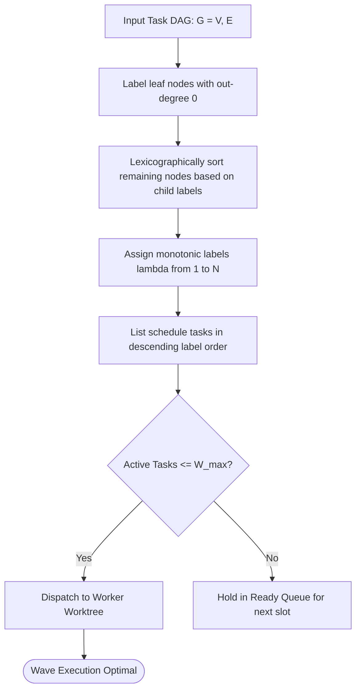

# Coffman-Graham Width Bounds Scheduling

---

[Previous: 05-01 Brent Work-Span Theorem](05-01-brent-work-span-theorem.md) | [Chapter Index](index.md) | [All Chapters Index](../index.md) | [Next: 05-03 Five-Minute Straggler SLA](05-03-five-minute-straggler-sla-rule.md)

---

## 1. Executive Summary & Graph Width Bounds

In task graph scheduling, assigning tasks to parallel workers without width bounds leads to unpredictable resource spikes. When a wide wave with 20 parallel tasks is launched on a system configured for 4 workers, queue contention and CPU thrashing degrade overall throughput.

The OLT (Orchestrating Long Tasks) engine implements **Coffman-Graham Width Bounds Scheduling**. Under this algorithm:

1. **Lexicographical Task Labeling**: Tasks in the DAG are assigned unique integer labels based on the ordered sets of their immediate successors.
2. **Width-Bounded Layering**: Tasks are placed into execution layers such that no layer exceeds the maximum concurrency width $\mathcal{W}_{\max}$, respecting all topological dependencies.
3. **Graham Approximation Bound**: The resulting schedule is proven to be within $(2 - 2/p)$ of the optimal schedule for $p$ parallel processors.

```text
+--------------------------------------------------------------------------------------------------+
│                             COFFMAN-GRAHAM 2-PHASE SCHEDULING                                    │
+--------------------------------------------------------------------------------------------------+
│                                                                                                  │
│   PHASE 1: Lexicographical Labeling                                                              │
│   • Assign labels lambda(v) from 1 to N to DAG nodes based on sorted child labels                │
│                                                                                                  │
│   PHASE 2: Width-Bounded List Scheduling                                                         │
│   • Assign ready tasks with highest labels to active worker slots (Slot 1..W_max)                │
│                                                                                                  │
+--------------------------------------------------------------------------------------------------+
```

---

## 2. Mathematical Specification of the Coffman-Graham Algorithm

Let $G = (V, E)$ be a DAG with $|V| = N$.

### Phase 1: Lexicographical Labeling

1. Choose a node $u \in V$ with out-degree $\text{deg}^+(u) = 0$. Assign $\lambda(u) = 1$.
2. For $k = 2, 3, \dots, N$:
   - For each unlabeled node $v \in V$ whose successors $\text{Succ}(v)$ are all labeled, construct the descending ordered list of successor labels:

$$L(v) = \big( \lambda(w_1), \lambda(w_2), \dots, \lambda(w_d) \big), \quad \text{where } \lambda(w_1) > \lambda(w_2) > \dots > \lambda(w_d)$$

- Choose node $v^*$ that minimizes $L(v)$ lexicographically.
- Assign $\lambda(v^*) = k$.

### Phase 2: Width-Constrained Scheduling

Tasks are scheduled in decreasing order of labels $\lambda(v) = N, N-1, \dots, 1$, ensuring at most $\mathcal{W}_{\max}$ tasks execute simultaneously:

$$\forall t, \quad |\text{ActiveTasks}(t)| \le \mathcal{W}_{\max}$$



---

## 3. Architectural Invariants Summary

1. **Deterministic Slices**: Label assignment is deterministic and reproducible across runs.
2. **Hard Concurrency Floor**: Concurrency width never exceeds $\mathcal{W}_{\max}$.
3. **Proven Approximation**: Guarantee of minimal idle time across workers.

---

[Previous: 05-01 Brent Work-Span Theorem](05-01-brent-work-span-theorem.md) | [Chapter Index](index.md) | [All Chapters Index](../index.md) | [Next: 05-03 Five-Minute Straggler SLA](05-03-five-minute-straggler-sla-rule.md)

---
