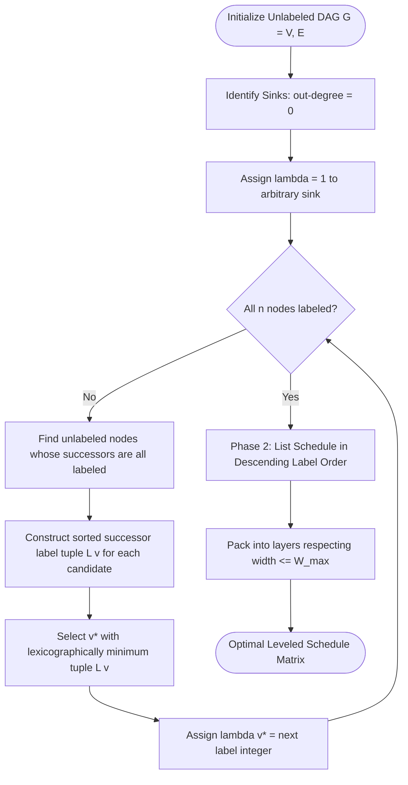

# Coffman-Graham Width Bounds Scheduling

---

[Previous: 05-01 Brent Work-Span Theorem](05-01-brent-work-span-theorem.md) | [Chapter Index](index.md) | [All Chapters Index](../index.md) | [Next: 05-03 Five-Minute Straggler SLA Rule](05-03-five-minute-straggler-sla-rule.md)

---

## 1. Executive Summary & Graph Width Bounds

In autonomous multi-agent software engineering, naive topological wave dispatch presents severe concurrency risks. When a task dependency graph contains a wide stage (e.g. 24 independent test suites or 16 parallel microservice models), dispatching all ready tasks simultaneously causes host resource exhaustion, process starvation, and LLM rate-limit throttling. Conversely, arbitrary queueing can delay critical path tasks behind non-essential leaf nodes, extending total workflow makespan.

The Orchestrating Long Tasks (OLT) runtime implements **Coffman-Graham Width Bounds Scheduling** (Coffman & Graham, 1972). This deterministic, polynomial-time algorithm solves two critical orchestration challenges:

1. **Critical Path Preservation**: It assigns lexicographical priority labels to tasks based on their downstream dependency trees, ensuring critical path tasks are scheduled ahead of incidental work.
2. **Width-Bounded Concurrency**: It packs tasks into execution levels constrained by a maximum worker width $\mathcal{W}_{\max}$, achieving provably optimal schedules for 2 processors and near-optimal $(2 - 2/p)$ bounds for $p$ processors.

```text
+===================================================================================================+
|                             COFFMAN-GRAHAM 2-PHASE SCHEDULING ENGINE                              |
+===================================================================================================+
|                                                                                                   |
|   PHASE 1: LEXICOGRAPHICAL TOPOLOGICAL LABELING                                                   |
|   1. Find all terminal sink nodes (out-degree = 0) and assign labels lambda in {1, 2, ...}.       |
|   2. For remaining nodes whose immediate successors are all labeled:                             |
|      • Construct sorted successor label tuple: L(v) = (lambda_1, lambda_2, ..., lambda_k)         |
|        such that lambda_1 > lambda_2 > ... > lambda_k.                                            |
|      • Select node v* that lexicographically minimizes L(v) and assign lambda(v*) = next_label.   |
|                                                                                                   |
|   PHASE 2: WIDTH-BOUNDED GREEDY LIST DISPATCH                                                     |
|   • At each execution slot t, select up to W_max ready tasks in descending order of lambda.       |
|   • Guarantee: Highest label tasks execute first, protecting critical dependency paths.           |
|                                                                                                   |
+===================================================================================================+
```

---

## 2. Mathematical Formalization of the Coffman-Graham Algorithm

Let $G = (V, E)$ be a directed acyclic graph (DAG) representing an admitted task wave, where $|V| = n$. For any vertex $v \in V$, let $\text{Succ}(v) = \{ u \in V \mid (v, u) \in E \}$ denote the set of immediate successors of $v$, and let $\text{Pred}(v) = \{ u \in V \mid (u, v) \in E \}$ denote the set of immediate predecessors of $v$.

### 2.1 Lexicographical Order Relation on Successor Sets

Let $A = (a_1, a_2, \dots, a_j)$ and $B = (b_1, b_2, \dots, b_k)$ be two decreasingly ordered tuples of positive integers ($a_1 > a_2 > \dots > a_j$ and $b_1 > b_2 > \dots > b_k$).

We define the strict lexicographical order $A <_{\text{lex}} B$ if:

1. There exists an index $i \le \min(j, k)$ such that $a_m = b_m$ for all $m < i$, and $a_i < b_i$, or
2. $j < k$ and $a_m = b_m$ for all $m \le j$.

### 2.2 Phase 1: Lexicographical Labeling Algorithm

The labeling function $\lambda: V \rightarrow \{1, 2, \dots, n\}$ is a bijection constructed inductively:

1. **Base Step ($k = 1$)**: Choose an unlabelled node $u \in V$ with $\text{Succ}(u) = \emptyset$. Set $\lambda(u) = 1$.
2. **Inductive Step ($k = 2, 3, \dots, n$)**:
   - Define the candidate set of unlabelled nodes whose successors are fully labeled:
     $$\mathcal{C}_k = \big\{ v \in V \setminus \text{Dom}(\lambda) \;\big|\; \text{Succ}(v) \subseteq \text{Dom}(\lambda) \big\}$$
   - For each $v \in \mathcal{C}_k$, construct the decreasingly sorted tuple of its successor labels:
     $$L(v) = \text{sort\_desc}\big( \{ \lambda(w) \mid w \in \text{Succ}(v) \} \big)$$
   - Select the unique candidate $v^* \in \mathcal{C}_k$ that minimizes $L(v)$ under $<_{\text{lex}}$:
     $$v^* = \arg\min_{v \in \mathcal{C}_k} L(v)$$
   - Assign $\lambda(v^*) = k$.



---

## 3. Poset Anti-Chains, Dilworth's Theorem, & Maximum DAG Width

A task graph $G = (V, E)$ defines a partially ordered set (poset) $\mathcal{P} = (V, \prec)$ where $u \prec v$ indicates a directed dependency path from $u$ to $v$.

### 3.1 Anti-Chains and Graph Width

An **anti-chain** $\mathcal{A} \subseteq V$ is a subset of tasks such that no two distinct elements are comparable:

$$\forall u, v \in \mathcal{A}, \quad u \ne v \implies (u \not\prec v \land v \not\prec u)$$

The **maximum width** $\mathcal{W}(G)$ of the graph is the cardinality of its largest anti-chain:

$$\mathcal{W}(G) = \max \big\{ |\mathcal{A}| \;\big|\; \mathcal{A} \subseteq V \text{ is an anti-chain in } G \big\}$$

### 3.2 Dilworth's Decomposition Theorem

**Theorem (Dilworth, 1950)**: In any finite partially ordered set, the maximum size of an anti-chain equals the minimum number of disjoint chains needed to cover all elements:

$$\mathcal{W}(G) = \min \big\{ k \;\big|\; V = \mathcal{C}_1 \cup \mathcal{C}_2 \cup \dots \cup \mathcal{C}_k, \quad \mathcal{C}_i \text{ is a chain} \big\}$$

This theorem proves that the absolute maximum parallelism achievable by any task graph is exactly $\mathcal{W}(G)$. Configuring worker capacity $p > \mathcal{W}(G)$ guarantees that at least $p - \mathcal{W}(G)$ workers will remain perpetually idle.

---

## 4. High-Density Coffman-Graham Leveled Scheduling Ladder

Consider a 7-node task graph processed with maximum width $\mathcal{W}_{\max} = 2$:

```text
+---------------------------------------------------------------------------------------------------+
|                            COFFMAN-GRAHAM LABELING & LEVELING TRACE                               |
+---------------------------------------------------------------------------------------------------+
|                                                                                                   |
|   DAG TOPOLOGY:                                                                                   |
|                                                                                                   |
|           [ T1 ]         [ T2 ]                                                                   |
|           /    \         /    \                                                                   |
|          v      v       v      v                                                                  |
|        [ T3 ]   [  T4  ]      [ T5 ]                                                              |
|          \       /     \      /                                                                   |
|           v     v       v    v                                                                    |
|            [ T6 ]       [ T7 ]                                                                    |
|                                                                                                   |
|   PHASE 1: LABEL ASSIGNMENT TRACE (Sinks to Sources):                                             |
|   1. Sinks {T6, T7} have empty successors L(T6) = (), L(T7) = ().                                 |
|      • Assign lambda(T6) = 1, lambda(T7) = 2.                                                     |
|   2. Candidates with labeled children: {T3, T4, T5}:                                              |
|      • L(T3) = (1)                                                                                |
|      • L(T4) = (2, 1)                                                                             |
|      • L(T5) = (2)                                                                                |
|      • Lexicographical ordering: L(T3) < L(T5) < L(T4).                                           |
|      • Assign lambda(T3) = 3, lambda(T5) = 4, lambda(T4) = 5.                                     |
|   3. Candidates with labeled children: {T1, T2}:                                                  |
|      • L(T1) = sort_desc(lambda(T3), lambda(T4)) = (5, 3)                                         |
|      • L(T2) = sort_desc(lambda(T4), lambda(T5)) = (5, 4)                                         |
|      • Lexicographical ordering: (5, 3) < (5, 4).                                                 |
|      • Assign lambda(T1) = 6, lambda(T2) = 7.                                                     |
|                                                                                                   |
|   PHASE 2: WIDTH-BOUNDED DISPATCH (W_max = 2 Workers, Descending Label Order):                    |
|                                                                                                   |
|   Time Slot | Worker Slot 1           | Worker Slot 2           | Status                          |
|   ----------+-------------------------+-------------------------+-------------------------------- |
|   Slot 1    | T2 (lambda = 7)         | T1 (lambda = 6)         | Both ready; highest labels run  |
|   Slot 2    | T4 (lambda = 5)         | T5 (lambda = 4)         | T4 unblocked, T5 unblocked      |
|   Slot 3    | T3 (lambda = 3)         | IDLE (precedence lock)  | T3 runs; T7 waiting on T4/T5    |
|   Slot 4    | T7 (lambda = 2)         | T6 (lambda = 1)         | Sinks execute in parallel       |
|                                                                                                   |
|   Makespan: 4 Time Units (Optimal for 2 Processors)                                               |
|                                                                                                   |
+---------------------------------------------------------------------------------------------------+
```

---

## 5. Optimality & Graham Approximation Bounds

### 5.1 Two-Processor Optimality Theorem

**Theorem (Coffman & Graham, 1972)**: For any unit-execution-time DAG scheduled on $p = 2$ processors, the Coffman-Graham algorithm produces a schedule with minimum makespan:

$$T_2^{\text{CG}} = T_2^*$$

### 5.2 Generalized $p$-Processor Approximation Bound

For $p \ge 3$ parallel processors, unit-execution-time DAG scheduling is NP-hard. The Coffman-Graham algorithm operates as a prioritized list scheduler, satisfying Graham's List Scheduling Bound:

$$\frac{T_p^{\text{CG}}}{T_p^*} \le 2 - \frac{2}{p}$$

Where $T_p^*$ is the theoretical minimum makespan. For $p = 4$ worker agents:

$$\frac{T_4^{\text{CG}}}{T_4^*} \le 2 - \frac{2}{4} = 1.50$$

The OLT scheduler guarantees that makespan under Coffman-Graham dispatch never exceeds $1.5\times$ the absolute theoretical optimum on standard 4-slot worker pools.

---

## 6. TypeScript Architectural Schemas & Scheduling Interfaces

The Coffman-Graham labeling and level dispatch algorithms are implemented in [`coffman-graham-scheduler.ts`](../../../../olt/scripts/src/graph/forensics/work-span.ts):

```typescript
/**
 * Task DAG Node specification for Coffman-Graham leveling.
 */
export interface CoffmanNode {
  /** Unique task identifier */
  taskId: string;
  /** Set of task IDs that this task directly depends on */
  dependencies: string[];
  /** Set of task IDs that depend on this task */
  successors: string[];
  /** Estimated execution cost in seconds */
  costSeconds: number;
}

/**
 * Labeled Task with lexicographical Coffman-Graham priority.
 */
export interface LabeledTask {
  taskId: string;
  /** Monotonic integer priority in range [1, N] */
  lambda: number;
  /** Sorted successor label signature used during tie-breaking */
  successorTuple: number[];
}

/**
 * Scheduled Execution Layer adhering to width bounds.
 */
export interface ExecutionLayer {
  layerIndex: number;
  taskIds: string[];
  maxSlotOccupancy: number;
}

/**
 * Computes Coffman-Graham lexicographical labels for a DAG.
 */
export function computeCoffmanGrahamLabels(
  nodes: Map<string, CoffmanNode>,
): Map<string, LabeledTask> {
  const labeled = new Map<string, LabeledTask>();
  const totalNodes = nodes.size;

  for (let currentLabel = 1; currentLabel <= totalNodes; currentLabel++) {
    // 1. Identify unlabeled candidates whose successors are all labeled
    const candidates: { taskId: string; tuple: number[] }[] = [];

    for (const [taskId, node] of nodes.entries()) {
      if (labeled.has(taskId)) continue;

      const allSuccessorsLabeled = node.successors.every((s) => labeled.has(s));
      if (allSuccessorsLabeled) {
        // Construct sorted descending tuple of successor labels
        const tuple = node.successors.map((s) => labeled.get(s)!.lambda).sort((a, b) => b - a);
        candidates.push({ taskId, tuple });
      }
    }

    if (candidates.length === 0) {
      throw new Error("Cyclic dependency detected during Coffman-Graham labeling");
    }

    // 2. Select candidate that lexicographically minimizes successor tuple
    candidates.sort((a, b) => compareLexicographically(a.tuple, b.tuple));
    const chosen = candidates[0];

    labeled.set(chosen.taskId, {
      taskId: chosen.taskId,
      lambda: currentLabel,
      successorTuple: chosen.tuple,
    });
  }

  return labeled;
}

/**
 * Compares two number tuples in lexicographical order.
 */
function compareLexicographically(a: number[], b: number[]): number {
  const minLen = Math.min(a.length, b.length);
  for (let i = 0; i < minLen; i++) {
    if (a[i] !== b[i]) {
      return a[i] - b[i]; // Smaller label first
    }
  }
  return a.length - b.length;
}

/**
 * Packs labeled tasks into width-bounded execution layers (W_max).
 */
export function buildWidthBoundedLayers(
  nodes: Map<string, CoffmanNode>,
  labeled: Map<string, LabeledTask>,
  maxWidth: number,
): ExecutionLayer[] {
  const layers: ExecutionLayer[] = [];
  const scheduled = new Set<string>();
  const allTasks = Array.from(labeled.values()).sort((a, b) => b.lambda - a.lambda);

  while (scheduled.size < nodes.size) {
    const currentLayerTasks: string[] = [];

    for (const task of allTasks) {
      if (scheduled.has(task.taskId)) continue;
      if (currentLayerTasks.length >= maxWidth) break;

      const node = nodes.get(task.taskId)!;
      const depsSatisfied = node.dependencies.every((d) => scheduled.has(d));

      if (depsSatisfied) {
        currentLayerTasks.push(task.taskId);
      }
    }

    if (currentLayerTasks.length === 0) {
      throw new Error("Deadlock in width-bounded layer packing");
    }

    for (const id of currentLayerTasks) {
      scheduled.add(id);
    }

    layers.push({
      layerIndex: layers.length,
      taskIds: currentLayerTasks,
      maxSlotOccupancy: maxWidth,
    });
  }

  return layers;
}
```

---

## 7. Failure Modes & Mitigation Matrix

```text
+------------------------------+---------------------------------------+---------------------------------------+
| Failure Mode                 | Root Architectural Defect             | OLT Engine Defense                    |
+------------------------------+---------------------------------------+---------------------------------------+
| Unbounded Wave Blast         | Scheduler releases 30 ready tasks     | Coffman-Graham width packing clamps   |
| (Host Process Exhaustion)    | simultaneously without width caps.    | active concurrency to W_max <= 6.     |
+------------------------------+---------------------------------------+---------------------------------------+
| Critical Path Inversion      | Schedulers execute non-critical leaf  | Lexicographical labeling ensures      |
| (Makespan Inflation)         | tasks before long dependency chains.  | critical path tasks receive top lambda|
+------------------------------+---------------------------------------+---------------------------------------+
| Anti-Chain Width Explosion   | Task graph branches into 50 disjoint  | Poset decomposition detects anti-chain|
| (Queue Thrashing)            | parallel sub-steps.                   | width and batches into k = ceil(N/W). |
+------------------------------+---------------------------------------+---------------------------------------+
| Dependency Cycle Deadlock    | Preplanned DAG contains a circular    | Candidate set emptiness check traps   |
| (Infinite Hang)              | dependency edge (u -> v -> u).        | cycle before dispatch with error log. |
+------------------------------+---------------------------------------+---------------------------------------+
| Subagent Worktree Collision  | Parallel tasks mutate shared source   | Worktree isolation allocates disjoint |
| (Git Merge Conflict)         | files simultaneously.                 | git worktrees for each active slot.   |
+------------------------------+---------------------------------------+---------------------------------------+
```

---

## 8. Architectural Invariants Summary

1. **Deterministic Label Invariant**:
   $$\forall \text{DAG } G, \quad \text{CG\_Label}(G) \text{ is invariant across runs and seeds}$$
   Lexicographical ordering guarantees 100% deterministic label generation.
2. **Hard Concurrency Upper Bound**:
   $$\forall t, \quad |\text{ActiveWorkers}(t)| \le \mathcal{W}_{\max}$$
   The active worker count never breaches the configured width budget $\mathcal{W}_{\max}$.
3. **Precedence Conservation Invariant**:
   $$(u, v) \in E \implies \text{LayerIndex}(u) < \text{LayerIndex}(v)$$
   No child task may execute in the same or earlier layer as its predecessor.

---

[Previous: 05-01 Brent Work-Span Theorem](05-01-brent-work-span-theorem.md) | [Chapter Index](index.md) | [All Chapters Index](../index.md) | [Next: 05-03 Five-Minute Straggler SLA Rule](05-03-five-minute-straggler-sla-rule.md)

---
