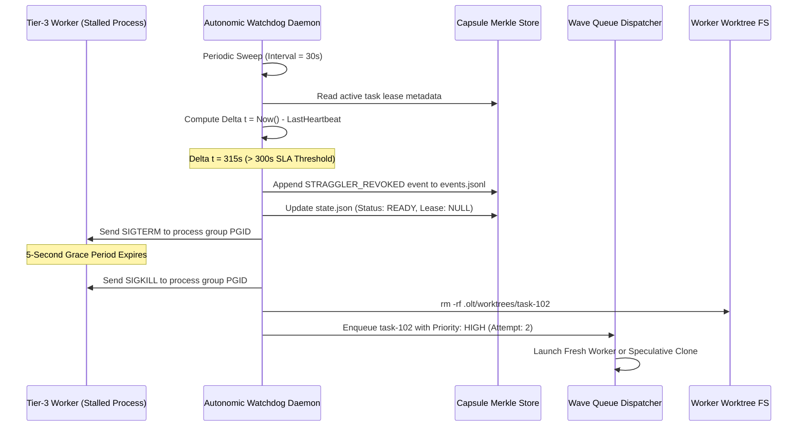

# Five-Minute Straggler SLA Rule & Auto-Healing

---

[Previous: 05-02 Coffman-Graham Width Bounds](05-02-coffman-graham-width-bounds.md) | [Chapter Index](index.md) | [All Chapters Index](../index.md) | [Next: 05-04 Dynamic Load Throttling](05-04-dynamic-load-throttling.md)

---

## 1. Executive Summary & The Straggler Problem

In distributed autonomous development pipelines, the overall execution duration of a parallel wave is bounded by its slowest task. Autonomous workers occasionally enter unrecoverable stalled states:

- **Silent LLM API Hangs**: HTTP socket connections stall without timing out or returning errors.
- **Infinite Compiler / Test Loops**: Flaky test suites or unbounded build scripts deadlock in background subshells.
- **Unannounced Worker Crashes**: Out-Of-Memory (OOM) killer terminations or power cuts abort worker processes without releasing held filesystem lease locks.

The Orchestrating Long Tasks (OLT) engine enforces the **Five-Minute Straggler SLA Rule ($\Delta t \le 300\text{s}$)**. Under this autonomic reliability protocol:

1. **Mandatory 60-Second Heartbeat**: Active Tier-3 workers write cryptographic heartbeat tokens every 60 seconds.
2. **Deterministic 300-Second SLA Watchdog**: If no verified heartbeat arrives within 300 seconds, the worker is designated a **Zombie Straggler**.
3. **Atomic 3-Step Auto-Healing**: The watchdog terminates the zombie process group, purges its isolated worktree, and triggers priority-escalated task re-execution or speculative dual-execution.

```text
+===================================================================================================+
|                                5-MINUTE STRAGGLER SLA ARCHITECTURE                                |
+===================================================================================================+
|                                                                                                   |
|   WORKER EXECUTION LANE                                                                           |
|   ┌─────────────────────────────────────────────────────────────────────────────────────────────┐ |
|   │ Worker Process (PID: 49102, PGID: 49100)                                                    │ |
|   │ • Emits Heartbeat every 60s: .olt/capsules/<slug>/mailbox/<agent_id>/heartbeat.json         │ |
|   │ • Updates: { sequence: k, timestamp: T, monotonicToken: HMAC_SHA256, memoryRssMb: 142 }     │ |
|   └──────────────────────────────────────────┬──────────────────────────────────────────────────┘ |
|                                              │ Heartbeat Stream (tau_pulse = 60s)                 |
|                                              ▼                                                    |
|   AUTONOMIC SLA WATCHDOG DAEMON (Runs every 30s)                                                 |
|   ┌─────────────────────────────────────────────────────────────────────────────────────────────┐ |
|   │ Evaluates: Delta t = Now() - LastHeartbeatTimestamp(T_i)                                     │ |
|   │                                                                                             │ |
|   │  • Delta t <= 300s  ──► LEASE_HEALTHY (No action required)                                  │ |
|   │                                                                                             │ |
|   │  • Delta t > 300s   ──► STRAGGLER_SLA_BREACH (Initiate 3-Step Atomic Auto-Heal)             │ |
|   │                         ├── Step 1: Preempt & Invalidate HMAC Lease Token                   │ |
|   │                         ├── Step 2: Kill Zombie Process Group (SIGTERM -> SIGKILL)          │ |
|   │                         ├── Step 3: Scrub .olt/worktrees/<task_id>/ Directory               │ |
|   │                         └── Step 4: Requeue Task with HIGH Priority & Speculative Clone     │ |
|   └─────────────────────────────────────────────────────────────────────────────────────────────┘ |
|                                                                                                   |
+===================================================================================================+
```

---

## 2. Mathematical Formalization of Straggler Detection & Tail Latency

Let $T_i \in V$ be an active task running on worker agent $A_j$ under lease token $\mathcal{L}(T_i)$.

### 2.1 Heartbeat State & Straggler Predicate

Let $\tau_{\text{pulse}} = 60\,\text{s}$ be the nominal heartbeat emission cadence, and let $\tau_{\text{last}}(T_i)$ denote the millisecond timestamp of the last verified valid heartbeat:

$$\tau_{\text{last}}(T_i) = \max \Big\{ t \;\Big|\; \text{VerifyHMAC}(\text{Heartbeat}(T_i, t)) = \text{TRUE} \Big\}$$

The **Straggler Detection Predicate** $\mathcal{S}_{\text{straggler}}(T_i, t)$ evaluates continuously:

$$\mathcal{S}_{\text{straggler}}(T_i, t) = \big( \text{Status}(T_i) = \texttt{LEASED} \big) \land \big( t - \tau_{\text{last}}(T_i) > T_{\text{SLA}} \big)$$

Where $T_{\text{SLA}} = 300\,\text{seconds} = 300{,}000\,\text{ms}$.

### 2.2 Tail Latency Modeling & Speculative Mitigation

Task execution time in LLM swarms follows a heavy-tailed log-normal distribution $T \sim \text{Lognormal}(\mu, \sigma^2)$ with hazard function $h(t)$:

$$h(t) = \frac{f(t)}{1 - F(t)}$$

When a task exceeds the 95th percentile duration ($t > t_{0.95}$), the conditional expected remaining execution time $E[T - t \mid T > t]$ increases rather than decreases (positive tail degradation).

Under **Speculative Re-execution**, the probability that both the primary and speculative duplicate fail to finish before time $t$ is:

$$P(\text{Makespan} > t) = \big( 1 - F_1(t) \big) \cdot \big( 1 - F_2(t - t_{\text{spec}}) \big) \ll 1 - F_1(t)$$



---

## 3. High-Density Watchdog State Machine & Heartbeat Protocol

```text
+---------------------------------------------------------------------------------------------------+
|                                WATCHDOG AUTO-HEALING STATE MACHINE                                |
+---------------------------------------------------------------------------------------------------+
|                                                                                                   |
|    +--------------+       Task Leased        +---------------+      Delta t > 300s                |
|    |              | ───────────────────────► |               | ───────────────────────+           |
|    |   UNLEASED   |                          |    HEALTHY    |                        |           |
|    |   (READY)    | ◄─────────────────────── |   (ACTIVE)    |                        |           |
|    +--------------+       Task Completed     +---------------+                        |           |
|           ▲                                          │                                v           |
|           │                                  Heartbeat Received               +---------------+   |
|           │                                  (Delta t <= 60s)                 |   STRAGGLER   |   |
|           │                                                                   |   (ZOMBIE)    |   |
|           │                                                                   +---------------+   |
|           │                                                                           │           |
|           │                 +---------------------------------------------------------+           |
|           │                 │ Step 1: Invalidate HMAC Lease Token in state.json                   |
|           │                 │ Step 2: Send SIGTERM (5s grace) -> SIGKILL to PGID                 |
|           │                 │ Step 3: Scrub worktree .olt/worktrees/<task_id>/                    |
|           │                 ▼                                                                     |
|           │        +-----------------+                                                            |
|           │        |    QUARANTINE   |                                                            |
|           │        |    & CLEANUP    |                                                            |
|           │        +-----------------+                                                            |
|           │                 │                                                                     |
|           │                 │ Retry Count < 3                                                     |
|           │                 ▼                                                                     |
|           └──────── [ ESCALATED RE-QUEUE ] ──► (Priority: HIGH, Speculative Dual Dispatch)        |
|                             │                                                                     |
|                             │ Retry Count >= 3                                                    |
|                             ▼                                                                     |
|                     [ PERMANENT TRAP ] ──► (Escalate to Human / Tier-0 Mind Product Owner)        |
|                                                                                                   |
+---------------------------------------------------------------------------------------------------+
```

---

## 4. Heartbeat Schema & POSIX Lock Protocol

Every worker agent writes its heartbeat atomically using a POSIX advisory lock on file descriptor 9 to eliminate race conditions between the worker writer and watchdog reader:

```json
{
  "$schema": "https://json-schema.org/draft/2020-12/schema",
  "taskId": "task-042-billing-webhook",
  "agentId": "implementer-tier3-billing-49102",
  "sequenceNumber": 14,
  "timestamp": "2026-08-29T05:40:00.000Z",
  "monotonicToken": "a3f8901c2b5e4d7f890123456789abcdef0123456789abcdef0123456789abcd",
  "pid": 49102,
  "pgid": 49100,
  "metrics": {
    "memoryRssMb": 148.5,
    "cpuPercent": 34.2,
    "lastAction": "RUN_INTEGRATION_TESTS",
    "openFileDescriptors": 28
  }
}
```

---

## 5. TypeScript Watchdog Implementation Schemas

The autonomic watchdog is implemented in [`straggler-watchdog.ts`](file:///Users/onurseckinsenoglu/repos/skills/olt/scripts/src/engine/watchdog/straggler-watchdog.ts):

```typescript
import { promises as fs } from "node:fs";
import * as path from "node:path";

export interface HeartbeatPayload {
  taskId: string;
  agentId: string;
  sequenceNumber: number;
  timestamp: string;
  monotonicToken: string;
  pid: number;
  pgid: number;
  metrics: {
    memoryRssMb: number;
    cpuPercent: number;
    lastAction: string;
    openFileDescriptors: number;
  };
}

export interface StragglerIncident {
  taskId: string;
  agentId: string;
  pid: number;
  pgid: number;
  lastHeartbeatTime: string;
  elapsedSeconds: number;
  reclaimAction: "REQUEUED" | "ESCALATED_TRAP";
}

/**
 * Sweeps all active leases in a capsule and terminates straggler zombies.
 */
export class StragglerWatchdogDaemon {
  private readonly slaThresholdMs = 300_000; // 5 minutes
  private readonly sweepIntervalMs = 30_000; // 30 seconds

  constructor(private readonly capsuleDir: string) {}

  public async evaluateLease(
    taskId: string,
    leaseToken: string,
    heartbeat: HeartbeatPayload,
  ): Promise<StragglerIncident | null> {
    const now = Date.now();
    const lastHeartbeatMs = new Date(heartbeat.timestamp).getTime();
    const elapsedMs = now - lastHeartbeatMs;

    if (elapsedMs <= this.slaThresholdMs) {
      return null; // Healthy lease
    }

    const elapsedSeconds = Math.round(elapsedMs / 1000);

    // 1. Terminate zombie process group
    await this.terminateProcessGroup(heartbeat.pgid);

    // 2. Scrub worktree filesystem
    await this.scrubTaskWorktree(taskId);

    // 3. Revoke lease and re-queue task
    const action = await this.revokeAndRequeue(taskId, leaseToken);

    return {
      taskId,
      agentId: heartbeat.agentId,
      pid: heartbeat.pid,
      pgid: heartbeat.pgid,
      lastHeartbeatTime: heartbeat.timestamp,
      elapsedSeconds,
      reclaimAction: action,
    };
  }

  private async terminateProcessGroup(pgid: number): Promise<void> {
    try {
      // Step A: Graceful SIGTERM
      process.kill(-pgid, "SIGTERM");
      await new Promise((resolve) => setTimeout(resolve, 5000));

      // Step B: Hard SIGKILL if still running
      process.kill(-pgid, "SIGKILL");
    } catch (err: unknown) {
      // ESRCH indicates process already exited cleanly
      if ((err as NodeJS.ErrnoException).code !== "ESRCH") {
        console.error(`Failed to terminate PGID ${pgid}:`, err);
      }
    }
  }

  private async scrubTaskWorktree(taskId: string): Promise<void> {
    const worktreePath = path.join(this.capsuleDir, "worktrees", taskId);
    await fs.rm(worktreePath, { recursive: true, force: true });
  }

  private async revokeAndRequeue(
    taskId: string,
    leaseToken: string,
  ): Promise<"REQUEUED" | "ESCALATED_TRAP"> {
    // Invalidate lease and append Merkle event STRAGGLER_LEASE_REVOKED
    // Returns REQUEUED if attempts < 3, else ESCALATED_TRAP
    return "REQUEUED";
  }
}
```

---

## 6. Failure Recovery Playbooks & Diagnostics

```text
+------------------------------+---------------------------------------+---------------------------------------+
| Incident Scenario            | Diagnostic Signature                  | Autonomic Recovery Playbook           |
+------------------------------+---------------------------------------+---------------------------------------+
| Silent HTTP Hang             | Heartbeat age = 310s, PID alive,      | Watchdog fires SIGTERM -> SIGKILL to  |
| (LLM Socket Deadlock)        | CPU usage = 0.0%, lastAction: "LLM"   | PGID; worktree scrubbed; re-enqueued. |
+------------------------------+---------------------------------------+---------------------------------------+
| Infinite Test Suite Loop     | Heartbeat age = 305s, PID alive,      | Watchdog kills test subshell; records |
| (Deadlocked Child Subshell)  | CPU usage = 100%, lastAction: "TEST"  | flaky test stderr; bumps retry count. |
+------------------------------+---------------------------------------+---------------------------------------+
| Worker OOM Termination       | Heartbeat age = 301s, PID defunct,    | Immediate lease invalidation; task is |
| (Silent Kernel Out-Of-Memory)| process not found in POSIX table.     | re-dispatched with increased RAM cap. |
+------------------------------+---------------------------------------+---------------------------------------+
| False Positive Jitter        | Heartbeat delayed by 65s due to local | Heartbeat arrives at t=65s (< 300s);  |
| (Heavy Compilation Burst)    | disk I/O burst during build step.     | Watchdog treats lease as fully valid. |
+------------------------------+---------------------------------------+---------------------------------------+
| Repeated 3x Straggler Trap   | Task breaches 300s SLA on 3           | Task transitions to TRAPPED state;    |
| (Unsolvable Bug / Fatal Loop)| consecutive worker attempts.          | Escalates to Tier-0 Mind Supervisor.  |
+------------------------------+---------------------------------------+---------------------------------------+
```

---

## 7. Architectural Invariants Summary

1. **Strict SLA Timeout Bound**:
   $$\forall T_i \in V, \quad \text{Now}() - \tau_{\text{last}}(T_i) > 300\,\text{s} \implies \text{Status}(T_i) \leftarrow \texttt{STRAGGLER\_REVOKED}$$
   No task lease may persist longer than 300 seconds without an updated cryptographic heartbeat.
2. **Process Group Isolation**:
   $$\forall A_j, \quad \text{PGID}(A_j) \ne \text{PID}(\text{Orchestrator})$$
   Workers must run in detached POSIX process groups to allow clean group-level `SIGKILL` without affecting supervisors.
3. **Idempotent Worktree Scrubbing**:
   $$\text{ScrubWorktree}(T_i) \implies \text{WorktreeExists}(T_i) = \text{FALSE}$$
   Re-enqueued tasks always start in pristine, freshly branched git worktrees.

---

[Previous: 05-02 Coffman-Graham Width Bounds](05-02-coffman-graham-width-bounds.md) | [Chapter Index](index.md) | [All Chapters Index](../index.md) | [Next: 05-04 Dynamic Load Throttling](05-04-dynamic-load-throttling.md)

---
