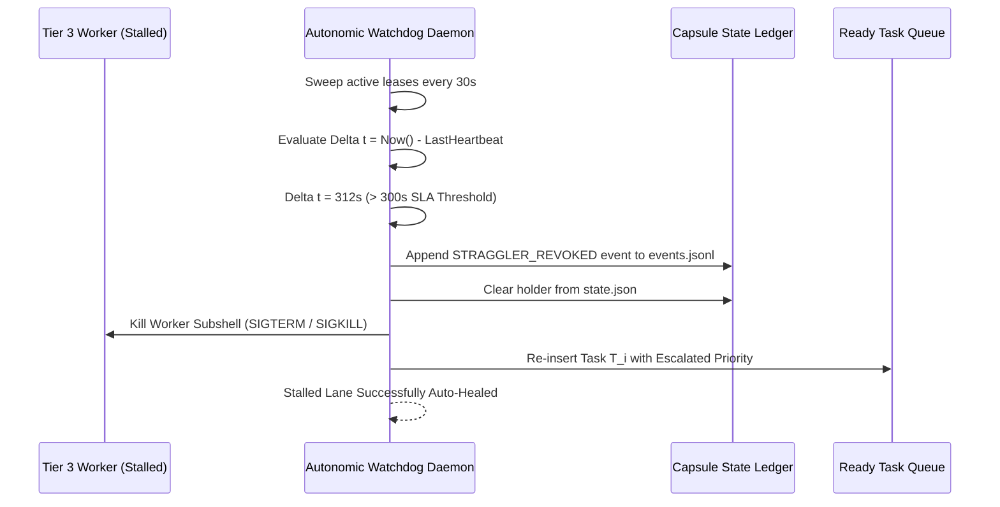

# Five-Minute Straggler SLA Rule & Auto-Healing

---

[Previous: 05-02 Coffman-Graham Width Bounds](05-02-coffman-graham-width-bounds.md) | [Chapter Index](index.md) | [All Chapters Index](../index.md) | [Next: 05-04 Dynamic Load Throttling](05-04-dynamic-load-throttling.md)

---

## 1. Executive Summary & The Straggler Problem

In distributed autonomous development, subagents occasionally enter unrecoverable stalled states:

- An agent enters an infinite retry loop on a failing compiler error.
- A network partition or API rate limit causes a worker process to hang silently.
- An agent terminates abruptly without releasing its lease token.

The OLT (Orchestrating Long Tasks) engine enforces the **Five-Minute Straggler SLA Rule ($\Delta t \le 300\text{s}$)**. Under this rule:

1. **Mandatory Heartbeat Cadence**: Every active worker must emit a heartbeat token to `.olt/capsules/<slug>/mailbox/<agent_id>/heartbeat.json` at least once every 60 seconds.
2. **5-Minute Watchdog Interlock**: If an active lease has no heartbeat update for $\Delta t > 300\text{s}$, the watchdog declares the worker a **Zombie**.
3. **Atomic 3-Step Auto-Healing**: The watchdog immediately revokes the lease, cleans the scratch worktree, and re-queues the task with elevated priority.

```text
+--------------------------------------------------------------------------------------------------+
│                             5-MINUTE STRAGGLER SLA TOPOLOGY                                      │
+--------------------------------------------------------------------------------------------------+
│                                                                                                  │
│   Worker Active ──► Emits Heartbeat every 60s: .olt/capsules/<slug>/mailbox/<id>/heartbeat.json   │
│                             │                                                                    │
│                             ▼                                                                    │
│   Watchdog Daemon ──► Evaluates: Delta t = Now() - LastHeartbeat(T_i)                            │
│                             │                                                                    │
│         ┌───────────────────┴───────────────────┐                                                │
│         ▼                                       ▼                                                │
│   Delta t <= 300s                         Delta t > 300s (SLA BREACH)                            │
│   [Lease HEALTHY]                         [ZOMBIE WORKER DETECTED]                               │
│                                                 │                                                │
│                                                 ▼                                                │
│                                           3-Step Auto-Heal:                                      │
│                                           1. Revoke Monotonic Lease Token                        │
│                                           2. Scrub .olt/worktrees/T_i/                           │
│                                           3. Re-queue Task with Escalated Priority               │
│                                                                                                  │
+--------------------------------------------------------------------------------------------------+
```

---

## 2. Mathematical Formalization of Straggler Detection

Let $\tau_{\text{last}}(T_i)$ denote the timestamp of the last verified heartbeat emitted for leased task $T_i$.

The **Straggler Detection Predicate** $\mathcal{S}_{\text{straggler}}(T_i)$ is:

$$\mathcal{S}_{\text{straggler}}(T_i) = \Big( \text{Status}(T_i) = \text{LEASED} \Big) \land \Big( \text{Now}() - \tau_{\text{last}}(T_i) > 300\text{s} \Big)$$

When $\mathcal{S}_{\text{straggler}}(T_i) = 1$, the recovery operator $\mathcal{R}_{\text{heal}}$ is triggered:

$$\mathcal{R}_{\text{heal}}(T_i) = \text{RevokeLease}(T_i) \circ \text{ScrubWorktree}(T_i) \circ \text{RequeueTask}(T_i, \text{priority} \leftarrow \text{HIGH})$$



---

## 3. Watchdog Daemon Implementation

The SLA watchdog ([`watchdog-daemon.ts`](file:///Users/onurseckinsenoglu/repos/skills/olt/scripts/src/engine/watchdog/watchdog-daemon.ts)) executes non-blocking background sweeps:

```typescript
export async function sweepStragglerLeases(capsuleDir: string): Promise<number> {
  const state = await loadCapsuleState(capsuleDir);
  const now = Date.now();
  let reclaimedCount = 0;

  for (const [taskId, task] of Object.entries(state.tasks)) {
    if (task.status === "LEASED" && task.lastHeartbeat) {
      const elapsedMs = now - new Date(task.lastHeartbeat).getTime();
      if (elapsedMs > 300_000) {
        await reclaimZombieTask(capsuleDir, taskId, task.holder);
        reclaimedCount++;
      }
    }
  }
  return reclaimedCount;
}
```

---

## 4. Architectural Invariants Summary

1. **Zero Indefinite Hangs**: No task may block the topological scheduler for longer than 300 seconds without heartbeat renewal.
2. **Atomic Recovery**: Worktrees of stalled workers are wiped clean before re-leasing.
3. **Escalated Re-Queue**: Straggler tasks receive priority dispatch on subsequent attempts.

---

[Previous: 05-02 Coffman-Graham Width Bounds](05-02-coffman-graham-width-bounds.md) | [Chapter Index](index.md) | [All Chapters Index](../index.md) | [Next: 05-04 Dynamic Load Throttling](05-04-dynamic-load-throttling.md)

---
