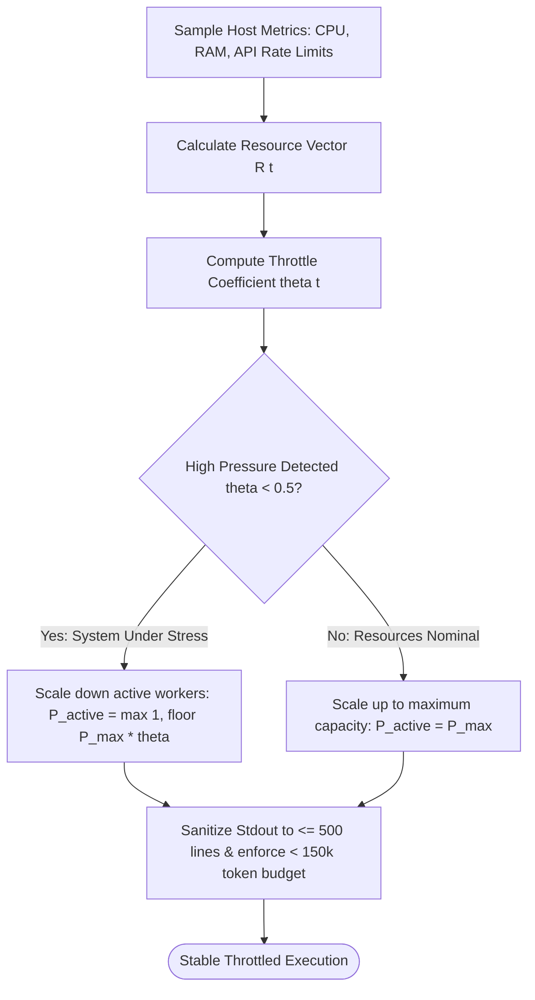

# Dynamic Load Throttling & Cowan Token Budgets

---

[Previous: 05-03 Five-Minute Straggler SLA](05-03-five-minute-straggler-sla-rule.md) | [Chapter Index](index.md) | [All Chapters Index](../index.md) | [Next: Chapter 06 Index](../06-topological-scheduler-dags/index.md)

---

## 1. Executive Summary & Context Budgeting

In autonomous multi-agent engineering swarms, unconstrained resource consumption causes two major failure modes:

1. **Host Resource Exhaustion**: Too many concurrent worker processes exhaust memory, CPU cores, or POSIX file descriptors.
2. **LLM Context Window Poisoning**: Accumulating thousands of lines of raw compiler stderr or verbose file dumps into an agent's context window exceeds the **Cowan Context Window Envelope ($<150{,}000$ tokens)**, degrading attention and causing catastrophic hallucinations.

The OLT (Orchestrating Long Tasks) engine implements **Dynamic Load Throttling & Cowan Token Budgeting**. Under this architecture:

- **Adaptive Concurrency Throttling**: Concurrency width $\theta(t)$ dynamically scales based on CPU load, available RAM, and host API rate limit responses.
- **Strict Cowan Token Budgets**: Context payloads entering LLM prompts are capped strictly at $<150{,}000$ tokens, with stdout streams sanitized and truncated to $\le 500$ lines.

```text
+--------------------------------------------------------------------------------------------------+
│                             DYNAMIC LOAD & CONTEXT THROTTLING                                    │
+--------------------------------------------------------------------------------------------------+
│                                                                                                  │
│   HOST SENSORS (CPU, RAM, API 429 Responses) ──► Adaptive Throttle: theta(t) in [1..8 Workers]  │
│                                                                                                  │
│   COWAN CONTEXT ENVELOPE (< 150,000 Tokens)                                                      │
│   • Discovery Frontmatter:    < 500 Tokens                                                       │
│   • Activation Instructions:  < 4,000 Tokens                                                     │
│   • Execution Context:        < 150,000 Tokens                                                   │
│   • Stdout Truncation:        Capped at 500 Lines (Progressive Disclosure)                       │
│                                                                                                  │
+--------------------------------------------------------------------------------------------------+
```

---

## 2. Mathematical Formalization of Adaptive Throttling

Let $\mathbf{R}(t) = \langle R_{\text{cpu}}(t), R_{\text{mem}}(t), R_{\text{rate}}(t) \rangle$ denote the real-time resource utilization vector at time $t$.

Let $\mathbf{C} = \langle C_{\text{cpu}}, C_{\text{mem}}, C_{\text{rate}} \rangle$ denote the maximum capacity vector.

The **Adaptive Throttle Coefficient** $\theta(t) \in [0.0, 1.0]$ is:

$$\theta(t) = \max\left( 0.1, \; 1.0 - \max\left( \frac{R_{\text{cpu}}(t)}{C_{\text{cpu}}}, \; \frac{R_{\text{mem}}(t)}{C_{\text{mem}}}, \; \frac{R_{\text{rate}}(t)}{C_{\text{rate}}} \right) \right)$$

The **Permitted Active Worker Count** $P_{\text{active}}(t)$ is:

$$P_{\text{active}}(t) = \max\Big( 1, \; \big\lfloor P_{\max} \cdot \theta(t) \big\rfloor \Big)$$



---

## 3. Stdout Sanitization & Progressive Disclosure

When commands emit massive stdout logs (e.g. 5,000 lines of test output), the OLT Sanitization Operator $\mathcal{S}_{\text{stdout}}$ extracts the first 50 lines, the last 150 lines, and summarizes intermediate blocks:

$$\mathcal{S}_{\text{stdout}}(\text{raw}) = \text{Head}_{50}(\text{raw}) \mathbin{\Vert} \texttt{"\n... [3,800 lines omitted] ...\n"} \mathbin{\Vert} \text{Tail}_{150}(\text{raw})$$

---

## 4. Architectural Invariants Summary

1. **Context Window Protection**: Total context per prompt never exceeds 150,000 Cowan tokens.
2. **Elastic Scaling**: Concurrency automatically scales down during CPU or API rate limit spikes.
3. **Zero Buffer Overflow**: Terminal streams are sanitized before entering LLM contexts.

---

[Previous: 05-03 Five-Minute Straggler SLA](05-03-five-minute-straggler-sla-rule.md) | [Chapter Index](index.md) | [All Chapters Index](../index.md) | [Next: Chapter 06 Index](../06-topological-scheduler-dags/index.md)

---
