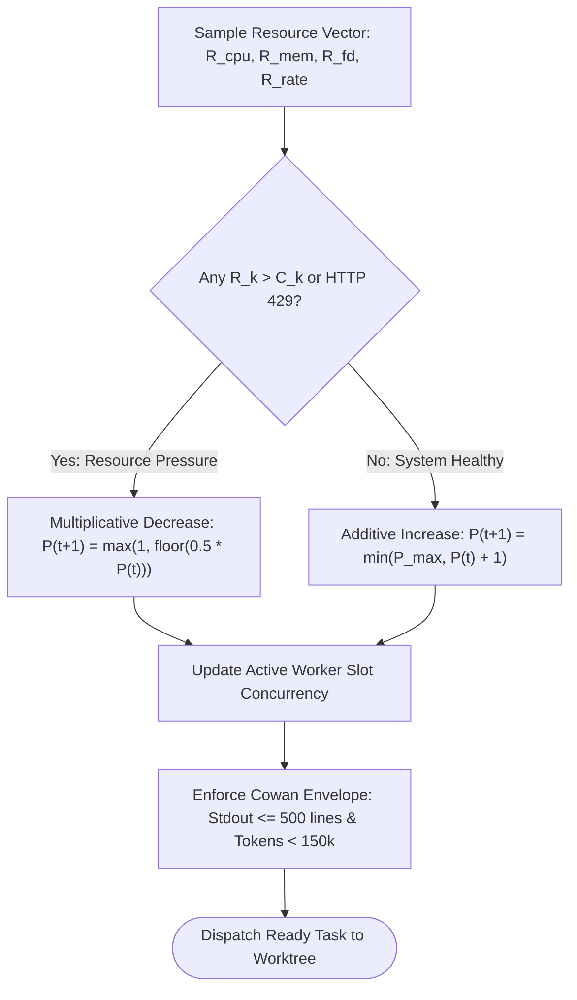

# Dynamic Load Throttling & Cowan Token Budgets

---

[Previous: 05-03 Five-Minute Straggler SLA Rule](05-03-five-minute-straggler-sla-rule.md) | [Chapter Index](index.md) | [All Chapters Index](../index.md) | [Next: Chapter 06: Topological Scheduler DAGs](../06-topological-scheduler-dags/index.md)

---

## 1. Executive Summary & Context Budgeting

In large-scale autonomous agentic workflows, compute capacity is constrained not only by CPU cores and RAM, but also by external LLM provider API rate limits and strict context window saturation thresholds. Unmanaged parallelism triggers two distinct failure modes:

1. **Host & API Thrashing**: Concurrently executing 8+ heavy worker processes generates local CPU starvation, exhausts POSIX file descriptors, and triggers cascading HTTP `429 Too Many Requests` API rate limit bans.
2. **Context Window Flooding**: Injecting uncurated terminal dumps (e.g. 5,000 lines of raw compiler stderr or test traces) into worker prompts poisons attention mechanisms, exceeding the **Cowan Context Window Envelope ($<150{,}000$ tokens)** and triggering catastrophic hallucinations.

The Orchestrating Long Tasks (OLT) engine implements **Dynamic Load Throttling & Cowan Token Budgeting**. This dual-channel control system uses Additive Increase Multiplicative Decrease (AIMD) host load sensing to modulate worker pool capacity in real-time while strictly sanitizing terminal streams to $\le 500$ lines.

```text
+===================================================================================================+
|                             DYNAMIC LOAD & CONTEXT THROTTLING                                     |
+===================================================================================================+
|                                                                                                   |
|   HOST LOAD SENSORS & API TELEMETRY                                                               |
|   ┌─────────────────────────────────────────────────────────────────────────────────────────────┐ |
|   │ Vector: R(t) = < CPU_load, RAM_resident, Open_FDs, API_429_Rate >                           │ |
|   └──────────────────────────────────────────┬──────────────────────────────────────────────────┘ |
|                                              │ Real-Time Metric Ingestion                         |
|                                              ▼                                                    |
|   AIMD FEEDBACK CONTROLLER (10-Second Sampling Loop)                                             |
|   ┌─────────────────────────────────────────────────────────────────────────────────────────────┐ |
|   │ • Additive Increase:         P(t+1) = min( P_max, P(t) + 1 )  [Nominal conditions]          │ |
|   │ • Multiplicative Decrease:   P(t+1) = max( 1, floor( 0.5 * P(t) ) )  [On 429 or CPU > 85%]  │ |
|   └──────────────────────────────────────────┬──────────────────────────────────────────────────┘ |
|                                              │ Clamped Worker Concurrency theta(t)                |
|                                              ▼                                                    |
|   COWAN CONTEXT WINDOW ENVELOPE (< 150,000 Tokens)                                                |
|   ┌─────────────────────────────────────────────────────────────────────────────────────────────┐ |
|   │ 1. Discovery Frontmatter     : < 500 Tokens                                                 │ |
|   │ 2. Activation Instructions   : < 4,000 Tokens                                               │ |
|   │ 3. Execution Payload         : < 150,000 Tokens (Hard Ceiling)                              │ |
|   │ 4. Terminal Stdout Truncator : Head 50 + Tail 150 Lines (Max 500 Lines Total)              │ |
|   └─────────────────────────────────────────────────────────────────────────────────────────────┘ |
|                                                                                                   |
+===================================================================================================+
```

---

## 2. Mathematical Formalization of AIMD Load Control

Let $\mathbf{R}(t) \in \mathbb{R}^4_{\ge 0}$ denote the four-dimensional real-time host resource consumption vector at sample time $t$:

$$\mathbf{R}(t) = \Big\langle R_{\text{cpu}}(t), \; R_{\text{mem}}(t), \; R_{\text{fd}}(t), \; R_{\text{rate}}(t) \Big\rangle$$

Where:

- $R_{\text{cpu}}(t)$: 1-minute OS load average normalized by available physical CPU cores $\left(\frac{\text{load}_{\text{1m}}}{N_{\text{cores}}}\right)$.
- $R_{\text{mem}}(t)$: Fraction of physical host RAM consumed by active worker subtrees $\left(\frac{\text{RAM}_{\text{used}}}{\text{RAM}_{\text{total}}}\right)$.
- $R_{\text{fd}}(t)$: File descriptor utilization fraction $\left(\frac{\text{FD}_{\text{open}}}{\text{FD}_{\text{max}}}\right)$.
- $R_{\text{rate}}(t)$: Rate limit pressure index derived from HTTP 429 / HTTP 503 response frequencies $\in [0, 1]$.

Let $\mathbf{C} = \langle C_{\text{cpu}}, C_{\text{mem}}, C_{\text{fd}}, C_{\text{rate}} \rangle = \langle 0.85, \; 0.80, \; 0.75, \; 0.05 \rangle$ represent the maximum safe operational threshold vector.

### 2.1 The Adaptive Throttle Coefficient

The instantaneous **Throttle Coefficient** $\theta(t) \in [0.1, 1.0]$ is defined as:

$$\theta(t) = \max\left( 0.1, \; 1.0 - \max_{k \in \{\text{cpu}, \text{mem}, \text{fd}, \text{rate}\}} \left( \frac{R_k(t)}{C_k} \right) \right)$$

### 2.2 AIMD Worker Pool Adjustment Equations

Let $P(t) \in \{1, 2, \dots, P_{\max}\}$ denote the active worker pool size. The feedback controller updates $P(t)$ at discrete intervals $\Delta t = 10\,\text{s}$:

$$P(t + \Delta t) = \begin{cases} \min\big( P_{\max}, \; P(t) + \alpha \big) & \text{if } \forall k, \; R_k(t) \le C_k \quad (\text{Additive Increase}) \\ \max\big( P_{\min}, \; \lfloor \beta \cdot P(t) \rfloor \big) & \text{if } \exists k, \; R_k(t) > C_k \quad (\text{Multiplicative Decrease}) \end{cases}$$

Where the standard OLT tuning constants are:

- Additive step: $\alpha = 1$ worker per 10-second healthy evaluation window.
- Multiplicative backoff factor: $\beta = 0.50$ (halves active capacity immediately upon breach).
- Worker bounds: $P_{\min} = 1$, $P_{\max} = \min(8, N_{\text{cores}})$.



---

## 3. Cowan Context Window Envelope & Sanitization

LLM cognitive performance degrades rapidly when prompts exceed attention retention limits. The OLT runtime establishes the **Cowan Context Window Envelope**, capping total token payloads at $< 150{,}000$ tokens across all worker interactions.

```text
+---------------------------------------------------------------------------------------------------+
|                                  COWAN CONTEXT BUDGET ALLOCATION                                  |
+---------------------------------------------------------------------------------------------------+
|                                                                                                   |
|   TOTAL CONTEXT BUDGET: 150,000 TOKENS MAXIMUM                                                    |
|                                                                                                   |
|   ┌───────────────────────────────────┬───────────────────┬───────────────────────────────────┐   |
|   │ Context Component                 │ Token Budget      │ Contents & Description            │   |
|   ├───────────────────────────────────┼───────────────────┼───────────────────────────────────┤   |
|   │ 1. Discovery Frontmatter          │ <= 500 tokens     │ Task ID, slug, role, permissions  │   |
|   │ 2. Activation Instructions        │ <= 4,000 tokens   │ Chapter invariants, tool schemas  │   |
|   │ 3. Working Memory / Ingested Files│ <= 120,000 tokens │ Target source files, AST context  │   |
|   │ 4. Stdout / Diagnostic Receipts   │ <= 25,000 tokens  │ Truncated terminal receipts       │   |
|   │ 5. Generation Safety Margin       │ 500 tokens        │ Response completion headroom      │   |
|   └───────────────────────────────────┴───────────────────┴───────────────────────────────────┘   |
|                                                                                                   |
+---------------------------------------------------------------------------------------------------+
```

### 3.1 Terminal Output Sanitization Formulation

When a shell tool emits raw standard output $O = \langle \ell_1, \ell_2, \dots, \ell_N \rangle$ with $N > 500$ lines, the OLT Sanitization Operator $\mathcal{S}_{\text{stdout}}$ discards uninformative middle lines while preserving initialization headers and terminal error traces:

$$\mathcal{S}_{\text{stdout}}(O) = \begin{cases} O & \text{if } N \le 500 \\ \big( \ell_1, \dots, \ell_{50} \big) \mathbin{\Vert} \Big\langle \texttt{"\n... ["} \cdot (N - 200) \cdot \texttt{" lines omitted; full log at .olt/logs/raw.log] ...\n"} \Big\rangle \mathbin{\Vert} \big( \ell_{N-149}, \dots, \ell_N \big) & \text{if } N > 500 \end{cases}$$

The full uncompressed log is simultaneously persisted out-of-band to disk at `.olt/capsules/<slug>/logs/<task_id>/raw_stdout.log`.

---

## 4. High-Density AIMD Throttling State Machine

```text
+---------------------------------------------------------------------------------------------------+
|                                AIMD THROTTLING CONTROL STATE MACHINE                              |
+---------------------------------------------------------------------------------------------------+
|                                                                                                   |
|       +------------------------------------------------------------------------------------+      |
|       │                                                                                    │      |
|       ▼                                                                                    │      |
|    +--------------------+       System Nominal for 10s       +--------------------+        │      |
|    |    STEADY_STATE    | ─────────────────────────────────► |   PROBING_EXPAND   |        │      |
|    |    (P = P_curr)    | ◄───────────────────────────────── |   (P = P + 1)      |        │      |
|    +--------------------+            P == P_max              +--------------------+        │      |
|              │                                                         │                   │      |
|              │ HTTP 429 Received                                       │ Resource Spike    │      |
|              │ or CPU > 85%                                            │ (RAM / CPU / FD)  │      |
|              ▼                                                         ▼                   │      |
|    +------------------------------------------------------------------------------+        │      |
|    |                             BACKOFF_QUENCH STATE                             |        │      |
|    |                    P_next = max( 1, floor( 0.5 * P_curr ) )                  |        │      |
|    |                    Arm Quench Timer: T_cooldown = 15 seconds                 |        │      |
|    +------------------------------------------------------------------------------+        │      |
|                                           │                                                │      |
|                                           │ Cooldown Timer Expired & Resources Nominal     │      |
|                                           └────────────────────────────────────────────────┘      |
|                                                                                                   |
+---------------------------------------------------------------------------------------------------+
```

---

## 5. TypeScript Dynamic Throttling & Budgeting Interfaces

The AIMD controller and Cowan context budgeter are implemented in [`dynamic-load-throttler.ts`](file:///Users/onurseckinsenoglu/repos/skills/olt/scripts/src/engine/throttler/dynamic-load-throttler.ts):

```typescript
import * as os from "node:os";

export interface HostSensorMetrics {
  cpuUsageFraction: number;
  memoryUsageFraction: number;
  openFdEstimate: number;
  http429Rate: number;
  sampleTimestampMs: number;
}

export interface ThrottleConfig {
  maxWorkers: number;
  minWorkers: number;
  cpuThreshold: number;
  memThreshold: number;
  fdThreshold: number;
  sampleIntervalMs: number;
}

export interface SanitizedOutput {
  displayContent: string;
  totalLineCount: number;
  omittedLineCount: number;
  rawLogPath: string;
}

export class DynamicLoadThrottler {
  private currentConcurrency: number;
  private readonly config: ThrottleConfig;

  constructor(config?: Partial<ThrottleConfig>) {
    this.config = {
      maxWorkers: 8,
      minWorkers: 1,
      cpuThreshold: 0.85,
      memThreshold: 0.8,
      fdThreshold: 0.75,
      sampleIntervalMs: 10_000,
      ...config,
    };
    this.currentConcurrency = Math.min(4, this.config.maxWorkers);
  }

  public evaluateMetrics(metrics: HostSensorMetrics): number {
    const isOverloaded =
      metrics.cpuUsageFraction > this.config.cpuThreshold ||
      metrics.memoryUsageFraction > this.config.memThreshold ||
      metrics.http429Rate > 0;

    if (isOverloaded) {
      // Multiplicative decrease (beta = 0.5)
      this.currentConcurrency = Math.max(
        this.config.minWorkers,
        Math.floor(this.currentConcurrency * 0.5),
      );
    } else {
      // Additive increase (alpha = 1)
      this.currentConcurrency = Math.min(this.config.maxWorkers, this.currentConcurrency + 1);
    }

    return this.currentConcurrency;
  }

  public sanitizeStdout(raw: string, rawLogPath: string): SanitizedOutput {
    const lines = raw.split("\n");
    const totalLineCount = lines.length;

    if (totalLineCount <= 500) {
      return {
        displayContent: raw,
        totalLineCount,
        omittedLineCount: 0,
        rawLogPath,
      };
    }

    const head = lines.slice(0, 50).join("\n");
    const tail = lines.slice(totalLineCount - 150).join("\n");
    const omittedLineCount = totalLineCount - 200;

    const displayContent = `${head}\n\n... [${omittedLineCount} lines omitted; full log at ${rawLogPath}] ...\n\n${tail}`;

    return {
      displayContent,
      totalLineCount,
      omittedLineCount,
      rawLogPath,
    };
  }
}
```

---

## 6. Anti-Blunder Matrix: Load Throttling & Budgeting

```text
+------------------------------+---------------------------------------+---------------------------------------+
| Blunder / Failure Mode       | Root Architectural Defect             | OLT Engine Defense                    |
+------------------------------+---------------------------------------+---------------------------------------+
| Unchecked LLM 429 Cascade    | Swarm ignores HTTP 429 headers and    | Multiplicative decrease cuts worker   |
| (API Service Lockout)        | immediately retries on all workers.   | pool by 50% on first 429 detection.   |
+------------------------------+---------------------------------------+---------------------------------------+
| Context Window Hallucination | Passing 10,000 lines of raw compiler  | Sanitization operator trims stdout to |
| (Attention Dilution)         | stderr into LLM prompt context.       | 500 lines (50 head, 150 tail).        |
+------------------------------+---------------------------------------+---------------------------------------+
| Over-Aggressive Backoff      | Dropping concurrency to 1 worker on   | 10-second sampling window smooths     |
| (Throughput Collapse)        | transient 100ms CPU spikes.           | transient spikes via 1-minute loadavg.|
+------------------------------+---------------------------------------+---------------------------------------+
| File Descriptor Leak         | Workers leave open sockets/pipes,     | Watchdog monitors FD ceiling and      |
| (EMFILE / ENFILE Crashes)    | exhausting host file descriptors.     | forces worker reclamation above 75%.  |
+------------------------------+---------------------------------------+---------------------------------------+
| Memory Leak OOM Stall        | Build processes leak RAM, causing     | Throttler backs off concurrency when  |
| (Host Kernel Panic)          | silent worker terminations.           | memory resident fraction exceeds 80%. |
+------------------------------+---------------------------------------+---------------------------------------+
```

---

## 7. Architectural Invariants Summary

1. **Strict Cowan Context Envelope**:
   $$\text{TokenCount}(\text{PromptPayload}) < 150{,}000$$
   No prompt dispatch may exceed the 150,000 token Cowan attention envelope.
2. **Deterministic Stdout Cap**:
   $$\text{LineCount}(\mathcal{S}_{\text{stdout}}(O)) \le 500$$
   Terminal standard output passed to agent prompts is strictly capped at 500 lines.
3. **Fail-Safe Worker Floor**:
   $$\forall t, \quad P_{\text{active}}(t) \ge 1$$
   Load throttling may quench parallelism, but will never reduce capacity below 1 worker.

---

[Previous: 05-03 Five-Minute Straggler SLA Rule](05-03-five-minute-straggler-sla-rule.md) | [Chapter Index](index.md) | [All Chapters Index](../index.md) | [Next: Chapter 06: Topological Scheduler DAGs](../06-topological-scheduler-dags/index.md)

---
