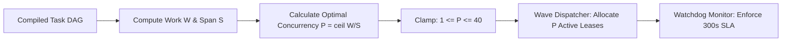

# Chapter 05: Concurrency Scaling & Straggler SLA

[OLT Documentation Hub](../../README.md) > [Architecture Index](../index.md) > Chapter 05: Concurrency Scaling & Straggler SLA

---

[⏮️ Previous: Chapter 04: Continuous Preplanning Factory](../04-continuous-preplanning-factory/index.md) | [📂 Chapter Index](index.md) | [📚 All Chapters Index](../index.md) | [⏭️ Next: 05-01 Brent Work-Span Theorem](05-01-brent-work-span-theorem.md)
---

## 1. Chapter Overview

Scaling autonomous agent execution requires formal mathematical scheduling models. Naively launching unbounded parallel workers results in token limit saturation, write scope collisions, and catastrophic straggler bottlenecks where a single stalled agent blocks the entire workflow.

OLT establishes a **Theoretical Concurrency Framework** based on **Brent's Work-Span Theorem**, **Coffman-Graham Width Bounds**, the **5-Minute Straggler SLA Rule**, and **Dynamic Load Throttling**.

```text
┌──────────────────────────────────────────────────────────────────────────────────────────────────┐
│                           CHAPTER 05: CONCURRENCY & SLA TOPOLOGY                                 │
├──────────────────────────┬──────────────────────────┬────────────────────────────────────────────┤
│ Sub-Topic                │ Key Architectural Model  │ Primary Invariants Enforced                │
├──────────────────────────┼──────────────────────────┼────────────────────────────────────────────┤
│ 01. Brent's Theorem      │ Work-Span Concurrency    │ P = ceil(W/S) <= 40 Maximum Parallel Lanes │
│ 02. Coffman-Graham       │ Precedence Width Bounds  │ Critical Path Prioritization & Layering    │
│ 03. 5-Minute Straggler   │ 300s Watchdog SLA        │ Automated Preemption & Sub-Decomposition   │
│ 04. Load Throttling      │ Dynamic Backpressure     │ Adaptive TPM / RPM Rate Limit Avoidance    │
└──────────────────────────┴──────────────────────────┴────────────────────────────────────────────┘
```

---

## 2. Table of Contents

1. **[05-01: Brent's Work-Span Theorem](./05-01-brent-work-span-theorem.md)**  
   _Formal Work ($W$) and Span ($S$), Brent's theorem $T_P \le \frac{W - S}{P} + S$, optimal concurrency._
2. **[05-02: Coffman-Graham Width Bounds](./05-02-coffman-graham-width-bounds.md)**  
   _Precedence graph level assignments under processor constraints $P$, critical path layering._
3. **[05-03: Five-Minute Straggler SLA Rule](./05-03-five-minute-straggler-sla-rule.md)**  
   _Straggler detection, $T_{\text{max}} = 300\text{s}$ timeout threshold, automated task decomposition._
4. **[05-04: Dynamic Load Throttling](./05-04-dynamic-load-throttling.md)**  
   _Adaptive queue draining, backpressure control, LLM rate limit avoidance, and token budgeting._

---

## 3. Concurrency Acceleration Curve



---

[⏮️ Previous: Chapter 04: Continuous Preplanning Factory](../04-continuous-preplanning-factory/index.md) | [📂 Chapter Index](index.md) | [📚 All Chapters Index](../index.md) | [⏭️ Next: 05-01 Brent Work-Span Theorem](05-01-brent-work-span-theorem.md)
---
