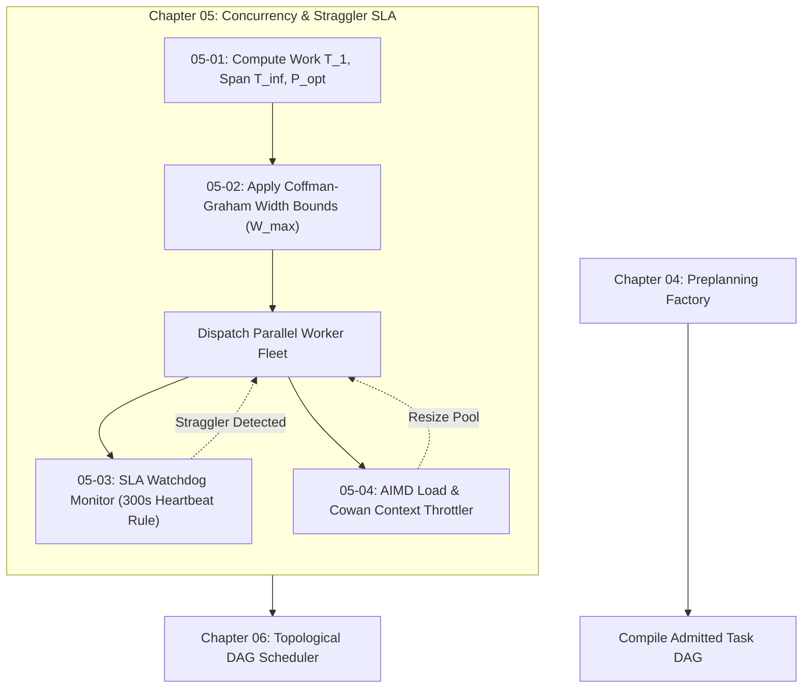

# Chapter 05: Concurrency Scaling & Straggler SLA

---

[Previous: Chapter 04: Continuous Preplanning Factory](../04-continuous-preplanning-factory/index.md) | [Chapter Index](index.md) | [All Chapters Index](../index.md) | [Next: 05-01 Brent Work-Span Theorem](05-01-brent-work-span-theorem.md)

---

## 1. Chapter Overview & Concurrency Architecture

Welcome to Chapter 05 of the OLT Architecture Book. This chapter establishes the mathematical models, width bounds, autonomic straggler watchdogs, and dynamic load throttling mechanisms governing parallel execution in the Orchestrating Long Tasks (OLT) engine.

Autonomous multi-agent swarms frequently encounter severe scheduling pathologies:

- **Under-Parallelization**: Running independent implementation tasks serially inflates end-to-end wall-clock latency.
- **Over-Parallelization**: Spawning unbounded workers triggers local host starvation, CPU lock contention, and LLM HTTP 429 rate limits.
- **Silent Straggler Freezes**: Flaky test suites or stalled network connections hang worker lanes indefinitely, blocking downstream dependencies.

Chapter 05 resolves these challenges through rigorous mathematical scheduling bounds and autonomic reliability controls.

```text
+===================================================================================================+
|                             CHAPTER 05: CONCURRENCY & SLA TOPOLOGY                                |
+===================================================================================================+
|                                                                                                   |
|    ┌───────────────────────────────────┐               ┌───────────────────────────────────┐      |
|    │ 05-01: Brent Work-Span Theorem    │               │ 05-02: Coffman-Graham Width       │      |
|    │ • Work (T_1) vs Span (T_inf)      │ ═════════════►│ • 2-Phase Lexicographical Labeling│      |
|    │ • Optimal Concurrency Allocation  │               │ • Anti-Chain Width Bounding       │      |
|    │ • Amdahl & Gustafson Scalability  │               │ • Critical Path Preservation      │      |
|    └─────────────────┬─────────────────┘               └─────────────────┬─────────────────┘      |
|                      │                                                   │                        |
|                      ▼                                                   ▼                        |
|    ┌───────────────────────────────────┐               ┌───────────────────────────────────┐      |
|    │ 05-03: Five-Minute Straggler SLA  │               │ 05-04: Dynamic Load Throttling    │      |
|    │ • 60s Monotonic Heartbeat Cadence │ ═════════════►│ • AIMD Worker Pool Adjustment     │      |
|    │ • 300s SLA Watchdog Invalidation  │               │ • Host Resource Sensing (CPU/RAM) │      |
|    │ • 3-Step Auto-Healing & Clean-up  │               │ • Cowan Context Envelope (< 150k) │      |
|    └───────────────────────────────────┘               └───────────────────────────────────┘      |
|                                                                                                   |
+===================================================================================================+
```

---

## 2. Chapter Table of Contents & Subtopics Map

```text
+----------------------------------------------------+----------------+--------------------------------------+
| Document                                           | Classification | Core Architectural Focus             |
+----------------------------------------------------+----------------+--------------------------------------+
| 05-01 Brent Work-Span Theorem                      | Mathematics    | T_p <= (T_1 - T_inf)/p + T_inf       |
| 05-02 Coffman-Graham Width Bounds                  | Algorithms     | Lexicographical labeling & width W   |
| 05-03 Five-Minute Straggler SLA Rule               | Reliability    | Heartbeat watchdog & auto-healing    |
| 05-04 Dynamic Load Throttling                      | Performance    | AIMD backoff & Cowan token budgets   |
+----------------------------------------------------+----------------+--------------------------------------+
```

### [05-01: Brent Work-Span Theorem & Parallel Speedup](05-01-brent-work-span-theorem.md)

Formalizes the foundational work-span model for task DAG execution. Defines total sequential work $T_1$, critical path span $T_\infty$, parallel execution duration $T_p$, theoretical speedup $S_p = T_1 / T_p$, Amdahl/Gustafson scaling limits, and multi-coordinator fleet partitioning for large swarms.

### [05-02: Coffman-Graham Width Bounds Scheduling](05-02-coffman-graham-width-bounds.md)

Deconstructs the two-phase Coffman-Graham algorithm for width-bounded DAG scheduling. Explores lexicographical successor labeling, anti-chain width calculations via Dilworth's theorem, critical path preservation, and polynomial-time optimality bounds ($T_2 = T_2^*$ for 2 processors, $(2 - 2/p)$ approximation for $p$ processors).

### [05-03: Five-Minute Straggler SLA Rule & Auto-Healing](05-03-five-minute-straggler-sla-rule.md)

Details the 5-minute straggler SLA rule ($T_{\text{SLA}} = 300\,\text{s}$). Codifies the 60-second worker heartbeat protocol, POSIX advisory file locking, the autonomic watchdog sweep daemon, process group signal escalation (`SIGTERM` $\rightarrow$ `SIGKILL`), worktree scrubbing, and speculative re-execution.

### [05-04: Dynamic Load Throttling & Cowan Token Budgets](05-04-dynamic-load-throttling.md)

Establishes the host resource sensing engine (CPU, RAM, file descriptors, API 429 response rate) and the Additive Increase Multiplicative Decrease (AIMD) feedback controller. Codifies the Cowan Context Window Envelope ($<150{,}000$ tokens) and stdout progressive disclosure sanitization ($\le 500$ lines).

---

## 3. Mathematical Formulations & Architectural Invariants

$$ \begin{array}{|l|l|l|}
\hline
\textbf{Mechanism} & \textbf{Formal Equation / Bound} & \textbf{Operational Invariant} \\ \hline
\text{Brent's Inequality} & T_p \le \frac{T_1 - T_\infty}{p} + T_\infty & \text{Optimal parallel work-span scaling} \\ \hline
\text{Optimal Workforce} & P_{\text{opt}} = \left\lceil \frac{T_1}{T_\infty} \right\rceil & \text{Prevents concurrency over-allocation} \\ \hline
\text{Coffman-Graham Bound} & \frac{T_p}{T_p^*} \le 2 - \frac{2}{p} & \text{Bounded makespan for } p \text{ worker slots} \\ \hline
\text{Straggler SLA Rule} & \text{Now}() - \tau_{\text{last}}(T_i) \le 300\,\text{s} & \text{Lease revoked upon 5-minute inactivity} \\ \hline
\text{Adaptive Throttle} & \theta(t) = \max\Big(0.1, \; 1 - \max_k \frac{R_k(t)}{C_k}\Big) & \text{Host load & API 429 backoff modulation} \\ \hline
\text{Cowan Envelope} & \text{Tokens}(\text{Payload}) < 150{,}000 & \text{Strict attention preservation ceiling} \\ \hline
\end{array} $$



---

## 4. Tiered Concurrency Governance Matrix

The table below summarizes how each tier in the OLT workforce interacts with concurrency, width limits, and straggler watchdogs:

```text
+-----------------------+-----------------------------+-----------------------------+------------------------------------+
| Workforce Tier        | Concurrency Role            | Active Capacity Bounds      | Failure & SLA Oversight            |
+-----------------------+-----------------------------+-----------------------------+------------------------------------+
| Tier 0: Mind Owner    | Perpetual Discovery Cadence | Single Daemon (FD 9 flock)  | Generational rotation & quiescence |
| Tier 1: Orchestrator  | Epics & Fleet Partitioning  | 1 Orchestrator per Capsule  | Allocates P_opt & spawns Coord.    |
| Tier 2: Coordinator   | Wave Execution & Leveling   | <= 4 Workers per Coord.     | Manages CG layers & dispatch queues|
| Tier 3: Workforce     | Atomic Task Execution       | Slot Concurrency [1..W_max] | Emits 60s heartbeats; 300s SLA cap |
+-----------------------+-----------------------------+-----------------------------+------------------------------------+
```

---

## 5. Cross-Chapter Execution Lifecycle

The lifecycle diagram below traces how concurrency scaling and straggler SLA controls integrate with upstream preplanning and downstream topological execution:

```text
+---------------------------------------------------------------------------------------------------+
|                                 CROSS-CHAPTER INTEGRATION LIFECYCLE                               |
+---------------------------------------------------------------------------------------------------+
|                                                                                                   |
|   1. Chapter 04 (Continuous Preplanning Factory)                                                  |
|      Ingests prompt.md, guarantees 100% prompt line coverage, and outputs Task DAG G = (V, E).    |
|                                     │                                                             |
|                                     ▼                                                             |
|   2. Chapter 05 (Concurrency Scaling & Straggler SLA)                                             |
|      ├── Section 05-01: Computes Work T_1, Critical Span T_inf, and Allocates P_opt = ceil(W/S).  |
|      ├── Section 05-02: Applies Coffman-Graham 2-Phase labeling and bounds wave width to W_max.  |
|      ├── Section 05-03: Arms 300-second Straggler SLA watchdog & 60-second heartbeat monitor.     |
|      └── Section 05-04: Dynamically throttles active workers via AIMD feedback & Cowan token caps.|
|                                     │                                                             |
|                                     ▼                                                             |
|   3. Chapter 06 (Topological Scheduler DAGs)                                                      |
|      Compiles execution waves via Kahn topological sort, Tarjan SCC checks, and Sugiyama layouts. |
|                                                                                                   |
+---------------------------------------------------------------------------------------------------+
```

---

## 6. Summary & Transition

The theoretical bounds and autonomic watchdogs established in Chapter 05 ensure that OLT autonomous swarms scale efficiently without risking host collapse, context window degradation, or silent straggler stalls.

Proceed to [05-01: Brent Work-Span Theorem](05-01-brent-work-span-theorem.md) to explore the mathematical foundations of parallel task scaling, or advance to [Chapter 06: Topological DAG Scheduler](../06-topological-scheduler-dags/index.md) to examine DAG compilation and topological execution wave engines.

---

[Previous: Chapter 04: Continuous Preplanning Factory](../04-continuous-preplanning-factory/index.md) | [Chapter Index](index.md) | [All Chapters Index](../index.md) | [Next: 05-01 Brent Work-Span Theorem](05-01-brent-work-span-theorem.md)

---
$$
