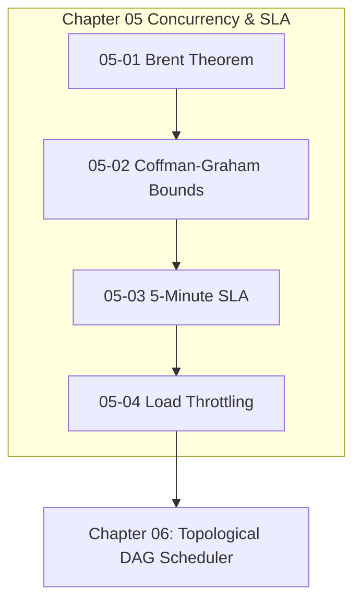

# Chapter 05: Concurrency Scaling & Straggler SLA

---

[Previous: Chapter 04 Index](../04-continuous-preplanning-factory/index.md) | [Chapter Index](index.md) | [All Chapters Index](../index.md) | [Next: 05-01 Brent Work-Span Theorem](05-01-brent-work-span-theorem.md)

---

## 1. Chapter Overview & Concurrency Architecture

Welcome to Chapter 05 of the OLT Architecture Book. This chapter establishes the mathematical models, width bounds, straggler watchdog rules, and dynamic load throttling mechanisms governing parallel execution and scheduling efficiency in the OLT (Orchestrating Long Tasks) engine.

Autonomous multi-agent swarms frequently experience scheduling pathologies: either spawning too few agents (resulting in high wall-clock latency) or spawning too many agents (causing rate limit throttling, lock contention, and straggler stalls). Chapter 05 formalizes the Brent Work-Span Theorem, details Coffman-Graham Width Bounds, codifies the 5-Minute Straggler SLA Rule, and defines Dynamic Load Throttling under Cowan context envelopes.

```text
+--------------------------------------------------------------------------------------------------+
│                             CHAPTER 05: CONCURRENCY & SLA TOPOLOGY                               │
+--------------------------------------------------------------------------------------------------+
│                                                                                                  │
│    ┌───────────────────────────┐                    ┌───────────────────────────┐                │
│    │ 05-01: Brent Work-Span    │                    │ 05-02: Coffman-Graham     │                │
│    │ Theorem & Parallel Speedup│ ══════════════════►│ Width Bounds Scheduling   │                │
│    └─────────────┬─────────────┘                    └─────────────┬─────────────┘                │
│                  │                                                │                              │
│                  ▼                                                ▼                              │
│    ┌───────────────────────────┐                    ┌───────────────────────────┐                │
│    │ 05-03: Five-Minute        │                    │ 05-04: Dynamic Load       │                │
│    │ Straggler SLA Rule        │ ══════════════════►│ Throttling & Token Budgets│                │
│    └───────────────────────────┘                    └───────────────────────────┘                │
│                                                                                                  │
+--------------------------------------------------------------------------------------------------+
```

---

## 2. Chapter Table of Contents & Learning Path

```text
+--------------------------------------------------+--------------+--------------------------------+
│ Document                                         │ Classification│ Core Architectural Focus       │
+--------------------------------------------------+--------------+--------------------------------+
│ 05-01 Brent Work-Span Theorem                    │ Mathematics  │ T_p <= (T_1 - T_inf)/p + T_inf │
│ 05-02 Coffman-Graham Width Bounds                │ Algorithms   │ 2-processor bounds & labels    │
│ 05-03 Five-Minute Straggler SLA Rule             │ Reliability  │ Heartbeat monitoring & reclaim │
│ 05-04 Dynamic Load Throttling                    │ Performance  │ Cowan context & throttle theta │
+--------------------------------------------------+--------------+--------------------------------+
```

### [05-01: Brent Work-Span Theorem & Parallel Speedup](05-01-brent-work-span-theorem.md)

Formalizes the work-span model: total work $T_1$, critical path span $T_\infty$, parallel execution time $T_p$, speedup $S_p = T_1 / T_p$, and multi-coordinator partitioning.

### [05-02: Coffman-Graham Width Bounds Scheduling](05-02-coffman-graham-width-bounds.md)

Deconstructs the two-phase Coffman-Graham algorithm: lexicographical task labeling, maximum width bounds $\mathcal{W}(G)$, and Graham greedy approximation bounds.

### [05-03: Five-Minute Straggler SLA Rule](05-03-five-minute-straggler-sla-rule.md)

Details the 5-minute heartbeat SLA rule ($\Delta t \le 300\text{s}$), the autonomic watchdog daemon, zombie worker detection, and the 3-step auto-healing recovery protocol.

### [05-04: Dynamic Load Throttling & Cowan Token Budgets](05-04-dynamic-load-throttling.md)

Explains the multi-dimensional resource vector $\mathbf{R}(t)$, adaptive throttle coefficient $\theta(t)$, and the Cowan context window budget envelope ($<150{,}000$ tokens).

---

## 3. Core Concurrency Formulations Table

$$ \begin{array}{|l|l|l|}
\hline
\textbf{Mechanism} & \textbf{Formal Equation} & \textbf{Operational Invariant} \\ \hline
\text{Brent's Theorem} & T_p \le \frac{T_1 - T_\infty}{p} + T_\infty & \text{Optimal parallel work-span scaling} \\ \hline
\text{Speedup Metric} & S_p = \frac{T_1}{T_p} \le p & \text{Sub-linear scaling efficiency} \\ \hline
\text{Straggler SLA} & \text{Now}() - \text{LastHeartbeat}(T_i) \le 300\text{s} & \text{5-minute lease revocation trigger} \\ \hline
\text{Throttle Function} & \theta(t) = \max\Big(0, \; 1 - \max_k \frac{R_k(t)}{C_k}\Big) & \text{Adaptive worker concurrency throttling} \\ \hline
\end{array}$$



---

## 4. Summary & Transition

The mathematical scaling models and watchdog SLA rules codified in Chapter 05 ensure that OLT swarms scale smoothly across available compute cores while instantly reclaiming stalled tasks.

Proceed to [05-01: Brent Work-Span Theorem](05-01-brent-work-span-theorem.md) or advance directly to [Chapter 06: Topological DAG Scheduler](../06-topological-scheduler-dags/index.md).

---

[Previous: Chapter 04 Index](../04-continuous-preplanning-factory/index.md) | [Chapter Index](index.md) | [All Chapters Index](../index.md) | [Next: 05-01 Brent Work-Span Theorem](05-01-brent-work-span-theorem.md)

---
$$
