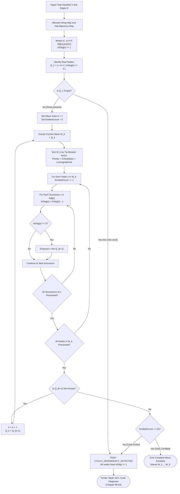

# DAG Compilation & Kahn's Topological Sort Algorithm

---

[Previous: Chapter 06: Topological Scheduler DAGs](index.md) | [Chapter Index](index.md) | [All Chapters Index](../index.md) | [Next: 06-02 Tarjan SCC Cycle Detection](06-02-tarjan-scc-cycle-detection.md)

---

## 1. Executive Summary & Graph-Theoretic Compilation Architecture

In autonomous multi-agent software engineering systems, uncoordinated task execution leads to severe failure modes: missing type definitions, unbuilt dependencies, merge collisions in shared source trees, and race conditions during artifact consumption. Arbitrary task scheduling guarantees non-deterministic execution failure when subagents run concurrently.

The OLT (Orchestrating Long Tasks) engine resolves this by compiling task requirements into a Directed Acyclic Graph (DAG) using **Kahn's Topological Sorting Algorithm**. The compiler transforms raw obligation lists derived from the sealed prompt into an ordered, multi-tier dependency structure.

Under this scheduler:

1. **Linear Time Compilation ($\mathcal{O}(|V| + |E|)$)**: Tasks are strictly sequenced such that every prerequisite task finishes and seals its artifacts before dependent tasks are unlocked.
2. **Topological Wave Synthesis**: Tasks possessing an in-degree of zero are partitioned into parallel execution waves ($W_1, W_2, \dots, W_K$), establishing clear concurrency boundaries.
3. **Deterministic Queue Progression**: Ready tasks are placed into active worker queues using deterministic tie-breaking rules, eliminating runtime race conditions across heterogeneous hosts.
4. **Immediate Cycle Rejection**: If the number of topologically emitted nodes is strictly less than $|V|$, graph compilation halts immediately, triggering Tarjan's cycle diagnosis subsystem.

```text
+--------------------------------------------------------------------------------------------------+
│                             KAHN TOPOLOGICAL COMPILATION PIPELINE                                │
+--------------------------------------------------------------------------------------------------+
│                                                                                                  │
│   Task Manifest V = {T_1, ..., T_N} ──► Build Adjacency List & In-Degree Array InDeg(v)          │
│   Dependency Set E = {(u, v), ...}             │                                                 │
│                                                ▼                                                 │
│                               Scan for Zero In-Degree Nodes:                                     │
│                               Q_0 = { v in V | InDeg(v) == 0 }                                   │
│                                                │                                                 │
│                                                ▼                                                 │
│                    ┌────────────────────────────────────────────────────────┐                    │
│                    │ WHILE Q_k is Non-Empty:                                │                    │
│                    │  1. Partition Q_k into Wave W_k                        │                    │
│                    │  2. Apply Deterministic Tie-Breaker: Sort(W_k)         │                    │
│                    │  3. For each node u in W_k:                            │                    │
│                    │       For each successor v in Adj(u):                  │                    │
│                    │         InDeg(v) = InDeg(v) - 1                        │                    │
│                    │         If InDeg(v) == 0: Enqueue v -> Q_{k+1}         │                    │
│                    │  4. Increment Wave Counter: k = k + 1                  │                    │
│                    └───────────────────────────┬────────────────────────────┘                    │
│                                                │                                                 │
│                                                ▼                                                 │
│                             Graph Completeness Verification:                                     │
│                                  |Emitted Nodes| == |V| ?                                        │
│                                    /                \                                            │
│                           [YES]   /                  \  [NO]                                     │
│                                  ▼                    ▼                                          │
│                 Compile Certified Wave Schedule     TRAP: CYCLIC_DEPENDENCY_DETECTED             │
│                 Emit Waves: W_1, ..., W_K           Dispatch to Tarjan SCC Resolver              │
│                                                                                                  │
+--------------------------------------------------------------------------------------------------+
```

---

## 2. Mathematical Formalization & Sorting Correctness Theorems

Let $G = (V, E)$ be a directed task graph where:

- $V = \{T_1, T_2, \dots, T_N\}$ is the finite set of task vertices, with $|V| = N$.
- $E \subseteq V \times V$ is the set of directed dependency edges, where $(u, v) \in E$ denotes that task $u$ is an immediate prerequisite of task $v$ ($u \prec v$).
- $\text{Adj}(u) = \{ v \in V \mid (u, v) \in E \}$ is the set of immediate successors of $u$.
- $\text{Pred}(v) = \{ u \in V \mid (u, v) \in E \}$ is the set of immediate predecessors of $v$.

### In-Degree Formulation

The in-degree $\text{deg}^-(v)$ and out-degree $\text{deg}^+(u)$ of vertices in $G$ are defined as:

$$\text{deg}^-(v) = |\text{Pred}(v)| = \big| \{ u \in V \mid (u, v) \in E \} \big|$$

$$\text{deg}^+(u) = |\text{Adj}(u)| = \big| \{ v \in V \mid (u, v) \in E \} \big|$$

### Kahn Queue Evolution Recurrence

Let $Q_k$ denote the ready queue at wave iteration $k \ge 1$:

$$Q_1 = \{ v \in V \mid \text{deg}^-(v) = 0 \}$$

At each step $k$, the active wave $W_k$ is formed directly from $Q_k$. The remaining in-degree for any node $v \in V \setminus \bigcup_{j=1}^k W_j$ after the removal of all predecessors in wave $W_k$ is:

$$\text{deg}^-_k(v) = \text{deg}^-(v) - \left| \text{Pred}(v) \cap \left( \bigcup_{j=1}^k W_j \right) \right|$$

The next wave queue $Q_{k+1}$ is populated according to:

$$Q_{k+1} = \left\{ v \in V \setminus \bigcup_{j=1}^k W_j \;\middle|\; \text{deg}^-_k(v) = 0 \right\}$$

The algorithm terminates at step $K$ when $Q_{K+1} = \emptyset$.

### Wave Partitioning Properties

The computed waves $W_1, W_2, \dots, W_K$ satisfy the partition conditions:

$$\bigcup_{k=1}^K W_k = V \iff G \text{ is a Directed Acyclic Graph (DAG)}$$

$$\forall i, j \in \{1, \dots, K\}, \quad i \neq j \implies W_i \cap W_j = \emptyset$$

$$\forall (u, v) \in E, \quad u \in W_i \land v \in W_j \implies i < j$$

### Deterministic Tie-Breaking Function

To ensure identical execution schedules across replicated orchestrator instances, nodes within each wave $W_k$ are totally ordered by a deterministic tie-breaking key $\tau(v)$:

$$\tau(v) = \Big\langle \pi(v), \quad \text{span}(v), \quad \text{lex}(v) \Big\rangle$$

where:

- $\pi(v) \in \mathbb{N}$: Static user-assigned priority weight (higher values evaluated first).
- $\text{span}(v) \in \mathbb{N}$: Downstream critical path length $\max_{p \in \text{Paths}(v \to \text{Sink})} |p|$.
- $\text{lex}(v) \in \Sigma^*$: Lexicographical UTF-8 byte representation of the task identifier string.

For any pair $u, v \in W_k$, $u$ precedes $v$ in queue dispatch if and only if $\tau(u) \succ \tau(v)$ in lexicographic tuple comparison.

### Correctness & Complexity Theorems

```text
+--------------------------------------------------------------------------------------------------+
│ THEOREM 1 (Linear Time Bound):                                                                   │
│ Kahn's algorithm computes the topological wave partition in exactly O(|V| + |E|) time.           │
│                                                                                                  │
│ PROOF: Initializing in-degree array requires O(|V| + |E|) steps. Each vertex v enters and leaves │
│ the ready queue exactly once: O(|V|). Each directed edge (u, v) is traversed exactly once when   │
│ node u is popped, decrementing InDeg(v): O(|E|). Total operations: O(|V| + |E|).                 │
+--------------------------------------------------------------------------------------------------+
│ THEOREM 2 (Topological Completeness & Cycle Trap):                                               │
│ |Union_{k=1}^K W_k| = |V| if and only if G contains no directed cycles.                         │
│                                                                                                  │
│ PROOF: If G contains a directed cycle C = <v_1, v_2, ..., v_m, v_1>, then for every vertex      │
│ v_i in C, deg^-(v_i) >= 1 at all iterations, because each v_i has at least one predecessor in C. │
│ Thus, no vertex in C can ever enter Q_k. Consequently, |Union W_k| <= |V| - |C| < |V|.           │
+--------------------------------------------------------------------------------------------------+
```

---

## 3. High-Density ASCII Kahn Queue Execution Trace

The following diagram traces the step-by-step state transitions of the in-degree array, the ready queue $Q$, and the compiled waves for a 6-task dependency graph:

```text
Dependency Edges:
  T1 -> T3, T1 -> T4
  T2 -> T4, T2 -> T5
  T3 -> T6
  T4 -> T6
  T5 -> T6

+--------------------------------------------------------------------------------------------------+
│                                  KAHN QUEUE EXECUTION TRACE TABLE                                │
+------+-------------+-----------------------------------+--------------------+--------------------+
│ Step │ Action      │ In-Degree State Table             │ Ready Queue (Q)    │ Emitted Wave       │
│      │             │ T1  T2  T3  T4  T5  T6            │                    │                    │
+------+-------------+-----------------------------------+--------------------+--------------------+
│  0   │ Initialize  │  0   0   1   2   1   3            │ [ T1, T2 ]         │ -                  │
│      │             │                                   │                    │                    │
│  1   │ Emit Wave 1 │  0   0   1   2   1   3            │ Pop T1, Pop T2     │ W_1 = { T1, T2 }   │
│      │ Process T1  │  -   -   0   1   1   3  (T3->0)   │ [ T3 ]             │                    │
│      │ Process T2  │  -   -   0   0   0   3  (T4,T5->0)│ [ T3, T4, T5 ]     │                    │
│      │             │                                   │                    │                    │
│  2   │ Emit Wave 2 │  -   -   0   0   0   3            │ Pop T3, T4, T5     │ W_2 = { T3, T4, T5}│
│      │ Process T3  │  -   -   -   -   -   2  (T6-1=2)  │ []                 │                    │
│      │ Process T4  │  -   -   -   -   -   1  (T6-1=1)  │ []                 │                    │
│      │ Process T5  │  -   -   -   -   -   0  (T6-1=0)  │ [ T6 ]             │                    │
│      │             │                                   │                    │                    │
│  3   │ Emit Wave 3 │  -   -   -   -   -   0            │ Pop T6             │ W_3 = { T6 }       │
│      │ Process T6  │  -   -   -   -   -   -            │ []                 │                    │
│      │             │                                   │                    │                    │
│  4   │ Terminate   │ Total Emitted: 6 / 6 (|V| == 6)   │ Empty Queue        │ Schedule Certified │
+------+-------------+-----------------------------------+--------------------+--------------------+

Compiled Wave Lattice:
  Wave 1: [ TASK-01 (InDeg=0) ]  [ TASK-02 (InDeg=0) ]
                 │       │              │       │
                 ▼       │              │       ▼
  Wave 2: [ TASK-03 ]    └───► [ TASK-04 ] ◄────┘    [ TASK-05 ]
                 │                     │                    │
                 └────────────────► [ TASK-06 ] ◄───────────┘
                                   (Wave 3)
```

---

## 4. Mermaid Step-by-Step DAG Compilation Flowchart



---

## 5. Concrete TypeScript Contracts & Reference Implementation

The topological compiler is implemented in [`topological-scheduler.ts`](../../../../olt/scripts/src/graph/compiler.ts). The implementation enforces strict type bounds, zero `any` usage, and linear algorithmic performance.

```typescript
export interface TaskDependencyNode {
  readonly id: string;
  readonly title: string;
  readonly priority: number;
  readonly estimatedSpanMs: number;
  readonly readScopes: readonly string[];
  readonly writeScopes: readonly string[];
}

export interface DependencyEdge {
  readonly fromTaskId: string;
  readonly toTaskId: string;
  readonly contractType: "STRICT_PREREQUISITE" | "WEAK_HINT";
}

export interface TopologicalWaveResult {
  readonly waves: readonly (readonly string[])[];
  readonly totalNodesScheduled: number;
  readonly waveCount: number;
  readonly isAcyclic: boolean;
  readonly unresolvedCyclicNodes: readonly string[];
}

export interface DeterministicTieBreaker {
  (a: TaskDependencyNode, b: TaskDependencyNode): number;
}

/**
 * Default deterministic comparator:
 * 1. Priority descending (higher priority first)
 * 2. Estimated span descending (longest span first)
 * 3. Task ID ascending (lexicographical tie-breaker)
 */
export const defaultTieBreaker: DeterministicTieBreaker = (a, b) => {
  if (a.priority !== b.priority) {
    return b.priority - a.priority;
  }
  if (a.estimatedSpanMs !== b.estimatedSpanMs) {
    return b.estimatedSpanMs - a.estimatedSpanMs;
  }
  return a.id.localeCompare(b.id);
};

export function compileTopologicalWaves(
  nodes: readonly TaskDependencyNode[],
  edges: readonly DependencyEdge[],
  tieBreaker: DeterministicTieBreaker = defaultTieBreaker,
): TopologicalWaveResult {
  const nodeMap = new Map<string, TaskDependencyNode>();
  const inDegree = new Map<string, number>();
  const adjacency = new Map<string, string[]>();

  for (const node of nodes) {
    nodeMap.set(node.id, node);
    inDegree.set(node.id, 0);
    adjacency.set(node.id, []);
  }

  for (const edge of edges) {
    if (!nodeMap.has(edge.fromTaskId) || !nodeMap.has(edge.toTaskId)) {
      throw new Error(`Edge references unknown node: ${edge.fromTaskId} -> ${edge.toTaskId}`);
    }
    adjacency.get(edge.fromTaskId)!.push(edge.toTaskId);
    inDegree.set(edge.toTaskId, (inDegree.get(edge.toTaskId) ?? 0) + 1);
  }

  const waves: string[][] = [];
  let scheduledCount = 0;

  // Initialize Wave 1 with all zero-in-degree nodes
  let currentWaveNodes = nodes
    .filter((n) => inDegree.get(n.id) === 0)
    .sort(tieBreaker)
    .map((n) => n.id);

  while (currentWaveNodes.length > 0) {
    waves.push(currentWaveNodes);
    scheduledCount += currentWaveNodes.length;

    const nextWaveNodeIds: string[] = [];

    for (const uId of currentWaveNodes) {
      const successors = adjacency.get(uId) ?? [];
      for (const vId of successors) {
        const remainingInDegree = (inDegree.get(vId) ?? 0) - 1;
        inDegree.set(vId, remainingInDegree);

        if (remainingInDegree === 0) {
          nextWaveNodeIds.push(vId);
        }
      }
    }

    // Sort next wave deterministically before next iteration
    currentWaveNodes = nextWaveNodeIds
      .map((id) => nodeMap.get(id)!)
      .sort(tieBreaker)
      .map((n) => n.id);
  }

  const isAcyclic = scheduledCount === nodes.length;
  const unresolvedCyclicNodes = isAcyclic
    ? []
    : nodes.filter((n) => (inDegree.get(n.id) ?? 0) > 0).map((n) => n.id);

  return {
    waves,
    totalNodesScheduled: scheduledCount,
    waveCount: waves.length,
    isAcyclic,
    unresolvedCyclicNodes,
  };
}
```

---

## 6. Anti-Blunder Matrix & Failure Diagnostics

The table below catalogs critical implementation blunders encountered in topological DAG compilation, their root causes, and corresponding OLT mitigations.

| Blunder Identifier            | Pathology / Symptom                                      | Root Cause                                                     | Architectural Mitigation                                                                                        |
| :---------------------------- | :------------------------------------------------------- | :------------------------------------------------------------- | :-------------------------------------------------------------------------------------------------------------- |
| `ERR_NONDETERMINISTIC_QUEUE`  | Flaky wave assignments across agent restarts.            | Iterating over unordered `Set` or `Map` keys without sorting.  | Enforce strict `DeterministicTieBreaker` tuple sort on each wave queue.                                         |
| `ERR_UNINDEXED_EDGE_MUTATION` | Runtime exceptions or corrupted in-degree counters.      | Edge mutations occurring concurrently during wave iteration.   | Freeze dependency graph into immutable read-only records before sorting.                                        |
| `ERR_CYCLIC_DEADLOCK_BYPASS`  | Scheduler hangs waiting for unattainable wave.           | Silently dropping unscheduled nodes when `isAcyclic` is false. | Immediate trap to `PROMPT_CORRUPTION_DETECTED` and dispatch to Tarjan resolver.                                 |
| `ERR_DANGLING_EDGE_REFERENCE` | Null pointer dereference during adjacency traversal.     | Task edges referencing task IDs omitted from node manifest.    | Preflight schema validator cross-checks $\forall (u, v) \in E \implies u, v \in V$.                             |
| `ERR_BULK_BARRIER_DRAG`       | Stragglers in Wave $k$ block independent tasks in $k+1$. | Rigid wave boundary enforcement without dynamic decoupling.    | Hand off compiled DAG to Dynamic Wave Decoupler ([Chapter 06-03](06-03-dynamic-wave-decoupling-and-scopes.md)). |

---

## 7. Architectural Invariants Summary

1. **Linear Time Complexity**: Graph compilation and topological wave sorting operate strictly in $\mathcal{O}(|V| + |E|)$ with zero backtracking.
2. **Zero-Tolerance Cycle Trapping**: Any cycle prevents execution dispatch and immediately routes the graph to Tarjan's SCC diagnosis engine.
3. **Deterministic Queue Progression**: Identical input manifests produce byte-for-byte identical wave schedules across all operating environments.
4. **Precedence Isolation**: For any directed edge $(u, v) \in E$, task $u$ is guaranteed to reside in wave $W_i$ and task $v$ in wave $W_j$ where $i < j$.

---

[Previous: Chapter 06: Topological Scheduler DAGs](index.md) | [Chapter Index](index.md) | [All Chapters Index](../index.md) | [Next: 06-02 Tarjan SCC Cycle Detection](06-02-tarjan-scc-cycle-detection.md)

---
