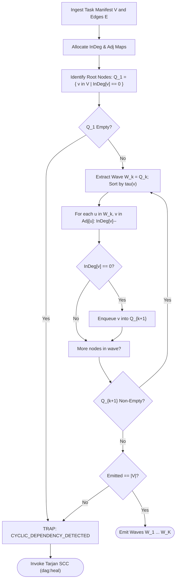

# DAG Compilation & Kahn's Topological Sort Algorithm

---

[Previous: Chapter 06: Topological Scheduler DAGs](index.md) | [Chapter Index](index.md) | [All Chapters Index](../index.md) | [Next: 06-02 Tarjan SCC Cycle Detection](06-02-tarjan-scc-cycle-detection.md)

---

## 1. Executive Summary & Graph-Theoretic Compilation Architecture

In autonomous multi-agent software engineering systems, uncoordinated task execution leads to missing type definitions, unbuilt dependencies, merge collisions in shared source trees, and race conditions during artifact consumption. Arbitrary task scheduling guarantees non-deterministic execution failure when subagents run concurrently.

The OLT (Orchestrating Long Tasks) engine resolves this by compiling task requirements into a Directed Acyclic Graph (DAG) using **Kahn's Topological Sorting Algorithm**. The compiler transforms raw obligation lists derived from the sealed prompt into an ordered, multi-tier dependency structure.

Under this scheduler:

1. **Linear Time Compilation ($\mathcal{O}(|V| + |E|)$)**: Tasks are strictly sequenced such that prerequisite tasks finish and seal artifacts before dependent tasks unlock.
2. **Topological Wave Synthesis**: Tasks possessing an in-degree of zero are partitioned into parallel execution waves ($W_1, W_2, \dots, W_K$), establishing clear concurrency boundaries.
3. **Deterministic Queue Progression**: Ready tasks are placed into active worker queues using deterministic tie-breaking rules, eliminating runtime race conditions across heterogeneous hosts.
4. **Immediate Cycle Rejection**: If the number of topologically emitted nodes is strictly less than $|V|$, graph compilation halts immediately, triggering Tarjan's cycle diagnosis subsystem (`dag:heal`).

```text
+--------------------------------------------------------------------------------------------------+
│                             KAHN TOPOLOGICAL COMPILATION PIPELINE                                │
+--------------------------------------------------------------------------------------------------+
│   Task Manifest V = {T_1, ..., T_N} ──► Build Adjacency List & In-Degree Array InDeg(v)          │
│   Dependency Set E = {(u, v), ...}             │                                                 │
│                                                ▼                                                 │
│   Scan for Zero In-Degree Nodes: Q_0 = { v in V | InDeg(v) == 0 }                                │
│                                                │                                                 │
│   ┌────────────────────────────────────────────┴───────────────────────────────────────────┐     │
│   │ WHILE Q_k is Non-Empty:                                                                │     │
│   │  1. Partition Q_k into Wave W_k; Sort by Deterministic Tie-Breaker tau(v)              │     │
│   │  2. For each u in W_k: for each v in Adj(u): InDeg(v)--; if InDeg(v)==0: Q_{k+1}.push(v)│   │
│   │  3. Increment Wave Counter: k = k + 1                                                  │     │
│   └────────────────────────────────────────────┬───────────────────────────────────────────┘     │
│                                                │                                                 │
│   Verify Completeness: |Emitted Nodes| == |V| ?                                                  │
│         ├── [YES] ──► Compile Certified Wave Schedule (Waves W_1, ..., W_K)                      │
│         └── [NO]  ──► TRAP: CYCLIC_DEPENDENCY_DETECTED ──► Dispatch to Tarjan SCC Resolver       │
+--------------------------------------------------------------------------------------------------+
```

---

## 2. Mathematical Formalization & Sorting Correctness Theorems

Let $G = (V, E)$ be a directed task graph where $V = \{T_1, T_2, \dots, T_N\}$ is the vertex set ($|V| = N$) and $E \subseteq V \times V$ is the directed dependency edge set. $(u, v) \in E$ denotes that task $u$ is an immediate prerequisite of task $v$ ($u \prec v$).
$\text{Adj}(u) = \{ v \in V \mid (u, v) \in E \}$ and $\text{Pred}(v) = \{ u \in V \mid (u, v) \in E \}$.

### In-Degree & Wave Recurrence

$$\text{deg}^-(v) = |\text{Pred}(v)| = \big| \{ u \in V \mid (u, v) \in E \} \big|$$

Let $Q_k$ denote the ready queue at wave iteration $k \ge 1$, where $Q_1 = \{ v \in V \mid \text{deg}^-(v) = 0 \}$. For remaining vertices $v \in V \setminus \bigcup_{j=1}^k W_j$:

$$\text{deg}^-_k(v) = \text{deg}^-(v) - \left| \text{Pred}(v) \cap \left( \bigcup_{j=1}^k W_j \right) \right|, \quad Q_{k+1} = \left\{ v \in V \setminus \bigcup_{j=1}^k W_j \;\middle|\; \text{deg}^-_k(v) = 0 \right\}$$

The computed waves $W_1, \dots, W_K$ partition $V$ such that $\bigcup_{k=1}^K W_k = V \iff G \text{ is a DAG}$, and $\forall (u, v) \in E$, $u \in W_i \land v \in W_j \implies i < j$.

### Deterministic Tie-Breaking Function

Nodes within each wave $W_k$ are totally ordered by a deterministic tie-breaking key $\tau(v)$:

$$\tau(v) = \Big\langle \pi(v), \quad \text{span}(v), \quad \text{lex}(v) \Big\rangle$$

where $\pi(v) \in \mathbb{N}$ is user priority, $\text{span}(v)$ is downstream critical path length, and $\text{lex}(v)$ is UTF-8 task ID. For $u, v \in W_k$, $u \succ v \iff \tau(u) \succ \tau(v)$ in lexicographic order.

```text
+--------------------------------------------------------------------------------------------------+
│ THEOREM 1 (Linear Time Bound): Kahn's algorithm computes wave partitions in exact O(|V| + |E|).  │
│ Proof: In-degree init takes O(|V| + |E|). Each vertex is enqueued/dequeued once: O(|V|). Each    │
│ edge is traversed once: O(|E|). Total runtime is strictly O(|V| + |E|).                          │
+--------------------------------------------------------------------------------------------------+
│ THEOREM 2 (Topological Completeness & Cycle Trap): |Union W_k| = |V| <=> G is acyclic.            │
│ Proof: Any cycle C has deg^-(v) >= 1 for all v in C at all iterations. No cyclic node enters Q.  │
│ Hence |Union W_k| <= |V| - |C| < |V|, triggering immediate cycle fault.                          │
+--------------------------------------------------------------------------------------------------+
```

---

## 3. Kahn Queue Execution Trace & Wave Lattice

```text
Edges: T1->T3, T1->T4, T2->T4, T2->T5, T3->T6, T4->T6, T5->T6
+------+-------------+-----------------------+--------------------+--------------------+
│ Step │ Action      │ In-Degrees (T1..T6)   │ Ready Queue (Q)    │ Emitted Wave       │
+------+-------------+-----------------------+--------------------+--------------------+
│  0   │ Initialize  │ 0, 0, 1, 2, 1, 3      │ [ T1, T2 ]         │ -                  │
│  1   │ Emit Wave 1 │ -, -, 0, 0, 0, 3      │ Pop T1, T2 -> Q2   │ W_1 = { T1, T2 }   │
│  2   │ Emit Wave 2 │ -, -, -, -, -, 0      │ Pop T3, T4, T5-> Q3│ W_2 = { T3, T4, T5}│
│  3   │ Emit Wave 3 │ -, -, -, -, -, -      │ Pop T6             │ W_3 = { T6 }       │
│  4   │ Terminate   │ Total: 6/6 (|V| == 6) │ Empty Queue        │ Certified Acyclic  │
+------+-------------+-----------------------+--------------------+--------------------+

Compiled Wave Lattice:
  Wave 1: [ TASK-01 (InDeg=0) ]  [ TASK-02 (InDeg=0) ]
                 │       │              │       │
                 ▼       │              │       ▼
  Wave 2: [ TASK-03 ]    └───► [ TASK-04 ] ◄────┘    [ TASK-05 ]
                 │                     │                    │
                 └────────────────► [ TASK-06 ] ◄───────────┘
                                   (Wave 3)
```

---

## 4. Compilation Flowchart



---

## 5. Concrete TypeScript Contracts & Reference Implementation

The topological compiler is implemented in [`topological-scheduler.ts`](../../../../olt/scripts/src/graph/compiler.ts):

```typescript
export interface TaskDependencyNode {
  readonly id: string;
  readonly title: string;
  readonly priority: number;
  readonly estimatedSpanMs: number;
  readonly readScopes: readonly string[];
  readonly writeScopes: readonly string[];
}

export interface DependencyEdge {
  readonly fromTaskId: string;
  readonly toTaskId: string;
  readonly contractType: "STRICT_PREREQUISITE" | "WEAK_HINT";
}

export interface TopologicalWaveResult {
  readonly waves: readonly (readonly string[])[];
  readonly totalNodesScheduled: number;
  readonly waveCount: number;
  readonly isAcyclic: boolean;
  readonly unresolvedCyclicNodes: readonly string[];
}

export interface DeterministicTieBreaker {
  (a: TaskDependencyNode, b: TaskDependencyNode): number;
}

export const defaultTieBreaker: DeterministicTieBreaker = (a, b) => {
  if (a.priority !== b.priority) return b.priority - a.priority;
  if (a.estimatedSpanMs !== b.estimatedSpanMs) return b.estimatedSpanMs - a.estimatedSpanMs;
  return a.id.localeCompare(b.id);
};

export function compileTopologicalWaves(
  nodes: readonly TaskDependencyNode[],
  edges: readonly DependencyEdge[],
  tieBreaker: DeterministicTieBreaker = defaultTieBreaker,
): TopologicalWaveResult {
  const nodeMap = new Map<string, TaskDependencyNode>();
  const inDegree = new Map<string, number>();
  const adjacency = new Map<string, string[]>();

  for (const node of nodes) {
    nodeMap.set(node.id, node);
    inDegree.set(node.id, 0);
    adjacency.set(node.id, []);
  }

  for (const edge of edges) {
    if (!nodeMap.has(edge.fromTaskId) || !nodeMap.has(edge.toTaskId)) {
      throw new Error(`Edge references unknown node: ${edge.fromTaskId} -> ${edge.toTaskId}`);
    }
    adjacency.get(edge.fromTaskId)!.push(edge.toTaskId);
    inDegree.set(edge.toTaskId, (inDegree.get(edge.toTaskId) ?? 0) + 1);
  }

  const waves: string[][] = [];
  let scheduledCount = 0;
  let currentWaveNodes = nodes
    .filter((n) => inDegree.get(n.id) === 0)
    .sort(tieBreaker)
    .map((n) => n.id);

  while (currentWaveNodes.length > 0) {
    waves.push(currentWaveNodes);
    scheduledCount += currentWaveNodes.length;
    const nextWaveNodeIds: string[] = [];

    for (const uId of currentWaveNodes) {
      for (const vId of adjacency.get(uId) ?? []) {
        const rem = (inDegree.get(vId) ?? 0) - 1;
        inDegree.set(vId, rem);
        if (rem === 0) nextWaveNodeIds.push(vId);
      }
    }

    currentWaveNodes = nextWaveNodeIds
      .map((id) => nodeMap.get(id)!)
      .sort(tieBreaker)
      .map((n) => n.id);
  }

  const isAcyclic = scheduledCount === nodes.length;
  const unresolvedCyclicNodes = isAcyclic
    ? []
    : nodes.filter((n) => (inDegree.get(n.id) ?? 0) > 0).map((n) => n.id);

  return {
    waves,
    totalNodesScheduled: scheduledCount,
    waveCount: waves.length,
    isAcyclic,
    unresolvedCyclicNodes,
  };
}
```

---

## 6. Anti-Blunder Matrix & Failure Diagnostics

| Blunder Identifier            | Pathology / Symptom                                      | Root Cause                                                     | Architectural Mitigation                                                                                        |
| :---------------------------- | :------------------------------------------------------- | :------------------------------------------------------------- | :-------------------------------------------------------------------------------------------------------------- |
| `ERR_NONDETERMINISTIC_QUEUE`  | Flaky wave assignments across agent restarts.            | Iterating over unordered `Set`/`Map` keys without sorting.     | Enforce strict `DeterministicTieBreaker` tuple sort on each wave.                                               |
| `ERR_UNINDEXED_EDGE_MUTATION` | Corrupted in-degree counters.                            | Edge mutations occurring concurrently during wave iteration.   | Freeze dependency graph into immutable records before sorting.                                                  |
| `ERR_CYCLIC_DEADLOCK_BYPASS`  | Scheduler hangs waiting for unattainable wave.           | Silently dropping unscheduled nodes when `isAcyclic` is false. | Immediate trap to Tarjan resolver via `dag:heal`.                                                               |
| `ERR_DANGLING_EDGE_REFERENCE` | Null pointer dereference during adjacency traversal.     | Task edges referencing task IDs omitted from node manifest.    | Preflight schema validator cross-checks $\forall (u, v) \in E \implies u, v \in V$.                             |
| `ERR_BULK_BARRIER_DRAG`       | Stragglers in Wave $k$ block independent tasks in $k+1$. | Rigid wave boundary enforcement without dynamic decoupling.    | Hand off compiled DAG to Dynamic Wave Decoupler ([Chapter 06-03](06-03-dynamic-wave-decoupling-and-scopes.md)). |

---

## 7. Architectural Invariants Summary

1. **Linear Time Complexity**: Graph compilation and topological wave sorting operate strictly in $\mathcal{O}(|V| + |E|)$ with zero backtracking.
2. **Zero-Tolerance Cycle Trapping**: Any cycle prevents execution dispatch and immediately routes the graph to Tarjan's SCC diagnosis engine (`dag:heal`).
3. **Deterministic Queue Progression**: Identical input manifests produce byte-for-byte identical wave schedules across all operating environments.
4. **Precedence Isolation**: For any directed edge $(u, v) \in E$, task $u$ resides in wave $W_i$ and task $v$ in wave $W_j$ where $i < j$.

---

[Previous: Chapter 06: Topological Scheduler DAGs](index.md) | [Chapter Index](index.md) | [All Chapters Index](../index.md) | [Next: 06-02 Tarjan SCC Cycle Detection](06-02-tarjan-scc-cycle-detection.md)

---
