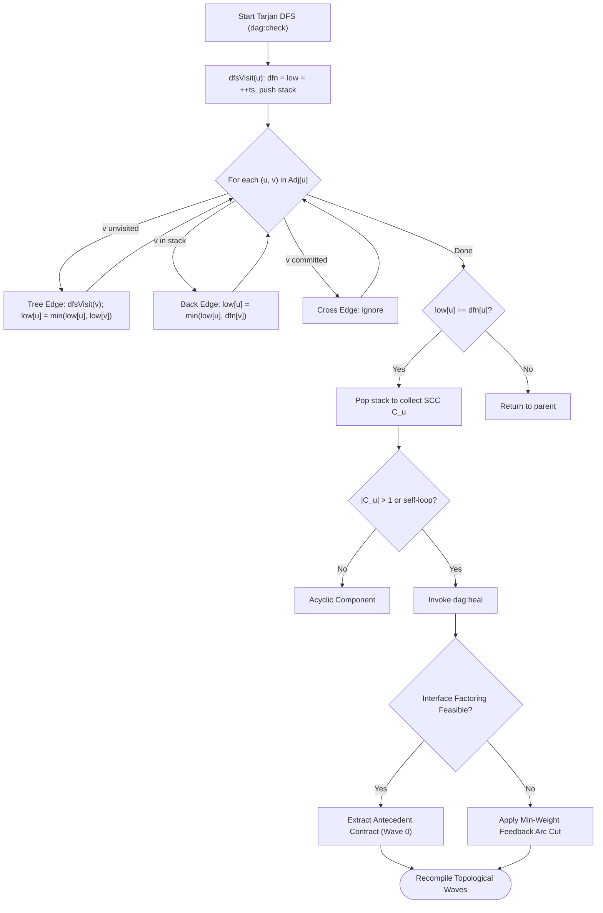

# Tarjan's SCC Cycle Detection & Contract Extraction

---

[Previous: 06-01 DAG Compilation & Kahn's Algorithm](06-01-dag-compilation-and-kahns-algorithm.md) | [Chapter Index](index.md) | [All Chapters Index](../index.md) | [Next: 06-03 Dynamic Wave Decoupling & Scopes](06-03-dynamic-wave-decoupling-and-scopes.md)

---

## 1. Executive Summary & Graph Cycle Pathologies

In complex multi-agent software engineering systems, independent planning agents frequently introduce circular dependency deadlocks during task decomposition. A common pathology occurs when Task A (e.g. `UserAuthenticationService`) requires types from Task B (e.g. `SessionStoreProvider`), while Task B declares dependencies on Task A's token schemas.

Without an algorithmic cycle-breaking subsystem, topological sorting algorithms trap in failure states with unscheduled nodes, stalling the orchestrator.

The OLT (Orchestrating Long Tasks) engine resolves dependency deadlocks via **Tarjan's Strongly Connected Components (SCC) Cycle Detection & Contract Extraction Protocol**, exposed through canonical commands `dag:check` and `dag:heal`.

Under this protocol:

1. **Linear-Time Component Discovery ($\mathcal{O}(|V| + |E|)$)**: Tarjan's single-pass DFS identifies maximal strongly connected subgraphs ($|\text{SCC}| > 1$) and self-referential loops in linear time without exponential cycle enumeration.
2. **Low-Link DFS Stack Tracing**: By tracking discovery timestamps $\text{dfn}(u)$ and lowest reachable depths $\text{low}(u)$, the engine pinpoints the exact back-edges creating topological cycles.
3. **Automated Interface Contract Factoring (`dag:heal`)**: Rather than blindly dropping edges, the scheduler extracts shared types into an antecedent interface contract task (Wave 0), converting cyclic graphs into clean fork-join structures.
4. **Deterministic Feedback Arc Set (FAS) Inversion**: For non-factorable dependencies, the engine computes a minimum-weight feedback arc cut to serialize tasks deterministically.

```text
+--------------------------------------------------------------------------------------------------+
│                             TARJAN SCC CYCLE DIAGNOSIS & REMEDIATION                             │
+--------------------------------------------------------------------------------------------------+
│   CIRCULAR DEADLOCK: Task A (AuthService) <═══════════════ [Back-Edge] ══════════════> Task B    │
│                                                                                                  │
│   TARJAN DFS EVALUATION:                                                                         │
│   - dfn(A) = 1, low(A) = 1, Stack: [ A ]                                                         │
│   - dfn(B) = 2, low(B) = 1 (back-edge to A in Stack), Stack: [ A, B ]                            │
│   - Root condition at A: low(A) == dfn(A) ──► Pop SCC Component: { A, B } (|SCC| = 2 > 1)        │
│                                           │                                                      │
│                                           ▼                                                      │
│   CONTRACT EXTRACTION (dag:heal):                                                                │
│   1. Synthesize Antecedent Contract Task: TASK-00-CONTRACT (Wave 1: interfaces/auth-session.ts)  │
│   2. Rewire Edges: TASK-00-CONTRACT ──► TASK-01 (Auth) & TASK-00-CONTRACT ──► TASK-02 (Session)  │
│   3. Sever Mutual Implementation Back-Edge (B ──► A)                                             │
│                                                                                                  │
│   RESOLVED LINEAR DAG: [ TASK-00: Contract ] ──► [ TASK-01: Auth ] & [ TASK-02: Session ]        │
+--------------------------------------------------------------------------------------------------+
```

---

## 2. Mathematical Formalization of Tarjan's Algorithm

Let $G = (V, E)$ be a directed graph. An **SCC** is a maximal subgraph $H = (V_H, E_H)$ where every pair of vertices $u, v \in V_H$ is mutually reachable.

### DFS Traversal State Variables & Recurrence

1. **Discovery Timestamp ($\text{dfn}(u)$)**: Integer order of first visit during DFS ($1 \le \text{dfn}(u) \le |V|$).
2. **Low-Link Value ($\text{low}(u)$)**: Smallest $\text{dfn}$ value of any vertex reachable from $u$'s DFS subtree via at most one back-edge into active stack $S$.
3. **Recursion Stack ($S \subseteq V$)**: Explicit LIFO stack of vertices in the current DFS branch.
4. **On-Stack Indicator ($\text{inStack}(u) \in \{0, 1\}$)**: $\mathcal{O}(1)$ membership test.

$$ \text{low}(u) = \min \begin{cases}
\text{dfn}(u) \\
\min \big\{ \text{low}(v) \;\big|\; (u, v) \in E \land v \text{ unvisited (Tree Edge)} \big\} \\
\min \big\{ \text{dfn}(v) \;\big|\; (u, v) \in E \land v \in S \text{ (Back/Cross Edge in Stack)} \big\}
\end{cases}$$

### Component Root Condition & Extraction

Vertex $u$ is the root of an SCC if and only if $\text{low}(u) = \text{dfn}(u)$.
When DFS finishes exploring edges of $u$ and the root condition holds, vertices are popped from $S$ until $u$ is removed:

$$C_u = \left\{ w \in S \;\middle|\; w \text{ popped before or with } u \right\}$$

$$\text{IsCyclic}(C_u) \iff |C_u| > 1 \quad \lor \quad \big( |C_u| = 1 \land \exists v \in C_u : (v, v) \in E \big)$$

### Minimum Feedback Arc Set (FAS) Edge Cut

For each cyclic component $C_k$, the minimum-weight feedback arc set $F_k \subset E(C_k)$ minimizes cut weight while breaking all cycles:

$$\min_{F_k \subseteq E(C_k)} \sum_{e \in F_k} w(e) \quad \text{subject to} \quad \text{CycleCount}(G[C_k] \setminus F_k) = 0$$

Weights $w(e)$ represent dependency strength: $100$ (type inheritance/import), $10$ (runtime call), $1$ (optional config).

---

## 3. Low-Link DFS Execution Trace

```text
Edges: A -> B, B -> C, C -> D, D -> B (Back-Edge), D -> E
+------+------+--------+--------+------------------+-------------------+---------------------------+
│ Step │ Node │ dfn(u) │ low(u) │ DFS Stack (S)    │ Edge Evaluated    │ Transition / Action       │
+------+------+--------+--------+------------------+-------------------+---------------------------+
│  1   │  A   │   1    │   1    │ [ A ]            │ A -> B (Tree)     │ DFS Recurse B             │
│  2   │  B   │   2    │   2    │ [ A, B ]         │ B -> C (Tree)     │ DFS Recurse C             │
│  3   │  C   │   3    │   3    │ [ A, B, C ]      │ C -> D (Tree)     │ DFS Recurse D             │
│  4   │  D   │   4    │   2    │ [ A, B, C, D ]   │ D -> B (Back)     │ B in S: low(D)=min(4,2)=2 │
│  5   │  D   │   4    │   2    │ [ A, B, C, D ]   │ D -> E (Tree)     │ DFS Recurse E             │
│  6   │  E   │   5    │   5    │ [ A..D, E ]      │ None (Sink Node)  │ Root: low(E)==dfn(E)->Pop │
│  7   │  D   │   4    │   2    │ [ A, B, C, D ]   │ Finished edges    │ low(D) != dfn(D) (2 != 4) │
│  8   │  C   │   3    │   2    │ [ A, B, C, D ]   │ Return to C       │ low(C)=min(3, low(D))=2   │
│  9   │  B   │   2    │   2    │ [ A ]            │ Root: low(B)==dfn │ Pop D, C, B -> SCC={B,C,D}│
│  10  │  A   │   1    │   1    │ []               │ Root: low(A)==dfn │ Pop A -> SCC={A}          │
+------+------+--------+--------+------------------+-------------------+---------------------------+
```

---

## 4. Remediation Flowchart



---

## 5. Concrete TypeScript Contracts & Reference Implementation

The Tarjan SCC engine is implemented in [`tarjan-scc.ts`](../../../../olt/scripts/src/reporting/sugiyama-dag/tarjan.ts):

```typescript
export interface TarjanNodeState {
  readonly id: string;
  dfn: number;
  low: number;
  onStack: boolean;
}

export interface StronglyConnectedComponent {
  readonly componentId: string;
  readonly nodeIds: readonly string[];
  readonly isCyclic: boolean;
  readonly internalEdges: readonly [string, string][];
}

export interface CycleRemediationProposal {
  readonly componentId: string;
  readonly strategy: "EXTRACT_INTERFACE_CONTRACT" | "MINIMUM_FEEDBACK_ARC_CUT";
  readonly targetEdgeToCut?: [string, string] | undefined;
  readonly synthesizedContractPath?: string | undefined;
  readonly justification: string;
}

export interface TarjanAnalysisResult {
  readonly components: readonly StronglyConnectedComponent[];
  readonly hasCycles: boolean;
  readonly cyclicComponents: readonly StronglyConnectedComponent[];
  readonly remediationProposals: readonly CycleRemediationProposal[];
}

export function analyzeStronglyConnectedComponents(
  nodes: readonly string[],
  edges: readonly [string, string][],
): TarjanAnalysisResult {
  const adjacency = new Map<string, string[]>();
  const stateMap = new Map<string, TarjanNodeState>();

  for (const nodeId of nodes) {
    adjacency.set(nodeId, []);
    stateMap.set(nodeId, { id: nodeId, dfn: 0, low: 0, onStack: false });
  }

  for (const [u, v] of edges) {
    adjacency.get(u)?.push(v);
  }

  let timestamp = 0;
  const stack: string[] = [];
  const components: StronglyConnectedComponent[] = [];

  function dfs(uId: string): void {
    const uState = stateMap.get(uId)!;
    timestamp += 1;
    uState.dfn = timestamp;
    uState.low = timestamp;
    stack.push(uId);
    uState.onStack = true;

    for (const vId of adjacency.get(uId) ?? []) {
      const vState = stateMap.get(vId);
      if (!vState) continue;
      if (vState.dfn === 0) {
        dfs(vId);
        uState.low = Math.min(uState.low, vState.low);
      } else if (vState.onStack) {
        uState.low = Math.min(uState.low, vState.dfn);
      }
    }

    if (uState.low === uState.dfn) {
      const componentNodes: string[] = [];
      let poppedId: string;
      do {
        poppedId = stack.pop()!;
        stateMap.get(poppedId)!.onStack = false;
        componentNodes.push(poppedId);
      } while (poppedId !== uId);

      const componentNodeSet = new Set(componentNodes);
      const internalEdges = edges.filter(
        ([from, to]) => componentNodeSet.has(from) && componentNodeSet.has(to),
      );
      const isCyclic = componentNodes.length > 1 || internalEdges.some(([f, t]) => f === t);

      components.push({
        componentId: `scc_${components.length + 1}_${uId}`,
        nodeIds: componentNodes,
        isCyclic,
        internalEdges,
      });
    }
  }

  for (const nodeId of nodes) {
    if (stateMap.get(nodeId)!.dfn === 0) dfs(nodeId);
  }

  const cyclicComponents = components.filter((c) => c.isCyclic);
  const remediationProposals = cyclicComponents.map((c): CycleRemediationProposal => {
    if (c.nodeIds.length === 2) {
      return {
        componentId: c.componentId,
        strategy: "EXTRACT_INTERFACE_CONTRACT",
        synthesizedContractPath: `interfaces/contract_${c.nodeIds[0]}_${c.nodeIds[1]}.ts`,
        justification: `Mutual dependency between ${c.nodeIds[0]} and ${c.nodeIds[1]} resolved by extracting shared interface.`,
      };
    }
    const lowest = c.internalEdges[c.internalEdges.length - 1];
    return {
      componentId: c.componentId,
      strategy: "MINIMUM_FEEDBACK_ARC_CUT",
      targetEdgeToCut: lowest,
      justification: `Multi-node cyclic loop broken by severing lowest priority edge ${lowest?.[0]} -> ${lowest?.[1]}.`,
    };
  });

  return { components, hasCycles: cyclicComponents.length > 0, cyclicComponents, remediationProposals };
}
```

---

## 6. Anti-Blunder Matrix & Failure Diagnostics

| Blunder Identifier | Pathology / Symptom | Root Cause | Architectural Mitigation |
| :--- | :--- | :--- | :--- |
| `ERR_CROSS_COMPONENT_POLLUTION` | False low-link propagation. | Updating $\text{low}(u)$ using $\text{dfn}(v)$ when $v \notin S$. | Check $\text{inStack}(v) == 1$ explicitly before updating $\text{low}(u)$. |
| `ERR_RECURSION_STACK_OVERFLOW` | V8 stack exhaustion on deep chains ($|V| > 10^4$). | Unbounded recursive DFS. | Use iterative DFS with explicit array stack for deep graphs. |
| `ERR_NAIVE_EDGE_DELETION` | Runtime compilation breaks due to missing types. | Blindly deleting cycle edges without interface contracts. | Prioritize Interface Contract Factoring via `dag:heal`. |
| `ERR_SELF_LOOP_OMISSION` | Single-node cycles ($T_i \to T_i$) ignored. | Checking only $|C| > 1$ and forgetting internal self-edges. | Formally check $\exists (v, v) \in E$ when $|C| = 1$. |
| `ERR_NONDETERMINISTIC_DFS_ORDER` | Divergent cycle cut proposals across platforms. | Iterating over non-sorted adjacency lists. | Sort outgoing edges lexicographically before DFS traversal. |

---

## 7. Architectural Invariants Summary

1. **Exact Linear Time**: Tarjan's SCC evaluation visits every vertex and directed edge exactly once in $\mathcal{O}(|V| + |E|)$ time.
2. **Deterministic Partitioning**: The computed set of strongly connected components is uniquely determined and host-independent.
3. **Contract-First Remediation**: Interface factoring via `dag:heal` is always preferred over destructive edge dropping.
4. **Zero Unchecked Cycles**: Any cycle identified by `dag:check` halts execution until certified acyclic.

---

[Previous: 06-01 DAG Compilation & Kahn's Algorithm](06-01-dag-compilation-and-kahns-algorithm.md) | [Chapter Index](index.md) | [All Chapters Index](../index.md) | [Next: 06-03 Dynamic Wave Decoupling & Scopes](06-03-dynamic-wave-decoupling-and-scopes.md)

---
$$
