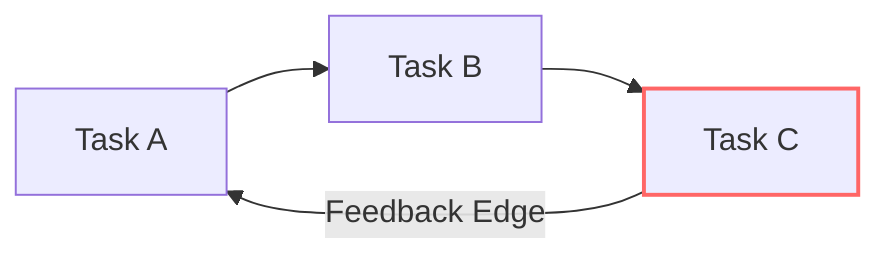

# Tarjan SCC Cycle Detection & Feedback Arc Breaking

[OLT Documentation Hub](../../README.md) > [Architecture Index](../index.md) > [Chapter 06](./index.md) > 06-02 Tarjan SCC

---

[⏮️ Previous: 06-01 DAG Compilation & Kahn's Algorithm](06-01-dag-compilation-and-kahns-algorithm.md) | [📂 Chapter Index](index.md) | [📚 All Chapters Index](../index.md) | [⏭️ Next: 06-03 Dynamic Wave Decoupling & Scopes](06-03-dynamic-wave-decoupling-and-scopes.md)
---

## 1. Strongly Connected Components in Dependency Graphs

A cyclic dependency ($T_1 \prec T_2 \prec T_3 \prec T_1$) is fatal to topological scheduling. If a cycle exists, Kahn's algorithm deadlocks.

OLT uses **Tarjan's Strongly Connected Components (SCC) Algorithm** to detect and isolate all dependency cycles in a single depth-first search pass ($\mathcal{O}(|V| + |E|)$).

---

## 2. Discovery (`dfn`) & Lowest Reachable (`lowlink`) Invariants

For every vertex $v$:

- $\text{dfn}[v]$: DFS discovery timestamp.
- $\text{lowlink}[v]$: Smallest $\text{dfn}$ reachable via tree and back-edges.

$$\text{lowlink}[v] = \min \begin{cases} \text{dfn}[v] \\ \text{lowlink}[w] & (v, w) \in E_{\text{tree}} \\ \text{dfn}[w] & (v, w) \in E_{\text{back}} \land w \in \text{Stack} \end{cases}$$

If $\text{lowlink}[v] == \text{dfn}[v]$, a maximal SCC is popped from the stack. Any SCC with $|V_{\text{SCC}}| > 1$ represents a poisonous cycle.

---

## 3. Automated Cycle Breaking via Feedback Arc Set

When a cycle is detected, OLT identifies the lowest-weight feedback edge $e = (u, v)$ (e.g. documentation cross-links or soft dependencies) and severs it, restoring strict acyclicity.

---

[⏮️ Previous: 06-01 DAG Compilation & Kahn's Algorithm](06-01-dag-compilation-and-kahns-algorithm.md) | [📂 Chapter Index](index.md) | [📚 All Chapters Index](../index.md) | [⏭️ Next: 06-03 Dynamic Wave Decoupling & Scopes](06-03-dynamic-wave-decoupling-and-scopes.md)
---
