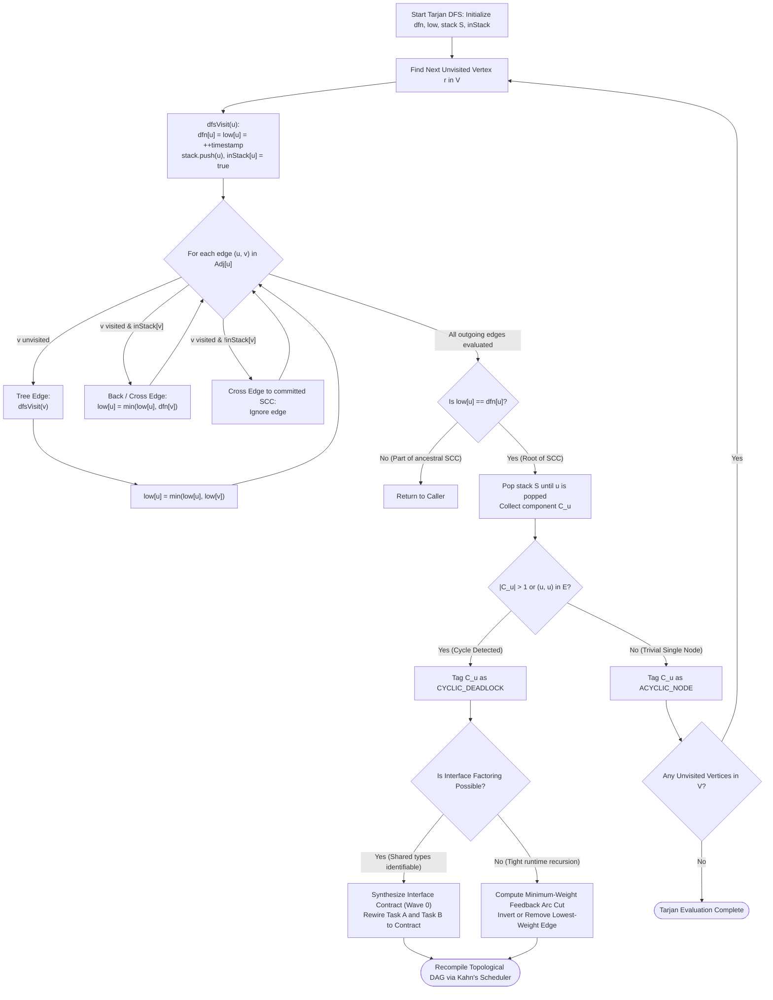

# Tarjan's SCC Cycle Detection & Contract Extraction

---

[Previous: 06-01 DAG Compilation & Kahn's Algorithm](06-01-dag-compilation-and-kahns-algorithm.md) | [Chapter Index](index.md) | [All Chapters Index](../index.md) | [Next: 06-03 Dynamic Wave Decoupling & Scopes](06-03-dynamic-wave-decoupling-and-scopes.md)

---

## 1. Executive Summary & Graph Cycle Pathologies

In complex multi-agent software engineering systems, independent planning agents frequently introduce circular dependency deadlocks during task decomposition. A common pathology occurs when Task A (e.g. `UserAuthenticationService`) requires types and methods from Task B (e.g. `SessionStoreProvider`), while Task B simultaneously declares dependencies on Task A's token schemas.

Without an algorithmic cycle-breaking subsystem, topological sorting algorithms (such as Kahn's algorithm) trap in failure states with unscheduled nodes, causing the orchestrator to stall indefinitely.

The OLT (Orchestrating Long Tasks) engine resolves dependency deadlocks via **Tarjan's Strongly Connected Components (SCC) Cycle Detection & Contract Extraction Protocol**.

Under this protocol:

1. **Linear-Time Component Discovery ($\mathcal{O}(|V| + |E|)$)**: Tarjan's single-pass Depth-First Search (DFS) identifies all maximal strongly connected subgraphs ($|\text{SCC}| > 1$) and self-referential loops in linear time without exponential cycle enumeration.
2. **Low-Link DFS Stack Tracing**: By tracking discovery timestamps $\text{dfn}(u)$ and lowest reachable subtree depths $\text{low}(u)$, the engine Pinpoints the exact back-edges creating topological cycles.
3. **Automated Interface Contract Factoring**: When cycles are identified, the scheduler does not blindly drop edges. Instead, it extracts shared types into an antecedent interface contract task (Wave 0), transforming bidirectional graph cycles into clean, unidirectional fork-join structures.
4. **Deterministic Feedback Arc Set (FAS) Inversion**: For non-factorable implementation dependencies, the engine computes a minimum-weight feedback arc cut to serialize the tasks deterministically.

```text
+--------------------------------------------------------------------------------------------------+
│                             TARJAN SCC CYCLE DIAGNOSIS & REMEDIATION                             │
+--------------------------------------------------------------------------------------------------+
│                                                                                                  │
│   CIRCULAR DEPENDENCY DEADLOCK DETECTED:                                                         │
│   Task A (AuthService) ═════════════════════════════════════════════► Task B (SessionStore)      │
│            ▲                                                                   │                 │
│            └─────────────────────────── [Back-Edge] ───────────────────────────┘                 │
│                                                                                                  │
│   TARJAN DFS EVALUATION:                                                                         │
│   - dfn(A) = 1, low(A) = 1, Stack: [ A ]                                                         │
│   - dfn(B) = 2, low(B) = 1 (back-edge to A in Stack), Stack: [ A, B ]                            │
│   - Root condition at A: low(A) == dfn(A) ──► Pop SCC Component: { A, B } (|SCC| = 2 > 1)        │
│                                           │                                                      │
│                                           ▼                                                      │
│   AUTOMATED CYCLE RESOLUTION: CONTRACT EXTRACTION PROTOCOL                                       │
│   ┌────────────────────────────────────────────────────────────────────────────────────────┐     │
│   │ 1. Synthesize Antecedent Contract Task: TASK-00-CONTRACT (Wave 1)                      │     │
│   │    - Extracts shared TypeScript interface: interfaces/auth-session.ts                  │     │
│   │ 2. Rewire Dependency Edges:                                                            │     │
│   │    - TASK-00-CONTRACT ──► TASK-01 (AuthService)                                        │     │
│   │    - TASK-00-CONTRACT ──► TASK-02 (SessionStore)                                       │     │
│   │ 3. Sever Mutual Implementation Back-Edge (B ──► A)                                     │     │
│   └───────────────────────────────────────┬────────────────────────────────────────────────┘     │
│                                           │                                                      │
│                                           ▼                                                      │
│   RESOLVED LINEAR TOPOLOGICAL DAG:                                                               │
│                     ┌──────────────────────────────────┐                                         │
│                     │ TASK-00: AuthSessionContract.ts  │ (Wave 1)                                │
│                     └─────────────┬────────────────────┘                                         │
│                                   │                                                              │
│                          ┌────────┴────────┐                                                     │
│                          ▼                 ▼                                                     │
│                ┌──────────────────┐   ┌──────────────────┐                                       │
│                │ TASK-01: AuthSvc │   │ TASK-02: SessSvc │ (Wave 2 - Parallel Execution)         │
│                └──────────────────┘   └──────────────────┘                                       │
│                                                                                                  │
+--------------------------------------------------------------------------------------------------+
```

---

## 2. Mathematical Formalization of Tarjan's Algorithm

Let $G = (V, E)$ be a directed graph. A subgraph $H = (V_H, E_H)$ is **strongly connected** if for every pair of vertices $u, v \in V_H$, there exists a directed path from $u$ to $v$ and a directed path from $v$ to $u$.

A **Strongly Connected Component (SCC)** is a maximal strongly connected subgraph of $G$.

### DFS Traversal State Variables

During the execution of Tarjan's algorithm, the orchestrator maintains:

1. **Discovery Timestamp ($\text{dfn}(u)$)**: The integer order in which vertex $u$ is first visited during DFS traversal ($1 \le \text{dfn}(u) \le |V|$).
2. **Low-Link Value ($\text{low}(u)$)**: The smallest $\text{dfn}$ value of any vertex known to be reachable from $u$ through $u$'s DFS subtree, including at most one back-edge into active stack $S$.
3. **Recursion Stack ($S \subseteq V$)**: An explicit LIFO stack containing vertices in the current DFS search path that have not yet been assigned to an SCC.
4. **On-Stack Bitmask ($\text{inStack}(u) \in \{0, 1\}$)**: An $\mathcal{O}(1)$ membership indicator.

### Recursive Low-Link Equations

For any vertex $u \in V$, its low-link value $\text{low}(u)$ is computed recursively:

$$ \text{low}(u) = \min \begin{cases}
\text{dfn}(u) \\
\min \big\{ \text{low}(v) \;\big|\; (u, v) \in E \land v \text{ is unvisited (Tree Edge)} \big\} \\
\min \big\{ \text{dfn}(v) \;\big|\; (u, v) \in E \land v \in S \text{ (Back Edge / Cross Edge to Stack)} \big\}
\end{cases}$$

### Component Root Condition & Extraction

A vertex $u$ is the **root of an SCC** if and only if:

$$\text{low}(u) = \text{dfn}(u)$$

When DFS finishes processing all outgoing edges of vertex $u$ and the root condition holds:

1. Vertices are popped from stack $S$ until $u$ is popped.
2. The set of popped vertices forms the component:

$$C_u = \left\{ w \in S \;\middle|\; w \text{ popped before or with } u \right\}$$

3. For every $w \in C_u$, set $\text{inStack}(w) = 0$ and $\text{SCC\_ID}(w) = u$.

### Cycle Classification Criteria

Let $\mathcal{C} = \{C_1, C_2, \dots, C_M\}$ be the partition of $V$ into SCCs.

$$\text{IsCyclic}(C_i) \iff |C_i| > 1 \quad \lor \quad \big( |C_i| = 1 \land \exists v \in C_i : (v, v) \in E \big)$$

The total cycle count and cyclic vertex set are:

$$V_{\text{cyclic}} = \bigcup_{C \in \mathcal{C}, \; \text{IsCyclic}(C)} C$$

### Minimum Feedback Arc Set (FAS) Edge Cut

For each cyclic component $C_k$, the minimum-weight feedback arc set $F_k \subset E(C_k)$ is selected such that the remaining subgraph $G[C_k] \setminus F_k$ is acyclic:

$$\min_{F_k \subseteq E(C_k)} \sum_{e \in F_k} w(e) \quad \text{subject to} \quad \text{CycleCount}(G[C_k] \setminus F_k) = 0$$

where edge weight $w(e)$ reflects semantic dependency strength:
- $w(e) = 100$: Strict type inheritance or schema import.
- $w(e) = 10$: Runtime implementation invocation.
- $w(e) = 1$: Optional configuration or logging hook.

---

## 3. High-Density ASCII Low-Link DFS Tree & Stack Unwinding

The diagram below traces the DFS tree execution, stack evolution, and low-link unwinding for a 5-node graph containing a 3-node cycle $\{B, C, D\}$:

```text
Dependency Edges:
  A -> B
  B -> C
  C -> D
  D -> B  <-- Back-Edge forming cycle {B, C, D}
  D -> E

+--------------------------------------------------------------------------------------------------+
│                             TARJAN DFS LOW-LINK TRACE & STACK STATE                              │
+------+------+--------+--------+------------------+-------------------+---------------------------+
│ Step │ Node │ dfn(u) │ low(u) │ DFS Stack (S)    │ Edge Evaluated    │ Transition / Action       │
+------+------+--------+--------+------------------+-------------------+---------------------------+
│  1   │  A   │   1    │   1    │ [ A ]            │ A -> B (Tree)     │ DFS Recurse B             │
│  2   │  B   │   2    │   2    │ [ A, B ]         │ B -> C (Tree)     │ DFS Recurse C             │
│  3   │  C   │   3    │   3    │ [ A, B, C ]      │ C -> D (Tree)     │ DFS Recurse D             │
│  4   │  D   │   4    │   4    │ [ A, B, C, D ]   │ D -> B (Back)     │ B in S: low(D)=min(4,2)=2 │
│  5   │  D   │   4    │   2    │ [ A, B, C, D ]   │ D -> E (Tree)     │ DFS Recurse E             │
│  6   │  E   │   5    │   5    │ [ A, B, C, D, E] │ None (Sink Node)  │ Root check: low(E)==dfn(E)│
│  7   │  E   │   5    │   5    │ [ A, B, C, D ]   │ Pop E             │ Emit SCC_1 = { E } (Triv) │
│  8   │  D   │   4    │   2    │ [ A, B, C, D ]   │ Return from E     │ low(D)=min(2, low(E))=2   │
│  9   │  D   │   4    │   2    │ [ A, B, C, D ]   │ Finished edges    │ low(D) != dfn(D) (2 != 4) │
│  10  │  C   │   3    │   2    │ [ A, B, C, D ]   │ Return from D     │ low(C)=min(3, low(D))=2   │
│  11  │  B   │   2    │   2    │ [ A, B, C, D ]   │ Return from C     │ low(B)=min(2, low(C))=2   │
│  12  │  B   │   2    │   2    │ [ A ]            │ Root: low(B)==dfn │ Pop D, C, B -> SCC_2      │
│      │      │        │        │                  │                   │ Emit SCC_2 = { B, C, D }  │
│      │      │        │        │                  │                   │ Cycle Detected! (|SCC|=3) │
│  13  │  A   │   1    │   1    │ [ A ]            │ Return from B     │ low(A)=min(1, low(B))=1   │
│  14  │  A   │   1    │   1    │ []               │ Root: low(A)==dfn │ Pop A -> Emit SCC_3={ A } │
+------+------+--------+--------+------------------+-------------------+---------------------------+

DFS Spanning Forest & Back-Edge Topology:
       (1/1) [ Node A ]
                │ (Tree Edge)
                ▼
       (2/2) [ Node B ] ◄─────────────────┐
                │ (Tree Edge)             │
                ▼                         │ (Back-Edge D -> B)
       (3/2) [ Node C ]                   │ (Discovered in Stack S)
                │ (Tree Edge)             │
                ▼                         │
       (4/2) [ Node D ] ──────────────────┘
                │ (Tree Edge)
                ▼
       (5/5) [ Node E ] (Trivial SCC Root: low=5, dfn=5)
```

---

## 4. Mermaid Cycle Detection & Remediation Flowchart



---

## 5. Concrete TypeScript Contracts & Tarjan Implementation

The Tarjan SCC engine is implemented in [`tarjan-scc.ts`](../../../../olt/scripts/src/reporting/sugiyama-dag/tarjan.ts):

```typescript
export interface TarjanNodeState {
  readonly id: string;
  dfn: number;
  low: number;
  onStack: boolean;
}

export interface StronglyConnectedComponent {
  readonly componentId: string;
  readonly nodeIds: readonly string[];
  readonly isCyclic: boolean;
  readonly internalEdges: readonly [string, string][];
}

export interface CycleRemediationProposal {
  readonly componentId: string;
  readonly strategy: "EXTRACT_INTERFACE_CONTRACT" | "MINIMUM_FEEDBACK_ARC_CUT";
  readonly targetEdgeToCut?: [string, string] | undefined;
  readonly synthesizedContractPath?: string | undefined;
  readonly justification: string;
}

export interface TarjanAnalysisResult {
  readonly components: readonly StronglyConnectedComponent[];
  readonly hasCycles: boolean;
  readonly cyclicComponents: readonly StronglyConnectedComponent[];
  readonly remediationProposals: readonly CycleRemediationProposal[];
}

export function analyzeStronglyConnectedComponents(
  nodes: readonly string[],
  edges: readonly [string, string][]
): TarjanAnalysisResult {
  const adjacency = new Map<string, string[]>();
  const stateMap = new Map<string, TarjanNodeState>();

  for (const nodeId of nodes) {
    adjacency.set(nodeId, []);
    stateMap.set(nodeId, { id: nodeId, dfn: 0, low: 0, onStack: false });
  }

  for (const [u, v] of edges) {
    adjacency.get(u)?.push(v);
  }

  let timestamp = 0;
  const stack: string[] = [];
  const components: StronglyConnectedComponent[] = [];

  function dfs(uId: string): void {
    const uState = stateMap.get(uId)!;
    timestamp += 1;
    uState.dfn = timestamp;
    uState.low = timestamp;
    stack.push(uId);
    uState.onStack = true;

    const neighbors = adjacency.get(uId) ?? [];
    for (const vId of neighbors) {
      const vState = stateMap.get(vId);
      if (!vState) continue;

      if (vState.dfn === 0) {
        // Tree edge
        dfs(vId);
        uState.low = Math.min(uState.low, vState.low);
      } else if (vState.onStack) {
        // Back edge or cross edge to ancestor in stack
        uState.low = Math.min(uState.low, vState.dfn);
      }
    }

    // Root condition
    if (uState.low === uState.dfn) {
      const componentNodes: string[] = [];
      let poppedId: string;
      do {
        poppedId = stack.pop()!;
        const poppedState = stateMap.get(poppedId)!;
        poppedState.onStack = false;
        componentNodes.push(poppedId);
      } while (poppedId !== uId);

      const componentNodeSet = new Set(componentNodes);
      const internalEdges = edges.filter(
        ([from, to]) => componentNodeSet.has(from) && componentNodeSet.has(to)
      );

      const isCyclic = componentNodes.length > 1 || internalEdges.some(([f, t]) => f === t);

      components.push({
        componentId: `scc_${components.length + 1}_${uId}`,
        nodeIds: componentNodes,
        isCyclic,
        internalEdges,
      });
    }
  }

  for (const nodeId of nodes) {
    if (stateMap.get(nodeId)!.dfn === 0) {
      dfs(nodeId);
    }
  }

  const cyclicComponents = components.filter((c) => c.isCyclic);
  const remediationProposals = cyclicComponents.map((c): CycleRemediationProposal => {
    if (c.nodeIds.length === 2) {
      return {
        componentId: c.componentId,
        strategy: "EXTRACT_INTERFACE_CONTRACT",
        synthesizedContractPath: `interfaces/contract_${c.nodeIds[0]}_${c.nodeIds[1]}.ts`,
        justification: `Mutual dependency between ${c.nodeIds[0]} and ${c.nodeIds[1]} resolved by extracting shared interface contract.`,
      };
    }
    const lowestWeightEdge = c.internalEdges[c.internalEdges.length - 1];
    return {
      componentId: c.componentId,
      strategy: "MINIMUM_FEEDBACK_ARC_CUT",
      targetEdgeToCut: lowestWeightEdge,
      justification: `Multi-node cyclic loop broken by severing lowest priority edge ${lowestWeightEdge?.[0]} -> ${lowestWeightEdge?.[1]}.`,
    };
  });

  return {
    components,
    hasCycles: cyclicComponents.length > 0,
    cyclicComponents,
    remediationProposals,
  };
}
```

---

## 6. Anti-Blunder Matrix & Failure Diagnostics

| Blunder Identifier | Pathology / Symptom | Root Cause | Architectural Mitigation |
| :--- | :--- | :--- | :--- |
| `ERR_CROSS_COMPONENT_POLLUTION` | Incorrect component merging or false low-links. | Updating $\text{low}(u)$ using $\text{dfn}(v)$ when $v \notin S$ (already committed SCC). | Check $\text{inStack}(v) == 1$ explicitly before updating $\text{low}(u)$. |
| `ERR_RECURSION_STACK_OVERFLOW` | V8 call stack exhaustion on graphs with deep chains ($|V| > 10^4$). | Naive recursive DFS implementation without trampoline or explicit stack. | Use iterative DFS or trampoline recursion for ultra-deep graphs. |
| `ERR_NAIVE_EDGE_DELETION` | Runtime compilation breaks due to missing type symbols. | Blindly deleting cycle edges without synthesizing interface contracts. | Prioritize Interface Contract Factoring over raw edge deletion. |
| `ERR_SELF_LOOP_OMISSION` | Single-node cycles ($T_i \to T_i$) ignored as non-cyclic. | Checking only $|C| > 1$ and forgetting internal self-edges $(v, v)$. | Formally check $\exists (v, v) \in E$ when $|C| = 1$. |
| `ERR_NONDETERMINISTIC_DFS_ORDER` | Different cycle cut proposals across operating systems. | Iterating over non-sorted adjacency lists. | Sort outgoing edges lexicographically before DFS traversal. |

---

## 7. Architectural Invariants Summary

1. **Exact Linear Time**: Tarjan's SCC evaluation visits every vertex and directed edge exactly once in $\mathcal{O}(|V| + |E|)$ time.
2. **Deterministic Partitioning**: The computed set of strongly connected components is uniquely determined and independent of host execution timing.
3. **Contract-First Remediation**: Interface factoring is always preferred over destructive edge dropping to preserve type safety.
4. **Guaranteed Termination**: Following cycle remediation, the graph is mathematically guaranteed to compile without cycles under Kahn's scheduler.

---

[Previous: 06-01 DAG Compilation & Kahn's Algorithm](06-01-dag-compilation-and-kahns-algorithm.md) | [Chapter Index](index.md) | [All Chapters Index](../index.md) | [Next: 06-03 Dynamic Wave Decoupling & Scopes](06-03-dynamic-wave-decoupling-and-scopes.md)

---

$$
