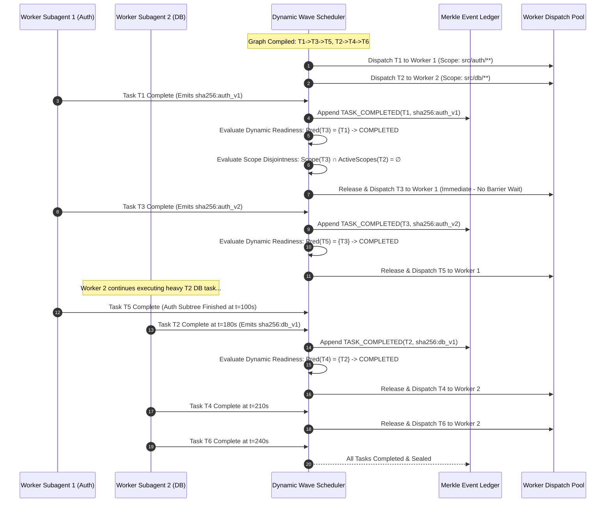

# Dynamic Wave Decoupling & Scope Confinement

---

[Previous: 06-02 Tarjan SCC Cycle Detection](06-02-tarjan-scc-cycle-detection.md) | [Chapter Index](index.md) | [All Chapters Index](../index.md) | [Next: 06-04 Sugiyama Layered Layout Engine](06-04-sugiyama-layered-layout-engine.md)

---

## 1. Executive Summary & The Barrier Drag Vulnerability

In traditional Bulk Synchronous Parallel (BSP) architectures, tasks execute in rigid lockstep waves: all tasks in Wave $k$ must run to completion before any task in Wave $k+1$ is permitted to start. When a single long-running task in Wave $k$ encounters unexpected complexity or straggles (e.g. taking 4 minutes while sibling tasks complete in 20 seconds), the entire compute fleet stalls. Available worker subagents sit idle at the synchronization barrier for 3.5 minutes—a critical concurrency inefficiency termed **Barrier Drag**.

The OLT (Orchestrating Long Tasks) engine eliminates barrier drag through **Dynamic Wave Decoupling & Scope Confinement**.

Under this scheduling paradigm:

1. **Fine-Grained Dynamic Task Release**: A downstream task $T_v$ in Wave $k+1$ is released for immediate worker leasing the instant all of its specific direct parent prerequisites $\text{Pred}(v)$ finish and seal their artifacts, completely bypassing unrelated tasks in Wave $k$.
2. **Strict Scope Disjointness Invariant ($S_i \cap S_j = \emptyset$)**: Concurrently executing tasks are mathematically proven to operate within non-overlapping filesystem write scopes. This enables lock-free parallel execution across isolated Git worktrees without merge conflict hazards.
3. **Cryptographic Cross-Wave Artifact Passing**: As tasks complete, output artifacts are sealed with SHA-256 hashes and recorded in the Merkle event ledger, allowing downstream subagents to mount prerequisite artifacts in read-only mode.
4. **Adaptive Concurrency Saturation**: Dynamic release continuously feeds ready tasks into worker pools, saturating Brent capacity without exceeding host token and memory budgets.

```text
+--------------------------------------------------------------------------------------------------+
│                       BULK SYNCHRONOUS BARRIER DRAG VS DYNAMIC DECOUPLING                        │
+--------------------------------------------------------------------------------------------------+
│                                                                                                  │
│   TRADITIONAL BULK SYNCHRONOUS (BSP) EXECUTION:                                                  │
│   Time ──► 0s                    30s                                                      240s   │
│   Wave 1:  [Task 1A: Auth (30s) ] DONE ──┐                                                       │
│            [Task 1B: DB   (25s) ] DONE ──┼──► [ FLEET IDLE: 210s BARRIER WAIT ] ──────────────► │
│            [Task 1C: ETL  (240s)] RUNNING ──────────────────────────────────────────► DONE ─────┤│
│                                                                                                 ││
│   Wave 2:  (Blocked despite Task 2A only depending on 1A) ────────────────────────────────────► ├──┤
│                                                                                       [Task 2A]  │
│                                                                                                  │
│   ────────────────────────────────────────────────────────────────────────────────────────────   │
│                                                                                                  │
│   OLT DYNAMIC WAVE DECOUPLING (Continuous Saturation):                                           │
│   Time ──► 0s                    30s          60s          90s          120s              240s   │
│   Worker 1:[Task 1A (30s)] ──► [Task 2A: Depends on 1A (60s)] ──► [Task 3A (60s)] ──► DONE       │
│   Worker 2:[Task 1B (25s)] ──► [Task 2B: Depends on 1B (45s)] ──► [Task 3B (40s)] ──► DONE       │
│   Worker 3:[Task 1C: Long ETL Running in Isolated Worktree Scope (240s)] ─────────────► DONE     │
│                                                                                                  │
│   SPEEDUP: Critical path executes without artificial wave barrier pauses.                        │
│   SAFETY:  Task 2A and Task 1C execute concurrently because Scope(2A) ∩ Scope(1C) = ∅.          │
│                                                                                                  │
+--------------------------------------------------------------------------------------------------+
```

---

## 2. Mathematical Formalization of Dynamic Wave Decoupling & Scopes

Let $G = (V, E)$ be a compiled Directed Acyclic Graph with vertices $V = \{T_1, T_2, \dots, T_N\}$ and directed dependency edges $E \subseteq V \times V$.

### Task Execution State Machine

For each task $v \in V$, let $\text{Status}(v, t) \in \Sigma$ denote its state at discrete wall-clock time $t$, where:

$$\Sigma = \{ \text{PENDING}, \text{READY}, \text{LEASED}, \text{EXECUTING}, \text{VALIDATING}, \text{COMPLETED}, \text{FAILED} \}$$

Let $\text{Pred}(v) = \{ u \in V \mid (u, v) \in E \}$ denote the direct parent prerequisites of task $v$.

### Dynamic Readiness Predicate

A pending task $v$ transitions dynamically to the $\text{READY}$ queue at timestamp $t$ if and only if the **Dynamic Readiness Predicate** $\mathcal{R}(v, t)$ evaluates to true:

$$\mathcal{R}(v, t) = \big( \text{Status}(v, t) = \text{PENDING} \big) \land \left( \forall u \in \text{Pred}(v), \quad \text{Status}(u, t) = \text{COMPLETED} \right)$$

$$ \text{Status}(v, t^+) = \begin{cases}
\text{READY} & \text{if } \mathcal{R}(v, t) = \text{TRUE} \\
\text{PENDING} & \text{if } \mathcal{R}(v, t) = \text{FALSE}
\end{cases}$$

### The Scope Disjointness Invariant

Let $\mathcal{F}$ denote the universe of normalized file paths within the repository.

For each task $v \in V$, define:
- $\text{ReadScope}(v) \subseteq \mathcal{F}$: Set of path patterns accessed in read-only mode.
- $\text{WriteScope}(v) \subseteq \mathcal{F}$: Set of canonical path patterns modified during task execution.

Let $\text{Active}(t) = \{ v \in V \mid \text{Status}(v, t) \in \{\text{LEASED}, \text{EXECUTING}, \text{VALIDATING}\} \}$ be the set of tasks currently active across parallel worker subagents.

```text
+--------------------------------------------------------------------------------------------------+
│ INVARIANT: MUTUAL SCOPE DISJOINTNESS                                                             │
│                                                                                                  │
│ For all distinct active tasks T_a, T_b in Active(t) with a != b:                                 │
│                                                                                                  │
│     WriteScope(T_a) ∩ WriteScope(T_b) = ∅                                                        │
│                                                                                                  │
│ Furthermore, to prevent dirty read hazards during uncommitted writes:                            │
│                                                                                                  │
│     WriteScope(T_a) ∩ ReadScope(T_b) = ∅  (unless T_a is a completed ancestor of T_b)           │
+--------------------------------------------------------------------------------------------------+
```

### Path Disjointness Predicate for Glob Scopes

Two file scope patterns $p_1, p_2$ are disjoint ($\text{Disjoint}(p_1, p_2) = \text{TRUE}$) if there exists no path $f \in \mathcal{F}$ satisfying both glob expressions:

$$\text{Match}(f, p_1) \land \text{Match}(f, p_2) \implies \text{FALSE}$$

For prefix and wildcard globs:
- `src/auth/*` and `src/billing/*` are strictly disjoint.
- `src/auth/tokens.ts` and `src/auth/session.ts` are strictly disjoint.
- `src/auth/**` and `src/auth/tokens.ts` **overlap** (intersection non-empty).

### Execution Span Speedup Formulation

Let $t(v)$ be the execution duration of task $v$, and let $W_1, W_2, \dots, W_K$ be the topological waves computed by Kahn's algorithm.

Under rigid Bulk Synchronous Parallelism (BSP):

$$T_{\text{BSP}} = \sum_{k=1}^K \max_{v \in W_k} t(v)$$

Under OLT Dynamic Wave Decoupling with $P$ workers:

$$T_{\text{Dynamic}} \le \frac{T_1 - T_\infty}{P} + T_\infty$$

where $T_1 = \sum_{v \in V} t(v)$ and $T_\infty = \max_{\Pi \subseteq G} \sum_{v \in \Pi} t(v)$ is the critical path span.

$$\text{Efficiency Gain } \Delta T = T_{\text{BSP}} - T_{\text{Dynamic}} = \sum_{k=1}^K \max_{v \in W_k} t(v) - \left( \frac{\sum t(v) - T_\infty}{P} + T_\infty \right) \ge 0$$

---

## 3. High-Density ASCII Wave Barrier vs Dynamic Dispatch Lattice

```text
+--------------------------------------------------------------------------------------------------+
│                             DYNAMIC WAVE DISPATCH & SCOPE LATTICE                                │
+--------------------------------------------------------------------------------------------------+
│                                                                                                  │
│   DEPENDENCY GRAPH TOPOLOGY:                                                                     │
│   [T1: auth/login.ts (20s)] ───────────► [T3: auth/token.ts (40s)] ────► [T5: auth/verify.ts]   │
│   [T2: db/schema.ts   (180s)] ──────────► [T4: db/migrate.ts (30s)] ────► [T6: db/seed.ts]       │
│                                                                                                  │
│   FILESYSTEM WRITE SCOPES:                                                                       │
│   Scope(T1, T3, T5) = { "src/auth/**" }                                                          │
│   Scope(T2, T4, T6) = { "src/db/**" }                                                            │
│   Note: Scope(Auth) ∩ Scope(DB) = ∅ (Strictly Disjoint)                                          │
│                                                                                                  │
│   EXECUTION TIMELINE (Dynamic Decoupled Event Progression):                                      │
│   Timestamp (s):  0          20         40         60         80        180        210   240   │
│                   ├──────────┼──────────┼──────────┼──────────┼──────────┼──────────┼─────┼───┤│
│   Worker Pool 1:  │ [ T1 ]   │ [   T3   ]          │ [   T5   ]          │ IDLE     │ ... │   ││
│   (Auth Lane)     │ (0-20s)  │ (20-60s)            │ (60-100s)           │          │     │   ││
│                   ├──────────┴─────────────────────┴─────────────────────┼──────────┴─────┴───┤│
│   Worker Pool 2:  │ [                  T2: Large DB Migration          ] │ [ T4 ]   │[T6] │   ││
│   (DB Lane)       │ (0-180s)                                             │ (180-210)│(210)│   ││
│                   └──────────────────────────────────────────────────────┴──────────┴─────┴───┘│
│                                                                                                  │
│   BARRIER-FREE OBSERVATION:                                                                      │
│   - At t=20s: T1 completes. T3 is released IMMEDIATELY without waiting for T2 (which runs to 180s)│
│   - At t=60s: T3 completes. T5 is released IMMEDIATELY.                                          │
│   - Auth lane finishes completely at t=100s while T2 is still running safely in isolated scope.  │
│   - Total elapsed time = 240s vs BSP elapsed time = 180s (Wave 1) + 40s (Wave 2) + 30s = 250s   │
│                                                                                                  │
+--------------------------------------------------------------------------------------------------+
```

---

## 4. Mermaid Multi-Wave Transition Sequence Diagram



---

## 5. Concrete TypeScript Contracts & Lock-Free Dispatch Engine

The dynamic wave decoupling engine is implemented in [`dynamic-scheduler.ts`](../../../../olt/scripts/src/graph/decoupling/wave-partitioner.ts):

```typescript
export type TaskStatus =
  | "PENDING"
  | "READY"
  | "LEASED"
  | "EXECUTING"
  | "VALIDATING"
  | "COMPLETED"
  | "FAILED";

export interface TaskScopeDefinition {
  readonly taskId: string;
  readonly readGlobs: readonly string[];
  readonly writeGlobs: readonly string[];
}

export interface DynamicTaskNode {
  readonly id: string;
  readonly predecessors: readonly string[];
  readonly successors: readonly string[];
  readonly scopes: TaskScopeDefinition;
  status: TaskStatus;
  leaseWorkerId?: string | undefined;
  completedAtTimestamp?: number | undefined;
  outputArtifactHash?: string | undefined;
}

export interface DynamicSchedulerState {
  readonly capsuleSlug: string;
  readonly tasks: Map<string, DynamicTaskNode>;
  readonly activeLeases: Map<string, string>; // taskId -> workerId
}

/**
 * Evaluates whether two file scope definitions overlap.
 * Uses strict prefix matching and path containment.
 */
export function hasScopeOverlap(
  scopeA: TaskScopeDefinition,
  scopeB: TaskScopeDefinition
): boolean {
  for (const writeA of scopeA.writeGlobs) {
    for (const writeB of scopeB.writeGlobs) {
      if (globsIntersect(writeA, writeB)) {
        return true;
      }
    }
    for (const readB of scopeB.readGlobs) {
      if (globsIntersect(writeA, readB)) {
        return true;
      }
    }
  }
  for (const writeB of scopeB.writeGlobs) {
    for (const readA of scopeA.readGlobs) {
      if (globsIntersect(writeB, readA)) {
        return true;
      }
    }
  }
  return false;
}

export function globsIntersect(patternA: string, patternB: string): boolean {
  if (patternA === patternB) return true;
  if (patternA === "**/*" || patternB === "**/*") return true;

  const cleanA = patternA.replace(/\/\*\*.*$/, "").replace(/\/\*.*$/, "");
  const cleanB = patternB.replace(/\/\*\*.*$/, "").replace(/\/\*.*$/, "");

  return cleanA.startsWith(cleanB) || cleanB.startsWith(cleanA);
}

/**
 * Triggered on task completion event. Dynamically identifies all unlocked
 * child tasks whose prerequisites are completely satisfied and whose scopes
 * do not collide with currently executing tasks.
 */
export function onTaskCompletedEvent(
  state: DynamicSchedulerState,
  completedTaskId: string,
  artifactHash: string
): string[] {
  const completedTask = state.tasks.get(completedTaskId);
  if (!completedTask) {
    throw new Error(`Unknown task completed: ${completedTaskId}`);
  }

  completedTask.status = "COMPLETED";
  completedTask.outputArtifactHash = artifactHash;
  completedTask.completedAtTimestamp = Date.now();
  state.activeLeases.delete(completedTaskId);

  const releasedTaskIds: string[] = [];
  const currentlyActiveScopes: TaskScopeDefinition[] = [];

  for (const [activeTaskId] of state.activeLeases) {
    const activeTask = state.tasks.get(activeTaskId);
    if (activeTask) {
      currentlyActiveScopes.push(activeTask.scopes);
    }
  }

  // Inspect all immediate successors of the completed task
  for (const childId of completedTask.successors) {
    const childTask = state.tasks.get(childId);
    if (!childTask || childTask.status !== "PENDING") {
      continue;
    }

    // Check if ALL prerequisites are COMPLETED
    const allPredsCompleted = childTask.predecessors.every((predId) => {
      const pred = state.tasks.get(predId);
      return pred?.status === "COMPLETED";
    });

    if (allPredsCompleted) {
      // Verify scope disjointness against all currently active tasks
      const hasConflict = currentlyActiveScopes.some((activeScope) =>
        hasScopeOverlap(childTask.scopes, activeScope)
      );

      if (!hasConflict) {
        childTask.status = "READY";
        releasedTaskIds.push(childId);
        currentlyActiveScopes.push(childTask.scopes);
      }
    }
  }

  return releasedTaskIds;
}
```

---

## 6. Cross-Wave Artifact Passing & Merkle Ledger Sealing

To enable lock-free parallel execution across isolated Git worktrees, dependencies communicate strictly through sealed cryptographic artifacts:

1. **Artifact Staging**: Upon completion, a worker subagent writes output files to its dedicated worktree and stages artifacts to `.olt/capsules/<slug>/artifacts/<task-id>/`.
2. **Cryptographic Sealing**: The Tier 2 Coordinator computes the SHA-256 digest of all emitted artifact files:
   $$h_{\text{artifact}} = \text{SHA256}\left( \bigoplus_{f \in \text{Artifacts}} \text{SHA256}(\text{Content}(f)) \right)$$
3. **Merkle Anchor**: The completion event and $h_{\text{artifact}}$ are committed to `events.jsonl`.
4. **Read-Only Mounting**: When a child task in a subsequent wave is leased, the orchestrator mounts the parent's artifact directory into the child worker's worktree in read-only mode (`chmod 0444`).

---

## 7. Anti-Blunder Matrix & Failure Diagnostics

| Blunder Identifier | Pathology / Symptom | Root Cause | Architectural Mitigation |
| :--- | :--- | :--- | :--- |
| `ERR_SCOPE_COLLISION_RACE` | Concurrent Git worktrees produce conflicting changes on merge. | Overlapping write scopes allowed in concurrent active set. | Enforce `hasScopeOverlap` check before transitioning tasks to `READY`. |
| `ERR_PREMATURE_CHILD_RELEASE` | Child subagent reads incomplete parent output. | Releasing child when parent status is `EXECUTING` instead of `COMPLETED`. | Strict predicate $\forall u \in \text{Pred}(v): \text{Status}(u) == \text{COMPLETED}$. |
| `ERR_WILDCARD_SCOPE_STARVATION` | Scheduler serializes all tasks because scope is `**/*`. | Overly broad write scope definitions covering entire workspace. | Force agents to declare specific submodule paths (`src/auth/**`). |
| `ERR_PHANTOM_DEADLOCK_HOLD` | Task with satisfied dependencies held in `PENDING` indefinitely. | Missed completion event trigger or unhandled listener exception. | Re-evaluate all pending tasks periodically during health heartbeats. |
| `ERR_DIRTY_READ_CONTAMINATION` | Child subagent reads unvalidated parent worktree state. | Child reading directly from parent worktree instead of sealed artifacts. | Mount only cryptographically sealed artifacts from `.olt/artifacts/`. |

---

## 8. Architectural Invariants Summary

1. **Zero Barrier Drag**: Tasks unlock asynchronously the moment their specific prerequisites finish, maximizing compute velocity.
2. **Mutual Write Disjointness**: Concurrently active tasks possess mathematically disjoint write scopes ($S_a \cap S_b = \emptyset$).
3. **Immutable Artifact Flow**: Cross-task data transfer occurs exclusively through sealed, read-only Merkle-verified artifacts.
4. **Deterministic Recovery**: The dynamic schedule is fully reconstructible from the sequential ledger event log.

---

[Previous: 06-02 Tarjan SCC Cycle Detection](06-02-tarjan-scc-cycle-detection.md) | [Chapter Index](index.md) | [All Chapters Index](../index.md) | [Next: 06-04 Sugiyama Layered Layout Engine](06-04-sugiyama-layered-layout-engine.md)

---

$$
