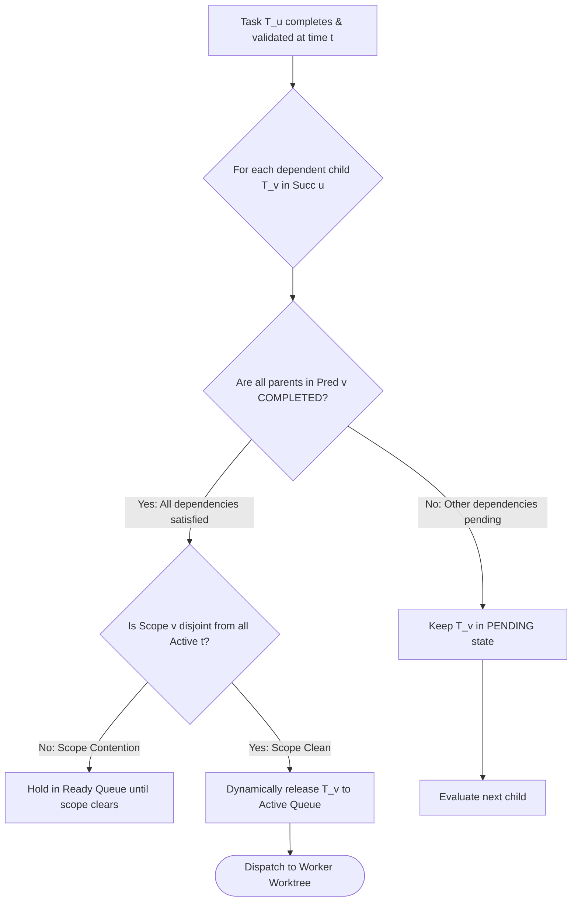

# Dynamic Wave Decoupling & Scope Confinement

---

[Previous: 06-02 Tarjan SCC Cycle Detection](06-02-tarjan-scc-cycle-detection.md) | [Chapter Index](index.md) | [All Chapters Index](../index.md) | [Next: 06-04 Sugiyama Layered Layout](06-04-sugiyama-layered-layout-engine.md)

---

## 1. Executive Summary & The Barrier Drag Vulnerability

In traditional bulk-synchronous parallel (BSP) schedulers, tasks execute in strict lockstep waves: all tasks in Wave 1 must finish before any task in Wave 2 can start. When a single task in Wave 1 takes 4 minutes while others finish in 30 seconds, available worker subagents sit idle for 3.5 minutes—a pathology known as **Barrier Drag**.

The OLT (Orchestrating Long Tasks) engine implements **Dynamic Wave Decoupling & Scope Confinement**. Under this model:

1. **Dynamic Task Readiness**: A task $T_v$ in a downstream wave is dynamically released the instant all of its specific direct parent dependencies $\text{Pred}(v)$ complete, without waiting for unrelated sibling tasks in the current wave.
2. **Scope Disjointness Invariant**: The scheduler guarantees that concurrently executing tasks operate in mutually disjoint file scopes, preventing Git merge conflicts across isolated worktrees.

```text
+--------------------------------------------------------------------------------------------------+
│                             DYNAMIC WAVE DECOUPLING TOPOLOGY                                     │
+--------------------------------------------------------------------------------------------------+
│                                                                                                  │
│   TRADITIONAL BSP (Barrier Drag):                                                                │
│   Wave 1: [Task 1A (30s)] [Task 1B (30s)] [Task 1C (4m - STRAGGLER)] ──► [BARRIER WAIT: 3.5m]   │
│   Wave 2: [Task 2A (Waits for 1C even though it only depends on 1A)]                            │
│                                                                                                  │
│   OLT DYNAMIC DECOUPLING:                                                                        │
│   Wave 1: [Task 1A (30s) DONE] ──► Task 2A IMMEDIATELY RELEASED & DISPATCHED                     │
│           [Task 1B (30s) DONE] ──► Task 2B IMMEDIATELY RELEASED & DISPATCHED                     │
│           [Task 1C (4m) RUNNING in parallel without blocking 2A/2B]                              │
│                                                                                                  │
+--------------------------------------------------------------------------------------------------+
```

---

## 2. Mathematical Formalization of Dynamic Readiness

Let $G = (V, E)$ be the active task DAG.

For each node $v \in V$, let $\text{Pred}(v) = \{ u \in V \mid (u, v) \in E \}$ denote the set of immediate predecessors.

Let $\text{Status}(u, t) \in \{\text{READY}, \text{LEASED}, \text{VALIDATED}, \text{COMPLETED}\}$ denote the state of task $u$ at time $t$.

The **Dynamic Readiness Predicate** $\mathcal{R}(v, t)$ is defined as:

$$\mathcal{R}(v, t) = \big( \text{Status}(v, t) = \text{READY} \big) \land \left( \forall u \in \text{Pred}(v), \quad \text{Status}(u, t) = \text{COMPLETED} \right)$$

### The Scope Disjointness Invariant

Let $\text{Active}(t) = \{ v \in V \mid \text{Status}(v, t) = \text{LEASED} \}$ be the set of currently executing tasks.

For any pair of concurrent tasks $T_a, T_b \in \text{Active}(t)$:

$$a \neq b \implies \text{Scope}(T_a) \cap \text{Scope}(T_b) = \emptyset$$



---

## 3. Dynamic Wave Decoupling Implementation

The dynamic scheduler ([`dynamic-scheduler.ts`](file:///Users/onurseckinsenoglu/repos/skills/olt/scripts/src/graph/dynamic-scheduler.ts)) handles state events asynchronously:

```typescript
export function onTaskCompleted(state: CapsuleState, completedTaskId: string): string[] {
  const releasedTasks: string[] = [];
  const activeScopes = getActiveTaskScopes(state);

  for (const [taskId, task] of Object.entries(state.tasks)) {
    if (task.status === "PENDING" && areAllPredecessorsCompleted(state, taskId)) {
      if (!hasScopeOverlap(task.scope, activeScopes)) {
        task.status = "READY";
        releasedTasks.push(taskId);
      }
    }
  }
  return releasedTasks;
}
```

---

## 4. Architectural Invariants Summary

1. **Zero Barrier Drag**: Tasks start the moment their prerequisites complete.
2. **Deterministic Scope Safety**: Scope disjointness guarantees zero Git merge conflicts.
3. **Event-Driven Dispatch**: Scheduler wakes up reactively on `task:validated` events.

---

[Previous: 06-02 Tarjan SCC Cycle Detection](06-02-tarjan-scc-cycle-detection.md) | [Chapter Index](index.md) | [All Chapters Index](../index.md) | [Next: 06-04 Sugiyama Layered Layout](06-04-sugiyama-layered-layout-engine.md)

---
