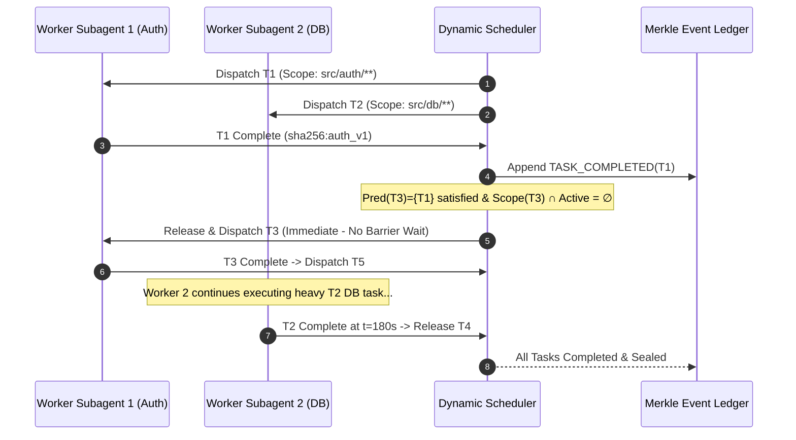

# Dynamic Wave Decoupling & Scope Confinement

---

[Previous: 06-02 Tarjan SCC Cycle Detection](06-02-tarjan-scc-cycle-detection.md) | [Chapter Index](index.md) | [All Chapters Index](../index.md) | [Next: 06-04 Sugiyama Layered Layout Engine](06-04-sugiyama-layered-layout-engine.md)

---

## 1. Executive Summary & The Barrier Drag Vulnerability

In Bulk Synchronous Parallel (BSP) architectures, tasks execute in rigid lockstep waves: all tasks in Wave $k$ must run to completion before any task in Wave $k+1$ is permitted to start. When a single long-running task in Wave $k$ encounters straggler latency, the entire compute fleet stalls at the synchronization barrier—inducing **Barrier Drag**.

The OLT (Orchestrating Long Tasks) engine eliminates barrier drag through **Dynamic Wave Decoupling & Scope Confinement**.

Under this scheduling paradigm:

1. **Fine-Grained Dynamic Task Release**: A downstream task $T_v$ in Wave $k+1$ is released for immediate worker leasing the instant all of its specific direct parent prerequisites $\text{Pred}(v)$ finish and seal their artifacts.
2. **Strict Scope Disjointness Invariant ($S_i \cap S_j = \emptyset$)**: Concurrently executing tasks operate within non-overlapping filesystem write scopes, verified statically via `dag:check` and dynamically by the lease coordinator.
3. **Cryptographic Cross-Wave Artifact Passing**: As tasks complete, output artifacts are sealed with SHA-256 digests and recorded in the Merkle event ledger, allowing child subagents to mount prerequisite artifacts in read-only mode.
4. **Adaptive Concurrency Saturation**: Dynamic release feeds ready tasks into worker pools, saturating Brent work/span capacity without exceeding host token and memory budgets.

```text
+--------------------------------------------------------------------------------------------------+
│                       BULK SYNCHRONOUS BARRIER DRAG VS DYNAMIC DECOUPLING                        │
+--------------------------------------------------------------------------------------------------+
│   TRADITIONAL BULK SYNCHRONOUS (BSP) EXECUTION:                                                  │
│   Wave 1: [Task 1A: Auth (30s) ] DONE ──┐                                                        │
│           [Task 1B: DB   (25s) ] DONE ──┼──► [ FLEET IDLE: 210s BARRIER WAIT ] ────────────────► │
│           [Task 1C: ETL  (240s)] RUNNING ──────────────────────────────────────────► DONE ─────┤│
│   Wave 2: (Blocked despite Task 2A only depending on 1A) ────────────────────────────────────► ├──┤
│                                                                                       [Task 2A]  │
│   ────────────────────────────────────────────────────────────────────────────────────────────   │
│   OLT DYNAMIC WAVE DECOUPLING:                                                                   │
│   Worker 1: [Task 1A (30s)] ──► [Task 2A: Depends on 1A (60s)] ──► [Task 3A (60s)] ──► DONE       │
│   Worker 2: [Task 1B (25s)] ──► [Task 2B: Depends on 1B (45s)] ──► [Task 3B (40s)] ──► DONE       │
│   Worker 3: [Task 1C: Long ETL in Isolated Worktree Scope (240s)] ────────────────────► DONE     │
│   SAFETY: Task 2A and 1C run concurrently because Scope(2A) ∩ Scope(1C) = ∅ (Audited: dag:check)│
+--------------------------------------------------------------------------------------------------+
```

---

## 2. Mathematical Formalization of Dynamic Wave Decoupling & Scopes

Let $G = (V, E)$ be a compiled DAG. For each task $v \in V$, $\text{Status}(v, t) \in \Sigma$, where:

$$\Sigma = \{ \text{PENDING}, \text{READY}, \text{LEASED}, \text{EXECUTING}, \text{VALIDATING}, \text{COMPLETED}, \text{FAILED} \}$$

Let $\text{Pred}(v) = \{ u \in V \mid (u, v) \in E \}$ denote direct parent prerequisites.

### Dynamic Readiness Predicate

A pending task $v$ transitions dynamically to the $\text{READY}$ queue at timestamp $t$ if and only if $\mathcal{R}(v, t)$ holds:

$$\mathcal{R}(v, t) \iff \big( \text{Status}(v, t) = \text{PENDING} \big) \land \left( \forall u \in \text{Pred}(v), \quad \text{Status}(u, t) = \text{COMPLETED} \right)$$

### Scope Disjointness Invariant

Let $\mathcal{F}$ denote the repository file path universe. For each task $v \in V$, $\text{WriteScope}(v) \subseteq \mathcal{F}$ and $\text{ReadScope}(v) \subseteq \mathcal{F}$.
For all distinct active tasks $T_a, T_b \in \text{Active}(t)$ ($a \neq b$):

$$\text{WriteScope}(T_a) \cap \text{WriteScope}(T_b) = \emptyset \quad \land \quad \text{WriteScope}(T_a) \cap \text{ReadScope}(T_b) = \emptyset$$

### Execution Span Speedup

Under rigid BSP with $K$ waves: $T_{\text{BSP}} = \sum_{k=1}^K \max_{v \in W_k} t(v)$.
Under OLT Dynamic Wave Decoupling with $P$ workers:

$$T_{\text{Dynamic}} \le \frac{T_1 - T_\infty}{P} + T_\infty, \quad \Delta T = T_{\text{BSP}} - T_{\text{Dynamic}} \ge 0$$

where $T_1 = \sum_{v \in V} t(v)$ and $T_\infty = \max_{\Pi \subseteq G} \sum_{v \in \Pi} t(v)$ is the critical path span.

---

## 3. Dynamic Dispatch & Scope Confinement Lattice

```text
Dependency: T1(20s)->T3(40s)->T5; T2(180s)->T4(30s)->T6. Scopes: Scope(T1,T3,T5) ∩ Scope(T2,T4,T6) = ∅
Timestamp (s):  0          20         40         60         80        180        210   240
                ├──────────┼──────────┼──────────┼──────────┼──────────┼──────────┼─────┼───┤
Worker Pool 1:  │ [ T1 ]   │ [   T3   ]          │ [   T5   ]          │ IDLE     │ ... │   │
(Auth Scope)    │ (0-20s)  │ (20-60s)            │ (60-100s)           │          │     │   │
                ├──────────┴─────────────────────┴─────────────────────┼──────────┴─────┴───┤
Worker Pool 2:  │ [                  T2: Large DB Migration          ] │ [ T4 ]   │[T6] │   │
(DB Scope)      │ (0-180s)                                             │ (180-210)│(210)│   │
                └──────────────────────────────────────────────────────┴──────────┴─────┴───┘
At t=20s: T1 completes. T3 releases immediately without waiting for T2 (runs to 180s).
```

---

## 4. Multi-Wave Transition Sequence



---

## 5. Concrete TypeScript Contracts & Reference Implementation

The dynamic wave decoupling engine is implemented in [`wave-partitioner.ts`](../../../../olt/scripts/src/graph/decoupling/wave-partitioner.ts):

```typescript
export type TaskStatus =
  "PENDING" | "READY" | "LEASED" | "EXECUTING" | "VALIDATING" | "COMPLETED" | "FAILED";

export interface TaskScopeDefinition {
  readonly taskId: string;
  readonly readGlobs: readonly string[];
  readonly writeGlobs: readonly string[];
}

export interface DynamicTaskNode {
  readonly id: string;
  readonly predecessors: readonly string[];
  readonly successors: readonly string[];
  readonly scopes: TaskScopeDefinition;
  status: TaskStatus;
  leaseWorkerId?: string | undefined;
  completedAtTimestamp?: number | undefined;
  outputArtifactHash?: string | undefined;
}

export interface DynamicSchedulerState {
  readonly capsuleSlug: string;
  readonly tasks: Map<string, DynamicTaskNode>;
  readonly activeLeases: Map<string, string>;
}

export function globsIntersect(patternA: string, patternB: string): boolean {
  if (patternA === patternB || patternA === "**/*" || patternB === "**/*") return true;
  const cleanA = patternA.replace(/\/\*\*.*$/, "").replace(/\/\*.*$/, "");
  const cleanB = patternB.replace(/\/\*\*.*$/, "").replace(/\/\*.*$/, "");
  return cleanA.startsWith(cleanB) || cleanB.startsWith(cleanA);
}

export function hasScopeOverlap(a: TaskScopeDefinition, b: TaskScopeDefinition): boolean {
  for (const wA of a.writeGlobs) {
    for (const wB of b.writeGlobs) if (globsIntersect(wA, wB)) return true;
    for (const rB of b.readGlobs) if (globsIntersect(wA, rB)) return true;
  }
  for (const wB of b.writeGlobs) {
    for (const rA of a.readGlobs) if (globsIntersect(wB, rA)) return true;
  }
  return false;
}

export function onTaskCompletedEvent(
  state: DynamicSchedulerState,
  completedTaskId: string,
  artifactHash: string,
): string[] {
  const completed = state.tasks.get(completedTaskId);
  if (!completed) throw new Error(`Unknown task completed: ${completedTaskId}`);

  completed.status = "COMPLETED";
  completed.outputArtifactHash = artifactHash;
  completed.completedAtTimestamp = Date.now();
  state.activeLeases.delete(completedTaskId);

  const releasedTaskIds: string[] = [];
  const activeScopes: TaskScopeDefinition[] = [];
  for (const [id] of state.activeLeases) {
    const t = state.tasks.get(id);
    if (t) activeScopes.push(t.scopes);
  }

  for (const childId of completed.successors) {
    const child = state.tasks.get(childId);
    if (!child || child.status !== "PENDING") continue;

    const allPredsDone = child.predecessors.every(
      (pId) => state.tasks.get(pId)?.status === "COMPLETED",
    );
    if (allPredsDone) {
      const conflict = activeScopes.some((active) => hasScopeOverlap(child.scopes, active));
      if (!conflict) {
        child.status = "READY";
        releasedTaskIds.push(childId);
        activeScopes.push(child.scopes);
      }
    }
  }
  return releasedTaskIds;
}
```

---

## 6. Cross-Wave Artifact Passing & Merkle Ledger Sealing

1. **Artifact Staging**: On task completion, subagents write output files to their dedicated worktree and stage artifacts to `.olt/capsules/<slug>/artifacts/<task-id>/`.
2. **Cryptographic Sealing**: The Coordinator computes the Merkle SHA-256 digest:
   $$h_{\text{artifact}} = \text{SHA256}\left( \bigoplus_{f \in \text{Artifacts}} \text{SHA256}(\text{Content}(f)) \right)$$
3. **Merkle Anchor**: The completion event and $h_{\text{artifact}}$ are committed to `events.jsonl`.
4. **Read-Only Mounting**: Subsequent child tasks mount parent artifact directories in read-only mode (`chmod 0444`).

---

## 7. Anti-Blunder Matrix & Failure Diagnostics

| Blunder Identifier              | Pathology / Symptom                                     | Root Cause                                                   | Architectural Mitigation                                                               |
| :------------------------------ | :------------------------------------------------------ | :----------------------------------------------------------- | :------------------------------------------------------------------------------------- |
| `ERR_SCOPE_COLLISION_RACE`      | Concurrent Git worktrees conflict on merge.             | Overlapping write scopes allowed in active set.              | Enforce `dag:check` scope audit and `hasScopeOverlap` gate.                            |
| `ERR_PREMATURE_CHILD_RELEASE`   | Child subagent reads incomplete parent output.          | Releasing child when parent is `EXECUTING` not `COMPLETED`.  | Strict predicate $\forall u \in \text{Pred}(v): \text{Status}(u) == \text{COMPLETED}$. |
| `ERR_WILDCARD_SCOPE_STARVATION` | Scheduler serializes all tasks because scope is `**/*`. | Overly broad write scope definitions.                        | Force agents to declare specific module paths (`src/auth/**`).                         |
| `ERR_PHANTOM_DEADLOCK_HOLD`     | Task with satisfied dependencies held `PENDING`.        | Missed completion event trigger or listener exception.       | Re-evaluate pending tasks periodically during health heartbeats.                       |
| `ERR_DIRTY_READ_CONTAMINATION`  | Child subagent reads unvalidated parent worktree state. | Child reading parent worktree directly instead of artifacts. | Mount only cryptographically sealed artifacts from `.olt/artifacts/`.                  |

---

## 8. Architectural Invariants Summary

1. **Zero Barrier Drag**: Tasks unlock asynchronously the moment direct prerequisites finish, maximizing compute velocity.
2. **Mutual Write Disjointness**: Concurrently active tasks possess mathematically disjoint write scopes ($S_a \cap S_b = \emptyset$).
3. **Static Scope Auditing**: Scope overlaps across parallel waves are audited statically via `dag:check`.
4. **Immutable Artifact Flow**: Cross-task data transfer occurs exclusively through sealed, read-only Merkle-verified artifacts.

---

[Previous: 06-02 Tarjan SCC Cycle Detection](06-02-tarjan-scc-cycle-detection.md) | [Chapter Index](index.md) | [All Chapters Index](../index.md) | [Next: 06-04 Sugiyama Layered Layout Engine](06-04-sugiyama-layered-layout-engine.md)

---
