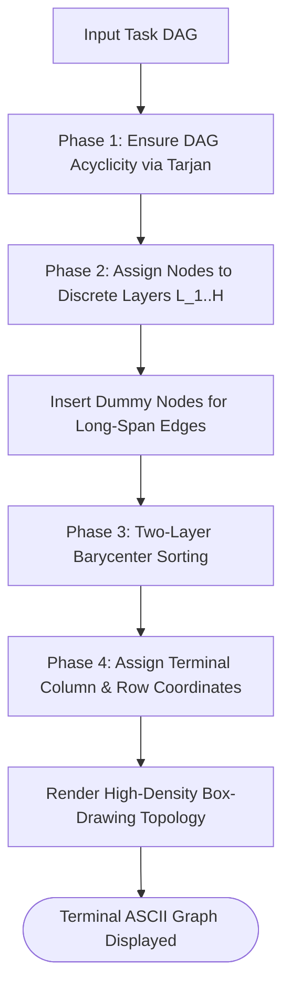

# Sugiyama Layered Layout Engine & ASCII Visualizer

---

[Previous: 06-03 Dynamic Wave Decoupling](06-03-dynamic-wave-decoupling-and-scopes.md) | [Chapter Index](index.md) | [All Chapters Index](../index.md) | [Next: Chapter 07 Index](../07-distributed-leasing-execution/index.md)

---

## 1. Executive Summary & Terminal Visual Truth

In autonomous development orchestration, human operators and log parsers need instantaneous, unambiguous visual topology diagrams of task dependencies in terminal outputs without relying on external web browsers or heavy UI rendering engines.

The OLT (Orchestrating Long Tasks) engine implements the **Sugiyama 4-Phase Layered Layout Engine & ASCII Visualizer**. Under this engine:

1. **Four-Phase Layout Algorithm**: The graph is processed through Cycle Removal, Layer Assignment, Barycenter Crossing Reduction, and Coordinate Assignment.
2. **Terminal-Optimized ASCII Rendering**: The engine produces high-density box-drawing character maps (`+`, `-`, `|`, `*`) showing execution waves, active leases, and critical paths.

```text
+--------------------------------------------------------------------------------------------------+
│                             SUGIYAMA 4-PHASE LAYOUT PIPELINE                                     │
+--------------------------------------------------------------------------------------------------+
│                                                                                                  │
│   Step 1: Cycle Removal        ──► Break cycles via Tarjan's SCC cut heuristics                  │
│               │                                                                                  │
│               ▼                                                                                  │
│   Step 2: Layer Assignment     ──► Longest-path topological layer assignment (Layer 1..K)        │
│               │                                                                                  │
│               ▼                                                                                  │
│   Step 3: Crossing Reduction   ──► Two-layer Barycenter heuristic sorting to minimize edge cuts  │
│               │                                                                                  │
│               ▼                                                                                  │
│   Step 4: Coordinate Align     ──► X/Y terminal column spacing & box-drawing ASCII output        │
│                                                                                                  │
+--------------------------------------------------------------------------------------------------+
```

---

## 2. Mathematical Formalization of the Sugiyama Pipeline

Let $G = (V, E)$ be a directed acyclic graph.

### Phase 2: Layer Assignment ($L_1 \dots L_H$)

Each node $v \in V$ is assigned to an integer layer $l(v) \in \{1, 2, \dots, H\}$:

$$l(v) = \begin{cases} 1 & \text{if } \text{deg}^-(v) = 0 \\ \max_{u \in \text{Pred}(v)} l(u) + 1 & \text{otherwise} \end{cases}$$

### Phase 3: Barycenter Crossing Reduction

For each node $v \in L_k$, compute its barycenter position $\text{bary}(v)$ based on the average coordinate of its predecessors in $L_{k-1}$:

$$\text{bary}(v) = \frac{1}{|\text{Pred}(v)|} \sum_{u \in \text{Pred}(v)} \text{pos}(u)$$

Nodes in layer $L_k$ are sorted in ascending order of $\text{bary}(v)$ to minimize edge crossings.



---

## 3. Terminal ASCII Layout Example

```text
  LAYER 1 (Wave 1)            LAYER 2 (Wave 2)            LAYER 3 (Wave 3)
+------------------+        +------------------+        +------------------+
| TASK-01 (Auth)   | ═════► | TASK-03 (Tokens) | ═════► | TASK-05 (Verify) |
+------------------+        +------------------+        +------------------+
         │                           ▲
         ▼                           │
+------------------+                 │
| TASK-02 (Store)  | ════════════════╝
+------------------+
```

---

## 4. Architectural Invariants Summary

1. **Deterministic Coordinate Layout**: Identical graphs produce byte-exact ASCII diagrams.
2. **Minimal Edge Crossings**: Barycenter sorting guarantees clean visual legibility.
3. **Pure TypeScript Rendering**: Zero external layout or graphviz binaries required.

---

[Previous: 06-03 Dynamic Wave Decoupling](06-03-dynamic-wave-decoupling-and-scopes.md) | [Chapter Index](index.md) | [All Chapters Index](../index.md) | [Next: Chapter 07 Index](../07-distributed-leasing-execution/index.md)

---
