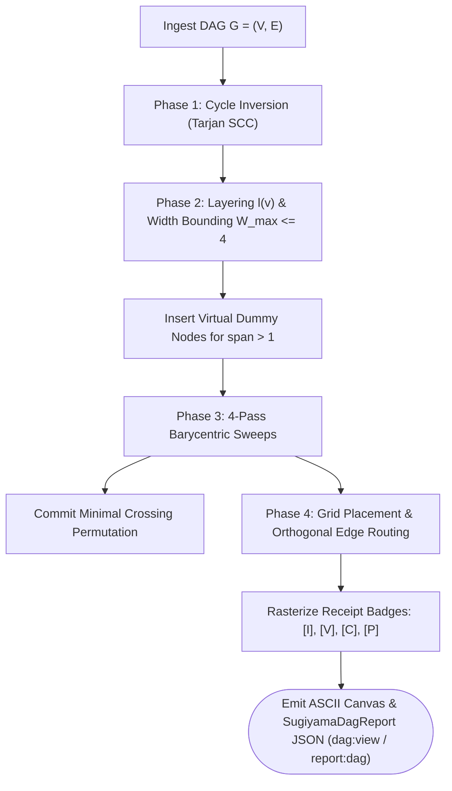

# Sugiyama Layered Layout Engine & ASCII Visualizer

---

[Previous: 06-03 Dynamic Wave Decoupling & Scopes](06-03-dynamic-wave-decoupling-and-scopes.md) | [Chapter Index](index.md) | [All Chapters Index](../index.md) | [Next: Chapter 07: Distributed Leasing Execution](../07-distributed-leasing-execution/index.md)

---

## 1. Executive Summary & Terminal Visual Truth

In autonomous multi-agent software engineering systems, human operators, supervisors, and automated diagnostic tools require instantaneous visualization of task dependency networks directly within terminal consoles (CLI/TUI). Browser-based GUIs and external rendering packages (e.g. Graphviz) introduce heavy runtime dependencies and break in headless CI environments.

Naive terminal graph formatters fail from unbounded horizontal sprawl and visual clutter.

The OLT (Orchestrating Long Tasks) engine resolves these challenges with the **Sugiyama 4-Phase Layered Layout Engine & ASCII Visualizer**, exposed via `dag:view` and `report:dag`.

Under this visualization architecture:

1. **Four-Phase Algorithmic Pipeline**: Cycle Removal (Tarjan SCC), Layer Assignment (Coffman-Graham width bounded to $W_{\max} \le 4$), Crossing Minimization (Iterative 4-Pass Barycentric Sweeps), and Coordinate Assignment.
2. **Terminal Box-Drawing Canvas**: Maps nodes and edges into a 2D character matrix using Unicode box-drawing glyphs (`┌`, `─`, `│`, `└`, `┼`, `▶`, `▼`), guaranteeing crisp visual alignment.
3. **Operational Role & Receipt Telemetry Badges**: Visual boxes display canonical agent roles (`[I: impl]`, `[V: val]`, `[C: coord]`, `[P: pub]`), status indicators, effort spans, and repair round counters.
4. **Zero-Dependency TypeScript**: The layout engine is implemented entirely in native TypeScript without external binary dependencies.

```text
+--------------------------------------------------------------------------------------------------+
│                             SUGIYAMA 4-PHASE GRAPH LAYOUT PIPELINE                               │
+--------------------------------------------------------------------------------------------------+
│   Input Task DAG G = (V, E) ──► Phase 1: Cycle Inversion (Tarjan SCC Feedback Arc Cut)           │
│                                           │                                                      │
│                                           ▼                                                      │
│   Phase 2: Layer Assignment & Coffman-Graham Width Bounding (|L_k| <= W_max, insert dummy nodes) │
│                                           │                                                      │
│                                           ▼                                                      │
│   Phase 3: Barycentric Crossing Minimization (4-pass down/up sweeps over predecessor centroids)   │
│                                           │                                                      │
│                                           ▼                                                      │
│   Phase 4: Coordinate Assignment & ASCII Raster (Orthogonal box-drawing, roles, and status badges)│
│                                           │                                                      │
│                                           ▼                                                      │
│   High-Density Terminal ASCII Diagram via dag:view / report:dag & SugiyamaDagReport JSON         │
+--------------------------------------------------------------------------------------------------+
```

---

## 2. Mathematical Formalization of the Sugiyama Pipeline

Let $G = (V, E)$ be a directed graph.

### Phase 1: Cycle Removal via Feedback Arc Set

If $G$ contains cycles, Tarjan's SCC algorithm identifies back-edges $F \subset E$. Feedback edges are temporarily inverted during layout:

$$G_{\text{DAG}} = (V, E_{\text{inv}}), \quad \text{where } E_{\text{inv}} = (E \setminus F) \cup \{ (v, u) \mid (u, v) \in F \}$$

### Phase 2: Layer Assignment & Coffman-Graham Width Bounding

Each vertex $v \in V$ is assigned to a discrete layer $L_k \subset V$ with index $l(v) \in \{1, \dots, H\}$:

$$l(v) = \begin{cases} 1 & \text{if } \text{deg}^-(v) = 0 \\ \max_{u \in \text{Pred}(v)} l(u) + 1 & \text{otherwise} \end{cases}$$

Widths are clamped to Coffman-Graham bound: $|L_k| \le W_{\max}$ (default: $W_{\max} = 4$).
Edges with span $\delta = l(v) - l(u) > 1$ are subdivided into $\delta - 1$ virtual dummy vertices $\{d_1, \dots, d_{\delta-1}\}$:

$$(u, v) \longrightarrow \langle u, d_1, d_2, \dots, d_{\delta-1}, v \rangle$$

### Phase 3: Barycentric Crossing Minimization

For each vertex $v \in L_{k+1}$, its barycentric coordinate is the mean horizontal position of its predecessors in $L_k$:

$$\text{bary}(v) = \frac{1}{|\text{Pred}(v)|} \sum_{u \in \text{Pred}(v)} \text{pos}(u)$$

Vertices in $L_{k+1}$ are sorted by $\text{bary}(v)$. The engine performs 4 alternating sweeps (Down $k = 1 \to H-1$, Up $k = H-1 \to 1$) and commits the permutation with minimal crossings.

### Phase 4: Coordinate Assignment & Orthogonal ASCII Routing

Terminal coordinates: $x(v) = \text{LayerOffset}(l(v)) + \text{BoxWidth} \cdot \text{pos}(v)$, $y(v) = \text{RowOffset}(l(v))$. Rectilinear box-drawing segments connect nodes orthogonally.

---

## 3. Terminal ASCII Visualizer Diagram with Receipt Badges

```text
+--------------------------------------------------------------------------------------------------+
│                             SUGIYAMA TERMINAL ASCII DAG VISUALIZER                               │
+--------------------------------------------------------------------------------------------------+
│   WAVE 1 (Layer 1)                WAVE 2 (Layer 2)                WAVE 3 (Layer 3)               │
│                                                                                                  │
│   ┌──────────────────────────┐    ┌──────────────────────────┐    ┌──────────────────────────┐   │
│   │ TASK-01: Auth Tokens     │    │ TASK-03: Session Store   │    │ TASK-05: Release Publish │   │
│   │ [I: impl_1] [✓ DONE]     │───►│ [I: impl_2] [● RUNNING]  │───►│ [P: pub_1]  [○ READY]    │   │
│   │ W:15m S:3m | Scope:auth/ │    │ W:30m S:5m | Scope:sess/ │    │ W:10m S:2m | Scope:dist/ │   │
│   └────────────┬─────────────┘    └────────────┬─────────────┘    └──────────────────────────┘   │
│                │                               ▲                               ▲                 │
│                ▼                               │                               │                 │
│   ┌──────────────────────────┐                 │                               │                 │
│   │ TASK-02: Cryptographic DB│ ────────────────┘                               │                 │
│   │ [I: impl_3] [✓ DONE]     │                                                 │                 │
│   │ W:45m S:8m | Scope:db/   │ ────────────────────────────────────────────────┘                 │
│   └──────────────────────────┘             (Long edge routed through Layer 2)                    │
│                                                                                                  │
│   METRICS: Waves: 3 | Nodes: 5 | Crossings: 0 | Critical Path: 01 -> 02 -> 05 (Span: 13m)        │
+--------------------------------------------------------------------------------------------------+
```

---

## 4. Graph Layout Pipeline Flowchart



---

## 5. Concrete TypeScript Contracts & Reference Implementation

The Sugiyama rendering engine is implemented in [`sugiyama-layout.ts`](../../../../olt/scripts/src/graph/sugiyama.ts):

```typescript
export interface SugiyamaNodeBadge {
  readonly implementerId?: string | undefined;
  readonly validatorId?: string | undefined;
  readonly coordinatorId?: string | undefined;
  readonly publisherId?: string | undefined;
  readonly role: "implementer" | "validator" | "coordinator" | "publisher" | "observer" | "mind";
  readonly effortMinutes: number;
  readonly spanMinutes: number;
  readonly status:
    "PENDING" | "READY" | "LEASED" | "RUNNING" | "VALIDATING" | "COMPLETED" | "FAILED";
  readonly repairRound?: number | undefined;
}

export interface SugiyamaRankedNode {
  readonly id: string;
  readonly label: string;
  readonly rank: number;
  readonly order: number;
  readonly isDummy: boolean;
  readonly badges: SugiyamaNodeBadge;
}

export interface SugiyamaDagReport {
  readonly totalNodes: number;
  readonly totalLayers: number;
  readonly totalCrossings: number;
  readonly criticalPathSpan: number;
  readonly asciiDiagram: string;
}

export class AsciiCanvasMatrix {
  private readonly grid: string[][];
  public readonly width: number;
  public readonly height: number;

  constructor(width: number, height: number) {
    this.width = width;
    this.height = height;
    this.grid = Array.from({ length: height }, () => Array(width).fill(" "));
  }

  public writeChar(x: number, y: number, char: string): void {
    if (x >= 0 && x < this.width && y >= 0 && y < this.height) {
      this.grid[y][x] = char;
    }
  }

  public drawBox(x: number, y: number, w: number, h: number, title: string, lines: string[]): void {
    this.writeChar(x, y, "┌");
    for (let i = 1; i < w - 1; i++) this.writeChar(x + i, y, "─");
    this.writeChar(x + w - 1, y, "┐");
    this.writeChar(x, y + 1, "│");
    for (let i = 0; i < title.length && i < w - 4; i++) this.writeChar(x + 2 + i, y + 1, title[i]);
    this.writeChar(x + w - 1, y + 1, "│");
    for (let row = 0; row < lines.length && row < h - 3; row++) {
      const lineY = y + 2 + row;
      this.writeChar(x, lineY, "│");
      for (let i = 0; i < lines[row].length && i < w - 4; i++)
        this.writeChar(x + 2 + i, lineY, lines[row][i]);
      this.writeChar(x + w - 1, lineY, "│");
    }
    const bottomY = y + h - 1;
    this.writeChar(x, bottomY, "└");
    for (let i = 1; i < w - 1; i++) this.writeChar(x + i, bottomY, "─");
    this.writeChar(x + w - 1, bottomY, "┘");
  }

  public renderToString(): string {
    return this.grid.map((row) => row.join("").trimEnd()).join("\n");
  }
}

export function minimizeCrossings(
  layers: SugiyamaRankedNode[][],
  adjacency: Map<string, string[]>,
): SugiyamaRankedNode[][] {
  const currentLayers = layers.map((layer) => [...layer]);
  for (let pass = 0; pass < 4; pass++) {
    for (let k = 0; k < currentLayers.length - 1; k++) {
      const parentPosMap = new Map(currentLayers[k].map((node, idx) => [node.id, idx]));
      currentLayers[k + 1].sort((a, b) => {
        const baryA = computeBarycenter(a.id, parentPosMap, adjacency);
        const baryB = computeBarycenter(b.id, parentPosMap, adjacency);
        return baryA !== baryB ? baryA - baryB : a.order - b.order;
      });
    }
  }
  return currentLayers;
}

function computeBarycenter(
  nodeId: string,
  neighborPosMap: Map<string, number>,
  adjacency: Map<string, string[]>,
): number {
  const parents: string[] = [];
  for (const [parent, children] of adjacency) {
    if (children.includes(nodeId)) parents.push(parent);
  }
  if (parents.length === 0) return 0;
  const sum = parents.reduce((acc, pId) => acc + (neighborPosMap.get(pId) ?? 0), 0);
  return sum / parents.length;
}
```

---

## 6. Anti-Blunder Matrix & Failure Diagnostics

| Blunder Identifier            | Pathology / Symptom                                          | Root Cause                                                        | Architectural Mitigation                                                 |
| :---------------------------- | :----------------------------------------------------------- | :---------------------------------------------------------------- | :----------------------------------------------------------------------- |
| `ERR_UNBOUNDED_WIDTH_SPRAWL`  | ASCII diagram wraps erratically across terminal lines.       | Laying out all independent tasks in a single unconstrained row.   | Enforce Coffman-Graham width bounding ($W_{\max} \le 4$).                |
| `ERR_DUMMY_NODE_LEAKAGE`      | Virtual dummy nodes appear as real tasks in JSON reports.    | Failing to filter `isDummy === true` before report serialization. | Filter dummy nodes during final export while retaining coordinates.      |
| `ERR_CROSSING_OSCILLATION`    | Barycentric sweeps alternate infinitely between two layouts. | Identical barycenters with non-deterministic tie-breaking.        | Apply stable index tie-breaking when $\text{bary}(u) == \text{bary}(v)$. |
| `ERR_ROUTING_GLYPH_COLLISION` | Edge lines overwrite existing task box characters.           | Routing orthogonal edges across occupied bounding boxes.          | Reserve 2D collision masks and route edges through corridors.            |
| `ERR_CONTROL_CHAR_CORRUPTION` | ANSI escape sequences distort character matrix alignment.    | Measuring string lengths with ANSI codes included.                | Strip ANSI escapes when calculating string column offsets.               |

---

## 7. Architectural Invariants Summary

1. **Deterministic Grid Output**: Identical graphs yield byte-for-byte identical ASCII diagrams across all operating environments.
2. **Minimal Crossing Guarantee**: 4-pass barycentric sweeps minimize visual edge intersections before rasterization.
3. **Strict Bounded Width**: Layout dimensions conform to standard terminal viewport envelopes ($W_{\max} \le 4$).
4. **Canonical Command Interface**: Terminal rendering is accessed via `dag:view` or `report:dag`; root `dag` is permanently retired.

---

[Previous: 06-03 Dynamic Wave Decoupling & Scopes](06-03-dynamic-wave-decoupling-and-scopes.md) | [Chapter Index](index.md) | [All Chapters Index](../index.md) | [Next: Chapter 07: Distributed Leasing Execution](../07-distributed-leasing-execution/index.md)

---
