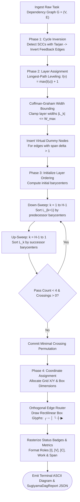

# Sugiyama Layered Layout Engine & ASCII Visualizer

---

[Previous: 06-03 Dynamic Wave Decoupling & Scopes](06-03-dynamic-wave-decoupling-and-scopes.md) | [Chapter Index](index.md) | [All Chapters Index](../index.md) | [Next: Chapter 07: Distributed Leasing Execution](../07-distributed-leasing-execution/index.md)

---

## 1. Executive Summary & Terminal Visual Truth

In autonomous multi-agent software engineering systems, human operators, strategic supervisors, and automated diagnostic tools require instantaneous, unambiguous visualization of complex task dependency networks directly within terminal consoles (CLI/TUI). Browser-based GUIs and external rendering tools (e.g. Graphviz, PlantUML) introduce heavy runtime dependencies, break in headless CI environments, and cannot be embedded in raw execution logs.

Naive terminal graph formatters suffer from two primary failure modes:

1. **Unbounded Horizontal Sprawl**: Independent parallel tasks are placed on a single unbounded horizontal row, blowing past standard 80–120 column terminal widths.
2. **Visual Clutter & Edge Crossings**: Diagonal line drawings and uncoordinated connector routing produce unintelligible ASCII diagrams.

The OLT (Orchestrating Long Tasks) engine resolves these challenges with the **Sugiyama 4-Phase Layered Layout Engine & ASCII Visualizer**.

Under this visualization architecture:

1. **Four-Phase Algorithmic Pipeline**: The dependency graph is processed through Cycle Removal (Tarjan SCC), Layer Assignment (Longest-Path & Coffman-Graham width bounding), Crossing Minimization (Iterative 4-Pass Barycentric Sweeps), and Coordinate Assignment.
2. **Terminal-Optimized Box-Drawing Canvas**: The engine maps nodes and edges into a 2D character matrix using Unicode box-drawing glyphs (`┌`, `─`, `│`, `└`, `┼`, `┬`, `┴`, `├`, `┤`, `▶`, `▼`), guaranteeing crisp visual alignment.
3. **Operational Role & Telemetry Badging**: Visual boxes format agent roles (`[I: implementer]`, `[V: validator]`, `[C: coordinator]`), task status indicators, effort spans, and repair round counters.
4. **Zero-Dependency TypeScript Implementation**: The layout engine is implemented entirely in native TypeScript without external binary dependencies.

```text
+--------------------------------------------------------------------------------------------------+
│                             SUGIYAMA 4-PHASE GRAPH LAYOUT PIPELINE                               │
+--------------------------------------------------------------------------------------------------+
│                                                                                                  │
│   Input Task DAG G = (V, E) ──► Phase 1: Cycle Inversion (Tarjan SCC Feedback Arc Cut)           │
│                                           │                                                      │
│                                           ▼                                                      │
│                                 Phase 2: Layer Assignment & Dummy Splitting                      │
│                                 - Compute Longest-Path Layer: l(v)                               │
│                                 - Coffman-Graham Width Bounding: |L_k| <= W_max                  │
│                                 - Insert Dummy Nodes for Long Edges (span > 1)                   │
│                                           │                                                      │
│                                           ▼                                                      │
│                                 Phase 3: Barycentric Crossing Minimization                       │
│                                 - Compute Centroids: bary(v) = avg(pos(parents))                 │
│                                 - 4-Pass Alternating Sweeps (Down-pass, Up-pass)                 │
│                                 - Retain Permutation with Minimal Crossings                      │
│                                           │                                                      │
│                                           ▼                                                      │
│                                 Phase 4: Coordinate Assignment & ASCII Raster                    │
│                                 - Allocate Column Widths and Row Heights                         │
│                                 - Orthogonal Box-Drawing Edge Routing                            │
│                                 - Render Status Badges, Roles, and Metadata                      │
│                                           │                                                      │
│                                           ▼                                                      │
│   High-Density Terminal ASCII Diagram & Structured SugiyamaDagReport JSON                        │
│                                                                                                  │
+--------------------------------------------------------------------------------------------------+
```

---

## 2. Mathematical Formalization of the Sugiyama Pipeline

Let $G = (V, E)$ be a directed graph.

### Phase 1: Cycle Removal via Feedback Arc Set

If $G$ contains cycles, Tarjan's SCC algorithm identifies all back-edges $F \subset E$. The feedback edges are temporarily inverted during layout:

$$G_{\text{DAG}} = (V, E_{\text{inv}}), \quad \text{where } E_{\text{inv}} = (E \setminus F) \cup \{ (v, u) \mid (u, v) \in F \}$$

### Phase 2: Layer Assignment & Coffman-Graham Width Bounding

Each vertex $v \in V$ is assigned to a discrete layer $L_k \subset V$ with index $l(v) \in \{1, 2, \dots, H\}$:

$$ l(v) = \begin{cases}
1 & \text{if } \text{deg}^-(v) = 0 \\
\max_{u \in \text{Pred}(v)} l(u) + 1 & \text{otherwise}
\end{cases}$$

To prevent terminal column overflow, layer widths are bounded by Coffman-Graham width $W_{\max}$ (default: $W_{\max} = 4$):

$$\forall k \in \{1, \dots, H\}, \quad |L_k| \le W_{\max}$$

#### Dummy Node Insertion for Long-Span Edges

For any directed edge $(u, v) \in E$ where $l(v) - l(u) = \delta > 1$, the edge is subdivided into a path of $\delta - 1$ virtual dummy vertices $\{d_1, d_2, \dots, d_{\delta-1}\}$ such that $l(d_i) = l(u) + i$:

$$(u, v) \longrightarrow \langle u, d_1, d_2, \dots, d_{\delta-1}, v \rangle$$

### Phase 3: Barycentric Crossing Minimization

The number of edge crossings between consecutive layers $L_k$ and $L_{k+1}$ is given by:

$$\text{Crossings}(L_k, L_{k+1}) = \sum_{\substack{(u_1, v_1) \in E \\ (u_2, v_2) \in E}} \mathbb{I}\Big( \big(\text{pos}(u_1) < \text{pos}(u_2)\big) \land \big(\text{pos}(v_1) > \text{pos}(v_2)\big) \Big)$$

For each vertex $v \in L_{k+1}$, its barycentric coordinate $\text{bary}(v)$ is the arithmetic mean of the horizontal positions of its predecessors in $L_k$:

$$\text{bary}(v) = \frac{1}{|\text{Pred}(v)|} \sum_{u \in \text{Pred}(v)} \text{pos}(u)$$

Vertices within layer $L_{k+1}$ are sorted in ascending order of $\text{bary}(v)$. The engine performs 4 alternating sweeps (Down-pass $k = 1 \to H-1$, Up-pass $k = H-1 \to 1$) and commits the ordering that minimizes total crossings:

$$\min \sum_{k=1}^{H-1} \text{Crossings}(L_k, L_{k+1})$$

### Phase 4: Coordinate Assignment & Orthogonal ASCII Routing

Let $(x(v), y(v))$ be the terminal grid coordinate assigned to vertex $v$.
- Column $x(v) = \text{LayerOffset}(l(v)) + \text{BoxWidth} \cdot \text{pos}(v)$
- Row $y(v) = \text{RowOffset}(l(v))$

Orthogonal edge routing connects $(x(u), y(u))$ to $(x(v), y(v))$ using rectilinear path segments with direction corners (`┌`, `┐`, `└`, `┘`, `┼`).

---

## 3. High-Density ASCII 4-Phase Pipeline & Terminal Rendering Layout

The diagram below shows the output generated by the Sugiyama visualizer for a multi-wave workflow:

```text
+--------------------------------------------------------------------------------------------------+
│                             SUGIYAMA TERMINAL ASCII DAG VISUALIZER                               │
+--------------------------------------------------------------------------------------------------+
│                                                                                                  │
│   WAVE 1 (Layer 1)                WAVE 2 (Layer 2)                WAVE 3 (Layer 3)               │
│                                                                                                  │
│   ┌──────────────────────────┐    ┌──────────────────────────┐    ┌──────────────────────────┐   │
│   │ TASK-01: Auth Tokens     │    │ TASK-03: Session Store   │    │ TASK-05: Integration Ver │   │
│   │ [I: impl_agent_1] [DONE] │───►│ [I: impl_agent_2] [RUN]  │───►│ [V: val_agent_1]  [PEND] │   │
│   │ W:15m S:3m | Scope:auth/ │    │ W:30m S:5m | Scope:sess/ │    │ W:10m S:2m | Scope:test/ │   │
│   └────────────┬─────────────┘    └────────────┬─────────────┘    └──────────────────────────┘   │
│                │                               ▲                               ▲                 │
│                │                               │                               │                 │
│                ▼                               │                               │                 │
│   ┌──────────────────────────┐                 │                               │                 │
│   │ TASK-02: Cryptographic DB│ ────────────────┘                               │                 │
│   │ [I: impl_agent_3] [DONE] │                                                 │                 │
│   │ W:45m S:8m | Scope:db/   │ ────────────────────────────────────────────────┘                 │
│   └──────────────────────────┘             (Long Edge routed through Layer 2)                    │
│                                                                                                  │
│   ════════════════════════════════════════════════════════════════════════════════════════════   │
│   METRICS: Waves: 3 | Nodes: 5 | Crossings: 0 | Critical Path: 01 -> 02 -> 05 (Span: 13m)        │
│                                                                                                  │
+--------------------------------------------------------------------------------------------------+
```

---

## 4. Mermaid Graph Layout Sequence & Pipeline Flowchart



---

## 5. Concrete TypeScript Contracts & Canvas Matrix Renderer

The Sugiyama rendering engine is implemented in [`sugiyama-layout.ts`](../../../../olt/scripts/src/graph/sugiyama.ts):

```typescript
export interface SugiyamaNodeBadge {
  readonly implementerId?: string | undefined;
  readonly validatorId?: string | undefined;
  readonly coordinatorId?: string | undefined;
  readonly role: "implementer" | "validator" | "coordinator" | "observer" | "mind";
  readonly effortMinutes: number;
  readonly spanMinutes: number;
  readonly status: "PENDING" | "READY" | "LEASED" | "RUNNING" | "VALIDATING" | "COMPLETED" | "FAILED";
  readonly repairRound?: number | undefined;
}

export interface SugiyamaRankedNode {
  readonly id: string;
  readonly label: string;
  readonly rank: number;
  readonly order: number;
  readonly isDummy: boolean;
  readonly badges: SugiyamaNodeBadge;
}

export interface SugiyamaLayoutConfig {
  readonly maxLaneWidth: number;
  readonly boxWidthChars: number;
  readonly boxHeightLines: number;
  readonly horizontalSpacing: number;
  readonly verticalSpacing: number;
}

export interface SugiyamaDagReport {
  readonly totalNodes: number;
  readonly totalLayers: number;
  readonly totalCrossings: number;
  readonly criticalPathSpan: number;
  readonly asciiDiagram: string;
}

export class AsciiCanvasMatrix {
  private readonly grid: string[][];
  public readonly width: number;
  public readonly height: number;

  constructor(width: number, height: number) {
    this.width = width;
    this.height = height;
    this.grid = Array.from({ length: height }, () => Array(width).fill(" "));
  }

  public writeChar(x: number, y: number, char: string): void {
    if (x >= 0 && x < this.width && y >= 0 && y < this.height) {
      this.grid[y][x] = char;
    }
  }

  public writeString(x: number, y: number, text: string): void {
    for (let i = 0; i < text.length; i++) {
      this.writeChar(x + i, y, text[i]);
    }
  }

  public drawBox(x: number, y: number, w: number, h: number, title: string, lines: string[]): void {
    // Top border
    this.writeChar(x, y, "┌");
    for (let i = 1; i < w - 1; i++) this.writeChar(x + i, y, "─");
    this.writeChar(x + w - 1, y, "┐");

    // Title line
    this.writeChar(x, y + 1, "│");
    this.writeString(x + 2, y + 1, title.padEnd(w - 4).slice(0, w - 4));
    this.writeChar(x + w - 1, y + 1, "│");

    // Content lines
    for (let row = 0; row < lines.length && row < h - 3; row++) {
      const lineY = y + 2 + row;
      this.writeChar(x, lineY, "│");
      this.writeString(x + 2, lineY, lines[row].padEnd(w - 4).slice(0, w - 4));
      this.writeChar(x + w - 1, lineY, "│");
    }

    // Bottom border
    const bottomY = y + h - 1;
    this.writeChar(x, bottomY, "└");
    for (let i = 1; i < w - 1; i++) this.writeChar(x + i, bottomY, "─");
    this.writeChar(x + w - 1, bottomY, "┘");
  }

  public drawHorizontalEdge(x1: number, x2: number, y: number): void {
    const startX = Math.min(x1, x2);
    const endX = Math.max(x1, x2);
    for (let x = startX; x <= endX; x++) {
      if (this.grid[y][x] === "│") {
        this.writeChar(x, y, "┼");
      } else if (this.grid[y][x] === " ") {
        this.writeChar(x, y, "─");
      }
    }
    this.writeChar(endX, y, "►");
  }

  public drawVerticalEdge(x: number, y1: number, y2: number): void {
    const startY = Math.min(y1, y2);
    const endY = Math.max(y1, y2);
    for (let y = startY; y <= endY; y++) {
      if (this.grid[y][x] === "─") {
        this.writeChar(x, y, "┼");
      } else if (this.grid[y][x] === " ") {
        this.writeChar(x, y, "│");
      }
    }
    this.writeChar(x, endY, "▼");
  }

  public renderToString(): string {
    return this.grid.map((row) => row.join("").trimEnd()).join("\n");
  }
}

/**
 * 4-Pass Barycentric Layer Crossing Minimizer
 */
export function minimizeCrossings(
  layers: SugiyamaRankedNode[][],
  adjacency: Map<string, string[]>
): SugiyamaRankedNode[][] {
  const currentLayers = layers.map((layer) => [...layer]);

  for (let pass = 0; pass < 4; pass++) {
    if (pass % 2 === 0) {
      // Down-sweep: Order layer k+1 based on parent positions in layer k
      for (let k = 0; k < currentLayers.length - 1; k++) {
        const parentLayer = currentLayers[k];
        const parentPosMap = new Map(parentLayer.map((node, idx) => [node.id, idx]));

        currentLayers[k + 1].sort((a, b) => {
          const baryA = computeBarycenter(a.id, parentPosMap, adjacency, true);
          const baryB = computeBarycenter(b.id, parentPosMap, adjacency, true);
          return baryA !== baryB ? baryA - baryB : a.order - b.order;
        });
      }
    } else {
      // Up-sweep: Order layer k based on child positions in layer k+1
      for (let k = currentLayers.length - 1; k > 0; k--) {
        const childLayer = currentLayers[k];
        const childPosMap = new Map(childLayer.map((node, idx) => [node.id, idx]));

        currentLayers[k - 1].sort((a, b) => {
          const baryA = computeBarycenter(a.id, childPosMap, adjacency, false);
          const baryB = computeBarycenter(b.id, childPosMap, adjacency, false);
          return baryA !== baryB ? baryA - baryB : a.order - b.order;
        });
      }
    }
  }

  return currentLayers;
}

function computeBarycenter(
  nodeId: string,
  neighborPosMap: Map<string, number>,
  adjacency: Map<string, string[]>,
  isPredecessor: boolean
): number {
  const neighbors: string[] = [];
  if (isPredecessor) {
    for (const [parent, children] of adjacency) {
      if (children.includes(nodeId)) neighbors.push(parent);
    }
  } else {
    neighbors.push(...(adjacency.get(nodeId) ?? []));
  }

  if (neighbors.length === 0) return 0;
  const sum = neighbors.reduce((acc, nId) => acc + (neighborPosMap.get(nId) ?? 0), 0);
  return sum / neighbors.length;
}
```

---

## 6. Anti-Blunder Matrix & Failure Diagnostics

| Blunder Identifier | Pathology / Symptom | Root Cause | Architectural Mitigation |
| :--- | :--- | :--- | :--- |
| `ERR_UNBOUNDED_WIDTH_SPRAWL` | ASCII diagram wraps erratically across terminal lines. | Laying out all independent tasks in a single unconstrained row. | Enforce Coffman-Graham width bounding ($W_{\max} \le 4$). |
| `ERR_DUMMY_NODE_LEAKAGE` | Virtual dummy nodes appear as real tasks in JSON reports. | Failing to filter `isDummy === true` nodes prior to report serialization. | Filter dummy nodes during final report export while keeping routing coordinates. |
| `ERR_CROSSING_OSCILLATION` | Barycentric sweeps alternate infinitely between two configurations. | Identical barycenters with non-deterministic tie-breaking. | Apply stable index tie-breaking when $\text{bary}(u) == \text{bary}(v)$. |
| `ERR_ROUTING_GLYPH_COLLISION` | Edge lines overwrite existing task box characters in canvas. | Routing orthogonal edges across occupied node bounding boxes. | Reserve 2D collision masks and route edges strictly through whitespace corridors. |
| `ERR_CONTROL_CHAR_CORRUPTION` | ANSI color escape sequences distort character matrix alignment. | Measuring string lengths with ANSI codes included. | Strip ANSI escapes when calculating string column offsets. |

---

## 7. Architectural Invariants Summary

1. **Deterministic Grid Output**: Identical graphs yield byte-for-byte identical ASCII diagrams across all operating environments.
2. **Minimal Crossing Guarantee**: 4-pass barycentric sweeps minimize visual edge intersections before rasterization.
3. **Strict Bounded Width**: Layout dimensions conform to standard terminal viewport envelopes without line wrapping.
4. **Hermetic TypeScript Architecture**: Pure native implementation requiring zero external binary or graphviz packages.

---

[Previous: 06-03 Dynamic Wave Decoupling & Scopes](06-03-dynamic-wave-decoupling-and-scopes.md) | [Chapter Index](index.md) | [All Chapters Index](../index.md) | [Next: Chapter 07: Distributed Leasing Execution](../07-distributed-leasing-execution/index.md)

---


$$
