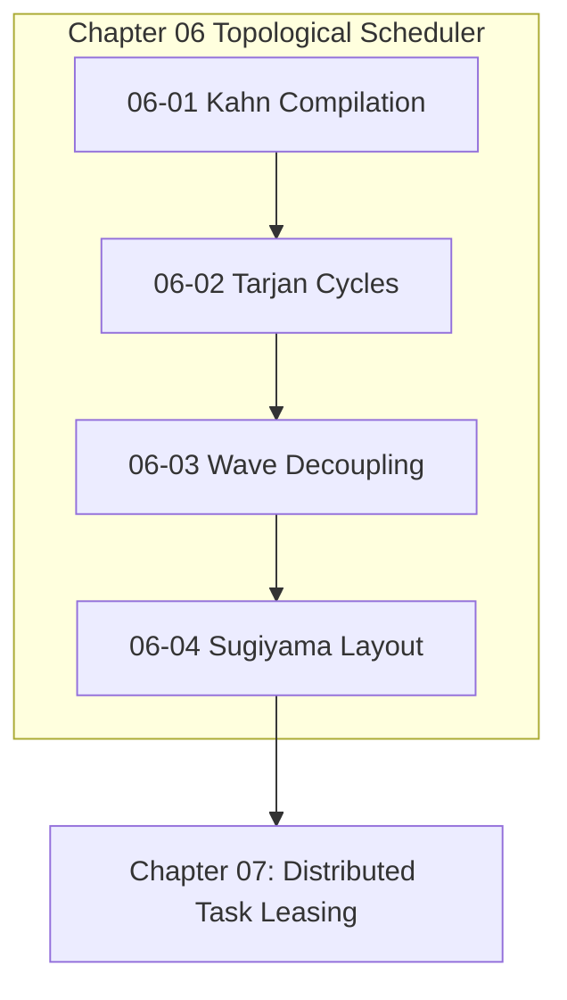

# Chapter 06: Topological DAG Scheduler

---

[Previous: Chapter 05 Index](../05-concurrency-straggler-sla/index.md) | [Chapter Index](index.md) | [All Chapters Index](../index.md) | [Next: 06-01 DAG Compilation & Kahn's Algorithm](06-01-dag-compilation-and-kahns-algorithm.md)

---

## 1. Chapter Overview & Scheduling Architecture

Welcome to Chapter 06 of the OLT Architecture Book. This chapter establishes the mathematical graph models, cycle-detection algorithms, dynamic wave decoupling mechanisms, and visual layout engines that power the **Topological DAG Scheduler** in the OLT (Orchestrating Long Tasks) engine.

Ad-hoc agent execution fails when tasks execute out of order, introducing circular dependencies and merge conflicts. Chapter 06 details DAG Compilation via Kahn's Topological Sorting Algorithm, formalizes Tarjan's SCC Cycle Detection and Contract Extraction, defines Dynamic Wave Decoupling & Scope Confinement, and presents the Sugiyama 4-Phase Layered Layout Engine for ASCII terminal visualization.

```text
+--------------------------------------------------------------------------------------------------+
│                             CHAPTER 06: TOPOLOGICAL SCHEDULER TOPOLOGY                           │
+--------------------------------------------------------------------------------------------------+
│                                                                                                  │
│    ┌───────────────────────────┐                    ┌───────────────────────────┐                │
│    │ 06-01: DAG Compilation   │                    │ 06-02: Tarjan SCC Cycle   │                │
│    │ & Kahn's Toposort Algorithm│ ══════════════════►│ Detection & Edge Cuts     │                │
│    └─────────────┬─────────────┘                    └─────────────┬─────────────┘                │
│                  │                                                │                              │
│                  ▼                                                ▼                              │
│    ┌───────────────────────────┐                    ┌───────────────────────────┐                │
│    │ 06-03: Dynamic Wave       │                    │ 06-04: Sugiyama Layered   │                │
│    │ Decoupling & Scopes       │ ══════════════════►│ Terminal Layout Engine    │                │
│    └───────────────────────────┘                    └───────────────────────────┘                │
│                                                                                                  │
+--------------------------------------------------------------------------------------------------+
```

---

## 2. Chapter Table of Contents & Learning Path

```text
+--------------------------------------------------+--------------+--------------------------------+
│ Document                                         │ Classification│ Core Architectural Focus       │
+--------------------------------------------------+--------------+--------------------------------+
│ 06-01 DAG Compilation & Kahn's Algorithm        │ Algorithms   │ Linear-time wave sorting O(V+E)│
│ 06-02 Tarjan SCC Cycle Detection                 │ Graph Theory │ Tarjan lowlinks & edge cutting │
│ 06-03 Dynamic Wave Decoupling & Scopes           │ Concurrency  │ Scope disjointness & readiness │
│ 06-04 Sugiyama Layered Layout Engine             │ Visualization│ 4-phase ASCII DAG rendering    │
+--------------------------------------------------+--------------+--------------------------------+
```

### [06-01: DAG Compilation & Kahn's Topological Sort Algorithm](06-01-dag-compilation-and-kahns-algorithm.md)

Deconstructs linear-time topological sorting ($\mathcal{O}(|V|+|E|)$), in-degree tracking arrays, queue management, and wave synthesis.

### [06-02: Tarjan's SCC Cycle Detection & Contract Extraction](06-02-tarjan-scc-cycle-detection.md)

Details Tarjan's DFS $\text{dfn}/\text{low}$ algorithm, strongly connected component identification ($|\text{SCC}| > 1$), minimum-weight cut selection, and TypeScript interface contract factoring.

### [06-03: Dynamic Wave Decoupling & Scope Confinement](06-03-dynamic-wave-decoupling-and-scopes.md)

Explains the dynamic readiness predicate $\mathcal{R}(u, t)$, elimination of barrier drag, and mathematical scope conflict avoidance ($\text{Scope}(T_a) \cap \text{Scope}(T_b) = \emptyset$).

### [06-04: Sugiyama Layered Layout Engine & ASCII Visualizer](06-04-sugiyama-layered-layout-engine.md)

Formalizes the 4-phase Sugiyama layout pipeline (cycle removal, layer assignment, barycenter crossing reduction, coordinate assignment) for rendering terminal ASCII graph diagrams.

---

## 3. Core Graph Formulations & Algorithms Table

$$ \begin{array}{|l|l|l|}
\hline
\textbf{Mechanism} & \textbf{Formal Expression} & \textbf{Computational Complexity} \\ \hline
\text{Kahn's Sort} & W_{k+1} = \{ v \mid \forall (u, v) \in E \implies u \in \bigcup W_j \} & \mathcal{O}(|V| + |E|) \\ \hline
\text{Tarjan SCC} & \text{low}(u) = \min(\text{dfn}(u), \min \text{low}(v), \min \text{dfn}(v)) & \mathcal{O}(|V| + |E|) \\ \hline
\text{Scope Guard} & \text{Scope}(T_a) \cap \text{Scope}(T_b) = \emptyset & \mathcal{O}(1) \text{ per pair} \\ \hline
\text{Barycenter} & \text{pos}(v) = \frac{1}{|\text{Pred}(v)|} \sum_{u \in \text{Pred}(v)} \text{pos}(u) & \mathcal{O}(|V| \log |V|) \\ \hline
\end{array}$$



---

## 4. Summary & Transition

The topological graph scheduling algorithms and cycle-breaking mechanisms codified in Chapter 06 guarantee deadlock-free, collision-free execution across all autonomous waves.

Proceed to [06-01: DAG Compilation & Kahn's Algorithm](06-01-dag-compilation-and-kahns-algorithm.md) or advance directly to [Chapter 07: Distributed Task Leasing](../07-distributed-leasing-execution/index.md).

---

[Previous: Chapter 05 Index](../05-concurrency-straggler-sla/index.md) | [Chapter Index](index.md) | [All Chapters Index](../index.md) | [Next: 06-01 DAG Compilation & Kahn's Algorithm](06-01-dag-compilation-and-kahns-algorithm.md)

---
$$
