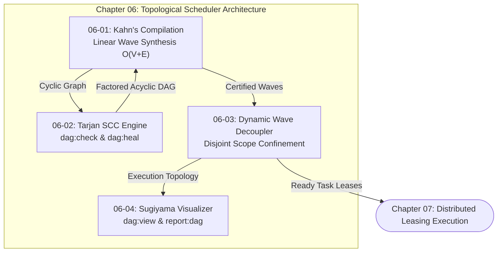

# Chapter 06: Topological Scheduler DAGs

---

[Previous: Chapter 05: Concurrency & Straggler SLA](../05-concurrency-straggler-sla/index.md) | [Chapter Index](index.md) | [All Chapters Index](../index.md) | [Next: 06-01 DAG Compilation & Kahn's Algorithm](06-01-dag-compilation-and-kahns-algorithm.md)

---

## 1. Chapter Overview & Topological Scheduling Foundations

In autonomous multi-agent software engineering systems, task execution cannot proceed ad-hoc or sequentially without inducing catastrophic failure modes. Uncoordinated worker agents execute out of order, read incomplete intermediate types, overwrite shared files concurrently, and stall on circular dependencies.

Chapter 06 formalizes the **Topological Scheduler DAG Subsystem** of the OLT (Orchestrating Long Tasks) engine. The topological scheduler bridges prompt decomposition (Chapter 04) and distributed task leasing (Chapter 07) by converting raw obligation manifests into deterministic, acyclic execution graphs with verified scope isolation.

The subsystem rests on four foundational pillars:

1. **DAG Compilation & Linear Topological Sorting**: Compiling dependency networks into discrete execution waves in strictly linear time ($\mathcal{O}(|V| + |E|)$) using Kahn's algorithm with deterministic tie-breaking.
2. **Linear-Time Cycle Detection & Contract Extraction**: Employing Tarjan's Strongly Connected Components (SCC) algorithm to detect circular dependencies and synthesizing antecedent interface contracts to restore graph acyclicity (`dag:check`, `dag:heal`).
3. **Dynamic Wave Decoupling & Scope Confinement**: Eliminating Bulk Synchronous Parallel (BSP) barrier drag through event-driven task release while mathematically enforcing mutual write scope disjointness ($S_i \cap S_j = \emptyset$).
4. **Sugiyama Layered Graph Drawing & Unified Reporting**: Providing deterministic, compact 4-phase terminal DAG diagrams (`dag:view`, `report:dag`) featuring operational receipt badges (`[I: impl]`, `[V: val]`, `[C: coord]`, `[P: pub]`) for CLI inspection.

```text
+--------------------------------------------------------------------------------------------------+
│                             CHAPTER 06: TOPOLOGICAL SCHEDULER TOPOLOGY                           │
+--------------------------------------------------------------------------------------------------+
│                                                                                                  │
│   From Chapter 04 (Preplanning Obligation Extraction)                                            │
│                 │                                                                                │
│                 ▼                                                                                │
│   ┌───────────────────────────┐                    ┌───────────────────────────┐                 │
│   │ 06-01: DAG Compilation   │                    │ 06-02: Tarjan SCC Cycle   │                 │
│   │ & Kahn's Toposort Waves   │ ══════════════════►│ Detection (dag:heal/check)│                 │
│   └─────────────┬─────────────┘   Cycle Detected   └─────────────┬─────────────┘                 │
│                 │                                                │                               │
│                 │ Acyclic DAG Certified                          │ Interface Contract Factored   │
│                 ▼                                                ▼                               │
│   ┌───────────────────────────┐                    ┌───────────────────────────┐                 │
│   │ 06-03: Dynamic Wave       │                    │ 06-04: Sugiyama Layered   │                 │
│   │ Decoupling & Scope Guard  │ ══════════════════►│ Terminal ASCII (dag:view) │                 │
│   └─────────────┬─────────────┘                    └───────────────────────────┘                 │
│                 │                                                                                │
│                 ▼                                                                                │
│   To Chapter 07 (Distributed Task Leasing & Leases Protocol)                                     │
│                                                                                                  │
+--------------------------------------------------------------------------------------------------+
```

---

## 2. Chapter Table of Contents & Learning Path

```text
+--------------------------------------------------+--------------+--------------------------------+
│ Document                                         │ Classification│ Core Architectural Focus       │
+--------------------------------------------------+--------------+--------------------------------+
│ 06-01 DAG Compilation & Kahn's Algorithm        │ Algorithms   │ Linear-time wave sorting O(V+E)│
│ 06-02 Tarjan SCC Cycle Detection                 │ Graph Theory │ Tarjan lowlinks & dag:heal     │
│ 06-03 Dynamic Wave Decoupling & Scopes           │ Concurrency  │ Scope disjointness & dag:check │
│ 06-04 Sugiyama Layered Layout Engine             │ Visualization│ 4-phase ASCII & report:dag     │
+--------------------------------------------------+--------------+--------------------------------+
```

### [06-01: DAG Compilation & Kahn's Topological Sort Algorithm](06-01-dag-compilation-and-kahns-algorithm.md)

Deconstructs linear-time topological sorting ($\mathcal{O}(|V|+|E|)$), in-degree tracking maps, deterministic priority tie-breaking, and topological wave synthesis ($W_1, \dots, W_K$).

### [06-02: Tarjan's SCC Cycle Detection & Contract Extraction](06-02-tarjan-scc-cycle-detection.md)

Formalizes Tarjan's DFS $\text{dfn}/\text{low}$ traversal, strongly connected component identification ($|\text{SCC}| > 1$), minimum-weight feedback arc set heuristics, and automated TypeScript interface contract factoring via `dag:heal` and `dag:check`.

### [06-03: Dynamic Wave Decoupling & Scope Confinement](06-03-dynamic-wave-decoupling-and-scopes.md)

Analyzes the mathematical elimination of Bulk Synchronous Parallel (BSP) barrier drag, dynamic readiness evaluation $\mathcal{R}(v, t)$, and mutual file write scope disjointness ($S_a \cap S_b = \emptyset$) audited statically via `dag:check`.

### [06-04: Sugiyama Layered Layout Engine & ASCII Visualizer](06-04-sugiyama-layered-layout-engine.md)

Presents the 4-phase Sugiyama layered graph drawing framework (Cycle Inversion, Coffman-Graham Layering, 4-Pass Barycentric Crossing Minimization, and Orthogonal Box-Drawing Routing) for CLI/TUI diagram rendering via `dag:view` and `report:dag`.

---

## 3. Core Graph Formulations & Master Algorithms Matrix

$$
\begin{array}{|l|l|l|l|}
\hline
\textbf{Mechanism} & \textbf{Formal Mathematical Expression} & \textbf{Complexity} & \textbf{Architectural Purpose} \\ \hline
\text{Kahn In-Degree} & \text{deg}^-(v) = |\{ u \in V \mid (u, v) \in E \}| & \mathcal{O}(|V| + |E|) & \text{Roots detection and wave synthesis} \\ \hline
\text{Tarjan Low-Link} & \text{low}(u) = \min(\text{dfn}(u), \min \text{low}(v), \min \text{dfn}(v)) & \mathcal{O}(|V| + |E|) & \text{Linear cycle discovery in DFS stack} \\ \hline
\text{Scope Guard} & \forall T_a, T_b \in \text{Active}(t), \; \text{Scope}(T_a) \cap \text{Scope}(T_b) = \emptyset & \mathcal{O}(1) & \text{Collision-free parallel Git worktrees} \\ \hline
\text{Barycentric Center} & \text{bary}(v) = \frac{1}{|\text{Pred}(v)|} \sum_{u \in \text{Pred}(v)} \text{pos}(u) & \mathcal{O}(|V| \log |V|) & \text{Crossing minimization in terminal diagrams} \\ \hline
\text{Dynamic Readiness} & \mathcal{R}(v, t) \iff \forall u \in \text{Pred}(v), \; \text{Status}(u, t) = \text{COMPLETED} & \mathcal{O}(|\text{Pred}|) & \text{Barrier-free event-driven task release} \\ \hline
\end{array}
$$



---

## 4. Unified Reporting & Decoupled DAG Command Topology

The OLT engine decouples graph analysis and terminal rendering into dedicated CLI commands, backed by mechanical retirement guards:

1. **`dag:check`**: Statically audits task graphs for topological cycles, disconnected subgraphs, scope collisions ($S_a \cap S_b \neq \emptyset$), and unresolvable contract interfaces.
2. **`dag:heal`**: Autonomously remediates cycles by factoring shared TypeScript interfaces (Wave 0 contracts) or computing minimum-weight feedback arc cuts.
3. **`dag:view`**: Directly invokes the Sugiyama 4-phase visualizer to output ASCII/Unicode terminal DAG diagrams.
4. **`report:dag`**: Unified run-level graph inspector integrating Sugiyama diagrams, execution telemetry, and active status badges.
5. **Retired Command Intercepts**: Legacy root `dag` and `run:status` commands are permanently retired. Invocations trigger `[RETIRED_COMMAND]` guards redirecting operators to `report:dag` and `dag:check`.

---

## 5. Global Subsystem Invariants

1. **Deterministic Schedule Reproducibility**: Identical obligation inputs and graph topologies produce identical wave schedules and ASCII terminal layouts across all host architectures.
2. **Zero Uncaught Cycles**: No circular dependency can bypass compilation to reach active subagent worker leasing; cycles are trapped and remediated via `dag:heal`.
3. **Lock-Free Concurrency Safety**: Parallel task execution is permitted only when write scopes are strictly disjoint, guaranteeing zero Git merge conflicts.
4. **Zero Backwards-Compatibility Purity**: Legacy command aliases (`run:status`, root `dag`) are mechanically guarded and rejected; only canonical forward-only commands execute.
5. **Hermetic Zero-Dependency Execution**: All graph sorting, cycle analysis, and ASCII drawing algorithms execute in pure TypeScript without external binary dependencies.

---

## 6. Subsystem Traceability & Cross-Chapter Linkages

The Topological Scheduler serves as the computational backbone connecting preplanning to distributed execution:

- **Upstream Connection ([Chapter 04: Continuous Preplanning Factory](../04-continuous-preplanning-factory/index.md))**: Ingests cryptographic obligations sealed from user prompts ($h_{\text{prompt}}$) and maps obligation clusters into dependency vertices.
- **Span Management ([Chapter 05: Concurrency & Straggler SLA](../05-concurrency-straggler-sla/index.md))**: Applies Brent work-span bounds and Coffman-Graham widths to compute optimal parallel workforce capacity ($P_{\text{opt}}$).
- **Downstream Dispatch ([Chapter 07: Distributed Leasing Execution](../07-distributed-leasing-execution/index.md))**: Hands off dynamically released tasks to worker worktrees via monotonic lease tokens and anti-theft heartbeats.

---

[Previous: Chapter 05: Concurrency & Straggler SLA](../05-concurrency-straggler-sla/index.md) | [Chapter Index](index.md) | [All Chapters Index](../index.md) | [Next: 06-01 DAG Compilation & Kahn's Algorithm](06-01-dag-compilation-and-kahns-algorithm.md)

---
