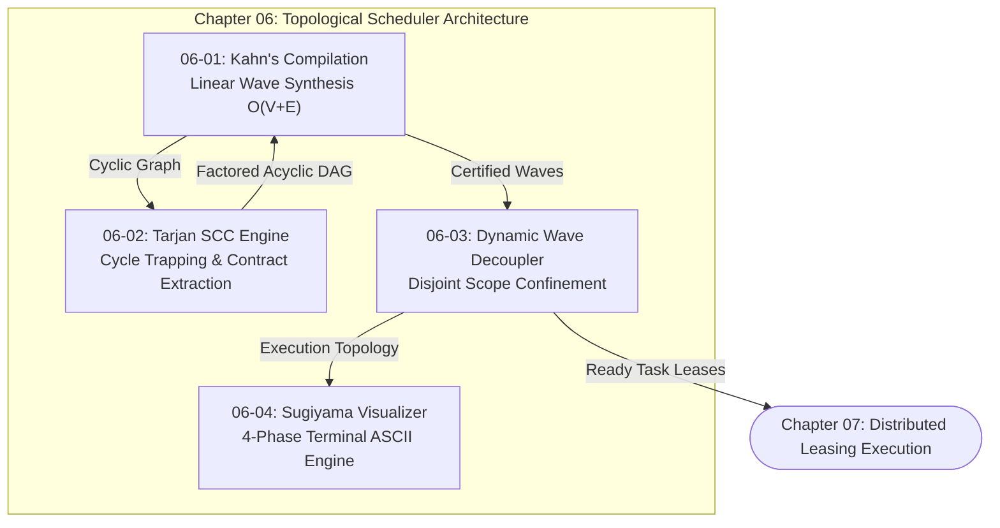

# Chapter 06: Topological Scheduler DAGs

---

[Previous: Chapter 05: Concurrency & Straggler SLA](../05-concurrency-straggler-sla/index.md) | [Chapter Index](index.md) | [All Chapters Index](../index.md) | [Next: 06-01 DAG Compilation & Kahn's Algorithm](06-01-dag-compilation-and-kahns-algorithm.md)

---

## 1. Chapter Overview & Topological Scheduling Foundations

In autonomous multi-agent software engineering systems, task execution cannot proceed ad-hoc or sequentially without inducing catastrophic failure modes. Uncoordinated worker agents execute out of order, read incomplete intermediate types, overwrite shared files concurrently, and stall on circular dependencies.

Chapter 06 formalizes the **Topological Scheduler DAG Subsystem** of the OLT (Orchestrating Long Tasks) engine. The topological scheduler bridges prompt decomposition (Chapter 04) and distributed task leasing (Chapter 07) by converting raw obligation manifests into deterministic, acyclic execution graphs with verified scope isolation.

The subsystem rests on four foundational pillars:

1. **DAG Compilation & Linear Topological Sorting**: Compiling dependency networks into discrete execution waves in strictly linear time ($\mathcal{O}(|V| + |E|)$) using Kahn's algorithm with deterministic tie-breaking.
2. **Linear-Time Cycle Detection & Contract Extraction**: Employing Tarjan's Strongly Connected Components (SCC) algorithm to detect circular dependencies and synthesizing antecedent interface contracts to restore graph acyclicity.
3. **Dynamic Wave Decoupling & Scope Confinement**: Eliminating Bulk Synchronous Parallel (BSP) barrier drag through event-driven task release while mathematically enforcing mutual write scope disjointness ($S_i \cap S_j = \emptyset$).
4. **Sugiyama Layered Graph Drawing & ASCII Visualizer**: Providing deterministic, compact 4-phase terminal DAG diagrams for CLI inspection and automated audit logging.

```text
+--------------------------------------------------------------------------------------------------+
│                             CHAPTER 06: TOPOLOGICAL SCHEDULER TOPOLOGY                           │
+--------------------------------------------------------------------------------------------------+
│                                                                                                  │
│   From Chapter 04 (Preplanning Obligation Extraction)                                            │
│                 │                                                                                │
│                 ▼                                                                                │
│   ┌───────────────────────────┐                    ┌───────────────────────────┐                 │
│   │ 06-01: DAG Compilation   │                    │ 06-02: Tarjan SCC Cycle   │                 │
│   │ & Kahn's Toposort Waves   │ ══════════════════►│ Detection & Edge Cuts     │                 │
│   └─────────────┬─────────────┘   Cycle Detected   └─────────────┬─────────────┘                 │
│                 │                                                │                               │
│                 │ Acyclic DAG Certified                          │ Interface Contract Factored   │
│                 ▼                                                ▼                               │
│   ┌───────────────────────────┐                    ┌───────────────────────────┐                 │
│   │ 06-03: Dynamic Wave       │                    │ 06-04: Sugiyama Layered   │                 │
│   │ Decoupling & Scope Guard  │ ══════════════════►│ Terminal ASCII Visualizer │                 │
│   └─────────────┬─────────────┘                    └───────────────────────────┘                 │
│                 │                                                                                │
│                 ▼                                                                                │
│   To Chapter 07 (Distributed Task Leasing & Leases Protocol)                                     │
│                                                                                                  │
+--------------------------------------------------------------------------------------------------+
```

---

## 2. Chapter Table of Contents & Learning Path

The documents comprising Chapter 06 progress from mathematical compilation through cycle remediation, dynamic execution decoupling, and terminal visualization:

```text
+--------------------------------------------------+--------------+--------------------------------+
│ Document                                         │ Classification│ Core Architectural Focus       │
+--------------------------------------------------+--------------+--------------------------------+
│ 06-01 DAG Compilation & Kahn's Algorithm        │ Algorithms   │ Linear-time wave sorting O(V+E)│
│ 06-02 Tarjan SCC Cycle Detection                 │ Graph Theory │ Tarjan lowlinks & contract cuts│
│ 06-03 Dynamic Wave Decoupling & Scopes           │ Concurrency  │ Scope disjointness & readiness │
│ 06-04 Sugiyama Layered Layout Engine             │ Visualization│ 4-phase ASCII DAG rendering    │
+--------------------------------------------------+--------------+--------------------------------+
```

### [06-01: DAG Compilation & Kahn's Topological Sort Algorithm](06-01-dag-compilation-and-kahns-algorithm.md)

Deconstructs linear-time topological sorting ($\mathcal{O}(|V|+|E|)$), in-degree tracking maps, deterministic priority tie-breaking, and topological wave synthesis ($W_1, \dots, W_K$).

### [06-02: Tarjan's SCC Cycle Detection & Contract Extraction](06-02-tarjan-scc-cycle-detection.md)

Formalizes Tarjan's DFS $\text{dfn}/\text{low}$ traversal, strongly connected component identification ($|\text{SCC}| > 1$), minimum-weight feedback arc set heuristics, and automated TypeScript interface contract factoring.

### [06-03: Dynamic Wave Decoupling & Scope Confinement](06-03-dynamic-wave-decoupling-and-scopes.md)

Analyzes the mathematical elimination of Bulk Synchronous Parallel (BSP) barrier drag, dynamic readiness evaluation $\mathcal{R}(v, t)$, and mutual file write scope disjointness ($S_a \cap S_b = \emptyset$) across isolated Git worktrees.

### [06-04: Sugiyama Layered Layout Engine & ASCII Visualizer](06-04-sugiyama-layered-layout-engine.md)

Presents the 4-phase Sugiyama layered graph drawing framework (Cycle Inversion, Coffman-Graham Layering, 4-Pass Barycentric Crossing Minimization, and Orthogonal Box-Drawing Routing) for CLI/TUI diagram rendering.

---

## 3. Core Graph Formulations & Master Algorithms Matrix

$$
\begin{array}{|l|l|l|l|}
\hline
\textbf{Mechanism} & \textbf{Formal Mathematical Expression} & \textbf{Complexity} & \textbf{Architectural Purpose} \\ \hline
\text{Kahn In-Degree} & \text{deg}^-(v) = |\{ u \in V \mid (u, v) \in E \}| & \mathcal{O}(|V| + |E|) & \text{Roots detection and wave synthesis} \\ \hline
\text{Tarjan Low-Link} & \text{low}(u) = \min(\text{dfn}(u), \min \text{low}(v), \min \text{dfn}(v)) & \mathcal{O}(|V| + |E|) & \text{Linear cycle discovery in DFS stack} \\ \hline
\text{Scope Guard} & \forall T_a, T_b \in \text{Active}(t), \; \text{Scope}(T_a) \cap \text{Scope}(T_b) = \emptyset & \mathcal{O}(1) & \text{Collision-free parallel Git worktrees} \\ \hline
\text{Barycentric Center} & \text{bary}(v) = \frac{1}{|\text{Pred}(v)|} \sum_{u \in \text{Pred}(v)} \text{pos}(u) & \mathcal{O}(|V| \log |V|) & \text{Crossing minimization in terminal diagrams} \\ \hline
\text{Dynamic Readiness} & \mathcal{R}(v, t) \iff \forall u \in \text{Pred}(v), \; \text{Status}(u, t) = \text{COMPLETED} & \mathcal{O}(|\text{Pred}|) & \text{Barrier-free event-driven task release} \\ \hline
\end{array}
$$



---

## 4. Topological Task Lifecycle & State Transitions

Tasks compiled within the topological graph transition through deterministic operational states managed by the orchestrator:

```text
+--------------------------------------------------------------------------------------------------+
│                             TASK SCHEDULING LIFECYCLE STATE MACHINE                              │
+--------------------------------------------------------------------------------------------------+
│                                                                                                  │
│   [ PENDING ] ──► (All Parents Completed & Scope Disjoint) ──► [ READY ]                         │
│                                                                   │                              │
│                                                                   ▼ (Worker Claims Lease)        │
│   [ COMPLETED ] ◄── (Adversarial Gate Pass) ◄── [ VALIDATING ] ◄── [ LEASED / EXECUTING ]        │
│          │                                             │                                         │
│          ▼                                             ▼ (Validation Failure)                    │
│   (Trigger Next Wave)                             [ REPAIR_PENDING ]                             │
│                                                                                                  │
+--------------------------------------------------------------------------------------------------+
```

| Lifecycle State | Transition Trigger                | Verification Invariant                                             |
| :-------------- | :-------------------------------- | :----------------------------------------------------------------- |
| `PENDING`       | Graph ingestion & compilation     | In-degree $\text{deg}^-_t(v) \ge 1$ or uncompleted prerequisites.  |
| `READY`         | $\mathcal{R}(v, t) = \text{TRUE}$ | All direct parents in $\text{Pred}(v)$ possess `COMPLETED` status. |
| `LEASED`        | Tier 2/3 Worker claim             | Monotonic lease token bound to dedicated Git worktree.             |
| `EXECUTING`     | Subagent execution start          | File modifications strictly confined to $\text{WriteScope}(v)$.    |
| `VALIDATING`    | Implementation handoff            | Cognitive validator command locks active (Chapter 08).             |
| `COMPLETED`     | Validation sign-off               | Artifacts sealed with SHA-256 and committed to Merkle ledger.      |

---

## 5. Global Subsystem Invariants

All modules within Chapter 06 strictly adhere to the following system-wide invariants:

1. **Deterministic Schedule Reproducibility**: Identical obligation inputs and graph topologies produce identical wave schedules and ASCII terminal layouts across all host architectures.
2. **Zero Uncaught Cycles**: No circular dependency can bypass compilation to reach active subagent worker leasing.
3. **Lock-Free Concurrency Safety**: Parallel task execution is permitted only when write scopes are strictly disjoint, guaranteeing zero Git merge conflicts.
4. **Hermetic Zero-Dependency Execution**: All graph sorting, cycle analysis, and ASCII drawing algorithms execute in pure TypeScript without external binary dependencies.

---

## 6. Subsystem Traceability & Cross-Chapter Linkages

The Topological Scheduler serves as the computational backbone connecting preplanning to distributed execution:

- **Upstream Connection ([Chapter 04: Continuous Preplanning Factory](../04-continuous-preplanning-factory/index.md))**: Ingests cryptographic obligations sealed from user prompts ($h_{\text{prompt}}$) and maps obligation clusters into dependency vertices.
- **Span Management ([Chapter 05: Concurrency & Straggler SLA](../05-concurrency-straggler-sla/index.md))**: Applies Brent work-span bounds and Coffman-Graham widths to compute optimal parallel workforce capacity ($P_{\text{opt}}$).
- **Downstream Dispatch ([Chapter 07: Distributed Leasing Execution](../07-distributed-leasing-execution/index.md))**: Hands off dynamically released tasks to worker worktrees via monotonic lease tokens and anti-theft heartbeats.

---

## 7. Transition to Chapter 07

With dependency topology compiled, verified acyclic, and dynamically decoupled into scope-safe tasks, the orchestrator advances to runtime worker allocation and distributed lease management.

Proceed to the first topic in this chapter: [06-01: DAG Compilation & Kahn's Topological Sort Algorithm](06-01-dag-compilation-and-kahns-algorithm.md), or advance directly to [Chapter 07: Distributed Leasing Execution](../07-distributed-leasing-execution/index.md).

---

[Previous: Chapter 05: Concurrency & Straggler SLA](../05-concurrency-straggler-sla/index.md) | [Chapter Index](index.md) | [All Chapters Index](../index.md) | [Next: 06-01 DAG Compilation & Kahn's Algorithm](06-01-dag-compilation-and-kahns-algorithm.md)

---
