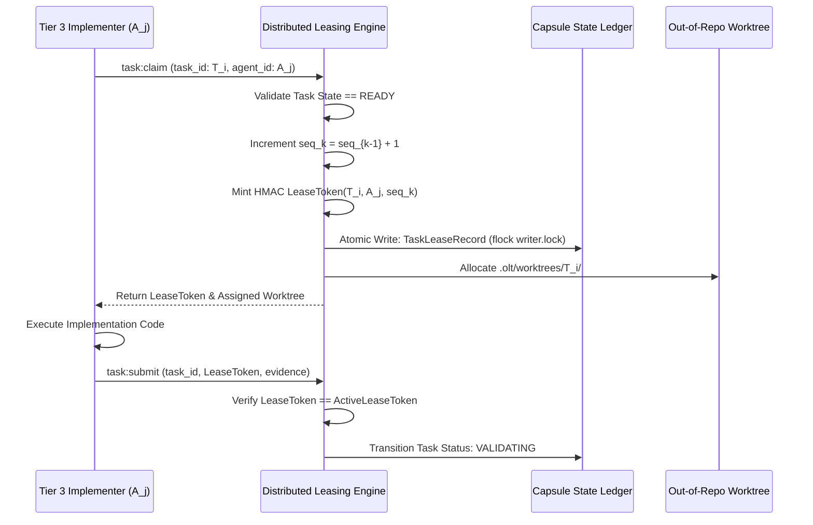

# Monotonic Lease Protocol & Cryptographic Tokens

---

[Previous: Chapter 07 Index](index.md) | [Chapter Index](index.md) | [All Chapters Index](../index.md) | [Next: 07-02 Heartbeats & Anti-Theft Locking](07-02-heartbeats-and-anti-theft-locking.md)
---

## 1. Executive Summary & The Split-Brain Threat

In distributed multi-agent architectures where multiple worker subagents execute concurrently across isolated worktrees, uncoordinated writes lead to catastrophic **split-brain hazards**:

- Two workers concurrently claim the same task ID and overwrite each other's changes.
- A slow worker whose lease timed out wakes up and attempts to commit stale code over a newly assigned worker's commits.
- Torn transaction records corrupt the central capsule state.

The **OLT (Orchestrating Long Tasks)** engine implements the **Monotonic Lease Protocol & Cryptographic Fencing Tokens**. Under this architecture:

1. **Monotonic Sequence Progression**: Every task lease is stamped with a strictly increasing integer sequence number $\text{seq}_k > \text{seq}_{k-1}$.
2. **HMAC Cryptographic Tokens**: Lease tokens are cryptographically signed HMAC strings bound to the task ID, agent identifier, timestamp, and sequence number.
3. **Fencing Token Invalidation**: When a lease is re-assigned, its previous sequence number is superseded; any subsequent write carrying an older token is rejected fail-closed.

```text
┌──────────────────────────────────────────────────────────────────────────────────────────────────┐
│                                 MONOTONIC LEASE PROTOCOL LIFECYCLE                               │
├──────────────────────────────────────────────────────────────────────────────────────────────────┤
│                                                                                                  │
│   ┌──────────────────────┐         ┌──────────────────────┐         ┌──────────────────────┐     │
│   │ Ready Task in Queue  │  ───►   │ Atomic Lease Minting │  ───►   │ Exclusive Execution  │     │
│   │ (Status: READY)      │         │ (HMAC Token + seq_k) │         │ (Worktree Isolation) │     │
│   └──────────────────────┘         └──────────────────────┘         └──────────────────────┘     │
│              ▲                                                                 │                 │
│              │                                                                 ▼                 │
│      [Lease Revocation]           ◄─────────────────────────────────── [Dual-Channel Verify]    │
│      (seq_{k+1} Minted)                                                [or Task Completion]      │
│                                                                                                  │
└──────────────────────────────────────────────────────────────────────────────────────────────────┘
```

---

## 2. Mathematical Formalization of Cryptographic Lease Tokens

Let $K_{\text{capsule}}$ denote the ephemeral secret key generated at capsule initialization.

Let $T_i$ be the target task ID, $A_j$ be the claiming worker agent identifier, $\tau_{\text{claim}}$ be the Unix timestamp, and $\text{seq}_k$ be the monotonic sequence counter.

The **Cryptographic Lease Token** $\mathcal{L}_{\text{token}}$ is computed as:

$$\mathcal{L}_{\text{token}}(T_i, A_j, \text{seq}_k) = \text{HMAC}_{\text{SHA256}}\Big( K_{\text{capsule}}, \quad T_i \mathbin{\Vert} A_j \mathbin{\Vert} \tau_{\text{claim}} \mathbin{\Vert} \text{seq}_k \Big)$$

```typescript
export interface TaskLeaseRecord {
  readonly taskId: string;
  readonly leaseHolder: string; // Canonical Agent Identifier
  readonly leaseSequence: number; // Strictly Monotonic Integer
  readonly leaseToken: string; // HMAC SHA-256 Digest
  readonly issuedAt: string;
  readonly expiresAt: string; // issuedAt + 300s SLA
  readonly status: "LEASED" | "VALIDATING" | "COMPLETED" | "REVOKED";
}
```



---

## 3. Fencing Token Mechanics & Split-Brain Invalidation

Consider a scenario where Worker 1 stalls due to network lag. The watchdog expires Worker 1's lease at $t = 300\text{s}$ and re-assigns the task to Worker 2:

$$\text{Lease}_1 = \langle T_i, \; A_1, \; \text{seq} = 1, \; \text{Token}_1 \rangle \quad \xrightarrow{\text{Watchdog Revoke}} \quad \text{Lease}_2 = \langle T_i, \; A_2, \; \text{seq} = 2, \; \text{Token}_2 \rangle$$

When Worker 1 suddenly awakens and attempts to commit changes with $\text{Token}_1$:

$$\text{ValidateWrite}(\text{Token}_1) = \Big( \text{Token}_1 \stackrel{?}{=} \text{ActiveLease}(T_i).\text{leaseToken} \Big) \implies \text{FALSE} \quad (\text{seq } 1 < 2)$$

The write is rejected immediately with error `STALE_LEASE_TOKEN_REJECTED`, protecting the repository from torn writes.

---

## 4. Integration with POSIX Advisory Locking

All lease issuance, renewal, and release operations must acquire exclusive POSIX advisory file locks on `.olt/capsules/<slug>/locks/writer.lock` ([`lock.ts`](file:///Users/onurseckinsenoglu/repos/skills/olt/scripts/src/engine/store/lock.ts)):

```typescript
export async function withWriterLock<T>(capsuleDir: string, fn: () => Promise<T>): Promise<T> {
  const lockPath = join(capsuleDir, "locks", "writer.lock");
  // Acquire POSIX flock exclusive lock ...
}
```

---

## 5. Architectural Invariants Summary

1. **Monotonic Progression**: Lease sequence numbers $\text{seq}_k$ strictly increase, rendering zombie writes impossible.
2. **Cryptographic Integrity**: Lease tokens cannot be forged or transferred between workers.
3. **Atomic Mutual Exclusion**: Lease state transitions execute under exclusive POSIX advisory file locks.

---

[Previous: Chapter 07 Index](index.md) | [Chapter Index](index.md) | [All Chapters Index](../index.md) | [Next: 07-02 Heartbeats & Anti-Theft Locking](07-02-heartbeats-and-anti-theft-locking.md)
---
