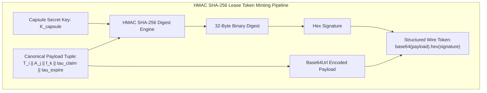
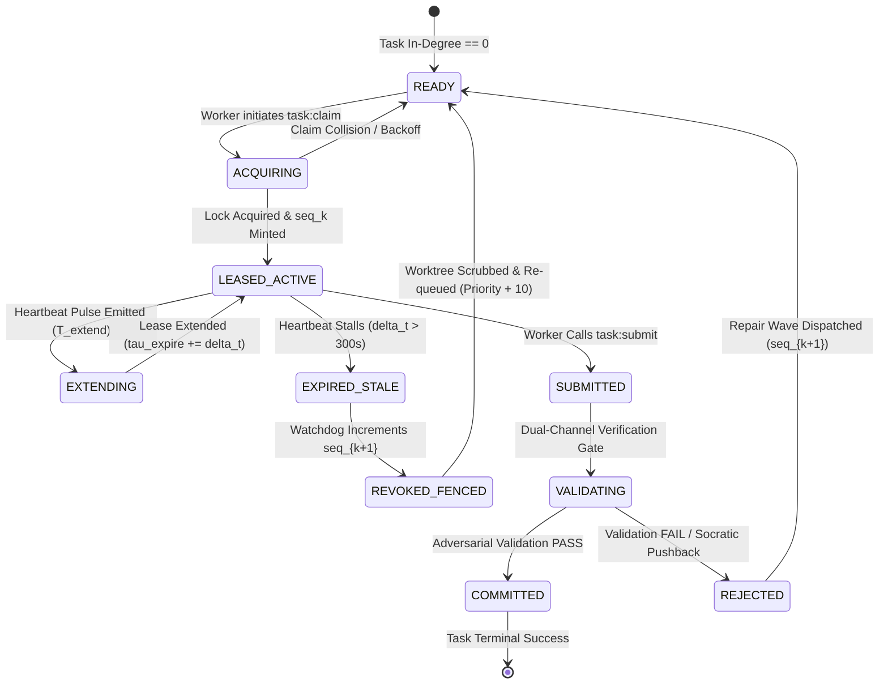

# Monotonic Lease Protocol & Cryptographic Tokens

---

[Previous: Chapter 07: Distributed Leasing Execution](index.md) | [Chapter Index](index.md) | [All Chapters Index](../index.md) | [Next: 07-02 Heartbeats & Anti-Theft Locking](07-02-heartbeats-and-anti-theft-locking.md)

---

## 1. Executive Summary & The Split-Brain Concurrency Threat

In distributed multi-agent autonomous engineering architectures, concurrent worker agents execute tasks across parallel execution lanes. Without rigorous distributed coordination, asynchronous delays, prolonged Large Language Model (LLM) inference cycles, host process stalls, and transient network partitions induce catastrophic **split-brain anomalies**:

1. **Dual-Writer Corruption**: Two worker agents concurrently believe they own the exclusive right to execute task $T_i$, simultaneously editing identical subsystems and generating conflicting or corrupted commits.
2. **Zombie Write Inversion**: A worker agent whose execution was delayed past its lease expiration awakens and attempts to commit stale code over newly committed changes from a successor agent.
3. **Torn Transaction Records**: Uncoordinated state updates bypass atomic boundaries, corrupting the central capsule state ledger (`state.json`) and invalidating dependency tracking across the DAG.

```text
+--------------------------------------------------------------------------------------------------+
|                            THE SPLIT-BRAIN CONCURRENCY HAZARD IN AGENT FLEETS                    |
+--------------------------------------------------------------------------------------------------+
|                                                                                                  |
|   Worker A_1 (Lease seq=1)               Scheduler / State Ledger             Worker A_2 (Lease seq=2)
|   ========================               ========================             ========================
|              |                                      |                                    |
|   [Claim Task T_i (seq=1)] ────────────────────────>│                                    |
|   [Executes AST Refactoring]                        │                                    |
|   [LLM Inference Stalls > 300s]                     │                                    |
|              :                           (Lease 1 Expires)                               |
|              :                           (Watchdog Revokes)                              |
|              :                                      │<─────────────────────── [Claim Task T_i (seq=2)]
|              :                                      │                         [Executes Clean Refactor]
|              :                                      │<─────────────────────── [Commit & Submit T_i]
|              :                                      │                         [Status -> VALIDATING]
|              :                                      │                                    |
|   [Stalled A_1 Awakens!]                            │                                    |
|   [Attempts Stale Write with seq=1] ───────────────>│                                    |
|                                                     │                                    |
|             WITHOUT FENCING: Stale Write Overwrites Valid Work (DATA LOSS & SPLIT-BRAIN)         |
|             WITH FENCING:    seq=1 < seq=2 -> HARD REJECT (FAIL-CLOSED INTEGRITY)                |
|                                                                                                  |
+--------------------------------------------------------------------------------------------------+
```

To eliminate distributed write hazards with mathematical finality, the **OLT (Orchestrating Long Tasks)** engine implements the **Monotonic Lease Protocol & Cryptographically Signed Fencing Tokens**. Every task claim requires minting a verifiable, strictly increasing sequence token that fences out stale writes at every storage and state boundary.

---

## 2. Formal Theory of Monotonic Fencing Tokens

The OLT leasing engine generalizes the Martin Kleppmann Fencing Token Principle into an asymmetric multi-agent execution context. A fencing token is a strictly monotonically increasing integer counter $f_k \in \mathbb{N}^+$ paired with an unforgeable cryptographic message authentication code.

### 2.1 Monotonicity Relation

Let $\mathcal{F} = \langle f_1, f_2, \dots, f_k \rangle$ be the historical sequence of fencing tokens issued for task $T_i$. The sequence satisfies strict monotonicity:

$$f_{k+1} > f_k \quad \forall k \ge 1, \qquad f_k \in \mathbb{N}^+$$

Under the standard OLT increment policy, progression is linear:

$$f_{k+1} = f_k + 1$$

### 2.2 Storage Gatekeeper Fencing Invariant

Let $f_{\text{active}}(T_i)$ denote the fencing token currently recorded in the authoritative capsule ledger. When an agent submits a state transition, code commit, or artifact bundle carrying fencing token $f_{\text{req}}$:

$$\text{ValidateWrite}(T_i, f_{\text{req}}) = \begin{cases} \text{PERMIT} & \text{if } f_{\text{req}} = f_{\text{active}}(T_i) \land \text{Now}() \le \tau_{\text{expire}} \\ \text{FAIL\_CLOSED} & \text{if } f_{\text{req}} < f_{\text{active}}(T_i) \lor \text{Now}() > \tau_{\text{expire}} \end{cases}$$

Any write request presenting $f_{\text{req}} < f_{\text{active}}(T_i)$ is rejected unconditionally with error `STALE_LEASE_FENCING_TOKEN_REJECTED`. The storage boundary acts as a deterministic linearizer: regardless of network latency, thread preemption, or subagent resurrection, older operations cannot mutate current state.

```text
+--------------------------------------------------------------------------------------------------+
|                            FENCING TOKEN MONOTONIC WRITE INVARIANT                               |
+--------------------------------------------------------------------------------------------------+
|                                                                                                  |
|   Storage Fencing Register: f_active(T_i) = 4                                                    |
|                                                                                                  |
|   Incoming Write 1: f_req = 4, Time <= tau_expire  ──► [ MATCH == 4 ] ──► ACCEPT & COMMIT       |
|   Incoming Write 2: f_req = 3 (Zombie Worker)     ──► [ 3 < 4 ]       ──► HARD REJECT (FENCED)   |
|   Incoming Write 3: f_req = 2 (Stale Subagent)    ──► [ 2 < 4 ]       ──► HARD REJECT (FENCED)   |
|   Incoming Write 4: f_req = 4, Time > tau_expire   ──► [ TIMEOUT ]     ──► REJECT (LEASE EXPIRED) |
|                                                                                                  |
+--------------------------------------------------------------------------------------------------+
```

---

## 3. Cryptographic HMAC Token Architecture

To prevent token forgery, impersonation, or replay attacks across distinct execution capsules, lease tokens are cryptographically signed using keyed-hash message authentication codes (HMAC SHA-256).

### 3.1 Mathematical Formulation of HMAC Lease Tokens

Let $K_{\text{capsule}} \in \{0, 1\}^{256}$ be the cryptographically secure pseudo-random key generated during capsule initialization (`capsule:init`).

Let $T_i$ be the unique task identifier, $A_j$ be the canonical agent identifier, $\tau_{\text{claim}}$ be the Unix epoch timestamp of issuance, $\tau_{\text{expire}}$ be the absolute expiration timestamp, and $f_k$ be the monotonic fencing sequence.

The **Lease Token Payload** $\mathcal{P}_{\text{lease}}$ is defined as the canonical tuple:

$$\mathcal{P}_{\text{lease}}(T_i, A_j, f_k, \tau_{\text{claim}}, \tau_{\text{expire}}) = T_i \mathbin{\Vert} A_j \mathbin{\Vert} f_k \mathbin{\Vert} \tau_{\text{claim}} \mathbin{\Vert} \tau_{\text{expire}}$$

The **Cryptographic Lease Token** $\mathcal{L}_{\text{token}}$ is computed as:

$$\mathcal{L}_{\text{token}} = \text{HMAC}_{\text{SHA256}}\Big( K_{\text{capsule}}, \quad \mathcal{P}_{\text{lease}}(T_i, A_j, f_k, \tau_{\text{claim}}, \tau_{\text{expire}}) \Big)$$

The full wire token presented by workers during task submission is the base64url-encoded serialization of the payload and signature:

$$\text{WireToken} = \text{Base64Url}(\mathcal{P}_{\text{lease}}) \mathbin{\Vert} \texttt{"."} \mathbin{\Vert} \text{Hex}(\mathcal{L}_{\text{token}})$$



---

## 4. High-Density Lease Lifecycle State Machine

A task lease transitions through a deterministic finite state machine governed by monotonic sequence progression, heartbeat pulses, and verification gates.



### 4.1 Detailed Lease State Descriptions

| Lease State      | Permitted Operations             | Fencing Guard                                                   | Next Transition                                 |
| :--------------- | :------------------------------- | :-------------------------------------------------------------- | :---------------------------------------------- |
| `READY`          | `task:claim`                     | $f_k = f_{\text{last}} + 1$                                     | $\to$ `ACQUIRING`                               |
| `ACQUIRING`      | Internal state lock              | Writer `flock` active                                           | $\to$ `LEASED_ACTIVE` or `READY`                |
| `LEASED_ACTIVE`  | Worktree edits, Heartbeat pulses | $f_{\text{req}} = f_k$, $\text{Now}() \le \tau_{\text{expire}}$ | $\to$ `EXTENDING`, `SUBMITTED`, `EXPIRED_STALE` |
| `EXTENDING`      | Heartbeat timestamp write        | $f_{\text{req}} = f_k$, non-blocking I/O                        | $\to$ `LEASED_ACTIVE`                           |
| `EXPIRED_STALE`  | None (worker isolated)           | Lease expired ($\Delta t > 300\,\text{s}$)                      | $\to$ `REVOKED_FENCED`                          |
| `REVOKED_FENCED` | Worktree purge, PID termination  | Stale token rejected ($f_k < f_{k+1}$)                          | $\to$ `READY` (Re-queue)                        |
| `SUBMITTED`      | Verification payload upload      | Token validated against active lease                            | $\to$ `VALIDATING`                              |
| `VALIDATING`     | Read-only test execution         | Write lock locked                                               | $\to$ `COMMITTED` or `REJECTED`                 |
| `COMMITTED`      | Upstream DAG propagation         | Fencing register closed                                         | Terminal state                                  |

---

## 5. Lease Acquisition ($T_{\text{acquire}}$) & Extension ($T_{\text{extend}}$) Protocol Mechanics

Lease operations execute under strict POSIX advisory locking semantics to eliminate race conditions between concurrent worker threads on the host filesystem.

### 5.1 Lease Acquisition Protocol ($T_{\text{acquire}}$)

When worker $A_j$ attempts to acquire a lease on task $T_i$:

1. **Advisory Lock Acquisition**: Acquire exclusive POSIX advisory lock `flock(LOCK_EX)` on `.olt/capsules/<slug>/locks/writer.lock`.
2. **Task State Verification**: Inspect authoritative ledger `state.json`. Assert $\text{Status}(T_i) = \texttt{"READY"}$.
3. **Monotonic Counter Increment**: Compute new sequence number $f_k = f_{\text{current}}(T_i) + 1$.
4. **Token Minting**: Generate cryptographic signature $\mathcal{L}_{\text{token}}$ using capsule secret $K_{\text{capsule}}$.
5. **Worktree Allocation**: Provision isolated git worktree at `.olt/worktrees/<task_id>/` branched from verified target ref.
6. **State Mutation**: Commit `TaskLeaseRecord` into `state.json`, record event `LEASE_ACQUIRED` in `events.jsonl`, and release POSIX `writer.lock`.

```text
+--------------------------------------------------------------------------------------------------+
|                            ATOMIC LEASE ACQUISITION PROTOCOL (T_acquire)                         |
+--------------------------------------------------------------------------------------------------+
|                                                                                                  |
|   Worker A_j                     POSIX writer.lock        Capsule Ledger          Git Worktree   |
|   ==========                     =================        ==============          ============   |
|       |                                  |                      |                       |        |
|   1. task:claim(T_i) ───────────────────>|                      |                       |        |
|       |                           [Acquire LOCK_EX]             |                       |        |
|       |                                  |                      |                       |        |
|   2. Check Status & In-Degree ───────────┼─────────────────────>|                       |        |
|       |                                  |              [Status == READY]               |        |
|       |                                  |                      |                       |        |
|   3. Increment Sequence f_{k+1} = f_k + 1┼─────────────────────>|                       |        |
|       |                                  |                      |                       |        |
|   4. Mint HMAC Token L_token ────────────┼─────────────────────>|                       |        |
|       |                                  |                      |                       |        |
|   5. Allocate Worktree ──────────────────┼──────────────────────┼──────────────────────>|        |
|       |                                  |                      |               [git worktree add]
|       |                                  |                      |                       |        |
|   6. Write Record & Release Lock ───────>|                      |                       |        |
|       |                           [Release LOCK_UN]             |                       |        |
|   7. Return { LeaseToken, WorktreePath } |                      |                       |        |
|       |                                  |                      |                       |        |
+--------------------------------------------------------------------------------------------------+
```

### 5.2 Lease Extension Protocol ($T_{\text{extend}}$)

To avoid global writer lock thrashing during long-running tasks, lease extensions bypass `state.json` updates and write directly to the worker's private heartbeat mailbox:

$$T_{\text{extend}}: \quad \tau_{\text{expire}} \leftarrow \text{Now}() + \text{TTL}_{\text{lease}} \qquad (\text{TTL}_{\text{lease}} = 300\,\text{s})$$

The worker writes its updated timestamp into `.olt/capsules/<slug>/mailbox/<agent_id>/heartbeat.json`. The Autonomic Watchdog reads this private file lock-free, updating the effective lease window dynamically.

---

## 6. TypeScript Lease Contracts & Runtime Interfaces

The TypeScript contracts governing lease records, tokens, and verification gatekeepers are defined in the leasing engine runtime specification (see [Chapter 15: State JSON & Mailbox Schemas](../15-state-schemas-and-event-ledger/15-04-state-json-and-mailbox-schemas.md)):

```typescript
/**
 * Canonical Task Lease Record stored in Capsule State Ledger
 */
export interface TaskLeaseRecord {
  readonly taskId: string;
  readonly leaseHolder: string; // Canonical Agent Identifier (e.g. implementer_core_01)
  readonly fencingToken: number; // Strictly Monotonic Integer (f_k)
  readonly leaseToken: string; // HMAC SHA-256 Hex Digest
  readonly issuedAt: string; // ISO 8601 Timestamp
  readonly expiresAt: string; // ISO 8601 Timestamp (issuedAt + TTL)
  readonly heartbeatIntervalSeconds: number; // Standard: 30s
  readonly maxTtlSeconds: number; // Standard SLA: 300s
  readonly worktreePath: string; // Isolated worktree path
  readonly status: TaskLeaseStatus;
}

export type TaskLeaseStatus =
  | "READY"
  | "ACQUIRING"
  | "LEASED_ACTIVE"
  | "EXTENDING"
  | "EXPIRED_STALE"
  | "REVOKED_FENCED"
  | "SUBMITTED"
  | "VALIDATING"
  | "COMMITTED";

export interface FencingVerificationResult {
  readonly valid: boolean;
  readonly activeToken: number;
  readonly presentedToken: number;
  readonly errorCode?: "TOKEN_FENCED" | "TOKEN_EXPIRED" | "SIGNATURE_INVALID" | "HOLDER_MISMATCH";
  readonly details: string;
}

/**
 * Validates an incoming write request against active fencing token and lease signature
 */
export function verifyFencingToken(
  activeRecord: TaskLeaseRecord,
  presentedFencingToken: number,
  presentedSignature: string,
  capsuleSecretKey: string,
  currentTimeMs: number = Date.now(),
): FencingVerificationResult {
  // 1. Monotonic Fencing Check
  if (presentedFencingToken < activeRecord.fencingToken) {
    return {
      valid: false,
      activeToken: activeRecord.fencingToken,
      presentedToken: presentedFencingToken,
      errorCode: "TOKEN_FENCED",
      details: `Write rejected: Presented fencing token ${presentedFencingToken} is superseded by active token ${activeRecord.fencingToken}.`,
    };
  }

  // 2. Lease Expiration Check
  const expirationMs = new Date(activeRecord.expiresAt).getTime();
  if (currentTimeMs > expirationMs) {
    return {
      valid: false,
      activeToken: activeRecord.fencingToken,
      presentedToken: presentedFencingToken,
      errorCode: "TOKEN_EXPIRED",
      details: `Write rejected: Lease expired at ${activeRecord.expiresAt} (Current time: ${new Date(currentTimeMs).toISOString()}).`,
    };
  }

  // 3. Cryptographic Signature Verification
  const expectedPayload = `${activeRecord.taskId}:${activeRecord.leaseHolder}:${presentedFencingToken}:${activeRecord.issuedAt}:${activeRecord.expiresAt}`;
  const computedSignature = computeHmacSha256(capsuleSecretKey, expectedPayload);

  if (computedSignature !== presentedSignature) {
    return {
      valid: false,
      activeToken: activeRecord.fencingToken,
      presentedToken: presentedFencingToken,
      errorCode: "SIGNATURE_INVALID",
      details: "Write rejected: Cryptographic lease token signature is invalid or forged.",
    };
  }

  return {
    valid: true,
    activeToken: activeRecord.fencingToken,
    presentedToken: presentedFencingToken,
    details: "Fencing token and cryptographic signature successfully verified.",
  };
}

function computeHmacSha256(secret: string, payload: string): string {
  const { createHmac } = require("crypto");
  return createHmac("sha256", secret).update(payload).digest("hex");
}
```

---

## 7. Anti-Theft Failure Matrix & Edge Cases

The following matrix itemizes adversarial edge cases, concurrency hazards, and the deterministic mechanisms employed by the OLT leasing engine to guarantee safety:

| Failure Scenario               | Trigger Mechanism                                              | Naive System Behavior                                     | OLT Fencing Defense                                                                        | Error Code                           |
| :----------------------------- | :------------------------------------------------------------- | :-------------------------------------------------------- | :----------------------------------------------------------------------------------------- | :----------------------------------- |
| **Worker Inference Hang**      | LLM inference takes 320s ($> 300\text{s}$ SLA)                 | Stale worker wakes up and overwrites new worker's commits | Stale write carrying $f_k$ rejected because active sequence is now $f_{k+1}$               | `STALE_LEASE_FENCING_TOKEN_REJECTED` |
| **Simultaneous Claim Race**    | Two workers call `task:claim` on $T_i$ at same millisecond     | Both workers acquire lease and mutate same branch         | Serialized via exclusive POSIX `writer.lock`; second worker receives `TASK_ALREADY_LEASED` | `TASK_ALREADY_LEASED`                |
| **Token Forgery**              | Compromised agent crafts synthetic lease token                 | Illegitimate worker injects arbitrary code changes        | HMAC SHA-256 validation against capsule secret $K_{\text{capsule}}$ fails                  | `LEASE_SIGNATURE_INVALID`            |
| **Token Replay Attack**        | Worker re-submits previously valid token after task completion | Validated task mutated post-verification                  | Fencing sequence for completed tasks is sealed; status is `COMMITTED`                      | `TASK_ALREADY_COMPLETED`             |
| **Host Clock Step Backward**   | Host NTP sync steps clock backward by 120s                     | Expired leases appear valid, causing duplicate runs       | Ephemeral monotonic process clock checks prevent artificial lease extension                | `CLOCK_SKEW_DETECTED`                |
| **Orphaned Subagent Worktree** | Subagent process killed mid-edit                               | Dirty uncommitted files pollute next worker run           | Watchdog executes `git clean -fdx` and `git reset --hard` before re-queueing               | `WORKTREE_PURGED`                    |

---

## 8. Architectural Invariants Summary

Every deployment of the OLT Distributed Leasing Protocol must enforce the following four non-negotiable invariants:

1. **Strict Fencing Monotonicity**: Fencing sequences strictly advance ($f_{k+1} > f_k$) on every lease issuance, revocation, or re-assignment.
2. **Cryptographic Unforgeability**: Lease tokens must be cryptographically signed with HMAC SHA-256 bound to capsule secret $K_{\text{capsule}}$, task ID, agent ID, and expiration timestamps.
3. **Atomic Mutual Exclusion**: All state mutations affecting task lease ownership must execute under exclusive POSIX advisory file locks (`writer.lock`).
4. **Fail-Closed Write Rejection**: Any storage, commit, or state transition request presenting an outdated fencing token ($f_{\text{req}} < f_{\text{active}}$) is rejected immediately and unconditionally.

---

[Previous: Chapter 07: Distributed Leasing Execution](index.md) | [Chapter Index](index.md) | [All Chapters Index](../index.md) | [Next: 07-02 Heartbeats & Anti-Theft Locking](07-02-heartbeats-and-anti-theft-locking.md)

---
