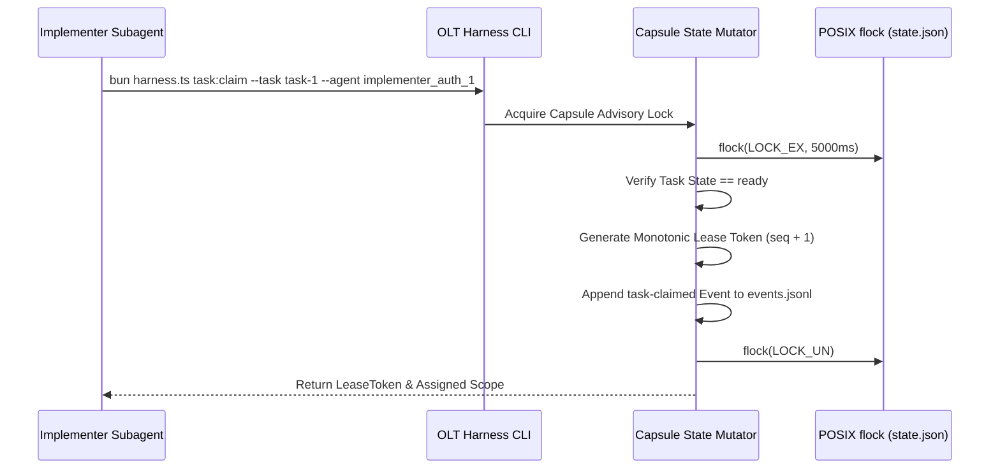

# Monotonic Lease Protocol & Bearer Tokens

[OLT Documentation Hub](../../README.md) > [Architecture Index](../index.md) > [Chapter 07](./index.md) > 07-01 Monotonic Lease Protocol

---

[⏮️ Previous: Chapter 07: Distributed Leasing & Execution Overview](index.md) | [📂 Chapter Index](index.md) | [📚 All Chapters Index](../index.md) | [⏭️ Next: 07-02 Heartbeats & Anti-Theft Locking](07-02-heartbeats-and-anti-theft-locking.md)
---

## 1. Task Claim Mechanics (`task:claim`)

A worker cannot begin modifying code without acquiring an exclusive lease from the capsule state mutator.

---

## 2. Monotonic Token Formula

$$\text{LeaseToken} = \text{HMAC}_{\text{secret}}(\text{task\_id} \mathbin{\Vert} \text{agent\_id} \mathbin{\Vert} \text{lease\_seq} \mathbin{\Vert} \text{issued\_at})$$

When the worker submits completed work via `task:submit`, it must present the exact `LeaseToken`. If a watchdog revoked the lease due to inactivity, the submission is rejected with `INVALID_LEASE_TOKEN`.

---

[⏮️ Previous: Chapter 07: Distributed Leasing & Execution Overview](index.md) | [📂 Chapter Index](index.md) | [📚 All Chapters Index](../index.md) | [⏭️ Next: 07-02 Heartbeats & Anti-Theft Locking](07-02-heartbeats-and-anti-theft-locking.md)
---
