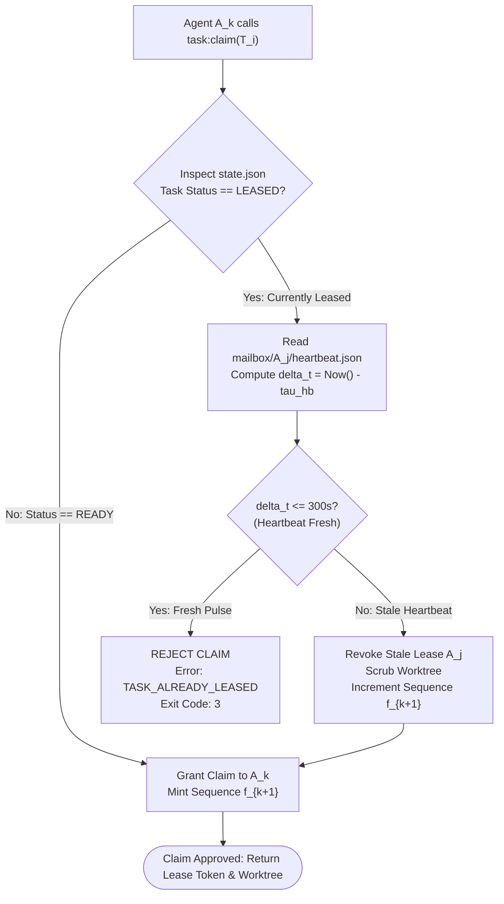

# Heartbeats & Anti-Theft Task Locking

---

[Previous: 07-01 Monotonic Lease Protocol & Tokens](07-01-monotonic-lease-protocol-and-tokens.md) | [Chapter Index](index.md) | [All Chapters Index](../index.md) | [Next: 07-03 Stale Worker & Zombie Auto-Recovery](07-03-stale-worker-and-zombie-auto-recovery.md)

---

## 1. Executive Summary & The Dual Pitfall: Premature Eviction vs. Pipeline Stalling

In distributed multi-agent task execution, autonomous schedulers face a fundamental concurrency dilemma:

1. **The Premature Eviction Hazard (Lease Theft)**: If the scheduler evicts a seemingly silent worker too quickly, an active worker performing a CPU-intensive compilation or deep LLM inference cycle is stripped of its lease. A rival worker claims the same task, resulting in duplicate execution, conflicting file mutations, and split-brain race conditions.
2. **The Pipeline Stalling Hazard (Zombie Lockup)**: If the scheduler waits too long to evict a failed worker, a hung process, disconnected subagent, or deadlocked subprocess holds an exclusive lock indefinitely, stalling all downstream dependencies along the DAG critical path.

```text
+--------------------------------------------------------------------------------------------------+
|                            THE LEASE RECLAMATION TUNING TRADEOFF                                 |
+--------------------------------------------------------------------------------------------------+
|                                                                                                  |
|   Premature Eviction (TTL < 30s)                    Optimal Window (30s - 300s)     Stalling (TTL > 300s)
|   ------------------------------                    ---------------------------     ---------------------
|   * High risk of lease theft                        * Regular heartbeats (30s)      * Zombie workers hang
|   * Duplicate worker execution                      * 10 missed pulses = stale      * DAG execution blocked
|   * Split-brain repository writes                   * Anti-theft locks active       * Span time explodes
|   * CPU & token budget waste                        * Fail-closed protection        * Manual operator needed
|                                                                                                  |
+--------------------------------------------------------------------------------------------------+
```

The **OLT (Orchestrating Long Tasks)** engine resolves this tradeoff through **Ephemeral Heartbeat Protocols & Anti-Theft Advisory Locking**. Active workers emit lightweight, non-blocking telemetry heartbeats at fixed 30-second intervals ($T_{\text{heartbeat}} = 30\,\text{s}$). Schedulers enforce a strict anti-theft invariant: any task with a fresh heartbeat timestamp cannot be claimed, re-assigned, or stolen by any other agent.

---

## 2. Ephemeral Heartbeat Protocol Mechanics

To prevent lock contention on the central capsule ledger (`state.json`), heartbeats are completely decoupled from shared write locks. Each subagent writes exclusively to its dedicated, isolated mailbox file on the host filesystem:

$$\text{Path: } \texttt{.olt/capsules/<slug>/mailbox/<agent_id>/heartbeat.json}$$

### 2.1 Periodic Pulse Timing & Jitter

Workers execute a non-blocking background heartbeat emitter running at interval $T_{\text{heartbeat}}$ with randomized jitter $\delta_j$ to prevent synchronized I/O bursts across dense worker waves:

$$T_{\text{interval}} = T_{\text{heartbeat}} + \delta_j, \qquad T_{\text{heartbeat}} = 30\,\text{s}, \quad \delta_j \sim \mathcal{U}(0, 2\,\text{s})$$

The heartbeat operation performs an atomic single-file write (`fs.writeFile` via temp file rename) into the worker's private directory. The write operation takes $< 1\,\text{ms}$ and requires zero coordination with other executing subagents.

```text
+--------------------------------------------------------------------------------------------------+
|                               NON-BLOCKING HEARTBEAT EMISSION TOPOLOGY                           |
+--------------------------------------------------------------------------------------------------+
|                                                                                                  |
|   Worker Agent 1 (implementer_01) ──► Write [heartbeat.json] in mailbox/implementer_01/ (Lock-Free)
|   Worker Agent 2 (implementer_02) ──► Write [heartbeat.json] in mailbox/implementer_02/ (Lock-Free)
|   Worker Agent 3 (validator_01)   ──► Write [heartbeat.json] in mailbox/validator_01/   (Lock-Free)
|                                                                                                  |
|                                            ▲                                                     |
|                                            │ Non-Blocking Periodic Scans (Every 10s)             |
|                                            │                                                     |
|                                Autonomic Watchdog Sensor                                         |
|                                            │                                                     |
|                                            ▼                                                     |
|                           [Evaluates Anti-Theft Predicate]                                       |
|                                                                                                  |
+--------------------------------------------------------------------------------------------------+
```

---

## 3. Mathematical Formalization of Anti-Theft Verification Predicates

Let $T_i$ be an active task currently leased to agent $A_j$ with fencing token $f_k$.

Let $\tau_{\text{hb}}(A_j, T_i)$ denote the Unix epoch timestamp recorded in the most recent valid heartbeat payload emitted by agent $A_j$ for task $T_i$.

Let $t_{\text{now}}$ be the current system time evaluated by the scheduler or watchdog.

### 3.1 Heartbeat Age & Lease Expiration Predicate

The **Heartbeat Age** $\Delta t_{\text{hb}}$ is defined as:

$$\Delta t_{\text{hb}} = t_{\text{now}} - \tau_{\text{hb}}(A_j, T_i)$$

Let $\text{TTL}_{\text{lease}} = 300\,\text{s}$ represent the 5-minute hard SLA threshold. The **Lease Expiration Predicate** $\mathcal{E}(T_i)$ evaluates to:

$$\mathcal{E}(T_i) = \begin{cases} \text{FALSE (Active / Healthy)} & \text{if } \Delta t_{\text{hb}} \le \text{TTL}_{\text{lease}} \\ \text{TRUE (Stale / Expired)} & \text{if } \Delta t_{\text{hb}} > \text{TTL}_{\text{lease}} \end{cases}$$

### 3.2 Anti-Theft Claim Predicate

When an arbitrary agent $A_k$ ($k \neq j$) attempts to execute `task:claim` on task $T_i$, the leasing engine evaluates the **Anti-Theft Claim Predicate** $\Pi_{\text{theft}}(T_i, A_k)$:

$$ \Pi_{\text{theft}}(T_i, A_k) = \begin{cases}
\text{REJECT (TASK\_ALREADY\_LEASED)} & \text{if } \text{Status}(T_i) = \text{LEASED} \land \neg \mathcal{E}(T_i) \\
\text{PERMIT (ACQUIRE\_GRANTED)} & \text{if } \text{Status}(T_i) = \text{READY} \\
\text{PERMIT (STALE\_EVICTION\_GRANTED)} & \text{if } \text{Status}(T_i) = \text{LEASED} \land \mathcal{E}(T_i)
\end{cases}$$

If $\Pi_{\text{theft}}(T_i, A_k) = \text{REJECT}$, the claim is aborted with error code `TASK_ALREADY_LEASED`. The active worker's lease is mathematically protected from preemption as long as its heartbeat stream remains fresh.



---

## 4. Anti-Theft Advisory Locking (`.locks/task-<id>.lease`)

In addition to heartbeat timestamp evaluation, the leasing engine coordinates task execution on the local host using dedicated POSIX advisory lock files:

$$\text{Lock Path: } \texttt{.olt/capsules/<slug>/locks/task-<task_id>.lease}$$

### 4.1 Locking Protocol Lifecycle

1. **Lease File Creation**: When task $T_i$ is compiled into the ready queue, an empty lock target `.locks/task-<task_id>.lease` is provisioned.
2. **Advisory Lock Acquisition**: When worker $A_j$ claims $T_i$, it opens `.locks/task-<task_id>.lease` and acquires an exclusive advisory lock using `flock(fd, LOCK_EX | LOCK_NB)`.
3. **Lock Maintenance**: The worker maintains the open file descriptor throughout its execution lifecycle.
4. **Crash Invariant**: If the worker process terminates abnormally (SIGSEGV, SIGKILL, host crash), the operating system kernel automatically releases the POSIX file lock immediately, allowing the watchdog to inspect the task without deadlock.

```text
+--------------------------------------------------------------------------------------------------+
|                            POSIX ADVISORY TASK LEASE LOCK TOPOLOGY                               |
+--------------------------------------------------------------------------------------------------+
|                                                                                                  |
|   Worker Process (PID: 49102)                                                                    |
|   ===========================                                                                    |
|   1. open(".locks/task-core-01.lease", O_RDWR | O_CREAT) -> fd: 14                               |
|   2. flock(14, LOCK_EX | LOCK_NB) -> SUCCESS                                                     |
|   3. Writes heartbeats to mailbox/implementer_01/heartbeat.json                                  |
|                                                                                                  |
|   Rival Worker (PID: 49105) Attempts Claim:                                                      |
|   =========================================                                                      |
|   1. open(".locks/task-core-01.lease", O_RDWR) -> fd: 8                                          |
|   2. flock(8, LOCK_EX | LOCK_NB) -> EWOULDBLOCK / EAGAIN                                         |
|   3. Claim immediately aborted: TASK_LOCK_HELD_BY_PROCESS                                        |
|                                                                                                  |
+--------------------------------------------------------------------------------------------------+
```

---

## 5. Clock Skew Guards & Monotonic Hardware Timers

In multi-agent environments spanning container runtimes, virtualized hosts, or systems experiencing Network Time Protocol (NTP) adjustments, wall-clock time can drift or step discontinuously.

### 5.1 Skew Mitigation Bounds

Let $\epsilon_{\text{skew}}$ denote the maximum anticipated clock skew across host processes ($\epsilon_{\text{skew}} = 2\,\text{s}$).

To guarantee that a worker never believes its lease is valid after the scheduler has marked it expired, the worker calculates an **Effective Worker TTL** ($\text{TTL}_{\text{worker}}$) that is strictly shorter than the scheduler's threshold:

$$\text{TTL}_{\text{worker}} = \text{TTL}_{\text{lease}} - 2\epsilon_{\text{skew}} = 300\,\text{s} - 4\,\text{s} = 296\,\text{s}$$

$$\text{Scheduler Eviction Threshold} = \text{TTL}_{\text{lease}} + \epsilon_{\text{skew}} = 300\,\text{s} + 2\,\text{s} = 302\,\text{s}$$

### 5.2 Monotonic Clock Enforcement

All in-process timers rely on monotonic hardware clocks (`process.hrtime.bigint()` in Node.js/Bun) rather than mutable wall-clock time (`Date.now()`). Monotonic timers cannot jump backward during NTP synchronization steps, guaranteeing that heartbeat intervals $T_{\text{heartbeat}}$ remain strictly periodic.

```typescript
// Monotonic Interval Timer Contract
const startMonotonic = process.hrtime.bigint();
// Elapsed nanoseconds cannot be mutated by OS clock steps:
const elapsedMs = Number(process.hrtime.bigint() - startMonotonic) / 1_000_000;
```

---

## 6. TypeScript Heartbeat Schemas & Anti-Theft Engine

The canonical data structures and runtime implementation of the heartbeat and anti-theft validation engine are specified below:

```typescript
/**
 * Canonical Heartbeat Payload emitted to private mailbox
 */
export interface HeartbeatPayload {
  readonly taskId: string;
  readonly agentId: string;
  readonly fencingToken: number;
  readonly timestamp: string; // ISO 8601 UTC
  readonly monotonicNanos: string; // process.hrtime.bigint string
  readonly phase: ExecutionPhase;
  readonly progressPct: number; // 0 to 100
  readonly cowanTokensConsumed: number;
  readonly hostPid: number;
}

export type ExecutionPhase =
  | "INITIALIZING"
  | "AST_ANALYSIS"
  | "PROMPT_SYNTHESIS"
  | "CODE_MODIFICATION"
  | "LOCAL_TESTING"
  | "EVIDENCE_GATHERING"
  | "SUBMITTING";

export interface AntiTheftEvaluation {
  readonly taskClaimable: boolean;
  readonly activeAgentId?: string;
  readonly heartbeatAgeSeconds: number;
  readonly reason: "TASK_READY" | "HEARTBEAT_FRESH" | "HEARTBEAT_EXPIRED" | "HEARTBEAT_MISSING";
  readonly recommendation: "GRANT_CLAIM" | "REJECT_THEFT" | "DISPATCH_ZOMBIE_RECOVERY";
}

/**
 * Validates heartbeat freshness against the anti-theft predicate
 */
export function evaluateAntiTheftLock(
  taskRecord: { taskId: string; status: string; leaseHolder?: string; fencingToken: number },
  heartbeat: HeartbeatPayload | null,
  nowMs: number = Date.now(),
  ttlSeconds: number = 300,
): AntiTheftEvaluation {
  if (taskRecord.status === "READY" || !taskRecord.leaseHolder) {
    return {
      taskClaimable: true,
      heartbeatAgeSeconds: 0,
      reason: "TASK_READY",
      recommendation: "GRANT_CLAIM",
    };
  }

  if (!heartbeat) {
    return {
      taskClaimable: true,
      activeAgentId: taskRecord.leaseHolder,
      heartbeatAgeSeconds: Infinity,
      reason: "HEARTBEAT_MISSING",
      recommendation: "DISPATCH_ZOMBIE_RECOVERY",
    };
  }

  const hbTimestampMs = new Date(heartbeat.timestamp).getTime();
  const ageSeconds = Math.max(0, (nowMs - hbTimestampMs) / 1000);

  if (ageSeconds <= ttlSeconds) {
    return {
      taskClaimable: false,
      activeAgentId: taskRecord.leaseHolder,
      heartbeatAgeSeconds: ageSeconds,
      reason: "HEARTBEAT_FRESH",
      recommendation: "REJECT_THEFT",
    };
  }

  return {
    taskClaimable: true,
    activeAgentId: taskRecord.leaseHolder,
    heartbeatAgeSeconds: ageSeconds,
    reason: "HEARTBEAT_EXPIRED",
    recommendation: "DISPATCH_ZOMBIE_RECOVERY",
  };
}
```

---

## 7. Failure Recovery Playbooks & Anti-Theft Edge Cases

The following operational playbooks govern automated recovery during runtime anomalies:

### Playbook A: Worker Heavy Compilation Delay

- **Condition**: Worker is running a long test suite (`bun test --coverage`) that occupies CPU for 90 seconds without main-thread turns.
- **Remedy**: Heartbeat emission runs on an independent worker thread (`Worker` thread or detached timer) ensuring heartbeats pulse every 30s regardless of main-thread execution loads.
- **Safety Margin**: $300\,\text{s} \text{ TTL} / 30\,\text{s interval} = 10$ missed pulses required before eviction.

### Playbook B: Transient Mailbox Read I/O Error

- **Condition**: Watchdog encounters transient `EBUSY` or `ENOENT` while reading `heartbeat.json` during an atomic rename.
- **Remedy**: Watchdog applies a 500ms exponential retry policy (up to 3 attempts). A lease is never declared stale based on a single failed read operation.

### Playbook C: Stale Worker Re-Claim Attempt

- **Condition**: Worker $A_1$ experienced a 350-second pause, was evicted, and attempts to resume writing.
- **Remedy**: When $A_1$ attempts to submit, the storage gatekeeper detects $f_{\text{req}} = 1 < f_{\text{active}} = 2$. $A_1$'s write is rejected fail-closed, and its process is signaled to terminate.

---

## 8. Architectural Invariants Summary

Every implementation of OLT Heartbeats and Anti-Theft Locking must enforce four binding invariants:

1. **Lock-Free Telemetry**: Heartbeat emission must execute to dedicated private mailbox directories without acquiring shared capsule state locks.
2. **Zero Premature Eviction**: No active task lease shall be revoked or re-assigned while its latest heartbeat is within the 300-second TTL window.
3. **Monotonic Timing**: Interval calculations must derive from monotonic hardware clocks to prevent vulnerability to wall-clock skew or NTP adjustments.
4. **Kernel-Level Lock Isolation**: POSIX advisory locks on `.locks/task-<id>.lease` ensure single-process execution per task lane on the host filesystem.

---

[Previous: 07-01 Monotonic Lease Protocol & Tokens](07-01-monotonic-lease-protocol-and-tokens.md) | [Chapter Index](index.md) | [All Chapters Index](../index.md) | [Next: 07-03 Stale Worker & Zombie Auto-Recovery](07-03-stale-worker-and-zombie-auto-recovery.md)

---
$$
