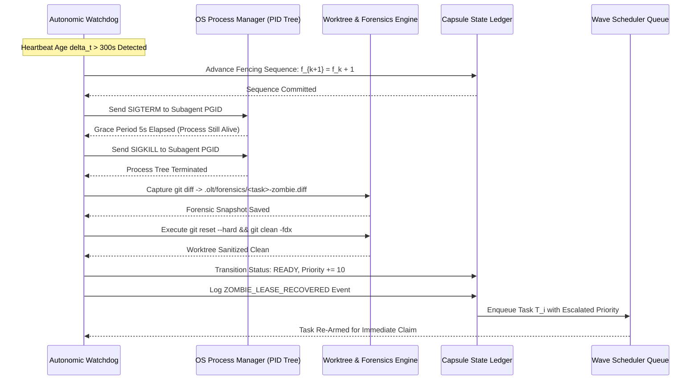

# Stale Worker & Zombie Subagent Auto-Recovery

---

[Previous: 07-02 Heartbeats & Anti-Theft Locking](07-02-heartbeats-and-anti-theft-locking.md) | [Chapter Index](index.md) | [All Chapters Index](../index.md) | [Next: 07-04 Cowan Token Budgeting & Sanitization](07-04-cowan-token-budgeting-and-sanitization.md)

---

## 1. Executive Summary & The Zombie Subagent Hazard

In distributed autonomous development workflows, worker subagents execute complex, open-ended tasks involving code generation, AST manipulation, compiler invocations, and test execution. Subagents can become unresponsive ("zombies") due to a variety of systemic and cognitive failure modes:

- **Infinite LLM Reasoning Loops**: The model repeatedly emits tool calls or cyclic reasoning paths without progressing toward task submission.
- **Subprocess Deadlocks & Hanging Sockets**: A child process (e.g. an unmocked database connection or blocking test runner) deadlocks, suspending the parent subagent process.
- **Host Process Drops & OOM Kills**: The host operating system terminates a subagent due to memory exhaustion without triggering graceful shutdown handlers.
- **Network Timeouts & API Freezes**: Remote inference endpoints stall or drop TCP sockets silently, leaving the worker thread in an unresolvable pending state.

```text
+--------------------------------------------------------------------------------------------------+
|                            THE ZOMBIE SUBAGENT HAZARD IN DISTRIBUTED DAGs                        |
+--------------------------------------------------------------------------------------------------+
|                                                                                                  |
|   Active Task DAG: [Task A] ──► [Task B (ZOMBIE!)] ──► [Task C] ──► [Task D]                     |
|                                       │                                                          |
|                                       ▼                                                          |
|   * Process PID 51201 hung in infinite test loop                                                 |
|   * Heartbeats cease at t = 120s                                                                 |
|   * Task B holds exclusive lease on subsystem `src/engine/`                                      |
|                                                                                                  |
|   WITHOUT AUTO-RECOVERY: Task B never completes; Tasks C & D stalled indefinitely (DEADLOCK)     |
|   WITH OLT AUTO-RECOVERY: Stale lease detected at t = 420s (120s + 300s SLA)                     |
|                           1. SIGTERM -> SIGKILL escalated on PID 51201                           |
|                           2. Forensic diff captured to .olt/forensics/                           |
|                           3. Worktree scrubbed via `git clean -fdx`                              |
|                           4. Task B re-queued with Priority + 10 & Re-armed Pro model            |
|                                                                                                  |
+--------------------------------------------------------------------------------------------------+
```

The **OLT (Orchestrating Long Tasks)** engine implements **Automated Zombie Detection & Orphan Lease Recovery**. The system continuously monitors execution telemetry, terminates unresponsive process trees, sanitizes dirty worktrees, captures forensic evidence, and re-queues blocked tasks under higher scheduling priority.

---

## 2. The 4-Step Atomic Recovery Operator $\mathcal{R}_{\text{zombie}}$

When an active task lease violates the heartbeat freshness SLA ($\Delta t_{\text{hb}} > 300\,\text{s}$), the Autonomic Watchdog initiates the **4-Step Atomic Recovery Operator** $\mathcal{R}_{\text{zombie}}$.

```text
+--------------------------------------------------------------------------------------------------+
|                            THE 4-STEP ATOMIC RECOVERY OPERATOR PIPELINE                          |
+--------------------------------------------------------------------------------------------------+
|                                                                                                  |
|   [ STEP 1: SEQUENCE ADVANCEMENT ] ──► Invalidate old token: f_{k+1} = f_k + 1                   |
|                   │                                                                              |
|                   ▼                                                                              |
|   [ STEP 2: PROCESS TERMINATION ]  ──► Escalated kill: SIGTERM ──(5s)──► SIGKILL (PID Tree)      |
|                   │                                                                              |
|                   ▼                                                                              |
|   [ STEP 3: WORKTREE SANITIZATION] ──► Capture diff ──► `git clean -fdx` ──► `git reset --hard`   |
|                   │                                                                              |
|                   ▼                                                                              |
|   [ STEP 4: RE-QUEUE & RE-ARM ]    ──► Status -> READY ──► Priority += 10 ──► Emit Event Log     |
|                                                                                                  |
+--------------------------------------------------------------------------------------------------+
```

### 2.1 Step 1: Monotonic Sequence Advancement

The watchdog immediately increments the task's fencing sequence in the capsule ledger:

$$f_{k+1} = f_k + 1$$

This immediately invalidates the stalled worker's lease token $\mathcal{L}_{\text{token}}(f_k)$. Even if the hung worker awakens during the termination window, any write attempt is rejected fail-closed by the storage gatekeeper.

### 2.2 Step 2: Escalated POSIX Process Termination

The watchdog discovers the root PID and child subprocesses associated with the agent from its initial registration. Termination follows strict signal escalation:

1. Send `SIGTERM` to the process group (`kill -TERM -<pgid>`) allowing graceful buffer flushing.
2. Arm a grace timer of $\Delta t_{\text{grace}} = 5\,\text{s}$.
3. If processes remain active after $5\,\text{s}$, send uncatchable `SIGKILL` (`kill -KILL -<pgid>`).
4. Assert all child PIDs have exited via `/proc` or `sysctl` process table inspection.

### 2.3 Step 3: Worktree Pruning & Forensic Preservation

Before wiping dirty artifacts, the recovery engine captures uncommitted changes for forensic analysis:

1. Execute `git diff HEAD` inside `.olt/worktrees/<task_id>/`.
2. Write the diff to `.olt/capsules/<slug>/forensics/<task_id>-zombie-<timestamp>.diff`.
3. Scrub the worktree clean:
   $$\texttt{git reset --hard HEAD} \quad \land \quad \texttt{git clean -fdx}$$
4. Release the advisory file lock `.locks/task-<task_id>.lease`.

### 2.4 Step 4: Transaction Rollback & Priority Escalation

1. Revert task state from `LEASED` to `READY` in `state.json`.
2. Increment task priority: $\text{Priority}(T_i) \leftarrow \text{Priority}(T_i) + 10$.
3. Append `ZOMBIE_LEASE_RECOVERED` event to `events.jsonl`.
4. Signal the scheduler wave dispatcher to re-assign the task immediately.

---

## 3. Mathematical Formalization of Recovery Time Objective (RTO)

Let $T_{\text{sweep}}$ be the watchdog sweep interval ($T_{\text{sweep}} = 10\,\text{s}$).

Let $\text{TTL}_{\text{lease}}$ be the heartbeat timeout threshold ($\text{TTL}_{\text{lease}} = 300\,\text{s}$).

Let $\Delta t_{\text{grace}}$ be the POSIX signal grace window ($\Delta t_{\text{grace}} = 5\,\text{s}$).

Let $T_{\text{scrub}}$ be the worktree sanitization latency ($T_{\text{scrub}} \le 2\,\text{s}$).

Let $T_{\text{ledger}}$ be the ledger update latency ($T_{\text{ledger}} \le 0.5\,\text{s}$).

### 3.1 Worst-Case Recovery Time Objective Bound

The **Recovery Time Objective** $\text{RTO}_{\text{zombie}}$ defines the maximum upper-bound time elapsed between worker failure (heartbeat cessation) and task re-queue availability:

$$\text{RTO}_{\text{zombie}} = \text{TTL}_{\text{lease}} + T_{\text{sweep}} + \Delta t_{\text{grace}} + T_{\text{scrub}} + T_{\text{ledger}}$$

$$\text{RTO}_{\text{zombie}} = 300\,\text{s} + 10\,\text{s} + 5\,\text{s} + 2\,\text{s} + 0.5\,\text{s} = 317.5\,\text{s}$$

Thus, OLT guarantees that any stalled or crashed worker is evicted and its task restored to the execution queue in under **318 seconds**.

### 3.2 Dynamic Priority Escalation Formula

To prevent starvation of repeatedly failing tasks, each recovery cycle escalates task scheduling priority:

$$P_{m}(T_i) = P_0(T_i) + m \cdot \Delta P_{\text{zombie}}, \qquad \Delta P_{\text{zombie}} = 10, \quad m \in \{1, 2, 3\}$$

where $m$ is the count of recovered zombie attempts for task $T_i$.



---

## 4. TypeScript Worker Reaper & Reclamation Engine

The core interfaces and operational implementation of the zombie reaper engine are defined in the watchdog subsystem specification (see [Chapter 10: Durability & Recovery Capsules](../10-durability-recovery-capsules/index.md)):

```typescript
export interface ZombieReaperConfig {
  readonly heartbeatTtlSeconds: number; // 300s
  readonly sweepIntervalSeconds: number; // 10s
  readonly sigtermGraceMs: number; // 5000ms
  readonly maxZombieRetries: number; // 3
}

export interface ZombieRecoveryReport {
  readonly taskId: string;
  readonly deadAgentId: string;
  readonly deadPid: number;
  readonly previousFencingToken: number;
  readonly newFencingToken: number;
  readonly forensicDiffPath: string;
  readonly recoveryDurationMs: number;
  readonly nextPriority: number;
  readonly quarantineTriggered: boolean;
}

/**
 * Executes the atomic 4-step recovery operator on a stalled worker task
 */
export async function executeZombieRecovery(
  capsuleDir: string,
  taskId: string,
  deadAgentId: string,
  deadPid: number,
  currentFencingToken: number,
  config: ZombieReaperConfig = {
    heartbeatTtlSeconds: 300,
    sweepIntervalSeconds: 10,
    sigtermGraceMs: 5000,
    maxZombieRetries: 3,
  },
): Promise<ZombieRecoveryReport> {
  const startTime = Date.now();

  // Step 1: Monotonic Sequence Advancement
  const newFencingToken = currentFencingToken + 1;

  // Step 2: POSIX Signal Escalation on Process Tree
  await terminateProcessTree(deadPid, config.sigtermGraceMs);

  // Step 3: Worktree Pruning & Forensic Preservation
  const worktreeDir = `${capsuleDir}/../../worktrees/${taskId}`;
  const forensicsDir = `${capsuleDir}/forensics`;
  const diffPath = `${forensicsDir}/${taskId}-zombie-${Date.now()}.diff`;

  await captureForensicDiff(worktreeDir, diffPath);
  await sanitizeWorktree(worktreeDir);

  // Step 4: Transaction Rollback & State Re-arm
  const retryCount = await getTaskZombieCount(capsuleDir, taskId);
  const quarantine = retryCount >= config.maxZombieRetries;

  const nextStatus = quarantine ? "QUARANTINED" : "READY";
  const priorityBoost = quarantine ? 0 : 10;

  await updateTaskStateLedger(capsuleDir, taskId, {
    status: nextStatus,
    fencingToken: newFencingToken,
    leaseHolder: undefined,
    priorityBoost,
  });

  await appendEventLog(capsuleDir, {
    type: "ZOMBIE_LEASE_RECOVERED",
    taskId,
    deadAgentId,
    fencingToken: newFencingToken,
    quarantine,
    timestamp: new Date().toISOString(),
  });

  return {
    taskId,
    deadAgentId,
    deadPid,
    previousFencingToken: currentFencingToken,
    newFencingToken,
    forensicDiffPath: diffPath,
    recoveryDurationMs: Date.now() - startTime,
    nextPriority: priorityBoost,
    quarantineTriggered: quarantine,
  };
}

async function terminateProcessTree(pid: number, graceMs: number): Promise<void> {
  try {
    process.kill(-pid, "SIGTERM");
  } catch (err) {
    // Process may have already exited
    return;
  }

  await new Promise((resolve) => setTimeout(resolve, graceMs));

  try {
    process.kill(-pid, "SIGKILL");
  } catch (err) {
    // Already terminated
  }
}

async function captureForensicDiff(worktreeDir: string, diffPath: string): Promise<void> {
  const { execSync } = require("child_process");
  try {
    const diff = execSync("git diff HEAD", { cwd: worktreeDir, encoding: "utf8" });
    const { writeFileSync, mkdirSync } = require("fs");
    const { dirname } = require("path");
    mkdirSync(dirname(diffPath), { recursive: true });
    writeFileSync(diffPath, diff, "utf8");
  } catch (err) {
    // Non-fatal if worktree is already clean
  }
}

async function sanitizeWorktree(worktreeDir: string): Promise<void> {
  const { execSync } = require("child_process");
  try {
    execSync("git reset --hard HEAD && git clean -fdx", { cwd: worktreeDir, stdio: "ignore" });
  } catch (err) {
    // Log worktree scrub failure
  }
}
```

---

## 5. Adaptive Model Re-Arming & Anti-Loop Policy

Re-queueing a task with identical prompt parameters after a zombie timeout often leads to repeated failure. OLT employs an **Adaptive Model Re-Arming Policy**:

```text
+--------------------------------------------------------------------------------------------------+
|                            ADAPTIVE MODEL RE-ARMING ESCALATION MATRIX                            |
+-------------------+--------------------+------------------------+--------------------------------+
| Attempt Index     | Assigned Model     | Prompt Modification    | Diagnostic Action              |
+-------------------+--------------------+------------------------+--------------------------------+
| Attempt 1 (Base)  | Tier 3 Flash       | Standard task brief    | Standard telemetry logging     |
| Attempt 2 (Retry) | Tier 3 Pro         | Anti-loop instruction  | Verbose step-by-step trace     |
| Attempt 3 (Retry) | Tier 3 Pro (Large) | Decomposed sub-steps   | Forensic diff comparison       |
| Attempt 4 (Final) | QUARANTINE         | Execution halted       | Trigger Socratic Review Gate   |
+-------------------+--------------------+------------------------+--------------------------------+
```

### 5.1 Anti-Loop Prompt Injection

On Attempt 2 and above, the prompt compiler injects explicit anti-loop instructions into the worker's activation envelope:

> [!WARNING]
> Prior execution of this task timed out after 300 seconds due to unresponsive reasoning loops or hung tests. You MUST break your execution into granular, verifiable commits. Do NOT run unbounded test suites without timeouts. Limit each tool invocation to under 30 seconds.

---

## 6. Comprehensive Failure Modes & Mitigation Matrix

| Failure Mode                              | Root Cause                                       | System Hazard                                | Automated Mitigation                                                                                |
| :---------------------------------------- | :----------------------------------------------- | :------------------------------------------- | :-------------------------------------------------------------------------------------------------- |
| **Unkillable Process (D-State)**          | Kernel blocked on disk NFS/I/O wait              | PID tree cannot be terminated by `SIGKILL`   | Fencing token sequence advanced ($f_{k+1}$); process ignored; worktree relocated to fresh directory |
| **Worktree `.git/index.lock` Contention** | Hard crash during active git commit              | Subsequent git commands fail with lock error | Watchdog forcibly removes stale `.git/index.lock` before executing `git reset`                      |
| **Forensic Storage Saturation**           | 100+ zombie diffs fill capsule disk quota        | Capsule disk write errors                    | Forensics engine caps stored diffs to 50MB with LRU pruning                                         |
| **Zombie Cascade Storm**                  | Flawed shared library hangs all parallel workers | All 15 worker lanes enter zombie recovery    | Circuit breaker detects $> 50\%$ worker failure rate and pauses wave execution                      |

---

## 7. Architectural Invariants Summary

1. **Deterministic Bounded Recovery**: Any unresponsive worker is fully recovered and its task re-queued in $\le 318\,\text{s}$.
2. **Worktree Isolation & Cleanliness**: Dirty uncommitted files are quarantined via forensic diffs and scrubbed before task re-assignment.
3. **Monotonic Fencing Invalidation**: Every zombie reclamation advances the fencing sequence $f_{k+1} = f_k + 1$, permanently blocking resurrection writes.
4. **Adaptive Escalation**: Tasks that experience zombie failures receive automatic priority boosts and model re-arming.

---

[Previous: 07-02 Heartbeats & Anti-Theft Locking](07-02-heartbeats-and-anti-theft-locking.md) | [Chapter Index](index.md) | [All Chapters Index](../index.md) | [Next: 07-04 Cowan Token Budgeting & Sanitization](07-04-cowan-token-budgeting-and-sanitization.md)

---
