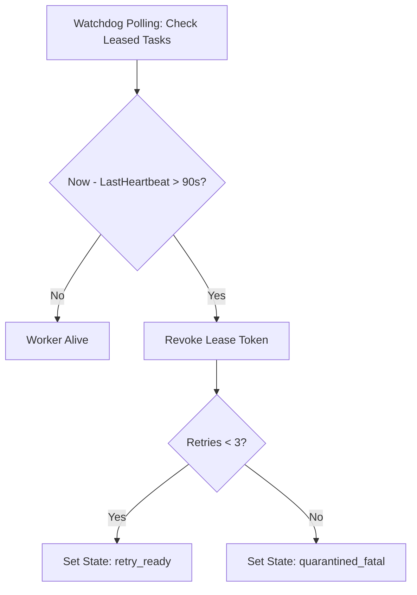

# Stale Worker & Zombie Auto-Recovery

[OLT Documentation Hub](../../README.md) > [Architecture Index](../index.md) > [Chapter 07](./index.md) > 07-03 Zombie Auto-Recovery

---

[⏮️ Previous: 07-02 Heartbeats & Anti-Theft Locking](07-02-heartbeats-and-anti-theft-locking.md) | [📂 Chapter Index](index.md) | [📚 All Chapters Index](../index.md) | [⏭️ Next: 07-04 Cowan Token Budgeting & Context](07-04-cowan-token-budgeting-and-sanitization.md)
---

## 1. Watchdog Recovery Loop

The **Watchdog Manager** runs periodically in the background:

1. Scans all leased tasks in `state.json`.
2. Identifies tasks where $\Delta t > 90\text{s}$.
3. Reaps the dead subagent PID / kills the stranded subshell.
4. Increments the task retry counter ($\text{retries} = \text{retries} + 1$).
5. Transitions task state back to `retry_ready`.

---

[⏮️ Previous: 07-02 Heartbeats & Anti-Theft Locking](07-02-heartbeats-and-anti-theft-locking.md) | [📂 Chapter Index](index.md) | [📚 All Chapters Index](../index.md) | [⏭️ Next: 07-04 Cowan Token Budgeting & Context](07-04-cowan-token-budgeting-and-sanitization.md)
---
