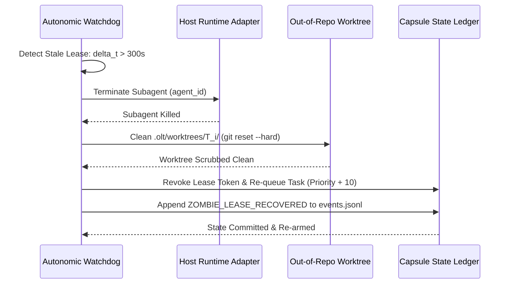

# Stale Worker & Zombie Subagent Auto-Recovery

---

[Previous: 07-02 Heartbeats & Anti-Theft Locking](07-02-heartbeats-and-anti-theft-locking.md) | [Chapter Index](index.md) | [All Chapters Index](../index.md) | [Next: 07-04 Cowan Token Budgeting](07-04-cowan-token-budgeting-and-sanitization.md)
---

## 1. Executive Summary & The Zombie Process Hazard

In distributed autonomous development environments, subagents can become unresponsive ("zombies") due to unhandled exceptions, socket drops, host CLI timeouts, or infinite reasoning loops. When a zombie worker holds an exclusive task lease:

- The target task remains locked in state `LEASED`.
- Dependent downstream tasks are blocked indefinitely.
- Partial, uncommitted, or corrupted code changes remain stranded in the worker's private worktree.

The **OLT (Orchestrating Long Tasks)** engine implements **Automated Zombie Detection & Orphan Lease Recovery**. Under this system:

1. **Continuous Watchdog Sweeps**: The Autonomic Watchdog scans active leases every 10 seconds.
2. **Deterministic Lease Reclamation**: Stale leases ($\Delta t > 300\text{s}$) are automatically revoked, their isolated worktrees are scrubbed, and tasks are returned to the `READY` queue with priority escalation.

```text
┌──────────────────────────────────────────────────────────────────────────────────────────────────┐
│                             STALE WORKER AUTO-RECOVERY PIPELINE                                  │
├──────────────────────────────────────────────────────────────────────────────────────────────────┤
│                                                                                                  │
│   ┌──────────────────────┐         ┌──────────────────────┐         ┌──────────────────────┐     │
│   │ Watchdog Lease Sweep │  ───►   │ Zombie Process Kill  │  ───►   │ Worktree Sanitization│     │
│   │ (Detect delta > 300s)│         │ & Lease Invalidation │         │ (git clean -fdx)     │     │
│   └──────────────────────┘         └──────────────────────┘         └──────────────────────┘     │
│              │                                 │                               │                 │
│              ▼                                 ▼                               ▼                 │
│      [Heartbeat Stale]               [Subagent Terminated]           [Worktree Reset]            │
│                                                                                │                 │
│                                                                                ▼                 │
│                                                                       [Task Re-queued in READY]  │
│                                                                                                  │
└──────────────────────────────────────────────────────────────────────────────────────────────────┘
```

---

## 2. Mathematical Formalization of the Recovery Lifecycle

Let $\mathcal{Z}(t)$ denote the set of zombie tasks detected at time $t$:

$$\mathcal{Z}(t) = \Big\{ T_i \in \text{Tasks} \;\Big|\; \text{Status}(T_i) = \text{LEASED} \land \big(\text{Now}() - h(T_i) > 300\text{s}\big) \Big\}$$

For each $T_i \in \mathcal{Z}(t)$, the recovery operator $\mathcal{R}_{\text{zombie}}$ performs four atomic state mutations:

$$ \mathcal{R}_{\text{zombie}}(T_i) = \begin{cases}
1. & \text{KillSubagent}(\text{LeaseHolder}(T_i)) \\
2. & \text{WipeDirectory}(\texttt{".olt/worktrees/"} \mathbin{\Vert} T_i) \\
3. & \text{Status}(T_i) \leftarrow \text{READY} \\
4. & \text{Priority}(T_i) \leftarrow \text{Priority}(T_i) + 10 \quad (\text{Priority Escalation}) \\
5. & \text{EmitEvent}(\texttt{"ZOMBIE\_LEASE\_RECOVERED"}, \quad T_i)
\end{cases}$$



---

## 3. Worktree Scrubbing & Forensic Archival

Before wiping a stalled worker's worktree, the engine captures a compressed forensic diff:

```text
┌──────────────────────────────────────────────────────────────────────────────────────────────────┐
│                               FORENSIC DIFF CAPTURE PROTOCOL                                     │
├──────────────────────────────────────────────────────────────────────────────────────────────────┤
│                                                                                                  │
│   1. Execute `git diff HEAD` in .olt/worktrees/<task_id>/.                                       │
│   2. Write diff to .olt/capsules/<slug>/forensics/<task_id>-stale-<timestamp>.diff.              │
│   3. Execute `git reset --hard HEAD` and `git clean -fdx`.                                       │
│   4. Log forensic artifact path in .olt/telemetry.jsonl.                                         │
│                                                                                                  │
└──────────────────────────────────────────────────────────────────────────────────────────────────┘
```

This allows meta-auditors to analyze why the worker failed (e.g. infinite loop in a specific test file) without risking repository contamination.

---

## 4. Priority Escalation & Model Re-Arming

When a task fails due to a zombie timeout, re-queueing it with identical parameters might cause the same failure. The OLT scheduler applies **Adaptive Model Re-Arming**:

- **Attempt 1**: Standard Implementer (`flash` model).
- **Attempt 2 (Post-Timeout)**: Advanced Implementer (`pro` model) with expanded context and explicit anti-loop prompts.
- **Attempt 3 (Post-Timeout)**: Human operator intervention alert via `doctor:diagnose`.

---

## 5. Architectural Invariants Summary

1. **Zero Stranded Tasks**: Every task leased to a failed worker is guaranteed to be re-queued within 310 seconds.
2. **Clean Workspace Guarantee**: Wiping dirty worktrees guarantees zero unverified code leaks into subsequent tasks.
3. **Monotonic Sequence Increment**: Revocation increments the lease sequence, preventing delayed commits from dead workers.

---

[Previous: 07-02 Heartbeats & Anti-Theft Locking](07-02-heartbeats-and-anti-theft-locking.md) | [Chapter Index](index.md) | [All Chapters Index](../index.md) | [Next: 07-04 Cowan Token Budgeting](07-04-cowan-token-budgeting-and-sanitization.md)
---
$$
