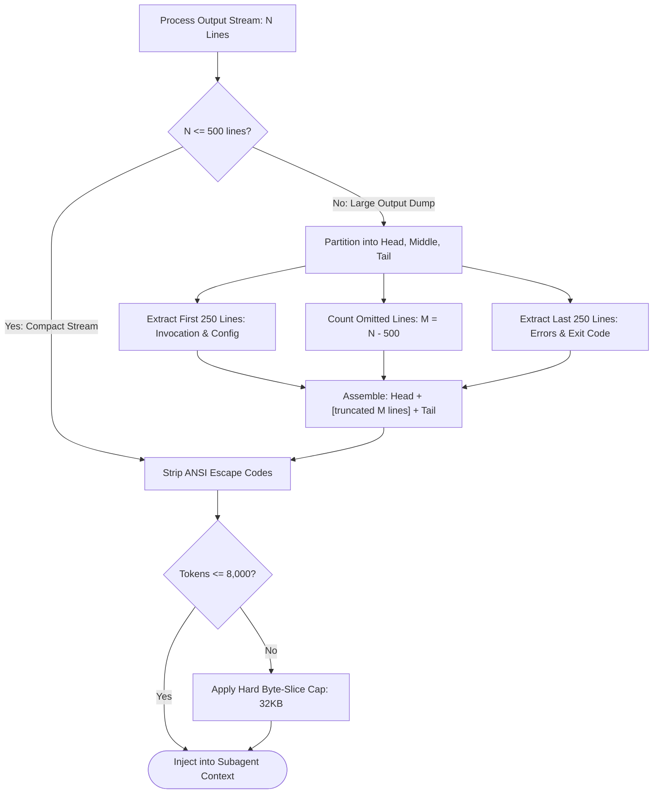

# Cowan Token Budgeting & Stdout Sanitization

---

[Previous: 07-03 Stale Worker & Zombie Auto-Recovery](07-03-stale-worker-and-zombie-auto-recovery.md) | [Chapter Index](index.md) | [All Chapters Index](../index.md) | [Next: Chapter 08: Adversarial Validation & Repair](../08-adversarial-validation-repair/index.md)

---

## 1. Executive Summary & The Cognitive Context Degradation Threat

Large Language Model (LLM) agents operating in autonomous engineering environments face severe performance, latency, and reliability degradations when context windows are unmanaged:

1. **Attention Dispersion ("Lost in the Middle")**: As context lengths exceed 150,000 tokens, transformer self-attention mechanisms exhibit severe retrieval dilution. Agents overlook critical system constraints, hallucinate variables, and produce broken code edits.
2. **Terminal Stdout Flooding**: Shell commands such as `bun test`, `cargo build`, or `git log` can produce 10,000+ lines of verbose terminal logs. A single unconstrained tool turn can exhaust the agent's context budget instantly.
3. **Monolithic Information Ingestion**: Dumping entire documentation trees, full ASTs, or complete source repositories into initial agent prompts inflates inference costs quadratically and crowds out task-specific instructions.

```text
+--------------------------------------------------------------------------------------------------+
|                            THE CONTEXT WINDOW SATURATION & DEGRADATION CURVE                     |
+--------------------------------------------------------------------------------------------------+
|                                                                                                  |
|   Reasoning Accuracy (%)                                                                         |
|   100 | ********************** (Optimal Range: 0 - 60k tokens)                                   |
|    80 |                       ******************* (Noticeable Latency: 60k - 120k tokens)        |
|    60 |                                          ************** (Attention Drop: 120k - 150k)    |
|    40 |                                                        ********* (Severe Drift > 150k)   |
|    20 |                                                                 ****                     |
|     0 +--------------------------------------------------------------------------------------    |
|       0k                     50k                    100k                   150k             200k+
|                                                                                                  |
|   OLT HARD SAFETY ENVELOPE: Strictly Bounded at <= 150,000 Cowan Tokens                          |
|   RESERVED HEADROOM BUFFER: >= 50,000 Tokens (Guarantees Generation Safety)                      |
|                                                                                                  |
+--------------------------------------------------------------------------------------------------+
```

The **OLT (Orchestrating Long Tasks)** engine implements the **Cowan Token Budgeting & Stdout Sanitization Engine**. Grounded in cognitive working-memory theory and deterministic stream filtering, the engine guarantees that no agent turn exceeds the 150,000-token envelope while preserving 100% of actionable error diagnostics and architectural constraints.

---

## 2. Cowan Working Memory Theory in Autonomous Agent Fleets

In cognitive psychology, **Nelson Cowan's Working Memory Formulation** establishes that human central working memory is capacity-limited to approximately **$7 \pm 2$ cognitive chunks** (with an active core focus of 4 chunks). When cognitive load exceeds this capacity, task performance collapses due to interference and decay.

The OLT architecture transposes Cowan's working-memory principles into autonomous multi-agent systems:

```text
+--------------------------------------------------------------------------------------------------+
|                            THE 7-CHUNK COWAN WORKING MEMORY BUFFER                               |
+--------------------------------------------------------------------------------------------------+
|                                                                                                  |
|   [ CHUNK 1: Immutable Core Persona & System Instructions (~4,000 Tokens) ]                      |
|   [ CHUNK 2: Active Task Specification & Obligation Contract (~3,000 Tokens) ]                   |
|   [ CHUNK 3: Progressive Reference Manual Slices (~10,000 Tokens) ]                             |
|   [ CHUNK 4: Active File / AST Context (< 15,000 Tokens) ]                                       |
|   [ CHUNK 5: Sanitized Tool Execution History & Error Diagnostics (< 12,000 Tokens) ]             |
|   [ CHUNK 6: Short-Term Chain-of-Thought Scratchpad (< 20,000 Tokens) ]                          |
|   [ CHUNK 7: Dynamic Workspace Buffer & Staging Area (< 86,000 Tokens) ]                         |
|                                                                                                  |
|   TOTAL ACTIVE CONTEXT: <= 150,000 Tokens | HEADROOM SAFETY BUFFER: >= 50,000 Tokens             |
|                                                                                                  |
+--------------------------------------------------------------------------------------------------+
```

### 2.1 Mathematical Formalization of the Cowan Token Budget

Let $C_{\text{total}}$ represent the total active context tokens presented to an LLM agent during turn $t$.

Let $C_{\text{sys}}$, $C_{\text{task}}$, $C_{\text{ref}}$, $C_{\text{tools}}$, and $C_{\text{work}}$ represent the token consumption across individual partitions:

$$C_{\text{total}} = C_{\text{sys}} + C_{\text{task}} + C_{\text{ref}} + C_{\text{tools}} + C_{\text{work}} \le B_{\text{cowan}} = 150{,}000$$

Where:

- $C_{\text{sys}} \le 4{,}000$ (Persona, Role, Hard Invariants, Tool Schemas)
- $C_{\text{task}} \le 3{,}000$ (Task Description, Acceptance Criteria, Falsifiable Gates)
- $C_{\text{ref}} \le 10{,}000$ (Progressively loaded documentation slices via `file://`)
- $C_{\text{tools}} \le 15{,}000$ (Sanitized command stdout/stderr briefs)
- $C_{\text{work}} \le 118{,}000$ (Active reasoning, code editing buffers, and scratchpad)

The safety headroom $H_{\text{safe}} = B_{\text{max}} - B_{\text{cowan}} \ge 50{,}000$ tokens ensures that models with 200k windows never reach hard truncation thresholds during generation bursts.

---

## 3. Deterministic Stdout Sanitization Operator $\mathcal{S}_{\text{stdout}}$

When agents execute shell commands (`run_command`), raw terminal streams frequently produce unbounded logging output. OLT applies the deterministic **Head-Tail Stdout Sanitization Operator** $\mathcal{S}_{\text{stdout}}$ with a 500-line maximum envelope ($L_{\text{max}} = 500$).

### 3.1 Mathematical Definition of $\mathcal{S}_{\text{stdout}}$

Let $O_{\text{raw}} = \langle l_1, l_2, \dots, l_N \rangle$ be the ordered sequence of output lines emitted by a process, where $N = |O_{\text{raw}}|$.

Let $K_{\text{cap}} = \lfloor L_{\text{max}} / 2 \rfloor = 250$ lines.

$$ \mathcal{S}_{\text{stdout}}(O_{\text{raw}}) = \begin{cases}
O_{\text{raw}} & \text{if } N \le L_{\text{max}} \\
\langle l_1, \dots, l_{K_{\text{cap}}} \rangle \mathbin{\Vert} \Big[ \texttt{"\n[... truncated "} \mathbin{\Vert} (N - L_{\text{max}}) \mathbin{\Vert} \texttt{" lines of verbose output ...]\n"} \Big] \mathbin{\Vert} \langle l_{N - K_{\text{cap}} + 1}, \dots, l_N \rangle & \text{if } N > L_{\text{max}}
\end{cases}$$

### 3.2 Information Preservation Properties

The Head-Tail truncation strategy guarantees that critical information is never lost:
- **Head (Lines 1 to 250)**: Preserves process invocation arguments, environment configuration, compiler banners, and initial test suite initialization.
- **Central Omission Marker**: Explicitly informs the agent of the exact number of elided lines, preventing confusion regarding missing logs.
- **Tail (Lines $N-249$ to $N$)**: Preserves terminal exit codes, stack traces, compiler error locations (`file.ts:42:15`), test failure summaries, and assertion diffs.



---

## 4. Progressive Disclosure Slice Protocol

To adhere to the Cowan budget, documentation and large source files are never injected monolithically into agent contexts. Instead, OLT implements the **Three-Tier Progressive Disclosure Model**:

```text
+--------------------------------------------------------------------------------------------------+
|                            PROGRESSIVE DISCLOSURE CONTEXT TIERS                                  |
+-------------------+-------------------+----------------------------------------------------------+
| Tier              | Context Footprint | Operational Trigger & Content Description                |
+-------------------+-------------------+----------------------------------------------------------+
| Tier 1: Discovery | < 500 Tokens      | At boot: `SKILL.md` frontmatter & command descriptions.  |
| Tier 2: Activation| < 3,000 Tokens    | On claim: `task.json` obligation brief & rubric gates.   |
| Tier 3: Execution | < 12,000 Tokens   | On demand: Granular `view_file` slices (max 800 lines).  |
+-------------------+-------------------+----------------------------------------------------------+
```

When an agent needs architectural context, it queries targeted slices (e.g. `view_file(path, StartLine=1, EndLine=120)`) rather than loading the complete document. This enforces an upper bound on reference documentation tokens ($C_{\text{ref}} \le 10{,}000$).

---

## 5. Sliding Window Context Compaction & Token Accounting

During long multi-turn execution loops, conversational turn history accumulates. When total turn history exceeds the sliding threshold ($C_{\text{total}} > 125{,}000$ tokens), the **Sliding Window Compaction Operator** $\mathcal{W}_{\text{compact}}$ is triggered.

```text
+--------------------------------------------------------------------------------------------------+
|                            SLIDING WINDOW CONTEXT COMPACTION TOPOLOGY                            |
+--------------------------------------------------------------------------------------------------+
|                                                                                                  |
|   Turn History: [Turn 1] [Turn 2] [Turn 3] [Turn 4] [Turn 5] [Turn 6] [Turn 7] [Turn 8]          |
|                 \_____________________________/ \_____________________________/                  |
|                                │                                       │                         |
|                                ▼                                       ▼                         |
|                     [ COMPACTED SUMMARY ]                            [ RECENT TURNS ]            |
|                     * Key file modifications                        * Turn 5 (Active Edit)       |
|                     * Test outcomes & error traces                  * Turn 6 (Test Run)          |
|                     * Retained invariant decisions                  * Turn 7 (Lint Fix)          |
|                     (Size: ~1,500 Tokens)                           * Turn 8 (Verification)      |
|                                                                     (Size: ~12,000 Tokens)       |
|                                                                                                  |
+--------------------------------------------------------------------------------------------------+
```

### 5.1 Telemetry Emission Schema

Token metrics are continuously measured and logged to `.olt/telemetry.jsonl` at the completion of every turn:

```json
{
  "timestamp": "2026-08-29T04:12:00.000Z",
  "agentId": "implementer_core_01",
  "taskId": "task-core-04",
  "turnIndex": 6,
  "tokens": {
    "systemPrompt": 3840,
    "taskBrief": 2150,
    "referenceManuals": 8420,
    "sanitizedTools": 6200,
    "reasoningMemory": 48300,
    "totalActive": 68910,
    "cowanBudgetRemaining": 81090
  },
  "status": "COMPLIANT"
}
```

---

## 6. TypeScript Cowan Token Budgeter & Sanitizer Implementation

The core implementation of stdout sanitization, token tracking, and context bounds is provided in the OLT context budget engine (see [Chapter 02: Modular File and Directory Budgets](../02-four-tier-hierarchy/02-04-modular-file-and-directory-budgets.md)):

```typescript
export interface CowanBudgetLimits {
  readonly maxContextTokens: number; // 150,000
  readonly maxStdoutLines: number; // 500
  readonly headPreserveLines: number; // 250
  readonly tailPreserveLines: number; // 250
  readonly maxToolOutputBytes: number; // 32,768 (32KB)
}

export const DEFAULT_COWAN_LIMITS: CowanBudgetLimits = {
  maxContextTokens: 150_000,
  maxStdoutLines: 500,
  headPreserveLines: 250,
  tailPreserveLines: 250,
  maxToolOutputBytes: 32_768,
};

/**
 * Deterministically sanitizes process stdout/stderr streams to prevent context flooding
 */
export function sanitizeStdout(
  rawOutput: string,
  limits: CowanBudgetLimits = DEFAULT_COWAN_LIMITS,
): string {
  if (!rawOutput) return "";

  // 1. Strip ANSI color/formatting escape codes
  const cleanText = stripAnsiCodes(rawOutput);

  const lines = cleanText.split("\n");
  if (lines.length <= limits.maxStdoutLines) {
    return enforceByteLimit(cleanText, limits.maxToolOutputBytes);
  }

  // 2. Head-Tail Truncation
  const head = lines.slice(0, limits.headPreserveLines);
  const tail = lines.slice(lines.length - limits.tailPreserveLines);
  const omittedCount = lines.length - limits.maxStdoutLines;

  const omissionMarker = `\n[... truncated ${omittedCount} lines of verbose output ...]\n`;
  const combined = [...head, omissionMarker, ...tail].join("\n");

  return enforceByteLimit(combined, limits.maxToolOutputBytes);
}

function stripAnsiCodes(input: string): string {
  // Matches all standard ANSI terminal escape sequences
  const ansiRegex = /[\u001b\u009b][[()#;?]*(?:[0-9]{1,4}(?:;[0-9]{0,4})*)?[0-9A-ORZcf-nqry=><]/g;
  return input.replace(ansiRegex, "");
}

function enforceByteLimit(text: string, maxBytes: number): string {
  const buffer = Buffer.from(text, "utf8");
  if (buffer.byteLength <= maxBytes) return text;

  const truncatedBuffer = buffer.subarray(0, maxBytes);
  return `${truncatedBuffer.toString("utf8")}\n[... output byte limit exceeded (32KB cap) ...]`;
}

/**
 * Evaluates current turn token consumption against the Cowan budget
 */
export function evaluateCowanBudget(
  currentTokens: number,
  limits: CowanBudgetLimits = DEFAULT_COWAN_LIMITS,
): { compliant: boolean; remainingBudget: number; action: "PROCEED" | "COMPACT_HISTORY" | "TRAP_OVERFLOW" } {
  const remaining = limits.maxContextTokens - currentTokens;

  if (remaining < 0) {
    return { compliant: false, remainingBudget: remaining, action: "TRAP_OVERFLOW" };
  }
  if (remaining < 25_000) {
    return { compliant: true, remainingBudget: remaining, action: "COMPACT_HISTORY" };
  }
  return { compliant: true, remainingBudget: remaining, action: "PROCEED" };
}
```

---

## 7. Anti-Blunder Matrix & Operational Safeguards

The following matrix documents common context-budgeting anti-patterns and their architectural remedies:

| Anti-Pattern | Description | Direct Failure Mode | OLT Architectural Safeguard |
| :--- | :--- | :--- | :--- |
| **Unbounded Test Flooding** | Running `bun test` across 500 tests emitting 8,000 lines | Exhausts context, pushing task instructions out of window | $\mathcal{S}_{\text{stdout}}$ caps to 500 lines (250 head / 250 tail) |
| **Recursive Error Chat** | Agent repeatedly re-runs failing command, dumping stack traces | Conversational turns explode to 200k tokens | Compaction operator $\mathcal{W}_{\text{compact}}$ triggers at 125k tokens |
| **Full Repo Prompt Ingestion** | Ingesting entire code tree in initial system prompt | High latency ($> 30\text{s}$ per turn), degraded reasoning | Progressive disclosure: Agent queries `file://` slices on demand |
| **Middle Error Truncation** | Truncating output from end rather than center | Drops final test summary and failure stack trace | Center-truncation preserves head configuration and tail exit summary |
| **Raw ANSI Escape Leakage** | Retaining color escape characters (`\x1b[31m`) in LLM context | Tokenizer fragments escape bytes, wasting 25% of token space | `stripAnsiCodes` purges all escape sequences before tokenization |

---

## 8. Architectural Invariants Summary

1. **Hard 150k Token Safety Envelope**: Cumulative active context per agent turn is strictly bounded below 150,000 Cowan tokens.
2. **Head-Tail Stdout Capping**: All tool outputs exceeding 500 lines are center-truncated, preserving initial arguments and terminal error diagnostics.
3. **ANSI & Byte Cleanliness**: Tool execution streams are stripped of terminal escape sequences and capped at 32KB per invocation.
4. **Progressive Disclosure Exclusivity**: System documentation and reference manuals are queried on-demand via URL slices rather than preloaded monolithically.

---

[Previous: 07-03 Stale Worker & Zombie Auto-Recovery](07-03-stale-worker-and-zombie-auto-recovery.md) | [Chapter Index](index.md) | [All Chapters Index](../index.md) | [Next: Chapter 08: Adversarial Validation & Repair](../08-adversarial-validation-repair/index.md)

---
$$
