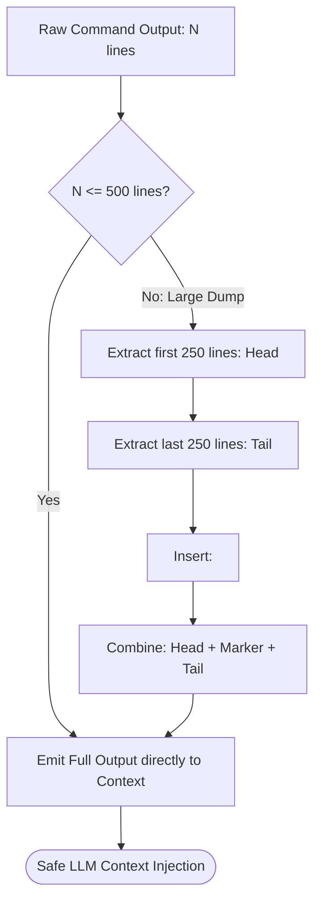

# Cowan Context Budgeting & Stdout Sanitization

---

[Previous: 07-03 Stale Worker & Zombie Recovery](07-03-stale-worker-and-zombie-auto-recovery.md) | [Chapter Index](index.md) | [All Chapters Index](../index.md) | [Next: Chapter 08 Index](../08-adversarial-validation-repair/index.md)
---

## 1. Executive Summary & The Context Degradation Problem

In Large Language Model agent architectures, context size directly impacts reasoning quality, execution latency, and token costs:

- **Lost in the Middle**: As context windows exceed 150,000 tokens, LLM attention mechanisms degrade, leading to ignored system instructions and hallucinated variables.
- **Terminal Stdout Dumps**: Commands like `bun test` or `git log` can emit 10,000+ lines of raw text, consuming the entire context window in a single tool turn.
- **Monolithic Ingestion**: Dumping entire documentation trees and codebases into an agent's initial prompt inflates token costs and crowds out task-specific instructions.

The **OLT (Orchestrating Long Tasks)** engine implements the **Cowan Context Budgeting & Stdout Sanitization Engine**. Under this system:

1. **The Cowan Envelope Bound ($< 150{,}000$ Tokens)**: Total cumulative context per agent turn is strictly bounded below 150,000 Cowan tokens.
2. **Deterministic Stdout Sanitization**: Terminal execution streams are capped and filtered, retaining essential error headers, exit codes, and failure traces while eliding repetitive success logs.
3. **Progressive Disclosure**: Agents query architecture manuals and schemas on-demand via targeted slice endpoints rather than loading full repositories.

```text
┌──────────────────────────────────────────────────────────────────────────────────────────────────┐
│                                 COWAN CONTEXT BUDGET ENVELOPE                                    │
├──────────────────────────────────────────────────────────────────────────────────────────────────┤
│                                                                                                  │
│   [System Instructions & Persona (~4,000 Tokens)]                                                │
│   ├── [Active Task Assignment & Scope (~2,000 Tokens)]                                           │
│   ├── [Progressively Loaded Reference Slices (~10,000 Tokens)]                                   │
│   ├── [Sanitized Tool Execution Briefs (~8,000 Tokens)]                                          │
│   └── [Dynamic Reasoning Working Memory (< 126,000 Tokens)]                                      │
│                                                                                                  │
│   ════════════════════════════════════════════════════════════════════════════════════════════   │
│   TOTAL CONTEXT CEILING: 150,000 COWAN TOKENS (Hard Safety Boundary)                             │
│                                                                                                  │
└──────────────────────────────────────────────────────────────────────────────────────────────────┘
```

---

## 2. Mathematical Formalization of Stdout Sanitization

Let $O_{\text{raw}} = \langle l_1, l_2, \dots, l_N \rangle$ be the sequence of stdout/stderr output lines emitted by a shell command, where $N = |O_{\text{raw}}|$.

Let $L_{\text{max}} = 500$ be the maximum permitted output line envelope.

The **Sanitization Operator** $\mathcal{S}_{\text{stdout}}$ transforms $O_{\text{raw}}$ into context-safe output $O_{\text{sanitized}}$:

$$ \mathcal{S}_{\text{stdout}}(O_{\text{raw}}) = \begin{cases}
O_{\text{raw}} & \text{if } N \le L_{\text{max}} \\
\langle l_1, \dots, l_{250} \rangle \mathbin{\Vert} \big[ \texttt{"<truncated "} \mathbin{\Vert} (N - 500) \mathbin{\Vert} \texttt{" lines>"} \big] \mathbin{\Vert} \langle l_{N-249}, \dots, l_N \rangle & \text{if } N > L_{\text{max}}
\end{cases}$$

```typescript
export function sanitizeStdout(rawOutput: string, maxLines = 500): string {
  const lines = rawOutput.split("\n");
  if (lines.length <= maxLines) return rawOutput;

  const head = lines.slice(0, Math.floor(maxLines / 2));
  const tail = lines.slice(lines.length - Math.floor(maxLines / 2));
  const omissionCount = lines.length - maxLines;

  return [...head, `<truncated ${omissionCount} lines>`, ...tail].join("\n");
}
```



---

## 3. Progressive Disclosure Architecture

The OLT Progressive Disclosure model partitions documentation into three cognitive layers:

```text
┌───────────────────────────┬───────────────────┬──────────────────────────────────────────────────┐
│ Disclosure Layer          │ Context Cost      │ Loading Trigger                                  │
├───────────────────────────┼───────────────────┼──────────────────────────────────────────────────┤
│ 1. Frontmatter Discovery  │ < 500 Tokens      │ At startup; reads SKILL.md name & description    │
├───────────────────────────┼───────────────────┼──────────────────────────────────────────────────┤
│ 2. Task Activation Brief  │ < 3,000 Tokens    │ When claiming task; loads specific requirements  │
├───────────────────────────┼───────────────────┼──────────────────────────────────────────────────┤
│ 3. On-Demand Deep Topics  │ < 15,000 Tokens   │ Progressively queried via file:// and CLI tools  │
└───────────────────────────┴───────────────────┴──────────────────────────────────────────────────┘
```

---

## 4. Token Consumption Accounting in Telemetry

Every subagent turn records its cumulative token metrics into `.olt/telemetry.jsonl`:

```json
{
  "timestamp": "2026-08-29T03:16:30.000Z",
  "actor": "implementer_engine_task-04",
  "tokens_in": 12450,
  "tokens_out": 1820,
  "tokens_cumulative": 14270,
  "cowan_budget_remaining": 135730,
  "status": "COMPLIANT"
}
```

---

## 5. Architectural Invariants Summary

1. **Hard 150k Token Ceiling**: No agent session is permitted to accumulate more than 150,000 tokens without forced compaction.
2. **Zero Unsanitized Dumps**: All tool stdout/stderr streams exceeding 500 lines are mechanically truncated with central omission markers.
3. **On-Demand Progressivity**: Agents query reference manuals dynamically rather than preloading full documentation trees.

---

[Previous: 07-03 Stale Worker & Zombie Recovery](07-03-stale-worker-and-zombie-auto-recovery.md) | [Chapter Index](index.md) | [All Chapters Index](../index.md) | [Next: Chapter 08 Index](../08-adversarial-validation-repair/index.md)
---
$$
