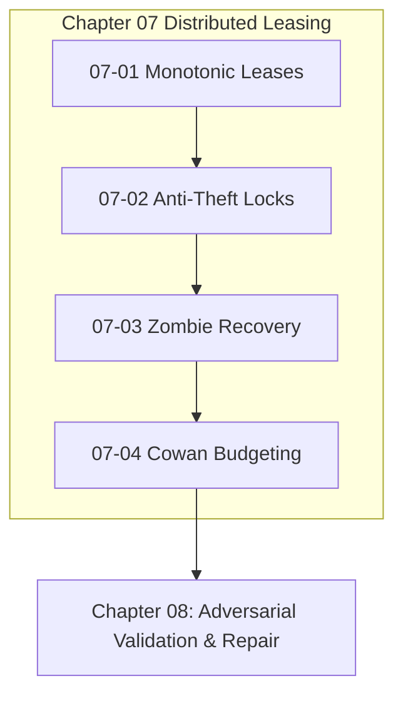

# Chapter 07: Distributed Task Leasing & Execution

---

[Previous: Chapter 06 Index](../06-topological-scheduler-dags/index.md) | [Chapter Index](index.md) | [All Chapters Index](../index.md) | [Next: 07-01 Monotonic Lease Protocol](07-01-monotonic-lease-protocol-and-tokens.md)
---

## 1. Chapter Overview & Leasing Architecture

Welcome to **Chapter 07 of the OLT Architecture Book**. This chapter codifies the distributed leasing protocols, cryptographic fencing tokens, non-blocking heartbeat mechanisms, zombie worker recovery pipelines, and Cowan context budget envelopes governing task execution across the **OLT (Orchestrating Long Tasks)** engine.

In concurrent agentic environments, uncoordinated writes produce split-brain race conditions, while unmonitored subagents produce stalled zombie lanes. Chapter 07 establishes the **Monotonic Lease Protocol & HMAC Fencing Tokens**, details **Heartbeats & Anti-Theft Task Locking**, formalizes **Stale Worker & Zombie Subagent Auto-Recovery**, and defines **Cowan Context Budgeting & Stdout Sanitization**.

```text
┌──────────────────────────────────────────────────────────────────────────────────────────────────┐
│                             CHAPTER 07: LEASING & EXECUTION TOPOLOGY                             │
├──────────────────────────────────────────────────────────────────────────────────────────────────┤
│                                                                                                  │
│    ┌───────────────────────────┐                    ┌───────────────────────────┐                │
│    │ 07-01: Monotonic Lease    │                    │ 07-02: Heartbeats &       │                │
│    │ Protocol & HMAC Tokens    │ ══════════════════►│ Anti-Theft Task Locking   │                │
│    └─────────────┬─────────────┘                    └─────────────┬─────────────┘                │
│                  │                                                │                              │
│                  ▼                                                ▼                              │
│    ┌───────────────────────────┐                    ┌───────────────────────────┐                │
│    │ 07-03: Stale Worker &     │                    │ 07-04: Cowan Context      │                │
│    │ Zombie Auto-Recovery      │ ══════════════════►│ Budgeting & Sanitization  │                │
│    └───────────────────────────┘                    └───────────────────────────┘                │
│                                                                                                  │
└──────────────────────────────────────────────────────────────────────────────────────────────────┘
```

---

## 2. Chapter Table of Contents & Learning Path

```text
┌──────────────────────────────────────────────────┬──────────────┬────────────────────────────────┐
│ Document                                         │ Classification│ Core Architectural Focus       │
├──────────────────────────────────────────────────┼──────────────┼────────────────────────────────┤
│ 07-01 Monotonic Lease Protocol & Tokens          │ Security     │ HMAC tokens, seq & fencing     │
│ 07-02 Heartbeats & Anti-Theft Locking            │ Concurrency  │ Non-blocking ticks & guards    │
│ 07-03 Stale Worker & Zombie Auto-Recovery        │ Reliability  │ 300s SLA, kills & re-queuing   │
│ 07-04 Cowan Token Budgeting & Sanitization       │ Optimization │ 150k context envelope & stdout │
└──────────────────────────────────────────────────┴──────────────┴────────────────────────────────┘
```

### [07-01: Monotonic Lease Protocol & Cryptographic Tokens](07-01-monotonic-lease-protocol-and-tokens.md)

Formalizes HMAC SHA-256 lease token minting, strictly monotonic sequence progression ($\text{seq}_k > \text{seq}_{k-1}$), split-brain invalidation, and POSIX advisory `flock` integration.

### [07-02: Heartbeats & Anti-Theft Task Locking](07-02-heartbeats-and-anti-theft-locking.md)

Deconstructs private mailbox heartbeat writing (`heartbeat.json`), lock-free non-blocking emission, and the mathematical anti-theft claim predicate $\Pi_{\text{theft}}$.

### [07-03: Stale Worker & Zombie Subagent Auto-Recovery](07-03-stale-worker-and-zombie-auto-recovery.md)

Explains the 4-step atomic recovery operator $\mathcal{R}_{\text{zombie}}$, subagent process termination, worktree scrubbing (`git clean -fdx`), and adaptive model re-arming.

### [07-04: Cowan Context Budgeting & Stdout Sanitization](07-04-cowan-token-budgeting-and-sanitization.md)

Details the 150k token Cowan envelope bound, the 500-line stdout sanitization operator $\mathcal{S}_{\text{stdout}}$, and progressive documentation disclosure layers.

---

## 3. Core Leasing Specifications Table

$$ \begin{array}{|l|l|l|}
\hline
\textbf{Mechanism} & \textbf{Formal Expression} & \textbf{Operational Invariant} \\ \hline
\text{HMAC Lease Token} & \text{HMAC}_K(T_i \mathbin{\Vert} A_j \mathbin{\Vert} \tau \mathbin{\Vert} \text{seq}) & \text{Cryptographic claim authorization} \\ \hline
\text{Fencing Sequence} & \text{seq}_k = \text{seq}_{k-1} + 1 & \text{Stale worker write invalidation} \\ \hline
\text{Heartbeat Window} & \text{Now}() - h(T_i) \le 300\text{s} & \text{Anti-theft lock protection} \\ \hline
\text{Reclamation SLA} & \Delta t > 300\text{s} \implies \text{Revoke} & \text{Automatic zombie lease recovery} \\ \hline
\text{Stdout Capping} & |O_{\text{sanitized}}| \le 500 \text{ lines} & \text{Central omission sanitization} \\ \hline
\text{Cowan Envelope} & \text{ContextTokens} < 150{,}000 & \text{Context window degradation guard} \\ \hline
\end{array}$$



---

## 4. Summary & Transition

The distributed leasing protocols and context sanitization guardrails established in Chapter 07 ensure that parallel task execution remains strictly isolated, resilient to crashes, and protected against state corruption.

Proceed to [07-01: Monotonic Lease Protocol](07-01-monotonic-lease-protocol-and-tokens.md) or advance directly to [Chapter 08: Adversarial Validation & Monotonic Repair](../08-adversarial-validation-repair/index.md).

---

[Previous: Chapter 06 Index](../06-topological-scheduler-dags/index.md) | [Chapter Index](index.md) | [All Chapters Index](../index.md) | [Next: 07-01 Monotonic Lease Protocol](07-01-monotonic-lease-protocol-and-tokens.md)
---
$$
