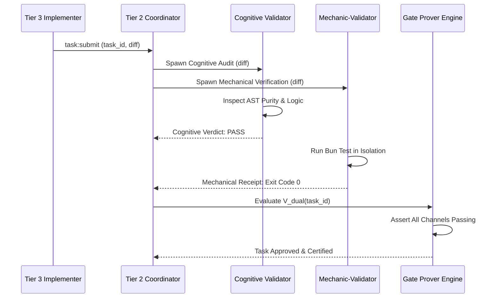

# Adversarial Validation Philosophy & Dual-Channel Verification

---

[Previous: Chapter 08 Index](index.md) | [Chapter Index](index.md) | [All Chapters Index](../index.md) | [Next: 08-02 Cognitive Validator Hard-Lock](08-02-cognitive-validator-command-hard-lock.md)
---

## 1. Executive Summary & Epistemic Skepticism

In automated software engineering pipelines, self-validating agents suffer from a fundamental cognitive flaw: **confirmation bias**. When an agent that wrote a piece of code is asked to review or test it, it naturally focuses on the happy path, accepts superficial test assertions, and overlooks subtle architectural regressions.

The **OLT (Orchestrating Long Tasks)** engine implements the **Adversarial Validation Philosophy & Dual-Channel Verification Architecture**. Under this model:

1. **Skepticism by Default**: Every code modification is treated as potentially defective until proven correct through orthogonal, adversarial inspection.
2. **Orthogonal Validator Pairing**: No implementer agent is ever permitted to validate its own code. An independently spawned Tier 3 Validator is assigned to every task.
3. **Dual-Channel Verification**: A task is only approved when both the Cognitive Channel (static AST logic audit) and the Mechanical Channel (deterministic test runtime) independently certify the diff.

```text
┌──────────────────────────────────────────────────────────────────────────────────────────────────┐
│                                DUAL-CHANNEL VERIFICATION TOPOLOGY                                │
├──────────────────────────────────────────────────────────────────────────────────────────────────┤
│                                                                                                  │
│   ┌──────────────────────────────────────────────────────────────────────────────────────┐       │
│   │                        TIER 3 IMPLEMENTER COMMITS DIFF                               │       │
│   └──────────────────────────────────────────┬───────────────────────────────────────────┘       │
│                                              │                                                   │
│                     ┌────────────────────────┴────────────────────────┐                          │
│                     ▼                                                 ▼                          │
│   ┌──────────────────────────────────┐              ┌──────────────────────────────────┐         │
│   │ CHANNEL 1: COGNITIVE VALIDATOR   │              │ CHANNEL 2: MECHANIC-VALIDATOR    │         │
│   │ • Static AST Purity (0 any)      │              │ • Bun Test Isolation Runner      │         │
│   │ • Logic & Invariant Audit        │              │ • Raw Binary & Exit Code 0 Proof │         │
│   │ • Hard-Locked: 0 CLI Commands    │              │ • Perceptual APCA Verification   │         │
│   └─────────────────┬────────────────┘              └─────────────────┬────────────────┘         │
│                     │                                                 │                          │
│                     └────────────────────────┬────────────────────────┘                          │
│                                              ▼                                                   │
│   ┌──────────────────────────────────────────────────────────────────────────────────────┐       │
│   │ MECHANICAL GATE PROVER: V_adv = CogVerdict(PASS) && MechExitCode(0) && AST(0)        │       │
│   └──────────────────────────────────────────────────────────────────────────────────────┘       │
│                                                                                                  │
└──────────────────────────────────────────────────────────────────────────────────────────────────┘
```

---

## 2. Mathematical Formalization of Dual-Channel Verification

Let $\Delta_i$ represent the code diff produced for task $T_i$.

Let $\mathcal{C}_{\text{cog}}(\Delta_i) \in \{\text{PASS}, \text{REJECT}\}$ denote the verdict emitted by the Cognitive Validator, and let $\mathcal{M}_{\text{mech}}(\Delta_i) = \langle \text{exit\_code}, \text{receipt\_bytes}, \text{ast\_errors} \rangle$ denote the execution output from the Mechanic-Validator.

The **Dual-Channel Verification Predicate** $\mathcal{V}_{\text{dual}}(T_i, \Delta_i)$ is:

$$\mathcal{V}_{\text{dual}}(T_i, \Delta_i) = \big( \mathcal{C}_{\text{cog}}(\Delta_i) = \text{PASS} \big) \land \big( \mathcal{M}_{\text{mech}}(\Delta_i).\text{exit\_code} = 0 \big) \land \big( \mathcal{M}_{\text{mech}}(\Delta_i).\text{ast\_errors} = 0 \big)$$

$$\text{TaskStatus}(T_i) \leftarrow \begin{cases} \text{COMPLETED} & \text{if } \mathcal{V}_{\text{dual}}(T_i, \Delta_i) = 1 \\ \text{REPAIR\_CYCLE} & \text{if } \mathcal{V}_{\text{dual}}(T_i, \Delta_i) = 0 \land k \le 5 \\ \text{HALTED} & \text{if } \mathcal{V}_{\text{dual}}(T_i, \Delta_i) = 0 \land k > 5 \end{cases}$$



---

## 3. The 4 Socratic Review Pushback Invariants

To prevent validators from rubber-stamping diffs, OLT enforces the **Socratic Review Pushback Quota**:

1. **Mandatory Adversarial Probing**: Validators must formulate at least 5 probing counterfactual questions (e.g. "What occurs if `state.json` contains malformed UTF-8?").
2. **Boundary Testing Demands**: Reviewers require explicit unit test assertions for null pointers, zero-length slices, and maximum file fanouts.
3. **Zero Vague Approvals**: Approvals stating generic phrases (e.g. "Looks good to me") are rejected by the harness parser with `INVALID_REVIEW_SUMMARY`.
4. **Structured Finding Escalation**: Any discovered defect must include line-numbered citations and suggested AST remediations.

---

## 4. Integration with the Cognitive Validator Manifest

The validation engine records all verification events into `.olt/capsules/<slug>/evidence/` ([`socratic-validator.ts`](file:///Users/onurseckinsenoglu/repos/skills/olt/scripts/src/reporting/socratic-validator.ts)):

```typescript
export interface ValidationEvidenceBundle {
  readonly taskId: string;
  readonly validatorId: string;
  readonly cognitiveVerdict: "PASS" | "REJECT";
  readonly mechanicalExitCode: number;
  readonly astViolationsCount: number;
  readonly socraticProbes: string[];
  readonly sha256Proof: string;
}
```

---

## 5. Architectural Invariants Summary

1. **Zero Self-Validation**: No agent may certify code it authored.
2. **Dual-Channel Interlock**: A task cannot transition to `COMPLETED` without simultaneous cognitive and mechanical approvals.
3. **Monotonic Convergence**: Review pushbacks must monotonically reduce the remaining defect count in each repair iteration.

---

[Previous: Chapter 08 Index](index.md) | [Chapter Index](index.md) | [All Chapters Index](../index.md) | [Next: 08-02 Cognitive Validator Hard-Lock](08-02-cognitive-validator-command-hard-lock.md)
---
