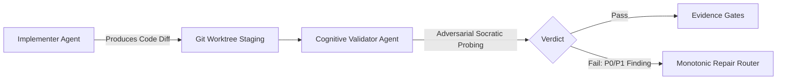

# Adversarial Validation Philosophy & Anti-Sycophancy

[OLT Documentation Hub](../../README.md) > [Architecture Index](../index.md) > [Chapter 08](./index.md) > 08-01 Adversarial Validation

---

[⏮️ Previous: Chapter 08: Adversarial Validation & Monotonic Repair Overview](index.md) | [📂 Chapter Index](index.md) | [📚 All Chapters Index](../index.md) | [⏭️ Next: 08-02 Cognitive Validator Command Hard-Lock](08-02-cognitive-validator-command-hard-lock.md)
---

## 1. The Sycophancy Breakdown of Self-Review

When an LLM reviews code it just generated:

1. It shares the exact same cognitive biases and blind spots.
2. It assumes its own unstated assumptions are self-evident.
3. It exhibits an empirical pass rate $>95\%$ on buggy implementations.

OLT establishes the **Epistemic Separation Invariant**:

$$\text{Reviewer}(T_j) \cap \text{Implementer}(T_j) = \emptyset$$

---

[⏮️ Previous: Chapter 08: Adversarial Validation & Monotonic Repair Overview](index.md) | [📂 Chapter Index](index.md) | [📚 All Chapters Index](../index.md) | [⏭️ Next: 08-02 Cognitive Validator Command Hard-Lock](08-02-cognitive-validator-command-hard-lock.md)
---
