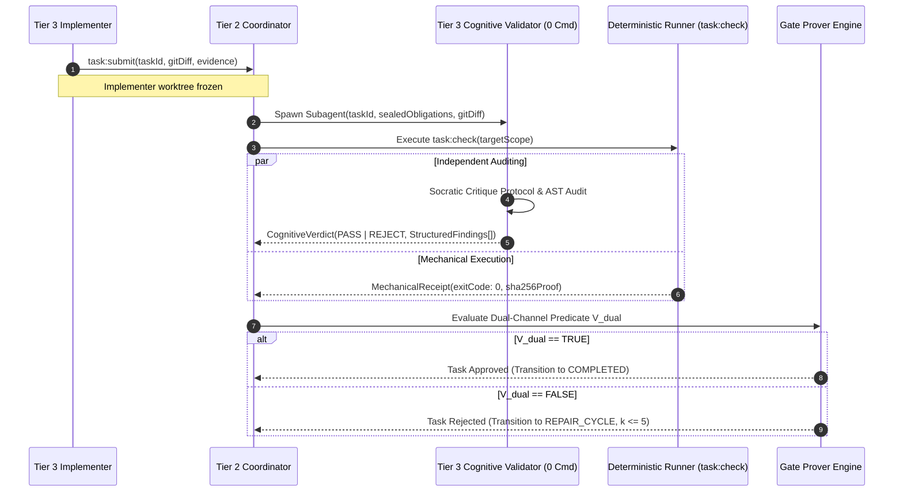

# 08-01 Adversarial Validation Philosophy & Dual-Channel Verification

---

[Previous: Chapter 08: Adversarial Validation & Repair](index.md) | [Chapter Index](index.md) | [All Chapters Index](../index.md) | [Next: 08-02 Cognitive Validator Command Hard-Lock](08-02-cognitive-validator-command-hard-lock.md)

---

## 1. Executive Summary & Epistemic Skepticism

In autonomous multi-agent software engineering systems powered by LLMs, single-agent validation is vulnerable to **confirmation bias**. When the same agent that authored a patch inspects its own output, systematic failure modes emerge:

- **Sympathetic Bias**: The author agent re-evaluates its original assumptions as valid, skipping edge cases and boundary conditions neglected during code generation.
- **Tautological Test Construction**: Author agents frequently write tests that assert implementation details rather than domain invariants, or produce hollow assertions (e.g., `expect(true).toBe(true)`).
- **Context Pollution & Blind Spots**: The author agent's active context window contains conversational scaffolding and scratchpad memory that masks uncommitted dependencies or missing imports.

The **OLT (Orchestrating Long Tasks)** engine enforces the **Adversarial Validation Philosophy**:

1. **Orthogonal Role Isolation**: Every implementation diff is evaluated by an independently spawned Tier 3 Validator that shares zero context, memory, or scratchpad state with the Implementer.
2. **Dual-Channel Verification**: A task is approved if and only if both the **Cognitive Channel** (pure static AST logic and architecture auditing) and the **Mechanical Channel** (deterministic CLI test execution via `task:check` / `ui-headless-validator`) independently certify the submission.
3. **Skepticism by Default**: The validation harness assumes all submitted diffs contain defects until formal, falsifiable proof of correctness is rendered.

```text
+--------------------------------------------------------------------------------------------------+
│                                ADVERSARIAL VALIDATION RING TOPOLOGY                              │
+--------------------------------------------------------------------------------------------------+
│   ┌────────────────────────────────────┐             ┌────────────────────────────────────┐      │
│   │         TIER 3 IMPLEMENTER         │             │     TIER 3 COGNITIVE VALIDATOR     │      │
│   │  - Role: Code Authoring            │             │  - Role: Adversarial Code Audit    │      │
│   │  - Grant: Full FS & Test Runners   │             │  - Grant: STRICTLY READ-ONLY (0 Cmd) │    │
│   │  - Output: Commit Diff + Artifacts │             │  - Output: Structured Findings     │      │
│   └─────────────────┬──────────────────┘             └─────────────────┬──────────────────┘      │
│                     │ (1) task:submit(Diff)                            │ (3) Verdict: PASS/REJECT│
│                     ▼                                                  ▼                         │
│   ┌───────────────────────────────────────────────────────────────────────────────────────┐      │
│   │                              TIER 2 SCHEDULER & COORDINATOR                           │      │
│   │  - Enforces 1:1 Agent Isolation & Clean Subagent Spawning                             │      │
│   │  - Evaluates Dual-Channel Predicate V_dual(Diff) = CogPass && Exit0 && AST0           │      │
│   └─────────────────┬──────────────────────────────────────────────────┬──────────────────┘      │
│                     │ (2) Spawn Mechanical Runner (task:check)         │ (4) Gate Certification  │
│                     ▼                                                  ▼                         │
│   ┌────────────────────────────────────┐             ┌────────────────────────────────────┐      │
│   │   MECHANICAL RUNNER (task:check)   │             │       GATE PROVER ENGINE           │      │
│   │  - Role: Deterministic Test Runner │             │  - Assert: CogPass && Exit0 && AST0│      │
│   │  - Grant: Hermetic CLI execution   │             │  - Result: Task Certified or Replan│      │
│   │  - Output: Binary Proofs & Receipts│             └────────────────────────────────────┘      │
│   └────────────────────────────────────┘                                                         │
+--------------------------------------------------------------------------------------------------+
```

---

## 2. 1:1 Single-Implementer Single-Validator Isolation

To eliminate conversational pollution and shared-state collusion, OLT enforces **1:1 Agent Isolation**. When task $T_i$ completes implementation, the Coordinator freezes the implementer's worktree and spawns an independent validator subagent.

- **Context Window Decoupling**: The validator receives only the sealed task obligation derived from `prompt.md`, the clean repository working tree, and the isolated Git diff (`git diff HEAD~1`). It receives zero internal chain-of-thought tokens or scratchpad notes from the implementer.
- **Lifespan Decoupling**: The validator is an ephemeral subagent spawned solely for the duration of the audit cycle, possessing no shared memory with preceding runs.
- **Asymmetric Authority**: The implementer holds write permissions in its worktree; the validator holds strictly zero write permissions and zero shell execution permissions.



---

## 3. The Socratic Critique Protocol

Cognitive validators execute five mandatory Socratic review probes before rendering a verdict:

1. **Assumption Probing**: What implicit preconditions does this patch require that are not validated at runtime?
2. **Boundary Condition Testing**: How does this implementation behave under zero, empty, maximum-capacity, or disconnected network inputs?
3. **Failure Mode Analysis**: If an upstream call rejects or a filesystem write fails mid-stream, what guarantees prevent corrupted state?
4. **Invariant Auditing**: Does the patch preserve repository-wide invariants (0 `any`, atomic renames, flock locks)?
5. **Concurrency Scrutiny**: Can concurrent workers executing with disjoint write scopes experience dirty read contamination from this change?

---

## 4. Mathematical Defect Escape Model

Let $p_{\text{def}} \in (0, 1)$ be the prior probability that an implementer introduces a defect $\delta \in \Delta$.
Let $\beta_{\text{self}} \in (0.4, 0.8)$ be the false-negative rate of self-validation (high confirmation bias).
Let $\beta_{\text{cog}} \in (0.05, 0.15)$ be the false-negative rate of an isolated cognitive validator.
Let $\beta_{\text{mech}} \in (0.01, 0.05)$ be the false-negative rate of deterministic test suites.

Under self-review: $P(\text{Escape}_{\text{self}}) = p_{\text{def}} \cdot \beta_{\text{self}}$.
Under OLT dual-channel adversarial verification, assuming cognitive and mechanical misses are conditionally independent:

$$P(\text{Escape}_{\text{OLT}}) = p_{\text{def}} \cdot \beta_{\text{cog}} \cdot \beta_{\text{mech}} \ll P(\text{Escape}_{\text{self}})$$

With $p_{\text{def}} = 0.20, \beta_{\text{self}} = 0.60, \beta_{\text{cog}} = 0.10, \beta_{\text{mech}} = 0.02$:

$$P(\text{Escape}_{\text{self}}) = 0.12 \quad (12\%), \qquad P(\text{Escape}_{\text{OLT}}) = 0.20 \cdot 0.10 \cdot 0.02 = 0.0004 \quad (0.04\%)$$

Adversarial dual-channel verification delivers a **$300\times$ defect escape reduction**.

---

## 5. TypeScript Validation Contracts & Interlock Types

```typescript
export interface SocraticProbeRecord {
  readonly probeType: "ASSUMPTION" | "BOUNDARY" | "FAILURE_MODE" | "INVARIANT" | "CONCURRENCY";
  readonly hypothesis: string;
  readonly evidenceLocation: string;
  readonly outcome: "VERIFIED_SAFE" | "DEFECT_FOUND";
  readonly details: string;
}

export interface CognitiveValidationVerdict {
  readonly taskId: string;
  readonly validatorId: string;
  readonly decision: "PASS" | "REJECT";
  readonly socraticProbes: readonly SocraticProbeRecord[];
  readonly structuredFindings: readonly string[];
  readonly astPurityVerified: boolean;
  readonly timestamp: string;
}

export interface DualChannelGateResult {
  readonly cognitiveVerdict: CognitiveValidationVerdict;
  readonly mechanicalExitCode: number;
  readonly astViolationsCount: number;
  readonly isCertified: boolean;
  readonly certificationHash?: string | undefined;
}

export function evaluateDualChannelGate(
  cognitive: CognitiveValidationVerdict,
  mechanicalExitCode: number,
  astViolationsCount: number,
): DualChannelGateResult {
  const isCertified =
    cognitive.decision === "PASS" &&
    mechanicalExitCode === 0 &&
    astViolationsCount === 0 &&
    cognitive.socraticProbes.length >= 5;

  return {
    cognitiveVerdict: cognitive,
    mechanicalExitCode,
    astViolationsCount,
    isCertified,
  };
}
```

---

## 6. Anti-Blunder Matrix & Failure Diagnostics

| Blunder Identifier             | Pathology / Symptom                                | Root Cause                                              | Architectural Mitigation                                                |
| :----------------------------- | :------------------------------------------------- | :------------------------------------------------------ | :---------------------------------------------------------------------- |
| `ERR_COLLUSIVE_VALIDATION`     | Implementer reviews own patch.                     | Assigning validation role to author agent.              | Strict 1:1 role separation enforced by Coordinator.                     |
| `ERR_SHALLOW_RUBBER_STAMP`     | Validator passes patch without substantive review. | Generic prose approval without probe evidence.          | Mandatory quota of 5 Socratic probe records required.                   |
| `ERR_CONTEXT_BLEED`            | Validator inherits author scratchpad tokens.       | Re-using agent conversation session.                    | Clean subagent spawning with fresh context window.                      |
| `ERR_MECHANICAL_GATE_OMISSION` | Code approved without running tests.               | Relying solely on cognitive review without CLI receipt. | Enforce dual-channel conjunction predicate $\mathcal{V}_{\text{dual}}$. |

---

## 7. Architectural Invariants Summary

1. **Zero Self-Certification**: Under no circumstances may an agent role that authored code certify that code.
2. **Orthogonal Context Hygiene**: Cognitive validators receive exclusively the Git diff, repository files, and sealed obligations.
3. **Mandatory Socratic Quota**: Every review bundle requires a minimum of 5 formal Socratic probe records.
4. **Dual-Channel Conjunction**: Approval requires simultaneous cognitive approval, zero AST violations, and mechanical exit code 0.

---

[Previous: Chapter 08: Adversarial Validation & Repair](index.md) | [Chapter Index](index.md) | [All Chapters Index](../index.md) | [Next: 08-02 Cognitive Validator Command Hard-Lock](08-02-cognitive-validator-command-hard-lock.md)

---
