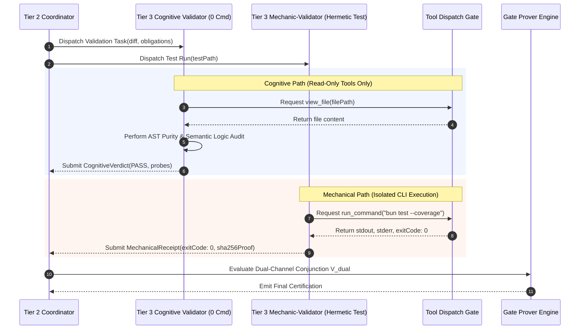

# 08-02 Cognitive Validator Command Hard-Lock Interlock

---

[Previous: 08-01 Adversarial Validation Philosophy](08-01-adversarial-validation-philosophy.md) | [Chapter Index](index.md) | [All Chapters Index](../index.md) | [Next: 08-03 Meta-Auditor Seven Forensic Heuristics](08-03-meta-auditor-seven-forensic-heuristics.md)

---

## 1. Executive Summary & The Validator Compromise Vulnerability

In autonomous agent architectures, granting command execution capabilities to code validator agents introduces severe security, reliability, and epistemic vulnerabilities:

1. **Test Harness Mutation**: A validator with shell access may rewrite test suites, inject permissive mocks, or loosen assertion thresholds to force failing tests to pass, hiding underlying defects.
2. **Terminal Exit Code Spoofing**: An hallucinating or compromised validator can execute shell commands that forge exit status 0 (e.g., `true` or dummy scripts) without performing real semantic code verification.
3. **Epistemic Collapse**: When validators execute tests directly, their reasoning collapses into shallow CLI feedback loops (checking exit codes) rather than performing rigorous AST logic, invariant, and architectural analysis.
4. **Prompt Injection & Byzantine Execution**: If an untrusted diff contains embedded prompt injection payloads (e.g., in code comments, error strings, or test fixtures), a validator with shell execution privileges could be coerced into running arbitrary host commands.

The **OLT (Orchestrating Long Tasks)** engine implements the **Cognitive Validator Command Hard-Lock Interlock**. Under this architecture:

- **Mechanical Command Lock (0 Commands)**: The Cognitive Validator role ([`validator.yaml`](../../../../olt/agents/validator.yaml)) is mechanically stripped of all shell command execution tools: $\text{Commands}(\text{Validator}) \equiv \emptyset$.
- **Pure AST & Semantic Auditing**: Validators operate strictly via read-only tools (`view_file`, `grep_search`, `find_by_name`) and AST inspection logic.
- **Decoupled Mechanic-Validator**: All runtime test execution is isolated in a separate, dedicated Mechanic-Validator ([`mechanic-validator.yaml`](../../../../olt/agents/mechanic-validator.yaml)).

```text
+--------------------------------------------------------------------------------------------------+
|                               COGNITIVE VALIDATOR HARD-LOCK TOPOLOGY                             |
+--------------------------------------------------------------------------------------------------+
|                                                                                                  |
|   +--------------------------------------------------------------------------------------+       |
|   |                        TIER 3 COGNITIVE VALIDATOR (Pure Audit)                       |       |
|   |  - Permitted Tools: view_file, grep_search, find_by_name, send_message               |       |
|   |  - PROHIBITED TOOLS: run_command, execute_script, bash (0 Commands Granted)          |       |
|   +------------------------------------------+-------------------------------------------+       |
|                                              |                                                   |
|                        Tool Invocation Request: action a                                         |
|                                              v                                                   |
|   +--------------------------------------------------------------------------------------+       |
|   |                       HARNESS RBAC INTERCEPTOR & PERMISSION GATE                     |       |
|   |                                                                                      |       |
|   |    Is a in {run_command, execute_script, bash}?                                      |       |
|   |       |                                                                              |       |
|   |       +--- YES ---> [ TRAP: COMMAND_HARD_LOCKED ] ---> Revoke Lease & Terminate Agent|       |
|   |       |                                                                              |       |
|   |       +--- NO  ---> [ PASS TO READ DISPATCHER ] ---> Execute view_file / AST inspect |       |
|   +--------------------------------------------------------------------------------------+       |
|                                                                                                  |
+--------------------------------------------------------------------------------------------------+
```

---

## 2. The Mechanic-Validator Split Architecture

To achieve complete separation between cognitive reasoning and runtime execution, OLT decouples validation into two specialized Tier 3 agent roles.

```text
+---------------------------+------------------------------------------+---------------------------+
| Architectural Dimension   | Tier 3 Cognitive Validator               | Tier 3 Mechanic-Validator |
+---------------------------+------------------------------------------+---------------------------+
| Primary Mission           | Static AST purity, semantics, logic      | Deterministic test suite  |
|                           | invariants, edge case analysis.          | execution & exit codes.   |
+---------------------------+------------------------------------------+---------------------------+
| Shell Command Authority   | STRICTLY 0 (Hard-Locked, No run_command) | ALLOWED (Hermetic bun)    |
+---------------------------+------------------------------------------+---------------------------+
| File System Mutation      | STRICTLY 0 (Read-Only)                   | STRICTLY 0 (Read-Only)    |
+---------------------------+------------------------------------------+---------------------------+
| Input Artifacts           | Git diff, prompt obligations, AST tree   | Repository worktree       |
+---------------------------+------------------------------------------+---------------------------+
| Output Evidence           | Structured findings JSON + Socratic logs | Execution receipt (exit 0)|
+---------------------------+------------------------------------------+---------------------------+
| Execution Isolation       | Zero IPC with implementer                | Isolated container/chroot |
+---------------------------+------------------------------------------+---------------------------+
```

### Cognitive vs. Mechanical Evaluation Pathways

1. **Cognitive Validator**:
   - Analyzes raw Git diffs for logic regressions, unchecked assumptions, and type suppressions (`any`, `@ts-ignore`).
   - Verifies adherence to the 4 Hard Zeros ($Z_{\text{hallucination}}, Z_{\text{mutation}}, Z_{\text{scope}}, Z_{\text{assumption}}$).
   - Formulates Socratic counterfactual inquiries and compiles structured defect findings.
   - Traces call graphs statically to verify error handling completeness without executing instructions.

2. **Mechanic-Validator**:
   - Executes unit, integration, and contract test suites within a hermetically sealed environment.
   - Captures raw process exit codes, stdout/stderr streams, and wall-clock execution timings.
   - Generates cryptographically hashed execution receipts ($\mathcal{S}_{\text{proof}}$) verified by the Gate Prover.



---

## 3. Fail-Closed Permission Enforcement & RBAC Hard-Locks

The command hard-lock is enforced at the platform harness layer, independent of agent prompt instructions. Even if an LLM validator attempts to generate a `run_command` tool invocation, the tool dispatcher intercepts and terminates the action.

### The RBAC Tool Interception Algorithm

Let $\mathcal{A}_{\text{exec}} = \{\texttt{"run\_command"}, \texttt{"execute\_script"}, \texttt{"bash"}, \texttt{"terminal\_exec"}\}$ denote the set of execution tools.

When role $R$ requests execution of tool $t \in \mathcal{T}_{\text{tools}}$:

$$ \text{AuthorizeTool}(R, t) = \begin{cases}
\text{ALLOW} & \text{if } t \in \text{PermittedTools}(R) \land (R \neq \text{Validator} \lor t \notin \mathcal{A}_{\text{exec}}) \\
\text{TRAP}(\texttt{"COMMAND\_HARD\_LOCKED"}) & \text{if } R = \text{Validator} \land t \in \mathcal{A}_{\text{exec}} \\
\text{DENY}(\texttt{"PERMISSION\_DENIED"}) & \text{otherwise}
\end{cases}$$

Upon encountering a `COMMAND_HARD_LOCKED` trap:
1. The active tool call is immediately aborted before spawning any child process.
2. The validator agent's active lease is revoked.
3. A fatal security violation event is written to the capsule audit log.
4. The Tier 2 Coordinator re-spawns a clean validator subagent instance.

```text
+--------------------------------------------------------------------------------------------------+
|                              FAIL-CLOSED INTERCEPTION STATE MACHINE                              |
+--------------------------------------------------------------------------------------------------+
|                                                                                                  |
|   [Agent Requests Tool Action]                                                                   |
|                 │                                                                                |
|                 ▼                                                                                |
|   [Check Role Manifest in role-contract.ts]                                                      |
|                 │                                                                                |
|        ┌────────┴────────┐                                                                       |
|        ▼                 ▼                                                                       |
|   (Role != Validator)  (Role == Validator)                                                       |
|        │                 │                                                                       |
|        ▼                 ▼                                                                       |
|   [Standard Auth]      [Check IsExecutionTool(t)]                                                |
|                          │                                                                       |
|                 ┌────────┴────────┐                                                              |
|                 ▼                 ▼                                                              |
|              (False)            (True)                                                           |
|                 │                 │                                                              |
|                 ▼                 ▼                                                              |
|          [Execute Read]     [HALT: COMMAND_HARD_LOCKED]                                          |
|                             [Emit Security Alert to Log]                                         |
|                             [Revoke Active Lease Token]                                          |
|                                                                                                  |
+--------------------------------------------------------------------------------------------------+
```

---

## 4. Pure AST & Diff Cognitive Auditing Mechanics

Because cognitive validators cannot execute tests, they employ static analysis techniques to verify code diffs:

1. **AST Purity Traversal**: Parsing modified TypeScript source files into Abstract Syntax Trees using the TypeScript compiler API. Traversal visitors identify explicit or implicit `any` annotations, type casts, and `@ts-ignore` comments.
2. **Control Flow Graph (CFG) Verification**: Validating that all branching paths return valid values, throw structured exceptions, or cleanly terminate without orphaned promises.
3. **Boundary Condition Probing**: Manually checking boundary input constants (e.g., zero, negative integers, null strings, max integers) across public API surfaces.
4. **Invariant Tracing**: Ensuring that distributed leasing constraints (e.g., POSIX flock locks, atomic file rename operations) are maintained across all mutated files.

---

## 5. Mathematical Formalization of Confinement & Safety Guarantees

Let $\mathcal{S}$ denote the repository state and $\mathcal{E}$ denote the external environment.

Let an agent action $a = \langle t, \text{args} \rangle$ operate on the state space $\mathcal{S} \times \mathcal{E}$.

### The Read-Only Confinement Theorem

For all actions $a$ issued by a Cognitive Validator $V_{\text{cog}}$:

$$\forall a \in \text{Actions}(V_{\text{cog}}), \quad \Delta \mathcal{S}(a) = \emptyset \quad \land \quad \Delta \mathcal{E}(a) = \emptyset$$

### Byzantine Prompt Injection Immunity

Let $\mathcal{P}_{\text{inj}} \subset \Delta_i$ represent an adversarial prompt injection payload embedded within an audited code diff.

Let $\text{Evaluate}(V_{\text{cog}}, \Delta_i)$ represent the validator's cognitive processing loop.

Because the execution capability is structurally disconnected at the harness dispatcher:

$$\text{CommandsExecuted}(\text{Evaluate}(V_{\text{cog}}, \Delta_i \cup \mathcal{P}_{\text{inj}})) \equiv \emptyset$$

This proves that even under arbitrary prompt injection attacks embedded in audited code, the Cognitive Validator cannot execute malicious host instructions, ensuring complete isolation of the host operating system.

---

## 6. TypeScript Validator Capability & Permission Schemas

The TypeScript interfaces defining the RBAC contract and tool dispatcher guards are implemented in [`role-contract.ts`](../../../../olt/scripts/src/packets/role-contract.ts):

```typescript
export interface RoleCapabilityContract {
  readonly roleName: "implementer" | "validator" | "mechanic_validator" | "coordinator";
  readonly permittedTools: readonly string[];
  readonly prohibitedTools: readonly string[];
  readonly commandExecutionGranted: boolean;
  readonly fileSystemWriteGranted: boolean;
  readonly maxMemoryMb: number;
  readonly timeoutMs: number;
}

export const COGNITIVE_VALIDATOR_CONTRACT: RoleCapabilityContract = {
  roleName: "validator",
  permittedTools: [
    "view_file",
    "grep_search",
    "find_by_name",
    "send_message",
  ],
  prohibitedTools: [
    "run_command",
    "write_to_file",
    "replace_file_content",
    "notebook_edit",
  ],
  commandExecutionGranted: false,
  fileSystemWriteGranted: false,
  maxMemoryMb: 512,
  timeoutMs: 180000,
};

export interface SecurityViolationEvent {
  readonly eventId: string;
  readonly agentId: string;
  readonly role: string;
  readonly attemptedTool: string;
  readonly payloadSnippet: string;
  readonly timestamp: string;
  readonly actionTaken: "ABORT_AND_REVOKE_LEASE";
}

export class CommandHardLockInterceptor {
  private readonly contract: RoleCapabilityContract;

  constructor(contract: RoleCapabilityContract) {
    this.contract = contract;
  }

  public validateToolDispatch(toolName: string, args: Record<string, unknown>): void {
    if (!this.contract.commandExecutionGranted && this.isExecutionTool(toolName)) {
      throw new Error(
        `HARNESS_SECURITY_VIOLATION: Role '${this.contract.roleName}' is hard-locked from executing command tools ('${toolName}').`,
      );
    }

    if (!this.contract.permittedTools.includes(toolName)) {
      throw new Error(
        `PERMISSION_DENIED: Tool '${toolName}' is not in permitted list for role '${this.contract.roleName}'.`,
      );
    }
  }

  private isExecutionTool(toolName: string): boolean {
    const executionTools = new Set(["run_command", "execute_script", "bash", "exec"]);
    return executionTools.has(toolName);
  }
}
```

---

## 7. Failure Modes & Security Guarantees Matrix

```text
+--------------------------------------------------------------------------------------------------+
|                               FAILURE MODES & SECURITY GUARANTEES                                |
+--------------------------+------------------------------+----------------------------------------+
| Failure Vector           | Vulnerability Without Lock   | OLT Hard-Lock Defense Mechanism        |
+--------------------------+------------------------------+----------------------------------------+
| Test Suite Rewriting     | Validator edits tests to     | File system write tools prohibited;    |
|                          | force failing tests to pass. | validator is strictly read-only.       |
+--------------------------+------------------------------+----------------------------------------+
| Fake Exit Code 0         | Validator executes `exit 0`  | Command tools hard-locked; only        |
|                          | without running real tests.  | Mechanic-Validator can run test CLI.   |
+--------------------------+------------------------------+----------------------------------------+
| Host OS Exploitation     | Prompt injection in diff     | Zero shell access prevents execution   |
|                          | triggers malicious command.  | of arbitrary injected shell commands.  |
+--------------------------+------------------------------+----------------------------------------+
| Flaky Test Masking       | Validator loops test rerun   | Mechanic-Validator records exact seed, |
|                          | until accidental green exit. | timing, and single-pass test results.  |
+--------------------------+------------------------------+----------------------------------------+
| Cognitive Laziness       | Validator relies on CLI test | Validator forced to perform deep AST   |
|                          | output instead of AST logic. | and control-flow invariant inspection. |
+--------------------------+------------------------------+----------------------------------------+
| Environment Bleed        | Validator mutates env vars   | Subagent isolation prevents validator  |
|                          | during execution testing.    | from altering process environment.     |
+--------------------------+------------------------------+----------------------------------------+
```

---

## 8. Architectural Invariants & Security Checklist

1. **Zero Execution Grant Invariant**: $\text{Commands}(\text{Validator}_{\text{cog}}) \equiv \emptyset$. Cognitive validators have zero permission to execute terminal commands.
2. **Read-Only Confinement Invariant**: Cognitive validators have zero permission to modify, create, or delete workspace files.
3. **Decoupled Execution Invariant**: All CLI test execution and binary artifact verification must be handled exclusively by the Mechanic-Validator.
4. **Fail-Closed Trap Invariant**: Any attempt by a cognitive validator to invoke execution tools must trigger an immediate fatal trap, revoking agent authorization.
5. **Deterministic Receipt Invariant**: Mechanical execution receipts must include SHA-256 digests of test runner stdout and stderr streams.
6. **Audit Trail Persistence Invariant**: All security violation events must be permanently logged to `.olt/capsules/<slug>/evidence/security-audit.json`.

---

[Previous: 08-01 Adversarial Validation Philosophy](08-01-adversarial-validation-philosophy.md) | [Chapter Index](index.md) | [All Chapters Index](../index.md) | [Next: 08-03 Meta-Auditor Seven Forensic Heuristics](08-03-meta-auditor-seven-forensic-heuristics.md)

---
$$
