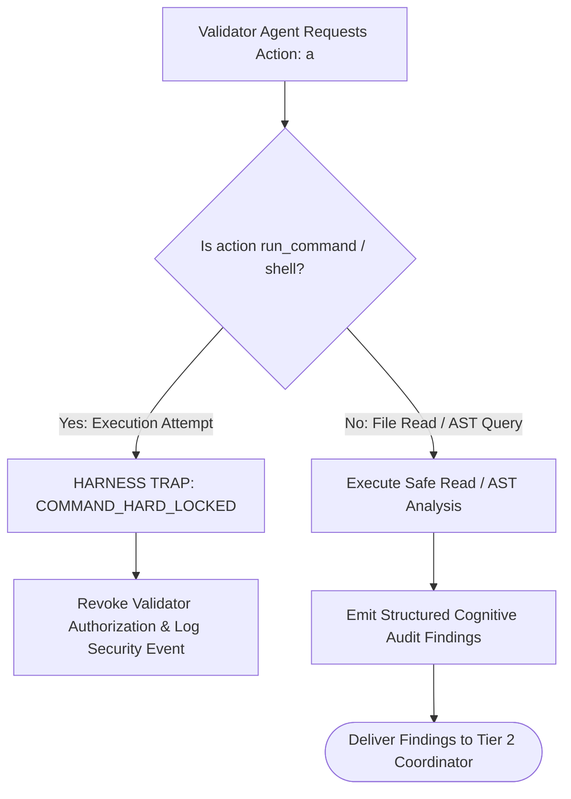

# Cognitive Validator Command Hard-Lock Interlock

---

[Previous: 08-01 Adversarial Validation Philosophy](08-01-adversarial-validation-philosophy.md) | [Chapter Index](index.md) | [All Chapters Index](../index.md) | [Next: 08-03 Meta-Auditor 7 Heuristics](08-03-meta-auditor-seven-forensic-heuristics.md)
---

## 1. Executive Summary & The Validator Compromise Vulnerability

In autonomous agent systems, giving validator agents the ability to run shell commands or execute tests directly introduces a critical vulnerability:

1. **Validator Mutation of Test Harnesses**: A validator with shell access might rewrite test scripts or inject mocks to force tests to pass, concealing underlying implementation defects.
2. **Terminal Command Fabrication**: Compromised or hallucinating validators can execute arbitrary scripts that forge passing exit codes without performing rigorous semantic audits.
3. **Loss of Separation of Concerns**: When a single agent performs both cognitive reasoning and test execution, cognitive depth collapses into shallow CLI script execution.

The **OLT (Orchestrating Long Tasks)** engine implements the **Cognitive Validator Command Hard-Lock Interlock**. Under this architecture:

1. **Mechanical Command Execution Lock (0 Commands)**: The Cognitive Validator role ([`validator.yaml`](file:///Users/onurseckinsenoglu/repos/skills/olt/agents/validator.yaml)) is mechanically stripped of all shell command execution tools: $\text{Commands}(\text{Validator}) \equiv \emptyset$.
2. **Pure Cognitive & AST Inspection**: Validators operate strictly via read tools (`view_file`, `grep_search`) and AST analyzers, evaluating semantic invariants and logic purity.
3. **Decoupled Mechanic-Validator**: All runtime test execution is delegated to the independent Mechanic-Validator ([`mechanic-validator.yaml`](file:///Users/onurseckinsenoglu/repos/skills/olt/agents/mechanic-validator.yaml)).

```text
┌──────────────────────────────────────────────────────────────────────────────────────────────────┐
│                               COGNITIVE VALIDATOR HARD-LOCK TOPOLOGY                             │
├──────────────────────────────────────────────────────────────────────────────────────────────────┤
│                                                                                                  │
│   ┌──────────────────────────────────────────────────────────────────────────────────────┐       │
│   │                        TIER 3 COGNITIVE VALIDATOR (Pure Audit)                       │       │
│   │  • Permitted Tools: view_file, grep_search, find_by_name, send_message               │       │
│   │  • PROHIBITED TOOLS: run_command, execute_script, bash (0 Commands Allowed)          │       │
│   └──────────────────────────────────────────┬───────────────────────────────────────────┘       │
│                                              │                                                   │
│                                              ▼                                                   │
│   ┌──────────────────────────────────────────────────────────────────────────────────────┐       │
│   │ HARNESS INTERCEPTOR: Any run_command call by Validator -> TRAP: COMMAND_HARD_LOCKED  │       │
│   └──────────────────────────────────────────────────────────────────────────────────────┘       │
│                                                                                                  │
└──────────────────────────────────────────────────────────────────────────────────────────────────┘
```

---

## 2. Mathematical Formalization of Role Authority Confinement

Let $\mathcal{R}$ denote the set of agent roles and $\mathcal{T}_{\text{tools}}$ denote the toolset exposed by the harness.

Let $\text{Tools}: \mathcal{R} \rightarrow \mathcal{P}(\mathcal{T}_{\text{tools}})$ map each role to its permitted tools.

The **Hard-Lock Interlock Invariant** enforces:

$$\text{run\_command} \notin \text{Tools}(\text{Validator})$$

$$\forall a \in \mathcal{A}_{\text{actions}}, \quad \big( \text{Role}(A) = \text{Validator} \land \text{IsShellExecution}(a) \big) \implies \text{Halt}(\texttt{"COMMAND\_HARD\_LOCKED"})$$



---

## 3. Role Separation: Cognitive Validator vs. Mechanic-Validator

```text
┌───────────────────────────┬──────────────────────────────────────────┬───────────────────────────┐
│ Attribute                 │ Cognitive Validator                      │ Mechanic-Validator        │
├───────────────────────────┼──────────────────────────────────────────┼───────────────────────────┤
│ Primary Focus             │ AST purity, logic, types, edge cases     │ Test suite execution      │
├───────────────────────────┼──────────────────────────────────────────┼───────────────────────────┤
│ Terminal Command Authority│ STRICTLY 0 (Hard-Locked)                 │ ALLOWED (bun test, etc.)  │
├───────────────────────────┼──────────────────────────────────────────┼───────────────────────────┤
│ File Edit Authority       │ STRICTLY 0 (Read-Only)                   │ STRICTLY 0 (Read-Only)    │
├───────────────────────────┼──────────────────────────────────────────┼───────────────────────────┤
│ Primary Evidence Output   │ Structured Socratic findings JSON        │ Binary receipts & exit 0  │
└───────────────────────────┴──────────────────────────────────────────┴───────────────────────────┘
```

---

## 4. Mechanical RBAC Enforcement in Harness Source

The RBAC enforcement engine ([`role-contract.ts`](file:///Users/onurseckinsenoglu/repos/skills/olt/scripts/src/packets/role-contract.ts)) verifies command permissions during tool dispatch:

```typescript
export function assertRoleCommandPermission(role: string, command: string): void {
  const contract = loadRoleContract(role);
  if (!contract.commands.includes(command)) {
    throw new HarnessError(
      "PERMISSION_DENIED",
      `Role ${role} is hard-locked from executing command ${command}`,
    );
  }
}
```

---

## 5. Architectural Invariants Summary

1. **Zero Command Bypass**: Cognitive validators cannot execute shell commands under any configuration.
2. **Uncorrupted Verification**: Test runners and cognitive reviews remain completely decoupled, preventing mutual masking.
3. **Fail-Closed Security**: Any attempt by a validator to bypass the interlock raises a fatal security exception.

---

[Previous: 08-01 Adversarial Validation Philosophy](08-01-adversarial-validation-philosophy.md) | [Chapter Index](index.md) | [All Chapters Index](../index.md) | [Next: 08-03 Meta-Auditor 7 Heuristics](08-03-meta-auditor-seven-forensic-heuristics.md)
---
