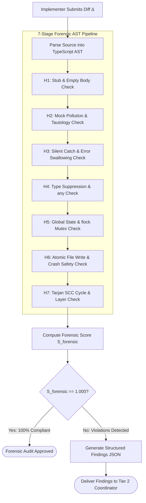

# 08-03 Meta-Auditor Seven Forensic Heuristics

---

[Previous: 08-02 Cognitive Validator Command Hard-Lock](08-02-cognitive-validator-command-hard-lock.md) | [Chapter Index](index.md) | [All Chapters Index](../index.md) | [Next: 08-04 Structured Findings & Monotonic Repair](08-04-structured-findings-and-monotonic-repair.md)

---

## 1. Executive Summary & Epistemic Grounding

Standard syntax linters and formatters operate on surface-level grammar, failing to detect subtle, deceptive shortcuts generated by autonomous coding agents. When faced with complex requirements, LLM agents frequently generate code that compiles cleanly but exhibits profound architectural decay:

- **Hollow Implementations**: Functions returning placeholder constants or empty structures to satisfy type signatures without implementing required logic.
- **Mock-Polluted Tests**: Tests that mock out the entire system under test, verifying mock frameworks rather than actual runtime paths.
- **Exception Swallowing**: Wrapping unstable code in blank `try/catch` blocks that silently conceal fatal runtime failures.
- **Type Suppressions**: Circumventing strict TypeScript type checks via `any` or `@ts-ignore` to silence compiler errors.

To eliminate these deceptive failure modes, the OLT validation architecture deploys the **Meta-Auditor Daemon**. The Meta-Auditor performs deep AST traversal, dependency graph analysis, and information entropy calculations across **The Seven Forensic Heuristics ($\mathcal{H}_{1 \dots 7}$)**.

```text
+--------------------------------------------------------------------------------------------------+
|                                 THE SEVEN FORENSIC HEURISTICS                                    |
+--------------------------------------------------------------------------------------------------+
|                                                                                                  |
|   [H1: Stub / Empty Pass Guard]         ──► Traps empty functions, hollow blocks, and fake stubs |
|   [H2: Mock-Polluted Test Guard]        ──► Traps tautological asserts & over-mocked test suites |
|   [H3: Silent Exception Swallowing]     ──► Traps empty catch blocks and unhandled rejections    |
|   [H4: Type Suppression / any Leakage]  ──► Traps implicit/explicit any, @ts-ignore, unsafe cast |
|   [H5: Unchecked Global Mutex Mutation] ──► Traps un-synchronized shared state and raw mutations |
|   [H6: Unstaged Crash Vulnerability]    ──► Traps non-atomic file writes and missing reflog sync |
|   [H7: Circular Dependency Inversion]   ──► Traps module dependency cycles and tier violations   |
|                                                                                                  |
+--------------------------------------------------------------------------------------------------+
```

---

## 2. Detailed Specifications of the Seven Heuristics

```text
+────────────+─────────────────────────────+───────────────────────────────────────────────────────+
| Heuristic  | Forensic Target             | Acceptance standard & Mathematical Invariant          |
+────────────+─────────────────────────────+───────────────────────────────────────────────────────+
| H1         | Stub / Empty Pass           | Function bodies must have >= 1 non-trivial statement; |
|            |                             | test bodies must have executable logic (len > 30 B).  |
+────────────+─────────────────────────────+───────────────────────────────────────────────────────+
| H2         | Mock-Polluted Tests         | Prohibits mocking system-under-test; prohibits        |
|            |                             | tautological asserts (e.g. expect(true).toBe(true)).  |
+────────────+─────────────────────────────+───────────────────────────────────────────────────────+
| H3         | Silent Exception Swallowing | Catch blocks must re-throw, log structured error,     |
|            |                             | or return explicit Result<T, E> failure type.         |
+────────────+─────────────────────────────+───────────────────────────────────────────────────────+
| H4         | Type Suppression / any      | AST purity: |anyTypes| = 0, |@ts-ignore| = 0,         |
|            |                             | unsafe double casts (as unknown as T) = 0.            |
+────────────+─────────────────────────────+───────────────────────────────────────────────────────+
| H5         | Unchecked Global Mutex      | All shared state mutations must be guarded by POSIX   |
|            |                             | flock advisory locks or atomic CAS operations.        |
+────────────+─────────────────────────────+───────────────────────────────────────────────────────+
| H6         | Unstaged Crash Hazard       | File writes must use atomic write-and-rename; git add |
|            |                             | staging executed immediately after each disk write.   |
+────────────+─────────────────────────────+───────────────────────────────────────────────────────+
| H7         | Circular Dependency         | Tarjan SCC algorithm on import graph must yield zero  |
|            |                             | strongly connected components with size > 1.          |
+────────────+─────────────────────────────+───────────────────────────────────────────────────────+
```

### $\mathcal{H}_1$: Stub / Empty Pass Guard

Autonomous agents under token pressure or implementation difficulty may generate empty function stubs (e.g., `function run() {}` or returning `null`) to pass initial syntax checks.

- **AST Rule**: Every function declaration, method, and arrow function must contain at least one AST statement that is not a comment, empty block, or placeholder throw.
- **Test Block Rule**: Every `test(...)` or `it(...)` declaration must contain active assertions with non-zero expression depth.

### $\mathcal{H}_2$: Mock-Polluted Test Guard

Agents frequently create tests where every dependency—including the target module under test—is substituted with `mock()` or `spyOn()`.

- **AST Rule**: In test files, the primary target class or function imported from the source directory must not be wrapped in `jest.mock()`, `mock()`, or replaced with dummy stubs.
- **Assertion Depth**: Prohibits trivial assertions such as `expect(true).toBe(true)` or `expect(x).toBeDefined()` without deep property assertions.

### $\mathcal{H}_3$: Silent Exception Swallowing Guard

When catching errors, agents often generate empty `catch (err) {}` blocks or discard errors to make fragile code appear stable.

- **AST Rule**: In every `CatchClause`, the `Block` must contain at least one node referencing the caught error variable, invoking a structured logger, rethrowing the error, or returning a typed failure result.

### $\mathcal{H}_4$: Type Suppression / `any` Leakage Guard

To satisfy the TypeScript compiler quickly, agents frequently inject `any`, `@ts-ignore`, `@ts-expect-error`, or `as unknown as Type`.

- **AST Rule**: AST visitor traverses all `TypeNode` declarations. Zero occurrences of `AnyKeyword`, `ts-ignore` comments, or unsafe type casts are permitted.

### $\mathcal{H}_5$: Unchecked Global Mutex & Shared State Guard

In concurrent multi-agent executions, uncontrolled mutations to global variables or unprotected file writes corrupt state.

- **AST Rule**: Disallows mutable module-level `let` or `var` exports. All filesystem ledger writes to `.olt/` must be wrapped in `withFileLock()` advisory locks.

### $\mathcal{H}_6$: Unstaged Crash Vulnerability & Tear Hazard Guard

Writing files directly without atomic temporary swaps leaves partial files if a crash occurs mid-write.

- **File System Rule**: All state files (e.g., `state.json`, `findings-ledger.json`) must be written to an ephemeral temporary file (e.g., `state.json.tmp.<pid>`) and atomically renamed via `fs.renameSync()`.

### $\mathcal{H}_7$: Circular Dependency & Architectural Inversion Guard

Dependency cycles create fragile initialization order bugs and degrade modularity.

- **Graph Rule**: The module dependency graph $G = (V, E)$ constructed from `import` declarations must be a Directed Acyclic Graph (DAG). Module cycles ($|SCC_i| > 1$) trigger immediate audit rejection.

---

## 3. Automated AST Forensic Scanning Engine

The Meta-Auditor operates via direct Abstract Syntax Tree analysis using the TypeScript Compiler API ([`ast-linter.ts`](file:///Users/onurseckinsenoglu/repos/skills/olt/scripts/src/linter/ast/ast-linter.ts)).



### AST Visitor Implementation Mechanics

```typescript
export function auditASTSourceFile(sourceFile: ts.SourceFile): ASTViolationNode[] {
  const violations: ASTViolationNode[] = [];

  function visit(node: ts.Node): void {
    // H1: Empty Function Bodies
    if (ts.isFunctionDeclaration(node) || ts.isMethodDeclaration(node)) {
      if (node.body && node.body.statements.length === 0) {
        violations.push(createViolation("H1", "EMPTY_FUNCTION_BODY", node, sourceFile));
      }
    }

    // H3: Silent Catch Blocks
    if (ts.isCatchClause(node)) {
      if (node.block.statements.length === 0) {
        violations.push(createViolation("H3", "SILENT_CATCH_BLOCK", node, sourceFile));
      }
    }

    // H4: Explicit Any Keywords
    if (node.kind === ts.SyntaxKind.AnyKeyword) {
      violations.push(createViolation("H4", "FORBIDDEN_ANY_TYPE", node, sourceFile));
    }

    ts.forEachChild(node, visit);
  }

  visit(sourceFile);
  return violations;
}
```

### Shannon Entropy Verification for Data Artifacts

When validating generated binary assets, mock images, or data payloads, the Meta-Auditor computes the Shannon entropy $H(X)$ across the byte stream:

$$H(X) = -\sum_{i=1}^{256} P(x_i) \log_2 P(x_i)$$

Where $P(x_i)$ is the empirical probability of byte value $x_i \in [0, 255]$.

- If $H(X) < 3.0 \text{ bits/byte}$, the file is flagged under heuristic $\mathcal{H}_1$ as an unrendered, solid-color placeholder or hollow stub.

---

## 4. Mathematical Formalization of Forensic Certification

Let $\Delta_i$ denote the submitted diff for task $T_i$.

Let $\mathbf{1}_{\mathcal{H}_k}(\Delta_i) \in \{0, 1\}$ be the indicator function evaluating compliance with heuristic $\mathcal{H}_k$:

$$ \mathbf{1}_{\mathcal{H}_k}(\Delta_i) = \begin{cases}
1 & \text{if } \Delta_i \text{ satisfies all rules of } \mathcal{H}_k \\
0 & \text{if } \exists \text{ violation of } \mathcal{H}_k
\end{cases}$$

### Master Forensic Compliance Score

The **Forensic Compliance Score** $\mathcal{S}_{\text{forensic}}(\Delta_i)$ is:

$$\mathcal{S}_{\text{forensic}}(\Delta_i) = \frac{1}{7} \sum_{k=1}^{7} \mathbf{1}_{\mathcal{H}_k}(\Delta_i)$$

### Hard Gate Threshold

Approval strictly requires total compliance:

$$\text{ForensicVerdict}(\Delta_i) = \begin{cases}
\text{PASS} & \text{if } \mathcal{S}_{\text{forensic}}(\Delta_i) \equiv 1.000 \\
\text{REJECT} & \text{if } \mathcal{S}_{\text{forensic}}(\Delta_i) < 1.000
\end{cases}$$

Any score $< 1.000$ generates a non-empty set of structured findings $\mathcal{F}_{\text{forensic}}$ triggering immediate monotonic repair.

---

## 5. TypeScript Heuristic Rule Definitions & AST Parser Interfaces

```typescript
export interface ASTViolationNode {
  readonly ruleId: "H1" | "H2" | "H3" | "H4" | "H5" | "H6" | "H7";
  readonly ruleName: string;
  readonly filePath: string;
  readonly lineStart: number;
  readonly lineEnd: number;
  readonly columnStart: number;
  readonly columnEnd: number;
  readonly astNodeType: string;
  readonly violationSnippet: string;
  readonly explanation: string;
  readonly remediationRecipe: string;
}

export interface ForensicScanReport {
  readonly scanId: string;
  readonly taskId: string;
  readonly scannedFilesCount: number;
  readonly violations: readonly ASTViolationNode[];
  readonly complianceScore: number;
  readonly passed: boolean;
  readonly durationMs: number;
  readonly timestamp: string;
}

export interface ForensicHeuristicRule {
  readonly ruleId: string;
  readonly name: string;
  readonly description: string;
  readonly evaluateAST(sourceFile: unknown): readonly ASTViolationNode[];
}
```

---

## 6. Failure Taxonomies & Targeted Remediation Recipes

```text
+--------------------------------------------------------------------------------------------------+
|                           FAILURE TAXONOMIES & REMEDIATION RECIPES                               |
+----+-----------------------+-----------------------------+---------------------------------------+
| ID | Anti-Pattern Code     | Forensic Defect Signature   | Required Remediation Standard         |
+----+-----------------------+-----------------------------+---------------------------------------+
| H1 | function run(): void  | Hollow function stub with   | Implement full invariant-checking     |
|    | { /* TODO */ }        | no operational statements.  | logic or raise NotImplementedError.   |
+----+-----------------------+-----------------------------+---------------------------------------+
| H2 | it('tests', () => {   | Tautological assert without | Instantiate real production class,    |
|    |   expect(true).toBe(1)| testing system under test.  | execute method, assert output state.  |
+----+-----------------------+-----------------------------+---------------------------------------+
| H3 | catch (e) {           | Silently swallows errors,   | Structured logger with error re-throw |
|    |   /* ignore error */ }| masking runtime crashes.    | or explicit Result.Err(e) return.     |
+----+-----------------------+-----------------------------+---------------------------------------+
| H4 | const data: any =     | Type suppression escaping   | Define explicit interface contract    |
|    |   JSON.parse(raw);    | compiler verification.      | with Zod/io-ts runtime validation.    |
+----+-----------------------+-----------------------------+---------------------------------------+
| H5 | fs.writeFileSync(     | Shared state mutation       | Wrap in withFileLock(path, () => ...) |
|    |   'state.json', buf); | without POSIX flock mutex.  | to prevent concurrent split-brain.    |
+----+-----------------------+-----------------------------+---------------------------------------+
| H6 | fs.writeFileSync(     | Direct write risk of torn   | Write to tmp file, then execute       |
|    |   target, data);      | file on abrupt process kill.| atomic fs.renameSync(tmp, target).    |
+----+-----------------------+-----------------------------+---------------------------------------+
| H7 | import { A } from 'B';| Circular import cycle       | Extract shared interfaces into        |
|    | import { B } from 'A';| creating init order faults. | independent types/ leaf module.       |
+----+-----------------------+-----------------------------+---------------------------------------+
```

---

## 7. Concrete Anti-Pattern vs. Approved Code Patterns

### Example 1: Heuristic $\mathcal{H}_3$ (Silent Catch vs. Structured Result)

```typescript
// REJECTED (Violates H3: Silent Exception Swallowing)
export function parseConfig(rawJson: string): AppConfig | null {
  try {
    return JSON.parse(rawJson);
  } catch (err) {
    return null; // Silent failure masks malformed JSON syntax errors
  }
}

// APPROVED (Satisfies H3: Structured Result with Typed Failure)
export function parseConfig(rawJson: string): Result<AppConfig, ConfigParseError> {
  try {
    const parsed = JSON.parse(rawJson);
    return Result.ok(validateConfigSchema(parsed));
  } catch (err) {
    const errorDetails = err instanceof Error ? err.message : String(err);
    logger.error("Configuration parse failure", { errorDetails, rawJsonSnippet: rawJson.slice(0, 50) });
    return Result.err(new ConfigParseError(`Failed to parse configuration: ${errorDetails}`));
  }
}
```

### Example 2: Heuristic $\mathcal{H}_6$ (Direct Write vs. Atomic Rename)

```typescript
// REJECTED (Violates H6: Crash-Vulnerable Direct Write)
export function persistState(statePath: string, payload: CapsuleState): void {
  fs.writeFileSync(statePath, JSON.stringify(payload, null, 2));
}

// APPROVED (Satisfies H6: Atomic Write-and-Rename with Advisory Locking)
export function persistState(statePath: string, payload: CapsuleState): void {
  const tmpPath = `${statePath}.tmp.${process.pid}.${Date.now()}`;
  withFileLock(`${statePath}.lock`, () => {
    fs.writeFileSync(tmpPath, JSON.stringify(payload, null, 2), "utf-8");
    fs.renameSync(tmpPath, statePath);
  });
}
```

---

## 8. Architectural Invariants & Verification Checklist

1. **Zero Heuristic Tolerance Invariant**: A task diff cannot merge unless $\mathcal{S}_{\text{forensic}}(\Delta) \equiv 1.000$.
2. **AST-Grounded Verification Invariant**: All heuristic checks must operate directly on compiler AST nodes rather than crude regex matching.
3. **Traceable Remediation Invariant**: Every violation emitted by the Meta-Auditor must include exact line and column coordinates accompanied by an actionable remediation recipe.
4. **Shannon Entropy Minimum Invariant**: All binary artifacts must satisfy $H(X) \ge 3.0$ bits per byte.
5. **Cycle-Free Modularity Invariant**: Dependency graphs must remain strict DAGs with zero strongly connected component cycles.
6. **Immutable Report Invariant**: Audit reports must be serialized to `.olt/capsules/<slug>/evidence/forensic-report-TASK-XX.json` before status transition.

---

[Previous: 08-02 Cognitive Validator Command Hard-Lock](08-02-cognitive-validator-command-hard-lock.md) | [Chapter Index](index.md) | [All Chapters Index](../index.md) | [Next: 08-04 Structured Findings & Monotonic Repair](08-04-structured-findings-and-monotonic-repair.md)

---
$$
