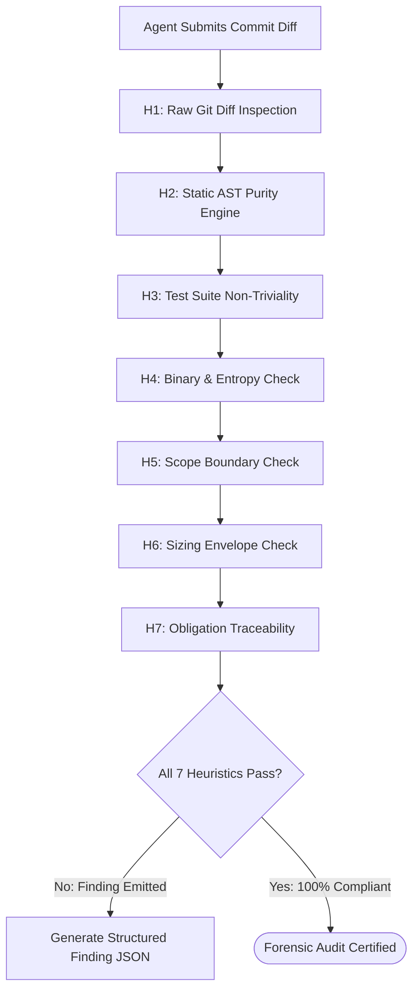

# Meta-Auditor & The Seven Forensic Heuristics

---

[Previous: 08-02 Cognitive Validator Hard-Lock](08-02-cognitive-validator-command-hard-lock.md) | [Chapter Index](index.md) | [All Chapters Index](../index.md) | [Next: 08-04 Structured Findings & Repair](08-04-structured-findings-and-monotonic-repair.md)
---

## 1. Executive Summary & Epistemic Grounding

To guarantee that agent-authored code satisfies the 4 Hard Zeros and meets production-grade quality, the OLT validation ecosystem deploys the **Meta-Auditor Daemon**.

Unlike simple linters that check surface-level formatting, the Meta-Auditor evaluates code diffs against **The Seven Forensic Heuristics ($\mathcal{H}_{1 \dots 7}$)**. These heuristics combine static AST analysis, Git provenance checks, Shannon entropy measurements, and requirement traceability proofs.

```text
┌──────────────────────────────────────────────────────────────────────────────────────────────────┐
│                                 THE SEVEN FORENSIC HEURISTICS                                    │
├──────────────────────────────────────────────────────────────────────────────────────────────────┤
│                                                                                                  │
│   [H1: Raw Git Diff Inspection]       ──► Line-by-line semantic diff verification               │
│   [H2: Static AST Purity Engine]      ──► Zero `any`, zero suppressions, strict typing           │
│   [H3: Test Suite Non-Triviality]     ──► Assertion depth, zero empty bodies, non-mock tests    │
│   [H4: Binary & Entropy Verification] ──► PNG 32-byte IHDR headers, Shannon entropy H(X) > 3.0   │
│   [H5: File Scope Confinement]        ──► Zero writes outside leased directory paths             │
│   [H6: Sizing Envelope Compliance]    ──► TypeScript <= 300, Docs 250-800, Fanout <= 10          │
│   [H7: 100% Obligation Traceability]  ──► Direct mapping from code diffs back to prompt lines    │
│                                                                                                  │
└──────────────────────────────────────────────────────────────────────────────────────────────────┘
```

---

## 2. Detailed Specifications of the Seven Heuristics

```text
┌────────────┬─────────────────────────────┬───────────────────────────────────────────────────────┐
│ Heuristic  │ Forensic Target             │ Mathematical / Algorithmic Acceptance Standard        │
├────────────┼─────────────────────────────┼───────────────────────────────────────────────────────┤
│ $\mathcal{H}_1$ │ Raw Git Diff Inspection     │ Diff contains no hallucinated imports or phantom code │
├────────────┼─────────────────────────────┼───────────────────────────────────────────────────────┤
│ $\mathcal{H}_2$ │ Static AST Purity           │ $|\text{anyTypes}| = 0 \land |\text{Suppressions}| = 0$│
├────────────┼─────────────────────────────┼───────────────────────────────────────────────────────┤
│ $\mathcal{H}_3$ │ Test Suite Non-Triviality   │ $|\text{ExpectCalls}| \ge 1 \land \text{BodyBytes} > 50$│
├────────────┼─────────────────────────────┼───────────────────────────────────────────────────────┤
│ $\mathcal{H}_4$ │ Binary & Entropy Proofs     │ $H(X) = -\sum P(x) \log_2 P(x) \ge 3.0 \text{ bits}$  │
├────────────┼─────────────────────────────┼───────────────────────────────────────────────────────┤
│ $\mathcal{H}_5$ │ Scope Confinement           │ $\forall p \in \text{ModifiedPaths}, \; p \subseteq \mathcal{S}_{\text{granted}}$│
├────────────┼─────────────────────────────┼───────────────────────────────────────────────────────┤
│ $\mathcal{H}_6$ │ Sizing Envelope             │ $L_{\text{ts}} \le 300 \land 250 \le L_{\text{doc}} \le 800 \land \text{deg}^+ \le 10$│
├────────────┼─────────────────────────────┼───────────────────────────────────────────────────────┤
│ $\mathcal{H}_7$ │ Obligation Traceability     │ $\text{MappedPromptLines}(\Delta) \subseteq \text{PromptLines}(P)$ │
└────────────┴─────────────────────────────┴───────────────────────────────────────────────────────┘
```

### $\mathcal{H}_1$: Raw Git Diff Inspection

The auditor parses the output of `git diff HEAD` directly. It verifies that all added functions are invoked, no dead code is introduced, and no commented-out code blocks remain.

### $\mathcal{H}_2$: Static AST Purity Engine

Parses every modified TypeScript file using the TypeScript Compiler API ([`ast-linter.ts`](file:///Users/onurseckinsenoglu/repos/skills/olt/scripts/src/linter/ast/ast-linter.ts)). Enforces:

- Zero explicit or implicit `any` types.
- Zero `@ts-ignore` or `@ts-expect-error` directives.
- Strict parameter usage (zero unreferenced arguments).

### $\mathcal{H}_3$: Test Suite Non-Triviality Guard

Analyzes test files to prevent "fake tests" (tests that pass trivially because their bodies are empty):

- Asserts test bodies contain at least one real `expect()` assertion.
- Prohibits trivial `expect(true).toBe(true)` assertions.

### $\mathcal{H}_4$: Binary & Shannon Entropy Verification

For visual, image, or artifact outputs, computes the Shannon entropy $H(X)$:

$$H(X) = -\sum_{i=1}^{256} P(x_i) \log_2 P(x_i)$$

If $H(X) < 3.0$ (indicating a flat, unrendered, or solid-color image), the artifact is rejected as a placeholder mock.

### $\mathcal{H}_5$: Scope Boundary Confinement

Asserts that every file path modified in the commit belongs strictly to the assigned task scope.

### $\mathcal{H}_6$: Sizing Envelope Compliance

Enforces modular file limits: $\le 300$ physical lines for TypeScript source files, $250 \le L \le 800$ lines for documentation chapters, and $\le 10$ entries per directory.

### $\mathcal{H}_7$: 100% Obligation Traceability

Verifies that the code modifications satisfy the specific requirements derived from the sealed prompt `prompt.md`.



---

## 3. Forensic Scoring & Finding Compilation

The Meta-Auditor computes the **Forensic Compliance Score** $\mathcal{S}_{\text{forensic}} \in [0.0, 1.0]$:

$$\mathcal{S}_{\text{forensic}}(\Delta) = \frac{1}{7} \sum_{k=1}^{7} \mathbf{1}_{\mathcal{H}_k}(\Delta)$$

A diff is approved if and only if $\mathcal{S}_{\text{forensic}}(\Delta) \equiv 1.000$. Any score $< 1.0$ generates structured findings for immediate monotonic repair.

---

## 4. Architectural Invariants Summary

1. **Zero Heuristic Compromise**: All 7 heuristics must pass simultaneously for a task to be certified.
2. **Deterministic Evaluation**: Forensic heuristics are completely rule-based and deterministic.
3. **Forensic Logging**: Audit reports are permanently attached to the task record in `state.json`.

---

[Previous: 08-02 Cognitive Validator Hard-Lock](08-02-cognitive-validator-command-hard-lock.md) | [Chapter Index](index.md) | [All Chapters Index](../index.md) | [Next: 08-04 Structured Findings & Repair](08-04-structured-findings-and-monotonic-repair.md)
---
