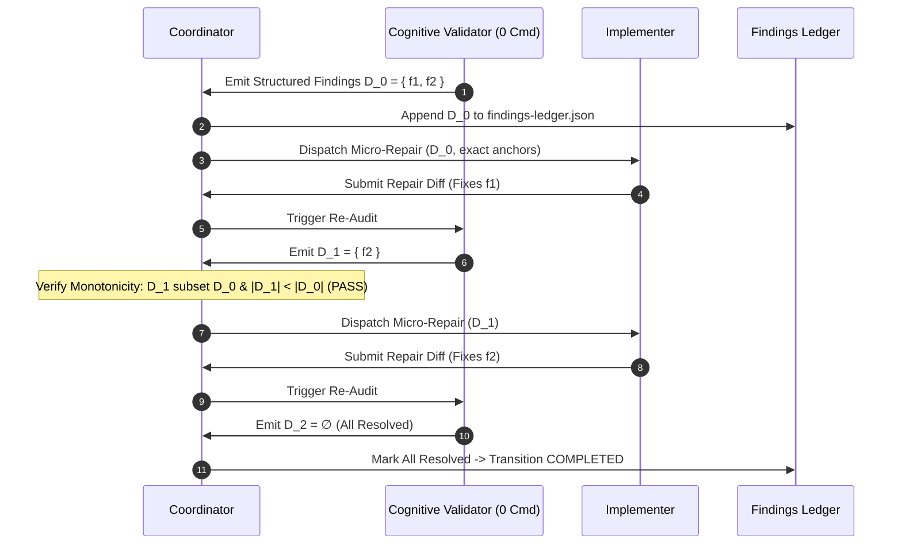

# 08-04 Structured Findings & Monotonic Repair Cycles

---

[Previous: 08-03 Meta-Auditor Seven Forensic Heuristics](08-03-meta-auditor-seven-forensic-heuristics.md) | [Chapter Index](index.md) | [All Chapters Index](../index.md) | [Next: Chapter 09: Falsifiable Evidence Gates](../09-falsifiable-evidence-gates/index.md)

---

## 1. Executive Summary & The Oscillation Trap

In autonomous multi-agent code generation, unstructured review feedback (e.g., natural language suggestions such as _"please clean up the code and improve error handling"_) triggers **the oscillation trap**:

1. **Scope Bleed**: The agent refactors unrelated files and changes working logic, introducing new regressions.
2. **Defect Replacement**: Fixing one issue inadvertently creates two new subtle bugs in previously stable components.
3. **Context Bloat & Hallucination**: Conversational review loops fill context windows with multi-turn apologies, degrading reasoning quality.
4. **Infinite Repair Loops**: The system oscillates between buggy implementations without mathematically converging.

The **OLT (Orchestrating Long Tasks)** engine eliminates oscillation through **Structured Findings & Monotonic Repair Cycles**:

- **Strictly Typed JSON Findings**: Review critique and audit violations are emitted as machine-readable JSON payloads specifying exact file coordinates, violation codes, and targeted remediation recipes.
- **Monotonic Defect Reduction**: In each repair iteration $k \le 5$, the set of unresolved findings must strictly shrink: $\mathcal{D}_{k+1} \subset \mathcal{D}_k$ and $|\mathcal{D}_{k+1}| < |\mathcal{D}_k|$.
- **Bounded Repair Envelope ($k \le 5$)**: If a task fails to converge after 5 rounds, execution halts fail-closed, triggering automated task decomposition via the Critic Engine.

```text
+--------------------------------------------------------------------------------------------------+
│                            5-ROUND MONOTONIC CONVERGENCE LADDER                                  │
+--------------------------------------------------------------------------------------------------+
│   Round 0: Initial Audit   ──► Emit Finding Set D_0 = { f_1, f_2, f_3, f_4 }                     │
│                                       │                                                          │
│                                       ▼                                                          │
│   Round 1: Micro-Patch 1   ──► Resolves { f_1, f_2 }  ──► D_1 = { f_3, f_4 }  (|D_1| < |D_0|)    │
│                                       │                                                          │
│                                       ▼                                                          │
│   Round 2: Micro-Patch 2   ──► Resolves { f_3 }       ──► D_2 = { f_4 }       (|D_2| < |D_1|)    │
│                                       │                                                          │
│                                       ▼                                                          │
│   Round 3: Micro-Patch 3   ──► Resolves { f_4 }       ──► D_3 = ∅             (CONVERGED)        │
│                                                                                                  │
│   CERTIFIED COMPLETION: D_K = ∅  &&  k <= 5  ──► Task Transitions to COMPLETED                   │
│   HALTING GUARD: If |D_{k+1}| >= |D_k| OR New Finding Introduced ──► HALT & REPLAN               │
+--------------------------------------------------------------------------------------------------+
```

---

## 2. Structured Finding JSON Schema Specification

Review findings emitted by Validators conform strictly to Draft 2020-12 JSON Schema:

```json
{
  "$schema": "https://json-schema.org/draft/2020-12/schema",
  "title": "StructuredFinding",
  "type": "object",
  "required": [
    "findingId",
    "taskId",
    "filePath",
    "startLine",
    "violationCode",
    "description",
    "remediationRecipe",
    "status"
  ],
  "properties": {
    "findingId": { "type": "string", "pattern": "^FINDING-[0-9]{3,}$" },
    "taskId": { "type": "string" },
    "filePath": { "type": "string" },
    "startLine": { "type": "integer", "minimum": 1 },
    "violationCode": { "type": "string" },
    "description": { "type": "string" },
    "remediationRecipe": { "type": "string" },
    "status": { "type": "string", "enum": ["OPEN", "RESOLVED", "WAIVED"] }
  }
}
```

---

## 3. Mathematical Formalization of Monotonic Convergence

Let $\mathcal{D}_k = \{f_1, f_2, \dots, f_{m_k}\}$ be the set of open finding IDs at repair iteration $k \in \{0, 1, \dots, 5\}$.
A transition from iteration $k$ to $k+1$ is valid if and only if **Monotonic Strict Subsetting** holds:

$$\mathcal{D}_{k+1} \subset \mathcal{D}_k \quad \land \quad |\mathcal{D}_{k+1}| < |\mathcal{D}_k|$$

```text
+--------------------------------------------------------------------------------------------------+
│ THEOREM (Convergence or Bounded Halt):                                                           │
│ 1. For any initial defect set |D_0| = M <= 5, strictly monotonic repair converges to D_K = ∅     │
│    in at most M steps (K <= M <= 5).                                                             │
│ 2. If at any step k: |D_{k+1}| >= |D_k| or exists f in D_{k+1} such that f not in D_k:           │
│    The engine trips HALT_OSCILLATION_DETECTED, freezing worktree and triggering replanning.      │
+--------------------------------------------------------------------------------------------------+
```

---

## 4. Mermaid Repair Cycle Sequence



---

## 5. Concrete TypeScript Findings Ledger Engine

Implemented in [`socratic-validator/index.ts`](../../../../olt/scripts/src/reporting/socratic-validator/index.ts):

```typescript
export interface StructuredFinding {
  readonly findingId: string;
  readonly taskId: string;
  readonly filePath: string;
  readonly startLine: number;
  readonly violationCode: string;
  readonly description: string;
  readonly remediationRecipe: string;
  status: "OPEN" | "RESOLVED" | "WAIVED";
}

export interface MonotonicRepairState {
  readonly taskId: string;
  round: number;
  maxRounds: number;
  previousFindingIds: Set<string>;
  history: { round: number; openCount: number }[];
}

export function evaluateRepairRound(
  state: MonotonicRepairState,
  currentFindings: readonly StructuredFinding[],
): { isMonotonic: boolean; isComplete: boolean; error?: string | undefined } {
  state.round += 1;
  const currentOpenIds = new Set(
    currentFindings.filter((f) => f.status === "OPEN").map((f) => f.findingId),
  );

  if (state.round > state.maxRounds) {
    return {
      isMonotonic: false,
      isComplete: false,
      error: `MAX_REPAIR_EXCEEDED: Task exceeded ${state.maxRounds} repair rounds without convergence.`,
    };
  }

  // Check strict subset condition: every current open finding must have existed previously
  for (const id of currentOpenIds) {
    if (!state.previousFindingIds.has(id)) {
      return {
        isMonotonic: false,
        isComplete: false,
        error: `REGRESSION_DETECTED: New finding '${id}' introduced during repair cycle.`,
      };
    }
  }

  // Check strict cardinality decrease
  if (currentOpenIds.size >= state.previousFindingIds.size && currentOpenIds.size > 0) {
    return {
      isMonotonic: false,
      isComplete: false,
      error: `OSCILLATION_DETECTED: Defect count did not strictly decrease (${currentOpenIds.size} >= ${state.previousFindingIds.size}).`,
    };
  }

  state.previousFindingIds = currentOpenIds;
  state.history.push({ round: state.round, openCount: currentOpenIds.size });

  return {
    isMonotonic: true,
    isComplete: currentOpenIds.size === 0,
  };
}
```

---

## 6. Anti-Blunder Matrix & Failure Diagnostics

| Blunder Identifier         | Pathology / Symptom                                         | Root Cause                            | Architectural Mitigation                                              |
| :------------------------- | :---------------------------------------------------------- | :------------------------------------ | :-------------------------------------------------------------------- |
| `ERR_PROSE_CRITIQUE_DRIFT` | Agent refactors unrelated logic based on vague review text. | Natural language review feedback.     | Strictly require Draft 2020-12 structured JSON findings.              |
| `ERR_REGRESSION_INJECTION` | Repair patch introduces new unrelated defect.               | Lack of monotonic subset enforcement. | Fail-closed halting guard when $f_{\text{new}} \notin \mathcal{D}_k$. |
| `ERR_INFINITE_REPAIR_SPIN` | Task stuck in 15+ repair cycles.                            | No hard upper bound on repair loops.  | Strict $k \le 5$ round envelope triggering Critic replan.             |
| `ERR_UNAUTHORIZED_RESOLVE` | Implementer marks own findings `RESOLVED`.                  | Self-validation privilege escalation. | Only Cognitive Validator role may transition finding status.          |

---

## 7. Architectural Invariants Summary

1. **Structured Pushback**: All reviewer rejections must be emitted as strictly typed JSON objects.
2. **Strict Monotonicity**: $\mathcal{D}_{k+1} \subset \mathcal{D}_k$ and $|\mathcal{D}_{k+1}| < |\mathcal{D}_k|$. No new findings may be introduced during repair.
3. **Hard 5-Round Bound**: Monotonic repair iterations are capped at $k \le 5$.
4. **Authoritative Validator Updates**: Only the Cognitive Validator may transition a finding to `RESOLVED`.
5. **Permanent Ledger Audit**: All finding records are permanently serialized to `findings-ledger.json`.

---

[Previous: 08-03 Meta-Auditor Seven Forensic Heuristics](08-03-meta-auditor-seven-forensic-heuristics.md) | [Chapter Index](index.md) | [All Chapters Index](../index.md) | [Next: Chapter 09: Falsifiable Evidence Gates](../09-falsifiable-evidence-gates/index.md)

---
