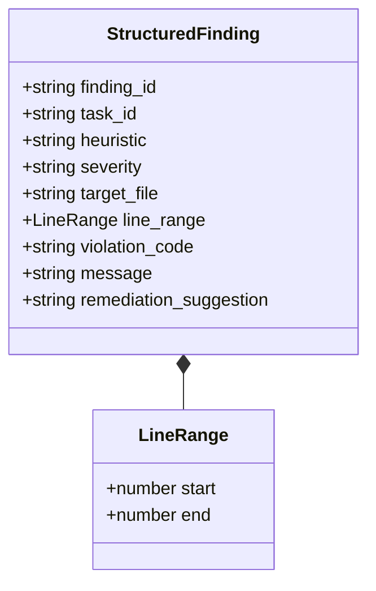

# Structured Findings & Monotonic Repair Cycles

---

[Previous: 08-03 Meta-Auditor 7 Heuristics](08-03-meta-auditor-seven-forensic-heuristics.md) | [Chapter Index](index.md) | [All Chapters Index](../index.md) | [Next: Chapter 09 Index](../09-falsifiable-evidence-gates/index.md)
---

## 1. Executive Summary & The Oscillation Trap

When code reviews emit vague, conversational pushbacks (e.g. "Please make the code cleaner and handle edge cases"), autonomous implementers frequently enter **oscillation loops**:

- Fixing one vague issue introduces another regression elsewhere.
- The agent refactors unrelated files, violating scope confinement.
- Review cycles repeat indefinitely without converging toward completion.

The **OLT (Orchestrating Long Tasks)** engine implements **Structured Findings & Monotonic Repair Cycles**. Under this system:

1. **Machine-Readable Structured Findings**: All review pushbacks and audit defects are emitted as strictly typed JSON objects specifying exact file paths, line numbers, violated heuristics, and targeted patch recommendations.
2. **Monotonic Convergence Invariant**: In each repair iteration $k \le 5$, the number of unresolved defects must strictly decrease: $|\mathcal{D}_{k+1}| < |\mathcal{D}_k|$.
3. **Bounded Repair Envelope ($k \le 5$)**: If a task fails to converge after 5 iterations, execution halts fail-closed for operator intervention.

```text
┌──────────────────────────────────────────────────────────────────────────────────────────────────┐
│                                 MONOTONIC REPAIR CYCLE FLOW                                      │
├──────────────────────────────────────────────────────────────────────────────────────────────────┤
│                                                                                                  │
│   ┌──────────────────────┐         ┌──────────────────────┐         ┌──────────────────────┐     │
│   │ Validator Rejection  │  ───►   │ Targeted Micro-Patch │  ───►   │ Re-Audit & Defect    │     │
│   │ (Structured Finding) │         │ (In-Lease Repair)    │         │ Count Verification   │     │
│   └──────────────────────┘         └──────────────────────┘         └──────────────────────┘     │
│              ▲                                                                 │                 │
│              │                                                                 ▼                 │
│      [Iterate if D_{k+1} < D_k]   ◄─────────────────────────────────── [Assert Convergence]     │
│      [HALT if Iterations > 5]                                          [or All Defects = 0]      │
│                                                                                                  │
└──────────────────────────────────────────────────────────────────────────────────────────────────┘
```

---

## 2. Structured Finding JSON Schema Specification

Review findings emitted by Validators or Meta-Auditors conform strictly to the Draft 2020-12 schema:

```json
{
  "finding_id": "find-ast-purity-204",
  "task_id": "TASK-04",
  "heuristic": "H2_STATIC_AST_PURITY",
  "severity": "ERROR",
  "target_file": "olt/scripts/src/engine/runner.ts",
  "line_range": {
    "start": 142,
    "end": 148
  },
  "violation_code": "TS_IMPLICIT_ANY",
  "message": "Parameter 'options' implicitly has an 'any' type in function executeTaskRunner.",
  "remediation_suggestion": "Define explicit interface TaskRunnerOptions and annotate parameter."
}
```



---

## 3. Mathematical Formalization of Monotonic Convergence

Let $\mathcal{D}_k$ denote the set of unresolved structured findings in repair iteration $k \in \{0, 1, \dots, 5\}$, where $\mathcal{D}_0$ is the initial defect set.

### The Monotonicity Condition

For every repair step $k \rightarrow k + 1$:

$$|\mathcal{D}_{k+1}| < |\mathcal{D}_k| \quad \text{and} \quad \forall d \in \mathcal{D}_{k+1}, \quad d \in \mathcal{D}_k \lor \text{IsDirectSubDefect}(d, \mathcal{D}_k)$$

This guarantees that:

1. No new unrelated defects are introduced during repair.
2. The sequence $|\mathcal{D}_0|, |\mathcal{D}_1|, \dots, |\mathcal{D}_K|$ is strictly decreasing and bounded below by zero.
3. Convergence to $|\mathcal{D}_K| = 0$ is attained in at most $K \le 5$ iterations.

```text
┌──────────────────────────────────────────────────────────────────────────────────────────────────┐
│                               MONOTONIC CONVERGENCE PROGRESSION                                  │
├───────────────────┬───────────────────┬──────────────────────────────────────────────────────────┤
│ Iteration (k)     │ Defect Count |D_k|│ State & Action                                           │
├───────────────────┼───────────────────┼──────────────────────────────────────────────────────────┤
│ k = 0 (Initial)   │ 4 Defects         │ Initial Submission rejected; Structured Findings emitted │
├───────────────────┼───────────────────┼──────────────────────────────────────────────────────────┤
│ k = 1 (Repair 1)  │ 2 Defects         │ In-lease micro-patch applied; 2 AST defects resolved     │
├───────────────────┼───────────────────┼──────────────────────────────────────────────────────────┤
│ k = 2 (Repair 2)  │ 0 Defects         │ Remaining 2 defects resolved; Task CERTIFIED & APPROVED  │
└───────────────────┴───────────────────┴──────────────────────────────────────────────────────────┘
```

---

## 4. Rejection & Replanning Integration

When monotonic repair fails ($|\mathcal{D}_{k+1}| \ge |\mathcal{D}_k|$) or iterations exceed $k > 5$, the OLT Critic Engine ([`critic-ops.ts`](file:///Users/onurseckinsenoglu/repos/skills/olt/scripts/src/cli/commands/critic-ops.ts)) executes a formal rejection:

```typescript
export async function rejectTaskExecution(
  taskId: string,
  findings: StructuredFinding[],
): Promise<void> {
  await recordCriticRejection(taskId, findings);
  await triggerPlanReplan(taskId);
}
```

The task is decomposed into smaller, more granular sub-tasks via `plan:replan`, eliminating the stalled monolith.

---

## 5. Architectural Invariants Summary

1. **Zero Unstructured Pushbacks**: All reviewer feedback must be structured with file paths, line ranges, and actionable remediations.
2. **Strict Monotonicity**: Any repair cycle that increases the defect count triggers an immediate task rollback.
3. **Hard 5-Round Bound**: Repair loops are capped at $k \le 5$ iterations, preventing runaway LLM cycles.

---

[Previous: 08-03 Meta-Auditor 7 Heuristics](08-03-meta-auditor-seven-forensic-heuristics.md) | [Chapter Index](index.md) | [All Chapters Index](../index.md) | [Next: Chapter 09 Index](../09-falsifiable-evidence-gates/index.md)
---
