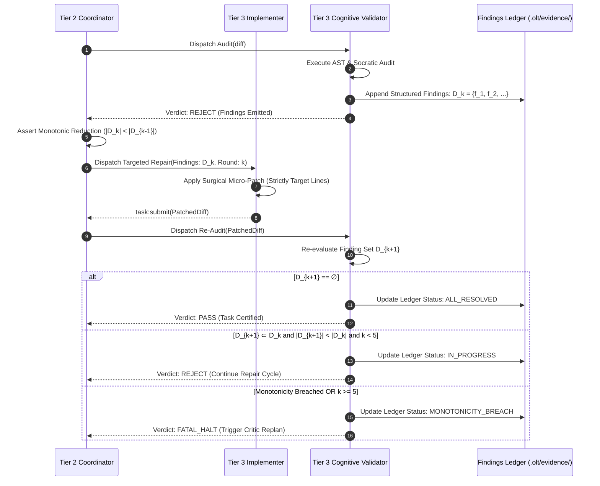

# 08-04 Structured Findings & Monotonic Repair Cycles

---

[Previous: 08-03 Meta-Auditor Seven Forensic Heuristics](08-03-meta-auditor-seven-forensic-heuristics.md) | [Chapter Index](index.md) | [All Chapters Index](../index.md) | [Next: Chapter 09: Falsifiable Evidence Gates](../09-falsifiable-evidence-gates/index.md)

---

## 1. Executive Summary & The Oscillation Trap

In autonomous multi-agent code generation, unstructured review feedback (e.g., natural language suggestions such as _"please clean up the code and improve error handling"_) triggers a well-known failure state: **the oscillation trap**.

When an LLM agent attempts to address vague conversational critique:

1. **Scope Bleed**: The agent refactors unrelated files and changes working logic, introducing new regressions.
2. **Defect Replacement**: Fixing one issue inadvertently creates two new subtle bugs in previously stable components.
3. **Context Bloat & Hallucination**: Conversational review loops fill context windows with multi-turn apologies and explanations, degrading reasoning quality.
4. **Infinite Repair Loops**: The system oscillates between different buggy implementations without mathematically converging toward a certified build.

The **OLT (Orchestrating Long Tasks)** engine eliminates oscillation through **Structured Findings & Monotonic Repair Cycles**. Under this architecture:

- **Strictly Typed JSON Findings**: All reviewer critique and audit violations are emitted as machine-readable JSON payloads specifying exact file coordinates, violation codes, and targeted remediation recipes.
- **Monotonic Defect Reduction**: In each repair iteration $k \le 5$, the set of unresolved findings must strictly shrink: $\mathcal{D}_{k+1} \subset \mathcal{D}_k$ and $|\mathcal{D}_{k+1}| < |\mathcal{D}_k|$.
- **Bounded Repair Envelope ($k \le 5$)**: If a task fails to converge after 5 rounds, execution halts fail-closed, triggering automated task decomposition via the Critic Engine.

```text
+--------------------------------------------------------------------------------------------------+
|                            5-ROUND MONOTONIC CONVERGENCE LADDER                                  |
+--------------------------------------------------------------------------------------------------+
|                                                                                                  |
|   Round 0: Initial Audit   ──► Emit Structured Finding Set D_0 = { f_1, f_2, f_3, f_4 }          |
|                                       │                                                          |
|                                       ▼                                                          |
|   Round 1: Micro-Patch 1   ──► Resolves { f_1, f_2 }  ──► D_1 = { f_3, f_4 }  (|D_1| < |D_0|)    |
|                                       │                                                          |
|                                       ▼                                                          |
|   Round 2: Micro-Patch 2   ──► Resolves { f_3 }       ──► D_2 = { f_4 }       (|D_2| < |D_1|)    |
|                                       │                                                          |
|                                       ▼                                                          |
|   Round 3: Micro-Patch 3   ──► Resolves { f_4 }       ──► D_3 = ∅             (CONVERGED)        |
|                                                                                                  |
|   +------------------------------------------------------------------------------------------+   |
|   | CERTIFIED COMPLETION: D_K = ∅  &&  k <= 5  ──► Task Transitions to COMPLETED             |   |
|   +------------------------------------------------------------------------------------------+   |
|                                                                                                  |
|   * HALTING GUARD: If |D_{k+1}| >= |D_k| OR New Finding f_new Introduced ──► HALT & REPLAN      |
|                                                                                                  |
+--------------------------------------------------------------------------------------------------+
```

---

## 2. Structured Finding JSON Schema Specification

Review findings emitted by Cognitive Validators or Meta-Auditors conform strictly to the Draft 2020-12 JSON Schema ([`socratic-validator.ts`](../../../../olt/scripts/src/reporting/socratic-validator.ts)):

```json
{
  "$schema": "https://json-schema.org/draft/2020-12/schema",
  "title": "StructuredFinding",
  "type": "object",
  "required": [
    "finding_id",
    "task_id",
    "rule_id",
    "severity",
    "target_file",
    "line_coordinates",
    "violation_code",
    "pushback_reason",
    "required_remediation"
  ],
  "properties": {
    "finding_id": { "type": "string", "pattern": "^FIND-[A-Z0-9_-]+$" },
    "task_id": { "type": "string" },
    "rule_id": { "type": "string", "enum": ["H1", "H2", "H3", "H4", "H5", "H6", "H7", "SOCRATIC"] },
    "severity": { "type": "string", "enum": ["FATAL", "WARN", "INFO"] },
    "target_file": { "type": "string" },
    "line_coordinates": {
      "type": "object",
      "required": ["start", "end"],
      "properties": {
        "start": { "type": "integer", "minimum": 1 },
        "end": { "type": "integer", "minimum": 1 }
      }
    },
    "violation_code": { "type": "string" },
    "pushback_reason": { "type": "string" },
    "required_remediation": { "type": "string" }
  }
}
```



---

## 3. Mathematical Formalization of Monotonic Convergence

Let $\mathcal{D}_k = \{f_1, f_2, \dots, f_m\}$ denote the set of active structured findings at repair iteration $k \in \{0, 1, 2, 3, 4, 5\}$, where $\mathcal{D}_0$ is the initial finding set emitted after round 0.

### The Monotonic Convergence Inequality

For each successive repair iteration $k \to k + 1$, the following two mathematical conditions must hold simultaneously:

$$\mathcal{D}_{k+1} \subset \mathcal{D}_k \quad \iff \quad \big( \forall f \in \mathcal{D}_{k+1}, \; f \in \mathcal{D}_k \big) \land \big( \exists f \in \mathcal{D}_k \text{ s.t. } f \notin \mathcal{D}_{k+1} \big)$$

$$|\mathcal{D}_{k+1}| < |\mathcal{D}_k|$$

### Zero Regression Invariant

Let $\mathcal{N}_{k+1} = \mathcal{D}_{k+1} \setminus \mathcal{D}_k$ denote any newly introduced findings discovered during iteration $k+1$.

The **Zero Regression Invariant** enforces:

$$|\mathcal{N}_{k+1}| \equiv 0$$

If $|\mathcal{N}_{k+1}| > 0$ (meaning the repair introduced new bugs, altered unrelated code, or created new AST violations), the repair cycle is immediately aborted:

$$ \text{MonotonicCheck}(\mathcal{D}_k, \mathcal{D}_{k+1}) = \begin{cases}
\text{CONVERGING} & \text{if } \mathcal{D}_{k+1} \subset \mathcal{D}_k \land |\mathcal{D}_{k+1}| < |\mathcal{D}_k| \\
\text{RESOLVED} & \text{if } \mathcal{D}_{k+1} = \emptyset \\
\text{REGRESSION\_HALT} & \text{if } |\mathcal{N}_{k+1}| > 0 \lor |\mathcal{D}_{k+1}| \ge |\mathcal{D}_k|
\end{cases}$$

### Finite Convergence Theorem

Given that the initial defect count $|\mathcal{D}_0| = N \in \mathbb{N}$ is finite and strictly bounded, and every valid step decreases the defect count by at least 1 ($|\mathcal{D}_{k+1}| \le |\mathcal{D}_k| - 1$), the repair sequence terminates in at most $K \le \min(N, 5)$ steps.

If $k > 5$ and $|\mathcal{D}_k| > 0$, the task is halted and escalated to the Tier 1 Critic Engine for architectural replanning via `plan:replan`.

---

## 4. Finding Ledger Persistence & State Transitions

All structured findings and their resolution histories are persisted in the capsule evidence store:

```text
.olt/capsules/<slug>/evidence/findings-ledger.json
```

```text
+--------------------------------------------------------------------------------------------------+
|                               FINDING LIFECYCLE STATE MACHINE                                    |
+--------------------------------------------------------------------------------------------------+
|                                                                                                  |
|   [ IDENTIFIED ]  ──► Finding detected by AST scanner or Socratic probe                          |
|         │                                                                                        |
|         ▼                                                                                        |
|   [ ASSIGNED ]    ──► Finding dispatched to implementer with target coordinates & recipe         |
|         │                                                                                        |
|         ▼                                                                                        |
|   [ PATCHED ]     ──► Implementer submits micro-patch addressing target lines                     |
|         │                                                                                        |
|         ▼                                                                                        |
|   [ RE_AUDITED ]  ──► Validator verifies AST and semantics on patched diff                       |
|         │                                                                                        |
|    ┌────┴────┐                                                                                   |
|    ▼         ▼                                                                                   |
| [ RESOLVED ] [ REGRESSED ] ──► (Triggers Monotonicity Breach Halt & Rollback)                    |
|                                                                                                  |
+--------------------------------------------------------------------------------------------------+
```

### Finding Record Concrete Example

```json
{
  "finding_id": "FIND-H4-TS-IMPLICIT-ANY-001",
  "task_id": "TASK-03",
  "rule_id": "H4",
  "severity": "FATAL",
  "target_file": "src/engine/scheduler.ts",
  "line_coordinates": { "start": 42, "end": 48 },
  "violation_code": "TS_ANY_SUPPRESSION",
  "pushback_reason": "Variable 'leasePayload' is cast to 'any', bypassing type safety.",
  "required_remediation": "Import TaskLeaseRecord interface and annotate variable explicitly.",
  "status": "RESOLVED",
  "round_identified": 0,
  "round_resolved": 1
}
```

---

## 5. TypeScript Finding & Remediation Schemas

The TypeScript interfaces governing structured findings and monotonic ledger tracking are defined in [`socratic-validator.ts`](../../../../olt/scripts/src/reporting/socratic-validator.ts) and [`critic-ops.ts`](../../../../olt/scripts/src/cli/commands/critic-ops.ts):

```typescript
export type FindingSeverity = "FATAL" | "WARN" | "INFO";

export type FindingStatus =
  | "IDENTIFIED"
  | "ASSIGNED"
  | "PATCHED"
  | "RE_AUDITED"
  | "RESOLVED"
  | "REGRESSED";

export interface LineRangeCoordinates {
  readonly start: number;
  readonly end: number;
}

export interface StructuredFinding {
  readonly findingId: string;
  readonly taskId: string;
  readonly ruleId: "H1" | "H2" | "H3" | "H4" | "H5" | "H6" | "H7" | "SOCRATIC";
  readonly severity: FindingSeverity;
  readonly targetFile: string;
  readonly lineCoordinates: LineRangeCoordinates;
  readonly violationCode: string;
  readonly pushbackReason: string;
  readonly requiredRemediation: string;
  readonly status: FindingStatus;
  readonly roundIdentified: number;
  readonly roundResolved?: number;
}

export interface MonotonicLedgerState {
  readonly taskId: string;
  readonly activeRound: number;
  readonly maxRoundsAllowed: 5;
  readonly initialFindingCount: number;
  readonly activeFindingCount: number;
  readonly findingsHistory: readonly StructuredFinding[];
  readonly monotonicInvariantSatisfied: boolean;
  readonly completedAt?: string;
}

export function assertMonotonicConvergence(
  previousFindings: readonly StructuredFinding[],
  currentFindings: readonly StructuredFinding[],
  round: number,
): void {
  if (round > 5) {
    throw new Error(`CRITIC_HALT: Repair loop exceeded maximum allowed rounds (5).`);
  }

  const prevIds = new Set(previousFindings.map((f) => f.findingId));
  const newFindings = currentFindings.filter((f) => !prevIds.has(f.findingId));

  if (newFindings.length > 0) {
    throw new Error(
      `MONOTONICITY_BREACH: Repair round ${round} introduced ${newFindings.length} new regression findings.`,
    );
  }

  if (currentFindings.length >= previousFindings.length && currentFindings.length > 0) {
    throw new Error(
      `MONOTONICITY_BREACH: Finding count did not decrease (Previous: ${previousFindings.length}, Current: ${currentFindings.length}).`,
    );
  }
}
```

---

## 6. Anti-Blunder Matrix for Monotonic Repair

```text
+--------------------------------------------------------------------------------------------------+
|                                MONOTONIC REPAIR ANTI-BLUNDER MATRIX                              |
+--------------------------+------------------------------+----------------------------------------+
| Blunder Anti-Pattern     | Root Cause                   | OLT Prevention & Invariant Solution    |
+--------------------------+------------------------------+----------------------------------------+
| Severity Downgrading     | Implementer marks fatal bug  | Finding status transitions can only be |
|                          | as warning to bypass check.  | written by the Cognitive Validator.    |
+--------------------------+------------------------------+----------------------------------------+
| Scope Expansion Patch    | Repair patch touches 10 files| Worktree lease confines writes strictly|
|                          | when finding was in 1 file.  | to target files listed in finding.     |
+--------------------------+------------------------------+----------------------------------------+
| Unvetted Side-Effects    | Patch fixes syntax but breaks| Dual-channel mechanical test run must  |
|                          | runtime unit assertions.     | execute on every repair iteration.     |
+--------------------------+------------------------------+----------------------------------------+
| Infinite Repair Drift    | Agent cycles between two     | Hard cap of k <= 5 rounds; monotonic   |
|                          | conflicting implementations. | decrease inequality strictly enforced. |
+--------------------------+------------------------------+----------------------------------------+
| Lost Finding Ledger      | Findings kept only in chat   | Immutable JSON ledger persisted to     |
|                          | context and lost on restart. | .olt/capsules/<slug>/evidence/.        |
+--------------------------+------------------------------+----------------------------------------+
```

---

## 7. Critic Replanning on Monotonicity Breach

When a repair iteration violates monotonic convergence ($|\mathcal{D}_{k+1}| \ge |\mathcal{D}_k|$ or $|\mathcal{N}_{k+1}| > 0$) or exhausts the 5-round envelope ($k > 5$), the Tier 2 Coordinator aborts the active lease and triggers the Critic Replan protocol:

1. **Lease Revocation & Worktree Rollback**: The active worktree is reset to `HEAD~1` via `git reset --hard`, discarding the unstable repair chain.
2. **Finding Aggregation**: The full finding history is packaged into a `CriticIncidentReport`.
3. **Plan Decomposition**: The Tier 1 Critic analyzes the failed task and splits the monolithic obligation into smaller, independently verifiable sub-tasks.

---

## 8. Architectural Invariants & Verification Checklist

1. **Structured Pushback Invariant**: All reviewer rejections must be emitted as strictly typed JSON objects conforming to the Draft 2020-12 schema.
2. **Strict Monotonicity Invariant**: $\mathcal{D}_{k+1} \subset \mathcal{D}_k$ and $|\mathcal{D}_{k+1}| < |\mathcal{D}_k|$. No new findings may be introduced during repair.
3. **Hard 5-Round Bound Invariant**: Monotonic repair iterations are capped at $k \le 5$. Tasks failing to converge within 5 rounds trigger automated Critic replanning.
4. **Authoritative Validator Updates Invariant**: Only the Cognitive Validator may transition a finding's status to `RESOLVED`.
5. **Permanent Ledger Audit Invariant**: All finding records, transitions, and diff hashes must be permanently serialized to `findings-ledger.json`.

---

[Previous: 08-03 Meta-Auditor Seven Forensic Heuristics](08-03-meta-auditor-seven-forensic-heuristics.md) | [Chapter Index](index.md) | [All Chapters Index](../index.md) | [Next: Chapter 09: Falsifiable Evidence Gates](../09-falsifiable-evidence-gates/index.md)

---
$$
