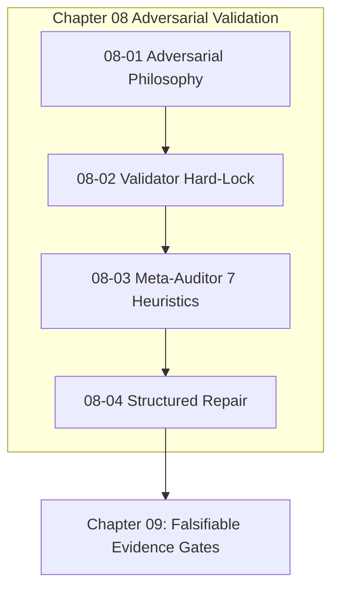

# Chapter 08: Adversarial Validation & Monotonic Repair

---

[Previous: Chapter 07 Index](../07-distributed-leasing-execution/index.md) | [Chapter Index](index.md) | [All Chapters Index](../index.md) | [Next: 08-01 Adversarial Validation Philosophy](08-01-adversarial-validation-philosophy.md)

---

## 1. Chapter Overview & Validation Architecture

Welcome to Chapter 08 of the OLT Architecture Book. This chapter establishes the adversarial validation paradigms, dual-channel verification interlocks, command execution hard-locks, forensic audit heuristics, and monotonic repair cycles governing quality assurance in the OLT (Orchestrating Long Tasks) engine.

Self-validating agents suffer from confirmation bias and rubber-stamping. Chapter 08 establishes the Adversarial Validation Philosophy & Dual-Channel Verification, details the Cognitive Validator Command Hard-Lock Interlock (0 Commands), formalizes the Meta-Auditor's Seven Forensic Heuristics ($\mathcal{H}_{1 \dots 7}$), and outlines Structured Findings & Monotonic Repair Cycles ($k \le 5$).

```text
+--------------------------------------------------------------------------------------------------+
│                             CHAPTER 08: VALIDATION ARCHITECTURE TOPOLOGY                         │
+--------------------------------------------------------------------------------------------------+
│                                                                                                  │
│    ┌───────────────────────────┐                    ┌───────────────────────────┐                │
│    │ 08-01: Adversarial        │                    │ 08-02: Cognitive Validator│                │
│    │ Validation & Dual-Channel │ ══════════════════►│ Command Hard-Lock (0 Cmd) │                │
│    └─────────────┬─────────────┘                    └─────────────┬─────────────┘                │
│                  │                                                │                              │
│                  ▼                                                ▼                              │
│    ┌───────────────────────────┐                    ┌───────────────────────────┐                │
│    │ 08-03: Meta-Auditor       │                    │ 08-04: Structured         │                │
│    │ Seven Forensic Heuristics │ ══════════════════►│ Findings & Repair (k <= 5)│                │
│    └───────────────────────────┘                    └───────────────────────────┘                │
│                                                                                                  │
+--------------------------------------------------------------------------------------------------+
```

---

## 2. Chapter Table of Contents & Learning Path

```text
+--------------------------------------------------+--------------+--------------------------------+
│ Document                                         │ Classification│ Core Architectural Focus       │
+--------------------------------------------------+--------------+--------------------------------+
│ 08-01 Adversarial Validation Philosophy          │ Theory       │ Dual-channel proofs & Socratic │
│ 08-02 Cognitive Validator Command Hard-Lock      │ Security     │ 0 CLI commands & RBAC locks    │
│ 08-03 Meta-Auditor Seven Forensic Heuristics     │ Forensics    │ 7 heuristics & Shannon entropy │
│ 08-04 Structured Findings & Monotonic Repair     │ Reliability  │ JSON schemas & bounded loops   │
+--------------------------------------------------+--------------+--------------------------------+
```

### [08-01: Adversarial Validation Philosophy & Dual-Channel Verification](08-01-adversarial-validation-philosophy.md)

Formalizes orthogonal validator pairing, skepticism-by-default, dual-channel mathematical predicates $\mathcal{V}_{\text{dual}}$, and Socratic review pushback quotas.

### [08-02: Cognitive Validator Command Hard-Lock Interlock](08-02-cognitive-validator-command-hard-lock.md)

Details the mechanical role interlock barring cognitive validators from executing terminal commands ($\text{Commands}(\text{Validator}) \equiv \emptyset$) to prevent test fabrication.

### [08-03: Meta-Auditor & The Seven Forensic Heuristics](08-03-meta-auditor-seven-forensic-heuristics.md)

Deconstructs the 7 forensic checks: raw Git diffs, AST purity, test non-triviality, Shannon entropy $H(X) \ge 3.0$, scope boundaries, sizing budgets, and obligation traceability.

### [08-04: Structured Findings & Monotonic Repair Cycles](08-04-structured-findings-and-monotonic-repair.md)

Explains the machine-readable Draft 2020-12 finding schema, monotonic convergence proofs ($|\mathcal{D}_{k+1}| < |\mathcal{D}_k|$), bounded 5-round loops, and critic replanning.

---

## 3. Core Validation Rules Table

$$ \begin{array}{|l|l|l|}
\hline
\textbf{Mechanism} & \textbf{Formal Expression} & \textbf{Operational Invariant} \\ \hline
\text{Dual Verification} & \mathcal{V}_{\text{dual}} = \text{Cog}(\text{PASS}) \land (\text{Exit}=0) \land (\text{AST}=0) & \text{Simultaneous channel satisfaction} \\ \hline
\text{Validator Lock} & \text{run\_command} \notin \text{Tools}(\text{Validator}) & \text{Zero terminal command authority} \\ \hline
\text{Forensic Score} & \mathcal{S}_{\text{forensic}}(\Delta) = \frac{1}{7} \sum \mathbf{1}_{\mathcal{H}_k} \equiv 1.000 & \text{100\% heuristic compliance} \\ \hline
\text{Shannon Entropy} & H(X) = -\sum P(x) \log_2 P(x) \ge 3.0 & \text{Anti-mock binary image verification} \\ \hline
\text{Monotonic Repair} & |\mathcal{D}_{k+1}| < |\mathcal{D}_k|, \quad k \le 5 & \text{Strictly decreasing defect sequences} \\ \hline
\end{array}$$



---

## 4. Summary & Transition

The adversarial validation frameworks and forensic inspection heuristics codified in Chapter 08 guarantee that code produced by autonomous agents is rigorously audited, tamper-free, and mathematically certified before merging.

Proceed to [08-01: Adversarial Validation Philosophy](08-01-adversarial-validation-philosophy.md) or advance directly to [Chapter 09: Falsifiable Evidence & Completion Gates](../09-falsifiable-evidence-gates/index.md).

---

[Previous: Chapter 07 Index](../07-distributed-leasing-execution/index.md) | [Chapter Index](index.md) | [All Chapters Index](../index.md) | [Next: 08-01 Adversarial Validation Philosophy](08-01-adversarial-validation-philosophy.md)

---
$$
