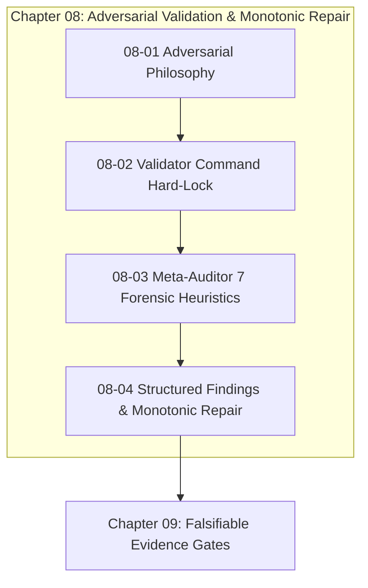

# Chapter 08: Adversarial Validation & Monotonic Repair

---

[Previous: Chapter 07: Distributed Leasing Execution](../07-distributed-leasing-execution/index.md) | [Chapter Index](index.md) | [All Chapters Index](../index.md) | [Next: 08-01 Adversarial Validation Philosophy](08-01-adversarial-validation-philosophy.md)

---

## 1. Chapter Overview & Architectural Mission

In autonomous multi-agent software engineering systems, self-validating agents inevitably suffer from **confirmation bias**, **tautological test construction**, and **rubber-stamping**. When the same agent that authored a patch is permitted to verify its own work, critical edge cases, silent exceptions, and architectural regressions escape into production.

Chapter 08 establishes the **Adversarial Validation & Monotonic Repair Architecture** within the OLT (Orchestrating Long Tasks) engine. Under this architecture:

1. **Orthogonal Adversarial Separation**: Implementer agents are strictly barred from certifying their own output. Validation is executed by independently spawned, orthogonal Tier 3 subagents.
2. **Dual-Channel Interlock**: Certification requires simultaneous agreement between the Cognitive Channel (pure AST static logic auditing) and the Mechanical Channel (hermetic test runner exit status).
3. **Command Hard-Lock (0 Commands)**: Cognitive validators are mechanically stripped of all shell command execution privileges ($\text{Commands}(\text{Validator}) \equiv \emptyset$), preventing test tampering and exit code forgery.
4. **Forensic AST Heuristics**: The Meta-Auditor evaluates diffs across seven automated heuristics ($\mathcal{H}_{1 \dots 7}$), trapping stubs, mock pollution, exception swallowing, and type suppressions.
5. **Monotonic Repair Loops**: Rejections emit machine-readable JSON structured findings. Repair cycles must strictly shrink the active defect set ($\mathcal{D}_{k+1} \subset \mathcal{D}_k$) within a bounded 5-round envelope ($k \le 5$).

```text
+--------------------------------------------------------------------------------------------------+
|                             CHAPTER 08: VALIDATION ARCHITECTURE TOPOLOGY                         |
+--------------------------------------------------------------------------------------------------+
|                                                                                                  |
|   +------------------------------------+             +------------------------------------+      |
|   | 08-01: Adversarial Validation      |             | 08-02: Cognitive Validator         |      |
|   | Philosophy & Dual-Channel Gates    | ═══════════►│ Command Hard-Lock (0 Commands)     |      |
|   +-----------------+------------------+             +-----------------+------------------+      |
|                     │                                                  │                         |
|                     ▼                                                  ▼                         |
|   +------------------------------------+             +------------------------------------+      |
|   | 08-03: Meta-Auditor Seven          |             | 08-04: Structured Findings &       |      |
|   | Forensic Heuristics (H1 - H7)      | ═══════════►│ Monotonic Repair Cycles (k <= 5)   |      |
|   +------------------------------------+             +------------------------------------+      |
|                                                                                                  |
+--------------------------------------------------------------------------------------------------+
```

---

## 2. The Four Pillars of Adversarial Validation

The validation subsystem is organized around four architectural pillars:

### Pillar 1: Adversarial Philosophy & 1:1 Validator Isolation

Establishes strict epistemic skepticism. Every code submission is treated as defective until falsifiable proof of correctness is rendered. Author agents are isolated from validator agents via clean subagent spawning, eliminating conversational pollution and sympathetic confirmation bias.

### Pillar 2: Cognitive Validator Command Hard-Lock (0 Commands)

Enforces mechanical RBAC interlocks that strip cognitive validators of all shell execution tools. By decoupling cognitive reasoning from test execution, validators are forced to perform deep AST structural and semantic audits while the Mechanic-Validator handles hermetic CLI execution.

### Pillar 3: Meta-Auditor Seven Forensic Heuristics ($\mathcal{H}_{1 \dots 7}$)

Implements automated AST-level forensic scanners that evaluate code diffs against seven critical failure patterns: stub function bodies, mock-polluted assertions, silent catch blocks, type suppressions, un-mutexed global state, crash-vulnerable writes, and circular module dependencies.

### Pillar 4: Structured Findings & Monotonic Repair Cycles ($k \le 5$)

Replaces vague natural language review comments with machine-readable Draft 2020-12 JSON schemas. Enforces monotonic convergence where each repair iteration must strictly reduce the active defect set without introducing regressions ($\mathcal{D}_{k+1} \subset \mathcal{D}_k$), bounded by a maximum of 5 iterations.

---

## 3. Seven Forensic Heuristics Summary Matrix

```text
+----+-----------------------------+------------------------------------+--------------------------+
| ID | Heuristic Target            | Detection Mechanism                | Risk Category            |
+----+-----------------------------+------------------------------------+--------------------------+
| H1 | Stub / Empty Pass Guard     | AST statement count in bodies < 1  | Hollow implementation    |
| H2 | Mock-Polluted Test Guard    | Target class mocked / tautology    | Deceptive test coverage  |
| H3 | Silent Exception Swallowing | Empty catch clauses / unlogged     | Masked runtime crashes   |
| H4 | Type Suppression / any      | AST AnyKeyword / @ts-ignore scans  | Loss of type safety      |
| H5 | Unchecked Global Mutex      | Un-flocked shared writes to .olt/  | Split-brain concurrency  |
| H6 | Unstaged Crash Hazard       | Direct writes without atomic swap  | Torn file corruption     |
| H7 | Circular Dependency         | Tarjan SCC cycle detection on DAG  | Init order failure       |
+----+-----------------------------+------------------------------------+--------------------------+
```

---

## 4. Chapter Subtopics Map & Reading Path

```text
+--------------------------------------------------+---------------+-------------------------------+
| Document                                         | Classification| Core Architectural Focus      |
+--------------------------------------------------+---------------+-------------------------------+
| 08-01 Adversarial Validation Philosophy          | Theory        | 1:1 isolation & dual-channel  |
| 08-02 Cognitive Validator Command Hard-Lock      | Security      | 0 CLI commands & RBAC traps   |
| 08-03 Meta-Auditor Seven Forensic Heuristics     | Forensics     | AST purity & Shannon entropy  |
| 08-04 Structured Findings & Monotonic Repair     | Reliability   | JSON schemas & bounded loops  |
+--------------------------------------------------+---------------+-------------------------------+
```

### [08-01: Adversarial Validation Philosophy & Dual-Channel Verification](08-01-adversarial-validation-philosophy.md)

Establishes epistemic skepticism by default, 1:1 single-implementer single-validator isolation, the 5-probe Socratic critique protocol, mathematical proofs of defect bypass reduction, and TypeScript validation contracts.

### [08-02: Cognitive Validator Command Hard-Lock Interlock](08-02-cognitive-validator-command-hard-lock.md)

Details the mechanical role interlock barring cognitive validators from executing terminal commands ($\text{Commands}(\text{Validator}) \equiv \emptyset$) to prevent test fabrication, the mechanic-validator split, and fail-closed RBAC enforcement.

### [08-03: Meta-Auditor Seven Forensic Heuristics](08-03-meta-auditor-seven-forensic-heuristics.md)

Deconstructs the seven forensic AST heuristics ($\mathcal{H}_1$: Stub Pass, $\mathcal{H}_2$: Mock-Polluted Test, $\mathcal{H}_3$: Silent Exception Swallowing, $\mathcal{H}_4$: Type Suppression, $\mathcal{H}_5$: Global Mutex, $\mathcal{H}_6$: Crash Vulnerability, $\mathcal{H}_7$: Circular Dependency), Shannon entropy calculations, and remediation recipes.

### [08-04: Structured Findings & Monotonic Repair Cycles](08-04-structured-findings-and-monotonic-repair.md)

Formulates the machine-readable Draft 2020-12 finding schema, monotonic convergence proofs ($|\mathcal{D}_{k+1}| < |\mathcal{D}_k|$ and $\mathcal{D}_{k+1} \subset \mathcal{D}_k$), bounded 5-round repair ladders, and Critic replanning protocols.

---

## 5. Core Validation Rules & Mathematical Invariants

$$ \begin{array}{|l|l|l|}
\hline
\textbf{Mechanism} & \textbf{Formal Expression} & \textbf{Operational Invariant} \\ \hline
\text{Dual Verification} & \mathcal{V}_{\text{adv}} = \text{Cog}(\text{PASS}) \land (\text{Exit}=0) \land (\text{AST}=0) \land (|\mathcal{F}|=0) & \text{Simultaneous channel satisfaction} \\ \hline
\text{Validator Lock} & \text{run\_command} \notin \text{Tools}(\text{Validator}_{\text{cog}}) & \text{Strictly zero CLI command authority} \\ \hline
\text{Forensic Score} & \mathcal{S}_{\text{forensic}}(\Delta) = \frac{1}{7} \sum_{k=1}^7 \mathbf{1}_{\mathcal{H}_k}(\Delta) \equiv 1.000 & \text{100\% heuristic AST compliance} \\ \hline
\text{Shannon Entropy} & H(X) = -\sum_{i=1}^{256} P(x_i) \log_2 P(x_i) \ge 3.0 & \text{Anti-stub data entropy threshold} \\ \hline
\text{Monotonic Repair} & \mathcal{D}_{k+1} \subset \mathcal{D}_k \land |\mathcal{D}_{k+1}| < |\mathcal{D}_k|, \quad k \le 5 & \text{Strictly decreasing defect sequences} \\ \hline
\end{array}$$



---

## 6. Chapter Invariants & Operational Checklist

1. **Zero Self-Validation**: No agent role may validate or certify code it authored.
2. **Validator Command Hard-Lock**: The Cognitive Validator toolset must strictly satisfy $\text{run\_command} \notin \text{Tools}(\text{Validator})$.
3. **100% Heuristic AST Compliance**: Diffs must achieve $\mathcal{S}_{\text{forensic}}(\Delta) \equiv 1.000$ across all seven forensic heuristics.
4. **Strict Defect Monotonicity**: Repair cycles must guarantee $\mathcal{D}_{k+1} \subset \mathcal{D}_k$ and $|\mathcal{D}_{k+1}| < |\mathcal{D}_k|$ with zero regression introduction.
5. **Bounded Repair Envelope**: Repair iterations are bounded by $k \le 5$. Unresolved defects beyond round 5 trigger immediate Critic replanning.
6. **Immutable Ledger Persistence**: All Socratic probe records, findings, and receipts must be permanently stored in `.olt/capsules/<slug>/evidence/`.

---

## 7. Architectural Summary & Transition

The adversarial validation frameworks and forensic inspection heuristics codified in Chapter 08 guarantee that code produced by autonomous agents is rigorously audited, tamper-free, and mathematically certified before merging into the main repository branch.

Proceed to the opening chapter topic: [08-01: Adversarial Validation Philosophy](08-01-adversarial-validation-philosophy.md) or advance directly to [Chapter 09: Falsifiable Evidence Gates](../09-falsifiable-evidence-gates/index.md).

---

[Previous: Chapter 07: Distributed Leasing Execution](../07-distributed-leasing-execution/index.md) | [Chapter Index](index.md) | [All Chapters Index](../index.md) | [Next: 08-01 Adversarial Validation Philosophy](08-01-adversarial-validation-philosophy.md)

---
$$
