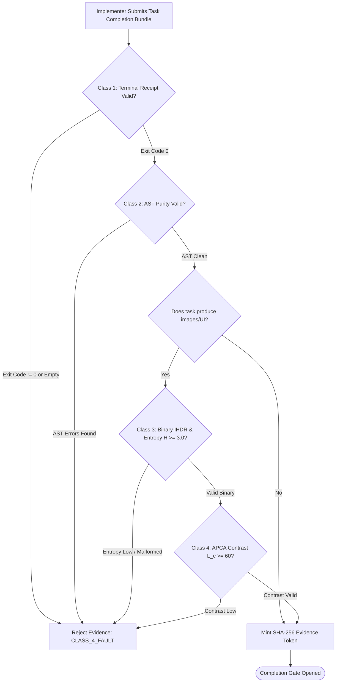

# Falsifiable Evidence Classes & Verification Proofs

---

[Previous: Chapter 09 Index](index.md) | [Chapter Index](index.md) | [All Chapters Index](../index.md) | [Next: 09-02 Anti-Mock Binary Inspection](09-02-anti-mock-png-ihdr-binary-inspection.md)
---

## 1. Executive Summary & The Evidence Taxonomy

In autonomous engineering systems, ungrounded assertions ("I tested the feature and it works") represent pure epistemic risk. To enforce the Zero-Assumption Philosophy, the **OLT (Orchestrating Long Tasks)** engine establishes a formal **Falsifiable Evidence Taxonomy**.

Under this system, every claim of task completion must be proven through one or more of **The Four Evidence Classes ($\mathcal{E}_1 \dots \mathcal{E}_4$)**. A task is mechanically barred from completion unless its evidence bundle satisfies the mathematical criteria of its assigned classes.

```text
┌──────────────────────────────────────────────────────────────────────────────────────────────────┐
│                                 THE FOUR EVIDENCE CLASSES                                        │
├──────────────────────────────────────────────────────────────────────────────────────────────────┤
│                                                                                                  │
│   CLASS 1: Terminal Execution Receipts                                                           │
│   • Bun test runners, exit code 0, non-empty stdout/stderr streams, execution duration > 0ms    │
│                                                                                                  │
│   CLASS 2: Static AST Invariant Proofs                                                           │
│   • TypeScript Compiler AST checks, zero `any`, zero suppressions, strict line sizing bounds    │
│                                                                                                  │
│   CLASS 3: Binary Chunk Integrity & Entropy Proofs                                               │
│   • PNG 8-byte magic header, 32-byte IHDR chunks, non-zero dimensions, Shannon entropy H(X)>=3.0│
│                                                                                                  │
│   CLASS 4: Perceptual APCA Contrast & Rendering Metrics                                          │
│   • WCAG 3.0 APCA contrast formulas (L_c >= 60 for body, L_c >= 75 for fine print)               │
│                                                                                                  │
└──────────────────────────────────────────────────────────────────────────────────────────────────┘
```

---

## 2. Formal Mathematical Classification Matrix

```text
┌───────┬──────────────────────────┬─────────────────────────────────┬─────────────────────────────┐
│ Class │ Category                 │ Verification Signature          │ Mathematical Acceptance Predicate │
├───────┼──────────────────────────┼─────────────────────────────────┼─────────────────────────────┤
│ $\mathcal{E}_1$ │ Terminal Execution       │ Shell Process Exit & Stdout     │ $\text{ExitCode} = 0 \land |\text{Stdout}| > 0 \land \text{Duration} > 0$ │
├───────┼──────────────────────────┼─────────────────────────────────┼─────────────────────────────┤
│ $\mathcal{E}_2$ │ Static AST Invariants    │ TypeScript Compiler AST         │ $|\text{anyTypes}| = 0 \land |\text{Suppressions}| = 0 \land L \le 300$ │
├───────┼──────────────────────────┼─────────────────────────────────┼─────────────────────────────┤
│ $\mathcal{E}_3$ │ Binary & Entropy Proofs  │ Byte Header & Entropy $H(X)$    │ $\text{Header} = \text{PNG} \land W, H > 0 \land H(X) \ge 3.0$ │
├───────┼──────────────────────────┼─────────────────────────────────┼─────────────────────────────┤
│ $\mathcal{E}_4$ │ Perceptual APCA Contrast │ Light-on-Dark Contrast $L_c$    │ $L_c = (Y_{\text{txt}}^{0.56} - Y_{\text{bg}}^{0.56}) \times 1.14 \ge 60.0$ │
└───────┴──────────────────────────┴─────────────────────────────────┴─────────────────────────────┘
```



---

## 3. Cryptographic Evidence Bundling

All evidence items are packaged into an immutable JSON payload stored under `.olt/capsules/<slug>/evidence/<task_id>.json`:

```typescript
export interface FalsifiableEvidenceReceipt {
  readonly schemaVersion: "2020-12";
  readonly taskId: string;
  readonly evidenceClasses: ("CLASS_1" | "CLASS_2" | "CLASS_3" | "CLASS_4")[];
  readonly terminalReceipt?: {
    readonly command: string;
    readonly exitCode: number;
    readonly stdoutDigest: string;
    readonly executionDurationMs: number;
  };
  readonly astReceipt?: {
    readonly filesAnalyzed: number;
    readonly anyTypeCount: number;
    readonly suppressionsCount: number;
  };
  readonly binaryReceipt?: {
    readonly imagePath: string;
    readonly dimensions: { width: number; height: number };
    readonly shannonEntropy: number;
  };
  readonly apcaReceipt?: {
    readonly textColor: string;
    readonly backgroundColor: string;
    readonly contrastLc: number;
  };
  readonly cryptographicProofDigest: string; // SHA-256 of canonical receipt JSON
}
```

---

## 4. Integration with Gate Prover

The Gate Prover Engine ([`gate-prove.ts`](file:///Users/onurseckinsenoglu/repos/skills/olt/scripts/src/cli/commands/gate-prove.ts)) verifies evidence authenticity before recording task satisfaction into `events.jsonl`. If any evidence field contains an invalid digest or falsified exit code, `gate:prove` rejects the submission fail-closed.

---

## 5. Architectural Invariants Summary

1. **Zero Unbacked Claims**: Every task completion requires at least one Class 1 or Class 2 cryptographic receipt.
2. **Deterministic Evidence Hashing**: Canonical serialization ensures evidence hashes are tamper-evident.
3. **Multi-Class Interlock**: Tasks touching UI or binary assets must satisfy Class 3 and Class 4 proofs.

---

[Previous: Chapter 09 Index](index.md) | [Chapter Index](index.md) | [All Chapters Index](../index.md) | [Next: 09-02 Anti-Mock Binary Inspection](09-02-anti-mock-png-ihdr-binary-inspection.md)
---
