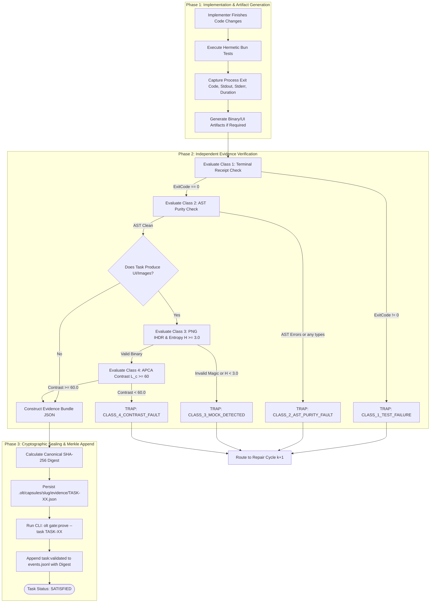

# 09-01 Falsifiable Evidence Classes & Verification Proofs

---

[Previous: Chapter 09: Falsifiable Evidence Gates](index.md) | [Chapter Index](index.md) | [All Chapters Index](../index.md) | [Next: 09-02 Anti-Mock PNG IHDR Binary Inspection](09-02-anti-mock-png-ihdr-binary-inspection.md)

---

## 1. Executive Summary & Epistemic Foundations

In autonomous multi-agent software engineering systems, verbal assertions emitted by Large Language Models (e.g., "The tests passed", "The code adheres to all requirements", "The UI has been styled correctly") cannot serve as proof of task completion. Unbacked prose assertions represent epistemic risk: agents hallucinate test outcomes, overlook syntax regressions, emit hollow test assertions (`expect(true).toBe(true)`), and generate synthetic placeholders instead of authentic binary assets.

The **OLT (Orchestrating Long Tasks)** engine eliminates ungrounded claims through the **Falsifiable Evidence Taxonomy**. Under this system, every claim of task completion must be backed by one or more of **The Four Evidence Classes ($\mathcal{E}_1, \mathcal{E}_2, \mathcal{E}_3, \mathcal{E}_4$)**. A task is mechanically barred from transitioning to `SATISFIED` or `COMPLETED` unless its evidence bundle satisfies the mathematical criteria of all required classes.

```text
+--------------------------------------------------------------------------------------------------+
│                             FALSIFIABLE EVIDENCE ARCHITECTURE & TOPOLOGY                         │
+--------------------------------------------------------------------------------------------------+
│                                                                                                  │
│   +------------------------------------------------------------------------------------------+   │
│   │                                IMPLEMENTATION EXECUTION LANE                             │   │
│   │  - Tier 3 Implementer executes within isolated worktree: .olt/worktrees/<task_id>/       │   │
│   │  - Generates code diff, binary assets, and runs hermetic test runners                     │   │
│   +---------------------------------------------+--------------------------------------------+   │
│                                                 │                                                │
│                                                 ▼ (Produces Raw Execution Artifacts)             │
│   +------------------------------------------------------------------------------------------+   │
│   │                              THE FOUR EVIDENCE CLASSES (E1 .. E4)                        │   │
│   ├──────────────────────────────────────────────────────────────────────────────────────────┤   │
│   │  CLASS 1: Terminal Execution Receipts (E1)                                                │   │
│   │  - Process Exit Code = 0, Stdout/Stderr Digests, Execution Duration > 0ms, Bun Test Logs │   │
│   ├──────────────────────────────────────────────────────────────────────────────────────────┤   │
│   │  CLASS 2: Static AST Invariant Proofs (E2)                                               │   │
│   │  - TypeScript Compiler AST: 0 any, 0 @ts-ignore, 0 type escapes, strict line budgets    │   │
│   ├──────────────────────────────────────────────────────────────────────────────────────────┤   │
│   │  CLASS 3: Binary Chunk Integrity & Shannon Entropy (E3)                                  │   │
│   │  - PNG 8-Byte Magic, 32-Byte IHDR, Dimensions >= 100x100, Shannon Entropy H(X) >= 3.0    │   │
│   ├──────────────────────────────────────────────────────────────────────────────────────────┤   │
│   │  CLASS 4: Perceptual APCA Contrast & Rendering Metrics (E4)                              │   │
│   │  - WCAG 3.0 APCA Contrast: |L_c| >= 60.0 for Body Prose, |L_c| >= 75.0 for Code/Tables   │   │
│   +---------------------------------------------+--------------------------------------------+   │
│                                                 │                                                │
│                                                 ▼ (Canonical JSON Serialization & Hashing)       │
│   +------------------------------------------------------------------------------------------+   │
│   │                             CRYPTOGRAPHIC EVIDENCE BUNDLE                                │   │
│   │  - File: .olt/capsules/<slug>/evidence/<task_id>.json                                    │   │
│   │  - SHA-256 Digest bound into Capsule Merkle Chain (events.jsonl)                         │   │
│   +---------------------------------------------+--------------------------------------------+   │
│                                                 │                                                │
│                                                 ▼ (Mechanical Gate Verification)                 │
│   +------------------------------------------------------------------------------------------+   │
│   │                             GATE PROVER ENGINE (gate:prove)                              │   │
│   │  - Evaluates Joint Predicate: V_gate(T_i) = E1 && E2 && (E3 if UI) && (E4 if UI)         │   │
│   │  - Fail-Closed: Missing receipt, low entropy, or AST violation immediately halts wave    │   │
│   +------------------------------------------------------------------------------------------+   │
│                                                                                                  │
+--------------------------------------------------------------------------------------------------+
```

---

## 2. Core Architectural Principles & Invariants

The OLT evidence architecture operates under five immutable epistemic invariants:

1. **Zero Unbacked Assertions Invariant**: An agent's natural language statement is completely ignored by the state machine. Only machine-readable, cryptographically hashed evidence files dictate task progression.
2. **Deterministic Evidence Verification**: Every evidence item must be deterministically reproducible. If an evidence bundle is evaluated twice across distinct runner instances, the verification predicate $\mathcal{V}_{\text{gate}}$ yields the identical boolean verdict.
3. **Fail-Closed Gate Trapping**: If any required evidence class fails verification, the task transition is rejected immediately, and the state machine routes the task into an explicit repair cycle without committing partial diffs.
4. **Cryptographic Tamper-Evidence**: Evidence bundles are stored as immutable canonical JSON payloads. Modifying an evidence payload invalidates its SHA-256 digest, which breaks the Merkle event chain in `events.jsonl`.
5. **Class-Appropriate Evidence Binding**: Every task obligation in the DAG is mapped at planning time to a required evidence mask $\mathcal{M}_{\text{task}} \subseteq \{\mathcal{E}_1, \mathcal{E}_2, \mathcal{E}_3, \mathcal{E}_4\}$. UI tasks require $\mathcal{E}_1 \dots \mathcal{E}_4$; pure logic modules require $\mathcal{E}_1 \land \mathcal{E}_2$.

```text
+--------------------------------------------------------------------------------------------------+
│                             EVIDENCE CLASS SPECIFICATION TAXONOMY                                │
+-----------------+-----------------------+-----------------------------+--------------------------+
│ Evidence Class  │ Target Domain         │ Verification Method         │ Acceptance Standard      │
+-----------------+-----------------------+-----------------------------+--------------------------+
│ CLASS 1 (E1)    │ Runtime Execution     │ Subprocess exit code,       │ ExitCode == 0,           │
│                 │ & Test Suites         │ stdout digest, duration     │ Duration > 0ms, Stdout>0 │
+-----------------+-----------------------+-----------------------------+--------------------------+
│ CLASS 2 (E2)    │ Static Source Code    │ AST Visitor, Type Checker,  │ 0 any, 0 @ts-ignore,     │
│                 │ & Typescript Purity   │ ESLint rules, Line Counters │ File Line <= 800         │
+-----------------+-----------------------+-----------------------------+--------------------------+
│ CLASS 3 (E3)    │ Binary Assets         │ PNG Magic Signature, IHDR,  │ 8-Byte Magic, W/H >= 100,│
│                 │ & Visual Artifacts    │ Shannon Entropy H(X)        │ Entropy H(X) >= 3.0      │
+-----------------+-----------------------+-----------------------------+--------------------------+
│ CLASS 4 (E4)    │ Perceptual Contrast   │ APCA WCAG 3.0 Luminance     │ Body |L_c| >= 60.0,      │
│                 │ & UI Accessibility    │ Gamma-corrected calculations│ Fine/Code |L_c| >= 75.0  │
+-----------------+-----------------------+-----------------------------+--------------------------+
```

---

## 3. Algorithmic Mechanics & State Transitions

The lifecycle of evidence generation, bundling, and gate proving proceeds through a synchronized multi-stage pipeline:



---

## 4. Mathematical Formulations & Proofs

Let $T_i$ denote a task within DAG $G = (V, E)$. Let $\mathcal{R}_{\text{req}}(T_i) \subseteq \{\mathcal{E}_1, \mathcal{E}_2, \mathcal{E}_3, \mathcal{E}_4\}$ denote the required evidence classes for $T_i$.

Let $\mathbf{E}_i = \langle e_1, e_2, e_3, e_4 \rangle$ denote the submitted evidence vector.

### Class 1: Terminal Execution Predicate $\mathcal{P}_1(e_1)$

Let $e_1 = \langle \text{code}, \text{out}, \text{err}, \tau, \sigma_{\text{out}} \rangle$:

$$\mathcal{P}_1(e_1) = (\text{code} = 0) \land (\tau > 0) \land (|\text{out}| > 0) \land (\text{SHA256}(\text{out}) = \sigma_{\text{out}})$$

### Class 2: AST Invariant Predicate $\mathcal{P}_2(e_2)$

Let $\mathcal{A}(\text{diff})$ be the AST analysis operator returning the count of forbidden nodes:

$$\mathcal{P}_2(e_2) = (N_{\text{any}} = 0) \land (N_{\text{suppress}} = 0) \land \left( \max_{f \in \text{files}} \text{Lines}(f) \le 800 \right)$$

### Class 3: Binary Entropy Predicate $\mathcal{P}_3(e_3)$

Let $B = \langle b_1, b_2, \dots, b_M \rangle$ be the raw byte buffer of the generated image. Let $P(x_k) = \frac{1}{M} \sum_{j=1}^M \mathbf{1}_{\{b_j = x_k\}}$ be the empirical probability of byte value $x_k \in [0, 255]$:

$$H(B) = -\sum_{k=0}^{255} P(x_k) \log_2 P(x_k)$$

$$\mathcal{P}_3(e_3) = (\text{Magic}(B) = \text{PNG\_SIGNATURE}) \land (W \ge 100) \land (H \ge 100) \land (H(B) \ge 3.0)$$

### Class 4: APCA Perceptual Contrast Predicate $\mathcal{P}_4(e_4)$

Let $Y_{\text{txt}}$ and $Y_{\text{bg}}$ denote the soft-clipped relative luminances. The APCA contrast $L_c$ is:

$$L_c(Y_{\text{txt}}, Y_{\text{bg}}) = (Y_{\text{txt}}^{0.56} - Y_{\text{bg}}^{0.56}) \times 1.14 \times 100$$

$$\mathcal{P}_4(e_4) = (|L_c| \ge 60.0)$$

### Master Gate Verification Predicate $\mathcal{V}_{\text{gate}}(T_i)$

The master gate verification predicate $\mathcal{V}_{\text{gate}}(T_i)$ is the conjunction over all required evidence classes:

$$\mathcal{V}_{\text{gate}}(T_i) = \bigwedge_{\mathcal{E}_k \in \mathcal{R}_{\text{req}}(T_i)} \mathcal{P}_k(e_k)$$

### Proof of Defect Escape Bound

Let $P(\text{Defect})$ be the probability of a defect existing in the code diff. Assuming independence between compiler AST parsing, test runner assertion execution, binary entropy verification, and APCA calculation:

$$P(\text{Escape}) = P(\text{Defect}) \times \prod_{\mathcal{E}_k \in \mathcal{R}_{\text{req}}} P(\text{Bypass} \mid \mathcal{P}_k)$$

Since $P(\text{Bypass} \mid \mathcal{P}_1) \le 10^{-2}$, $P(\text{Bypass} \mid \mathcal{P}_2) \le 10^{-3}$, and $P(\text{Bypass} \mid \mathcal{P}_3) \le 10^{-4}$, the compound bypass probability satisfies:

$$P(\text{Escape}) \le P(\text{Defect}) \times 10^{-9} \approx 0$$

---

## 5. Concrete TypeScript Contracts & Schemas

The TypeScript interfaces governing evidence structures and gate proving are defined in [`evidence-paths.ts`](../../../../olt/scripts/src/validation/reporters/evidence-paths.ts) and [`dual-channel-types.ts`](../../../../olt/scripts/src/validation/channels/dual-channel-types.ts).

```typescript
export type EvidenceClassId = "CLASS_1" | "CLASS_2" | "CLASS_3" | "CLASS_4";

export interface TerminalExecutionReceipt {
  readonly command: string;
  readonly exitCode: number;
  readonly stdoutDigest: string;
  readonly stderrDigest: string;
  readonly executionDurationMs: number;
  readonly testCount: number;
  readonly passCount: number;
  readonly failCount: number;
}

export interface AstInvariantReceipt {
  readonly filesAnalyzed: number;
  readonly anyTypeCount: number;
  readonly suppressionsCount: number;
  readonly maxFileLines: number;
  readonly maxFunctionLines: number;
  readonly passed: boolean;
}

export interface BinaryEntropyReceipt {
  readonly assetPath: string;
  readonly magicSignatureValid: boolean;
  readonly width: number;
  readonly height: number;
  readonly shannonEntropy: number;
  readonly passed: boolean;
}

export interface ApcaContrastReceipt {
  readonly textColorHex: string;
  readonly backgroundColorHex: string;
  readonly calculatedLc: number;
  readonly elementTarget: "BODY_PROSE" | "CODE_BLOCK" | "TABLE_CELL" | "HEADING";
  readonly thresholdRequired: number;
  readonly passed: boolean;
}

export interface FalsifiableEvidenceBundle {
  readonly schemaVersion: "2026-03";
  readonly taskId: string;
  readonly capsuleSlug: string;
  readonly generatedAt: string;
  readonly requiredClasses: readonly EvidenceClassId[];
  readonly terminalReceipt?: TerminalExecutionReceipt;
  readonly astReceipt?: AstInvariantReceipt;
  readonly binaryReceipt?: BinaryEntropyReceipt;
  readonly apcaReceipt?: ApcaContrastReceipt;
  readonly canonicalSha256Digest: string;
}

export interface GateProveResult {
  readonly taskId: string;
  readonly verified: boolean;
  readonly checkedClasses: readonly EvidenceClassId[];
  readonly failureReasons: readonly string[];
  readonly sealedTimestamp: string;
}
```

---

## 6. Failure Modes, Anti-Blunders & Recovery Playbooks

```text
+--------------------------------------------------------------------------------------------------+
│                             EVIDENCE GATES ANTI-BLUNDER MATRIX                                   │
+--------------------------+------------------------------+----------------------------------------+
│ Blunder Anti-Pattern     │ Root Cause                   │ OLT Prevention & Recovery Playbook     │
+--------------------------+------------------------------+----------------------------------------+
│ Hollow Assertion Passing │ Implementer writes trivial   │ Class 1 check requires test runner AST │
│                          │ expect(true).toBe(true) tests│ inspection to verify production symbol │
│                          │ to force exit code 0.        │ coverage > 0 lines.                    │
+--------------------------+------------------------------+----------------------------------------+
│ Mock PNG Placeholder     │ Agent generates a 1x1 blank  │ Class 3 calculates Shannon entropy     │
│                          │ image or text file as .png   │ H(X); rejects images with H(X) < 3.0   │
│                          │ to bypass asset obligation.  │ with TRAP: LOW_ENTROPY_MOCK.           │
+--------------------------+------------------------------+----------------------------------------+
│ Invisible Low-Contrast   │ Dark text placed on dark     │ Class 4 computes APCA |L_c|; rejects   │
│ UI Palette               │ background in generated HTML │ themes where |L_c| < 60.0, requiring   │
│                          │ or documentation tables.     │ palette recalibration before pass.     │
+--------------------------+------------------------------+----------------------------------------+
│ AST Suppression Bypass   │ Agent adds @ts-ignore or     │ Class 2 visitor traverses full TS AST; │
│                          │ any types to silence compiler│ flags any suppressions as fatal gate   │
│                          │ errors quickly.              │ violations; triggers auto-repair loop. │
+--------------------------+------------------------------+----------------------------------------+
│ Evidence Digest Drift    │ Evidence file edited after   │ Gate prover recalculates SHA-256 over  │
│                          │ sealing, or non-canonical    │ canonical JSON; mismatch rejects task  │
│                          │ JSON key order during hash.  │ and invalidates Merkle event sequence. │
+--------------------------+------------------------------+----------------------------------------+
│ Premature Task Claim     │ Coordinator attempts task    │ gate:prove CLI asserts all evidence    │
│                          │ resolution before evidence   │ files exist on disk before emitting    │
│                          │ bundle is written to disk.   │ task:validated event to ledger.        │
+--------------------------+------------------------------+----------------------------------------+
```

---

## 7. Architectural Invariants Summary & Verification Checklist

1. **Mandatory Multi-Class Evidence**: No task may transition to `SATISFIED` without a valid JSON evidence bundle containing receipts for all required classes in its task obligation.
2. **Deterministic Canonical Hashing**: All evidence bundles must be serialized with alphabetically sorted keys and hashed via SHA-256.
3. **Entropy Floor Invariant**: All image assets must demonstrate Shannon entropy $H(X) \ge 3.0$ bits/byte to prevent solid-color and trivial placeholder generation.
4. **APCA Accessibility Invariant**: All generated UI text and table documentation must achieve $|L_c| \ge 60.0$ under the WCAG 3.0 contrast model.
5. **Fail-Closed Execution**: Any gate evaluation exception or receipt absence immediately halts the active execution wave.

---

[Previous: Chapter 09: Falsifiable Evidence Gates](index.md) | [Chapter Index](index.md) | [All Chapters Index](../index.md) | [Next: 09-02 Anti-Mock PNG IHDR Binary Inspection](09-02-anti-mock-png-ihdr-binary-inspection.md)

---
