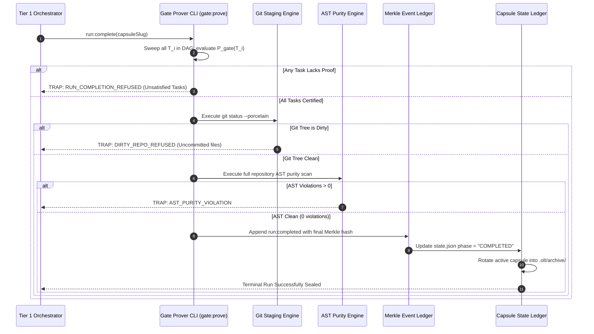

# 09-04 Gate Prove & Terminal Completion Sealing

---

[Previous: 09-03 APCA Perceptual Contrast Mathematics](09-03-apca-perceptual-contrast-mathematics.md) | [Chapter Index](index.md) | [All Chapters Index](../index.md) | [Next: Chapter 10: Durability, Recovery & Capsules](../10-durability-recovery-capsules/index.md)

---

## 1. Executive Summary & Epistemic Foundations

In large-scale autonomous execution engines, the terminal phase of an execution run represents the highest epistemic risk surface. Without formal mechanical completion barriers, autonomous agents succumb to **premature termination blunders**:

- Declaring a long task run "complete" while individual DAG tasks remain unvalidated or failed in background lanes.
- Merging incomplete feature branches into `main` with uncommitted scratch files or untracked test fixtures polluting the working tree.
- Appending a terminal state transition without verifying that all intermediate execution receipts are sealed in the Merkle event stream.
- Generating fabricated completion summaries that fail to reflect actual compilation errors or missing test receipts.

The **OLT (Orchestrating Long Tasks)** engine implements the **Gate Prove & Terminal Completion Sealing Protocol**. Under this protocol, no execution run may transition to `COMPLETED` without satisfying two strict mechanical gates:

1. **Mechanical Gate Prover (`gate:prove`)**: Every individual task obligation $T_i$ must be mechanically evaluated against its required evidence classes ($\mathcal{E}_1 \dots \mathcal{E}_4$), verified via SHA-256 digest matching, and recorded as `task:validated`.
2. **Terminal Manifest Sealing (`run:complete`)**: The entire DAG $G = (V, E)$ is evaluated under a global completion predicate $\Phi_{\text{run}}(G)$. Once certified, the engine commits a final Merkle root seal, marks `state.json` as `COMPLETED`, and performs clean generational rotation into historical archives.

```text
+--------------------------------------------------------------------------------------------------+
│                             TERMINAL COMPLETION SEALING TOPOLOGY                                 │
+--------------------------------------------------------------------------------------------------+
│                                                                                                  │
│   +------------------------------------------------------------------------------------------+   │
│   │                                 DAG TASK VERIFICATION SWEEP                              │   │
│   │  - Evaluates all N tasks: T_1, T_2, ..., T_N in DAG V                                    │   │
│   │  - Verifies: For each T_i, P_gate(T_i) == 1 (Valid Class 1-4 evidence bundle on disk)    │   │
│   +---------------------------------------------+--------------------------------------------+   │
│                                                 │                                                │
│                                                 ▼ (All N Tasks Verified)                         │
│   +------------------------------------------------------------------------------------------+   │
│   │                             GLOBAL REPOSITORY HYGIENE CHECK                              │   │
│   │  - git status --porcelain == "" (Zero untracked files, zero dirty diffs)                 │   │
│   │  - Full repo AST scan: 0 any types, 0 suppressions, 100% typecheck passes                │   │
│   +---------------------------------------------+--------------------------------------------+   │
│                                                 │                                                │
│                                                 ▼ (Hygiene Certified)                            │
│   +------------------------------------------------------------------------------------------+   │
│   │                             TERMINAL MERKLE ROOT GENERATION                              │   │
│   │  - Computes h_final = SHA-256( h_N || CanonicalJSON( TerminalCompletionPayload ) )       │   │
│   │  - Appends run:completed event to .olt/capsules/<slug>/events.jsonl                      │   │
│   +---------------------------------------------+--------------------------------------------+   │
│                                                 │                                                │
│                                                 ▼ (Ledger Sealed)                                │
│   +------------------------------------------------------------------------------------------+   │
│   │                             STATE PROJECTION & GENERATIONAL ROTATION                     │   │
│   │  - Sets state.json status = "COMPLETED", unlocks all POSIX flock tokens                  │   │
│   │  - Moves capsule to .olt/archive/<slug>/ and updates ARCHIVED_OBJECTIVES.jsonl           │   │
│   +------------------------------------------------------------------------------------------+   │
│                                                                                                  │
+--------------------------------------------------------------------------------------------------+
```

---

## 2. Core Architectural Principles & Invariants

1. **Zero Premature Merges Invariant**: An execution wave cannot complete while any task $T_i \in V$ remains in `CLAIMED`, `IN_PROGRESS`, `BLOCKED`, or `REPAIR_CYCLE` status.
2. **Fail-Closed Terminal Gate**: Any missing evidence receipt, hash mismatch, or non-zero compiler error immediately aborts the terminal sealing sequence and holds the capsule in `IN_PROGRESS`.
3. **Repository Hygiene Invariant**: Prior to terminal sealing, the Git working tree must be strictly clean (`git status --porcelain` returns an empty string) and all ephemeral subagent worktrees must be purged.
4. **Terminal Merkle Root Immutability**: The final event in `events.jsonl` encapsulates the SHA-256 digest of all prior task validations, creating a permanent, tamper-evident audit record.
5. **Generational Archival Cleanliness**: Completed capsules are rotated into `.olt/archive/`, clearing the active execution slot for subsequent autonomous cycles.

```text
+--------------------------------------------------------------------------------------------------+
│                             TERMINAL GATE VERIFICATION STAGES                                    │
+-------+-------------------------+--------------------------------+-------------------------------+
│ Stage │ Gate Verification Step  │ Mechanical Inspection Target   │ Halt Condition on Failure     │
+-------+-------------------------+--------------------------------+-------------------------------+
│ 1     │ Task Gate Prove Sweep   │ Evidence bundles for T_1..T_N  │ ABORT: UNSATISFIED_TASK_GATE  │
+-------+-------------------------+--------------------------------+-------------------------------+
│ 2     │ Git Staging Hygiene     │ `git status --porcelain`       │ ABORT: DIRTY_WORKING_TREE     │
+-------+-------------------------+--------------------------------+-------------------------------+
│ 3     │ Full-Repo AST Scan      │ Type-check & AST visitor       │ ABORT: AST_PURITY_REGRESSION  │
+-------+-------------------------+--------------------------------+-------------------------------+
│ 4     │ Merkle Root Sealing     │ SHA-256 hash chaining check    │ ABORT: MERKLE_CHAIN_TAMPERED  │
+-------+-------------------------+--------------------------------+-------------------------------+
│ 5     │ Generational Archival   │ State mutation to COMPLETED    │ ABORT: ARCHIVE_ROTATION_FAULT │
+-------+-------------------------+--------------------------------+-------------------------------+
```

---

## 3. Algorithmic Mechanics & State Transitions

The terminal completion sealing sequence orchestrates multiple subsystems through a coordinated protocol:



---

## 4. Mathematical Formulations & Proofs

Let $G = (V, E)$ be the execution DAG where vertex set $V = \{T_1, T_2, \dots, T_N\}$ represents all planned tasks.

### 1. Task Gate Predicate $\mathcal{P}_{\text{gate}}(T_i)$

For each task $T_i$, let $\mathcal{E}(T_i)$ denote its falsifiable evidence bundle stored on disk:

$$\mathcal{P}_{\text{gate}}(T_i) = \big( \text{Status}(T_i) = \text{VALIDATED} \big) \land \big( \text{SHA256}(\text{Canonical}(\mathcal{E}(T_i))) = T_i.\text{evidenceHash} \big)$$

### 2. Working Tree Hygiene Function $\mathcal{H}_{\text{git}}()$

Let $\mathcal{U}$ be the set of untracked, unstaged, or modified files returned by the version control engine:

$$ \mathcal{H}_{\text{git}}() = \begin{cases}
1 & \text{if } |\mathcal{U}| = 0 \\
0 & \text{otherwise}
\end{cases}$$

### 3. Repository AST Purity Predicate $\mathcal{A}_{\text{repo}}()$

Let $F_{\text{repo}}$ be the set of all TypeScript source files in the repository:

$$\mathcal{A}_{\text{repo}}() = \begin{cases}
1 & \text{if } \sum_{f \in F_{\text{repo}}} \left( N_{\text{any}}(f) + N_{\text{suppress}}(f) \right) = 0 \\
0 & \text{otherwise}
\end{cases}$$

### 4. Global Terminal Completion Predicate $\Phi_{\text{run}}(G)$

The global run completion predicate $\Phi_{\text{run}}(G)$ is defined as the strict conjunction:

$$\Phi_{\text{run}}(G) = \left( \bigwedge_{T_i \in V} \mathcal{P}_{\text{gate}}(T_i) \right) \land \mathcal{H}_{\text{git}}() \land \mathcal{A}_{\text{repo}}()$$

### 5. Terminal Merkle Root Hash Recurrence

Let $h_N$ be the cryptographic hash of the $N$-th event in `events.jsonl`. The final sealed run hash $h_{\text{final}}$ is:

$$h_{\text{final}} = \text{SHA256}\Big( h_N \mathbin{\Vert} \text{CanonicalJSON}\big( \{ \text{type}: \text{"run:completed"}, \text{totalTasks}: N, \text{sealedAt}: \tau \} \big) \Big)$$

### 6. Formal Proof of Run Integrity Under Fail-Closed Sealing

**Theorem**: If $\Phi_{\text{run}}(G) = 1$, then no task $T_k \in V$ contains unexecuted tests, unresolved defects, or uncommitted filesystem mutations.

*Proof*:
Assume for contradiction that $\Phi_{\text{run}}(G) = 1$ but there exists some task $T_m$ with an unexecuted test suite. By definition of Class 1 evidence ($\mathcal{E}_1$), $T_m.\text{evidenceHash}$ requires a non-empty stdout stream and duration $\tau > 0$. If the test suite did not execute, $\mathcal{P}_1(e_1) = 0$, implying $\mathcal{P}_{\text{gate}}(T_m) = 0$. Consequently:

$$\Phi_{\text{run}}(G) = \left( \bigwedge_{T_i \in V} \mathcal{P}_{\text{gate}}(T_i) \right) \land \mathcal{H}_{\text{git}}() \land \mathcal{A}_{\text{repo}}() = 0 \land \mathcal{H}_{\text{git}}() \land \mathcal{A}_{\text{repo}}() = 0$$

This contradicts $\Phi_{\text{run}}(G) = 1$. Therefore, no unexecuted or unvalidated task can exist in a sealed run.

---

## 5. Concrete TypeScript Contracts & Schemas

The interfaces governing gate proving and run completion are defined in [`gate-prove.ts`](../../../../olt/scripts/src/cli/commands/gate-prove.ts) and [`completion-actions.ts`](../../../../olt/scripts/src/reporting/completion-actions.ts).

```typescript
export interface TaskGateProof {
  readonly taskId: string;
  readonly evidenceDigest: string;
  readonly validatedClasses: readonly string[];
  readonly exitCode: number;
  readonly verifiedAt: string;
}

export interface TerminalRunCompletionAudit {
  readonly capsuleSlug: string;
  readonly totalPlannedTasks: number;
  readonly verifiedTasksCount: number;
  readonly gitClean: boolean;
  readonly astClean: boolean;
  readonly terminalMerkleRoot: string;
  readonly completedAt: string;
  readonly outcome: "SUCCESS_SEALED" | "REFUSED_UNSATISFIED";
  readonly diagnosticErrors: readonly string[];
}

export interface TerminalCompletionSeal {
  readonly schemaVersion: "2026-03";
  readonly runId: string;
  readonly capsuleSlug: string;
  readonly taskProofs: readonly TaskGateProof[];
  readonly genesisHash: string;
  readonly terminalMerkleHash: string;
  readonly sealedTimestamp: string;
}
```

```typescript
export function evaluateTerminalRunCompletion(
  dagTasks: readonly { readonly id: string; readonly status: string; readonly evidenceHash?: string }[],
  isGitClean: boolean,
  astViolationCount: number,
): { readonly canComplete: boolean; readonly errors: readonly string[] } {
  const errors: string[] = [];

  for (const task of dagTasks) {
    if (task.status !== "VALIDATED" && task.status !== "COMPLETED") {
      errors.push(`Task ${task.id} is in status '${task.status}', expected 'VALIDATED'`);
    }
    if (!task.evidenceHash || task.evidenceHash.length !== 64) {
      errors.push(`Task ${task.id} is missing valid 64-character SHA-256 evidenceHash`);
    }
  }

  if (!isGitClean) {
    errors.push("Git working tree is dirty; untracked or uncommitted changes detected");
  }

  if (astViolationCount > 0) {
    errors.push(`Full repository AST scan found ${astViolationCount} purity violations`);
  }

  return {
    canComplete: errors.length === 0,
    errors,
  };
}
```

---

## 6. Failure Modes, Anti-Blunders & Recovery Playbooks

```text
+--------------------------------------------------------------------------------------------------+
│                             GATE PROVE & SEALING ANTI-BLUNDER MATRIX                             │
+--------------------------+------------------------------+----------------------------------------+
│ Blunder Anti-Pattern     │ Root Cause                   │ OLT Prevention & Recovery Playbook     │
+--------------------------+------------------------------+----------------------------------------+
│ Premature Wave Exit      │ Coordinator detects 0 leased │ Engine checks DAG completion predicate │
│                          │ workers and assumes wave is  │ \Phi_run; refuses exit until 100% of   │
│                          │ finished with tasks pending. │ tasks have VALIDATED evidence on disk. │
+--------------------------+------------------------------+----------------------------------------+
│ Dirty Tree Sealing       │ Scratch files or test temp   │ Sealing engine runs git status; traps  │
│                          │ logs left in root workspace  │ fail-closed with DIRTY_WORKING_TREE    │
│                          │ during test runs.            │ and forces scratch directory cleanup.  │
+--------------------------+------------------------------+----------------------------------------+
│ Merkle Ledger Gap        │ Task marked VALIDATED in     │ Gate prover verifies event sequence;   │
│                          │ state.json without appending │ reconstructs projection from ledger    │
│                          │ record to events.jsonl.      │ before allowing run completion seal.   │
+--------------------------+------------------------------+----------------------------------------+
│ Unlinked Worktree Leak   │ Failed worker leaves active  │ Completion sweeper iterates .olt/      │
│                          │ worktree directory locked    │ worktrees/; prunes orphaned trees      │
│                          │ on filesystem.               │ prior to final archive rotation.       │
+--------------------------+------------------------------+----------------------------------------+
│ Cryptographic Digest     │ Evidence JSON file modified  │ Mechanical prover recalculates SHA-256 │
│ Invalidation             │ manually after test run,     │ checksum; catches payload mismatch     │
│                          │ breaking hash integrity.     │ and flags unauthorized tamper event.   │
+--------------------------+------------------------------+----------------------------------------+
```

---

## 7. Architectural Invariants Summary & Verification Checklist

1. **100% Task Proof Verification**: Every task in the DAG must possess an authenticated evidence receipt before the run can complete.
2. **Hermetic Working Tree Hygiene**: Git status must be 100% clean with zero untracked files before sealing.
3. **Cryptographic Merkle Run Seal**: The terminal event must cryptographically bind all previous events via SHA-256.
4. **State Machine Atomicity**: `state.json` is transitioned to `COMPLETED` if and only if the terminal Merkle event is committed.
5. **Generational Archive Integrity**: Archived capsules must be preserved immutably with complete evidence trails in `.olt/archive/`.

---

[Previous: 09-03 APCA Perceptual Contrast Mathematics](09-03-apca-perceptual-contrast-mathematics.md) | [Chapter Index](index.md) | [All Chapters Index](../index.md) | [Next: Chapter 10: Durability, Recovery & Capsules](../10-durability-recovery-capsules/index.md)

---
$$
