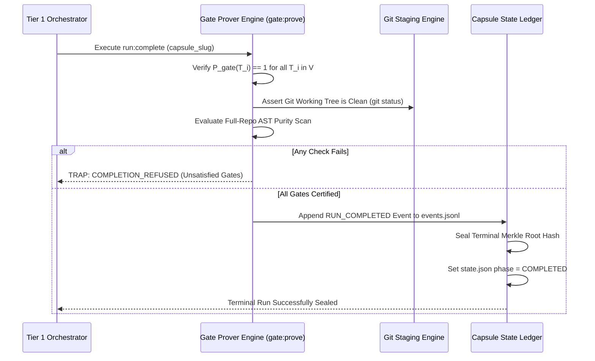

# Gate Prove & Terminal Completion Sealing

---

[Previous: 09-03 APCA Contrast Mathematics](09-03-apca-perceptual-contrast-mathematics.md) | [Chapter Index](index.md) | [All Chapters Index](../index.md) | [Next: Chapter 10 Index](../10-durability-recovery-capsules/index.md)
---

## 1. Executive Summary & The Premature Completion Threat

In autonomous execution systems, declaring a run "complete" without exhaustive proof verification introduces severe regressions:

- Partial feature branches are merged prematurely while background tasks are still failing.
- Unvalidated documentation stubs and unformatted code files pollute the production repository.
- State machines transition to `COMPLETED` while unresolved defects remain in the backlog.

The **OLT (Orchestrating Long Tasks)** engine implements the **Gate Prove & Terminal Completion Sealing Protocol**. Under this system:

1. **Mechanical Gate Prove (`gate:prove`)**: Every individual completion gate must be evaluated and cryptographically proven before a task can transition to `SATISFIED`.
2. **Terminal Manifest Sealing (`run:complete`)**: The entire capsule run cannot transition to `COMPLETED` until 100% of DAG tasks have valid cryptographic gate proofs, the git working tree is clean, and the final Merkle seal is appended.

```text
┌──────────────────────────────────────────────────────────────────────────────────────────────────┐
│                               TERMINAL COMPLETION SEALING TOPOLOGY                               │
├──────────────────────────────────────────────────────────────────────────────────────────────────┤
│                                                                                                  │
│   ┌──────────────────────┐         ┌──────────────────────┐         ┌──────────────────────┐     │
│   │ 100% Tasks Satisfied │  ───►   │ Terminal Gate Prover │  ───►   │ Merkle Run Seal &    │     │
│   │ & Evidence Bundled   │         │ (Evaluate Proofs)    │         │ State COMPLETED      │     │
│   └──────────────────────┘         └──────────────────────┘         └──────────────────────┘     │
│              │                                 │                               │                 │
│              ▼                                 ▼                               ▼                 │
│      [Zero Open Tasks]               [Cryptographic Proofs]          [Immutable Run Archive]     │
│                                                                                                  │
└──────────────────────────────────────────────────────────────────────────────────────────────────┘
```

---

## 2. Mathematical Formalization of Terminal Gate Proving

Let $G = (V, E)$ be the completed task graph with vertex set $V = \{T_1, T_2, \dots, T_N\}$.

For each task $T_i \in V$, let $\mathcal{E}(T_i)$ denote the cryptographic evidence bundle, and let $\mathcal{P}_{\text{gate}}(T_i)$ denote the **Gate Prover Predicate**:

$$\mathcal{P}_{\text{gate}}(T_i) = \big( \text{Status}(T_i) = \text{VALIDATED} \big) \land \big( \text{SHA256}(\text{Canonical}(\mathcal{E}(T_i))) = T_i.\text{evidenceHash} \big)$$

The **Terminal Run Completion Predicate** $\Phi_{\text{run}}(G)$ is defined as:

$$\Phi_{\text{run}}(G) = \left( \forall T_i \in V, \quad \mathcal{P}_{\text{gate}}(T_i) = 1 \right) \land \big( \text{GitStatus}() = \text{CLEAN} \big) \land \big( \text{ASTViolations}(\text{Repo}) = 0 \big)$$

$$\text{TransitionRunState}() = \begin{cases} \text{COMPLETED} & \text{if } \Phi_{\text{run}}(G) = 1 \\ \text{REJECT (Completion Blocked)} & \text{if } \Phi_{\text{run}}(G) = 0 \end{cases}$$



---

## 3. The `gate:prove` CLI Command Interface

The `gate:prove` command ([`gate-prove.ts`](file:///Users/onurseckinsenoglu/repos/skills/olt/scripts/src/cli/commands/gate-prove.ts)) provides mechanical verification for automated scripts:

```text
$ olt gate:prove --task TASK-04 --actor validator_ast-lint_task-04
[PASS] Gate Proof Certified: TASK-04
  - Evidence Classes: CLASS_1, CLASS_2
  - Exit Code: 0 (Bun Test Suite)
  - AST Purity: 0 Any, 0 Suppressions
  - Evidence Digest: 9e3a7c...5b12
  - Proof Sealed in events.jsonl
```

---

## 4. Generational Archival & Rotation

Upon successful terminal sealing:

1. The capsule state is transitioned to `COMPLETED`.
2. Completed objectives are appended to `ARCHIVED_OBJECTIVES.jsonl`.
3. The Tier 0 Mind performs clean generational rotation, archiving the capsule directory into `.olt/archive/` and re-arming its discovery loops.

---

## 5. Architectural Invariants Summary

1. **Zero Premature Merges**: Runs cannot complete with open tasks, failing tests, or uncommitted files.
2. **Cryptographic Proof Chain**: The terminal Merkle root incorporates all task evidence digests.
3. **Fail-Closed Terminal Gate**: Any missing proof halts completion immediately.

---

[Previous: 09-03 APCA Contrast Mathematics](09-03-apca-perceptual-contrast-mathematics.md) | [Chapter Index](index.md) | [All Chapters Index](../index.md) | [Next: Chapter 10 Index](../10-durability-recovery-capsules/index.md)
---
